# 2022년 2분기 블로그 결산

> 2022년 4월 블로그를 배포하고 나서 블로그에 대한 통계를 살펴보는 포스팅이에요!

아직 정말 부끄러운 수준의 트래픽이지만 추후에는 더더욱 발전되어 있는 블로그가 되도록 간절히 희망하며 시작해볼게요.

# 포스팅 개수

해당 포스팅은 제외하고 **총 14개**의 포스팅을 작성했네요.
3개월동안 14개니까 일주일에 하나 정도씩 작성했습니다.

현재는 [글또](https://junghyeonsu-dev.vercel.app/posts/Geultto-7th-commitment) 활동을 참여하면서 2주에 하나씩 필수적으로 작성중입니다.

이대로 간다면 3분기가 끝나면 약 20개의 포스팅이 작성되어 있겠네요

# 구글 서치 콘솔

> 구글 서치 콘솔은 구글에 검색을 통해서 들어온 유저의 수의 통계만 제공합니다.

## 노출수

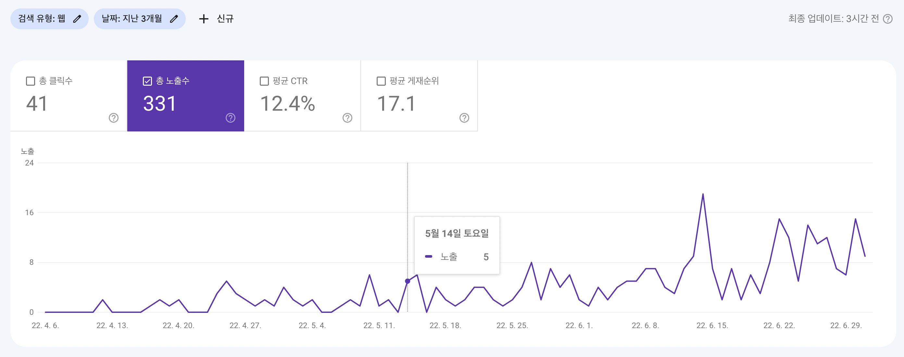

3개월동안 약 `300`개의 노출이 있었습니다.
처음 블로그를 만들고 거의 한 달 정도는 노출이 없었습니다.
글또 활동을 시작하고 노출수가 엄청나게 뛰었는데... 글또 효과를 제대로 보고 있네요

그래도 꾸준히 우상향 중입니다.

## 총 클릭수

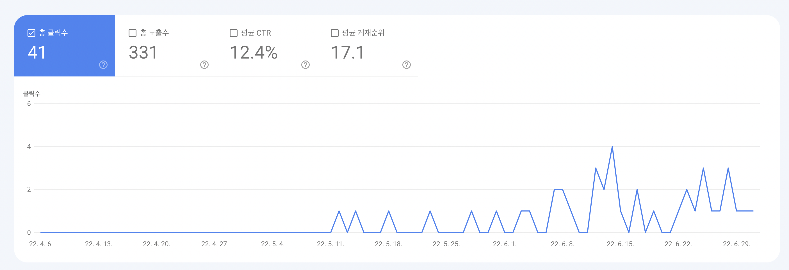

클릭수가 `41`개 밖에 안되지만 (거의) 아무것도 없는 블로그에 3달만에 클릭수 `41`개라서 아주 감사합니다..

클릭수 또한 우상향 중입니다.

## 평균 개재순위

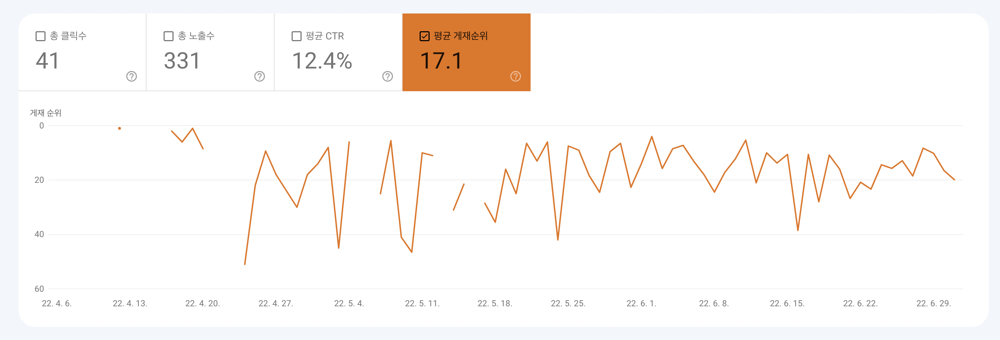

평균 개재순위는 구글 검색을 했을 때 몇 번째로 블로그가 뜨는지에 대한 순위를 나타냅니다. 평균 `17`번째로 포스팅이 뜨고 있습니다.

개재순위도 우상향을 해야할텐데 아직 `SEO`가 잘 적용되지 않았는지, 혹은 제목이나 설명이 조금 부실한지 혹은 이목을 확 끌지 못하는지는 잘 모르겠습니다.

개재순위도 우상향하리라 믿고 있습니다.

## 검색어별 사용자 수

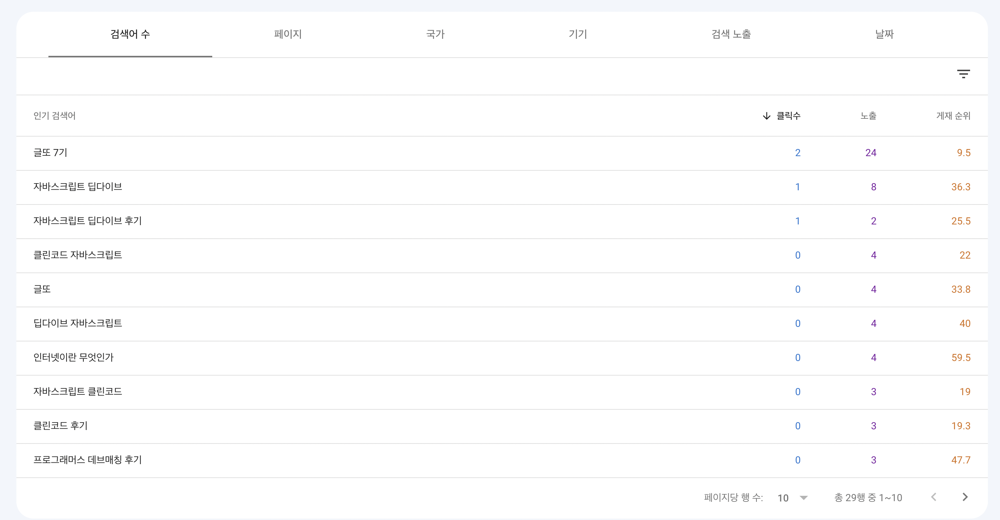

글또 7기가 상당히 많은 노출과 상당히 높은 개재 순위를 기록하고 있습니다.

근데 클릭 수가 `2`회 밖에 안되고 나머지 통계도 조금 이상하게 보이는데 왜 이렇게 나왔는지는 잘 모르겠습니다...

아직 트래픽이 많이 적어서 유의미한 데이터는 아닌 것 같습니다.

## 국가별 사용자 수

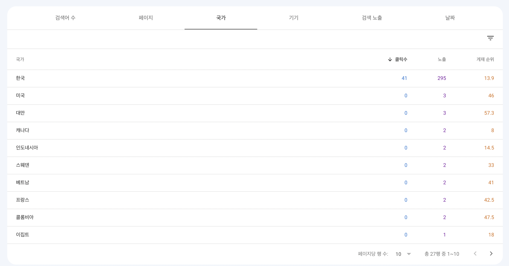

대부분의 유저분이 우리나라 사람이고, 가끔가다 미국과 대만에서 검색을 하고 있습니다.

## 기기별 사용자 수

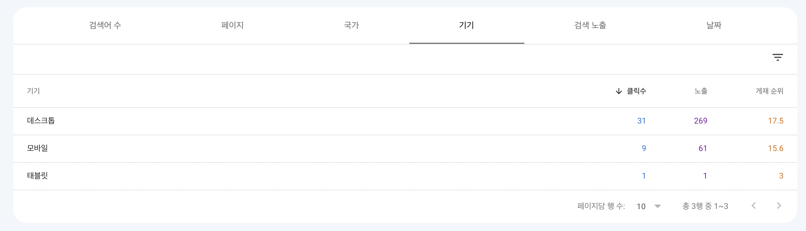

데스크탑이 `70%` 정도를 차지하고 있고 모바일은 `29%` 태블릿이 `1%`를 차지하고 있습니다.

# 구글 애널리틱스

> 구글 애널리틱스는 구글 서치 콘솔과 다르게 구글 검색을 통해서 들어온 유저와 제가 링크를 올려서 타고 들어온 것을 모두 포함한 통계입니다.

## 총 사용자 수

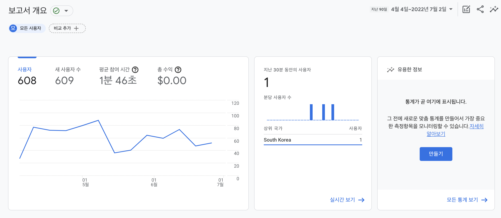

구글 서치 콘솔의 노출수가 `300`개이고, 구글 analytics에서는 총 사용자 수가 `600`명을 기록했습니다.

약 두 배 정도가 차이가 나는데 제가 링크를 이곳 저곳 많이 올렸나봅니다. 실제로 글또 활동을 하면서 블로그 링크를 통해서 들어오는 사람들이 많기 때문일거라고 생각됩니다.

## 페이지 제목 및 화면 클래스

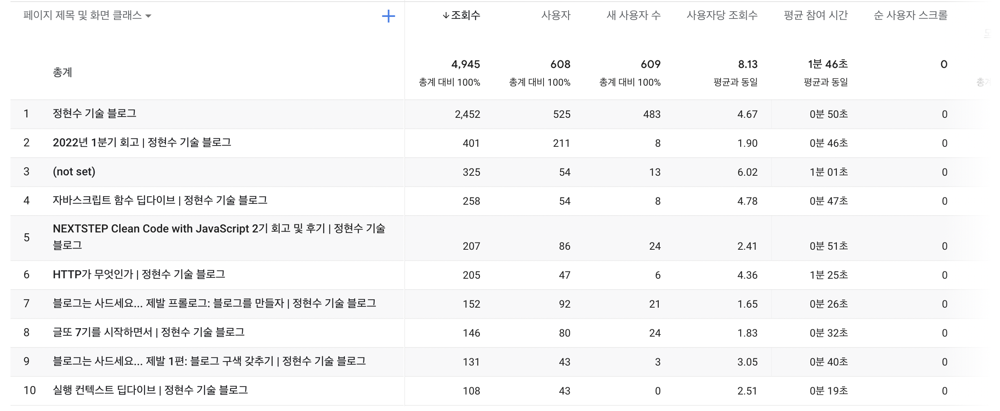

제일 첫 번째 포스팅인 1분기 회고글이 조회수가 제일 높습니다. 근데 제가 아마 많이 들락날락 했었던 것 같습니다.

구글 애널리틱스는 제가 들어가는 이벤트도 기록이 되는 것 같아서 엄청 유의미하지는 않고 재미로 보는 것이 나을 것 같습니다.

# Lighthouse

> 블로그 자체 성능에 대해서도 남겨놓고 나아지는 모습을 보여주기 위해 기록합니다.

## 성능

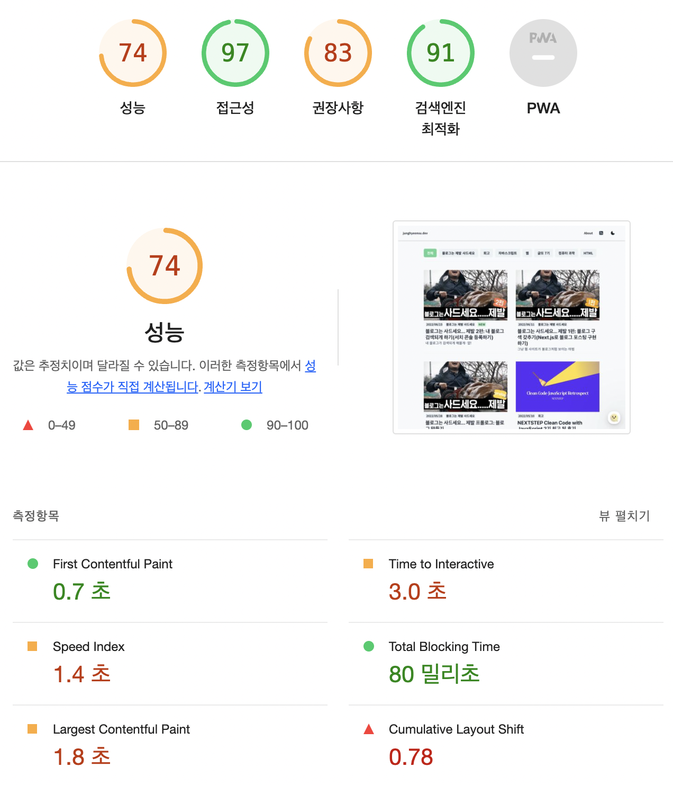

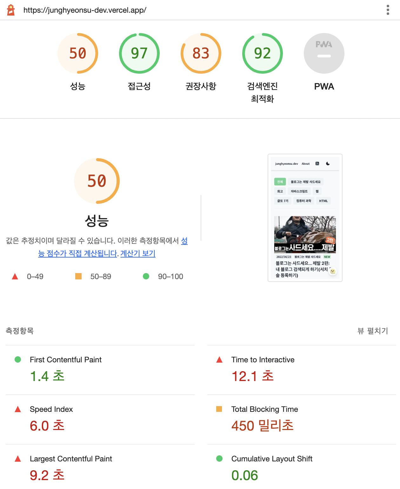

성능이 점수 데스크탑은 `74`점, 모바일은 `50`점으로 되게 낮습니다. 자바스크립트 파일이 되게 큰 것 같은데 다이어트를 좀 해야할 것 같습니다.
그리고 이미지가 큰 것도 한 몫 하는 것 같습니다. 이미지 파일도 다이어트를 해야하는데...

이미지는 `lazy loading` 처리가 되어 있어서 스크롤하면 필요한 이미지를 그 때 불러와서 성능을 조금 높이긴 했지만 이미지 크기 자체가 너무 커서(`png`로 맥북에서 캡쳐해서 그냥 그대로 올립니다.) 속도가 느린 것 같습니다.

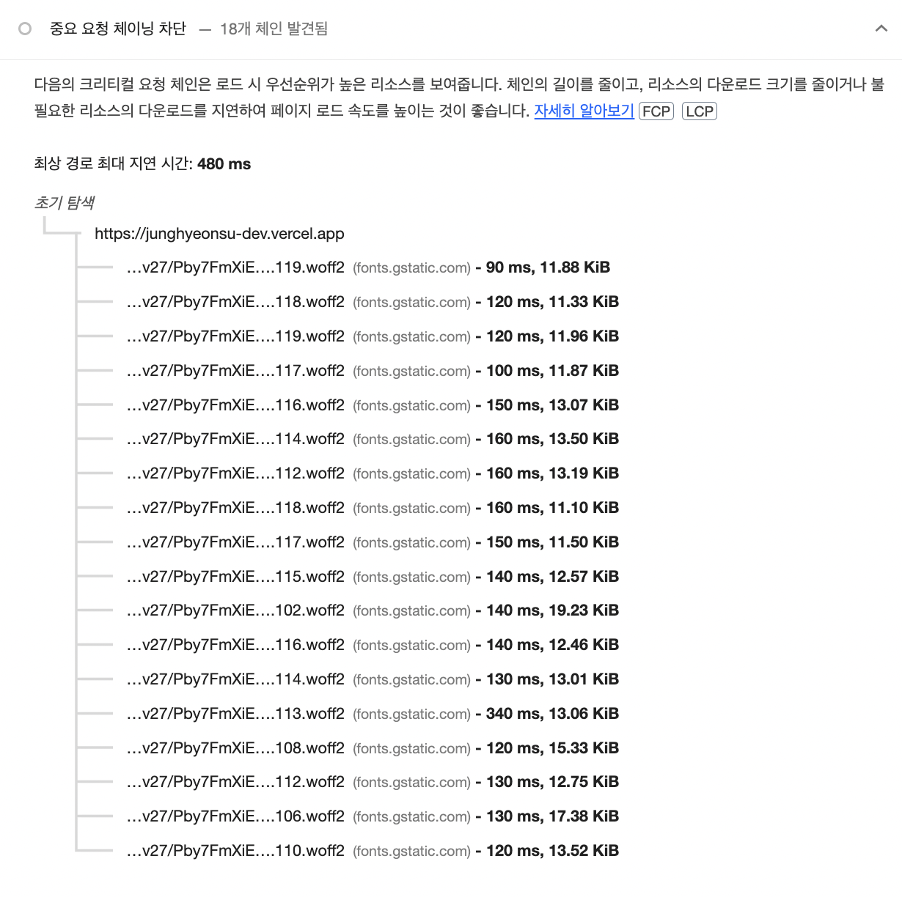

그리고 폰트가 불러오는데 시간이 조금 소요가 되는 것 같은데 이것도 최적화를 진행해야 할 것 같습니다.

## 접근성

접근성은 모바일, 데스크탑 둘 다 `97`점으로 준수한 점수를 기록했습니다. 근데 라이트하우스의 접근성은 웹 접근성의 일부만 측정하기 때문에 다른 접근성을 테스트하려면 직접 테스트해야 합니다.

그래도 높은 점수를 받아서 기분이 좋습니다.

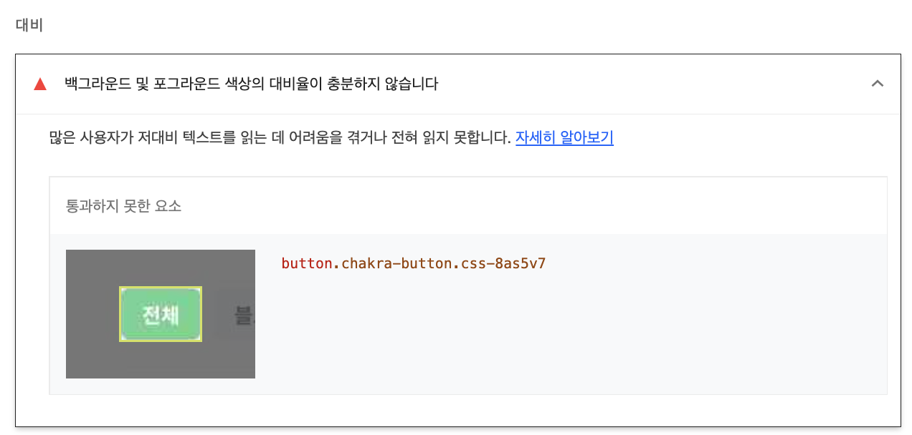

버튼 백그라운드 색과 폰트 컬러가 잘 보이지 않는다는 피드백입니다. 추후에 변경할 예정입니다.

## 권장사항

권장사항은 둘 다 `83`점으로 준수한 것 같습니다.

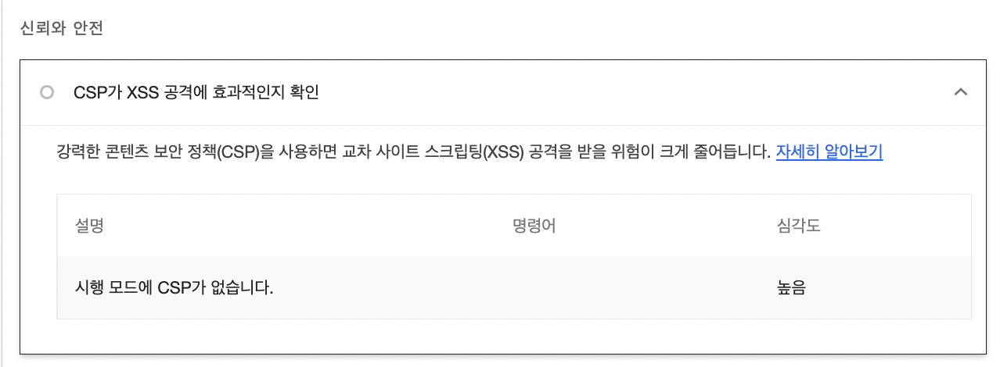

cross-site-scripting 공격에 약하다고 하는데 블로그에 중요한 API 호출이 있는 것이 아니라 크게 위험해 보이진 않아서 우선순위가 높은 것 같진 않습니다.

## 검색엔진 최적화

모바일, 데스크탑 `91`, `92`점을 기록했습니다.

`SEO`는 꽤 신경을 썼다고 생각헀는데 100점을 만족하려면 조금 멀었네요.

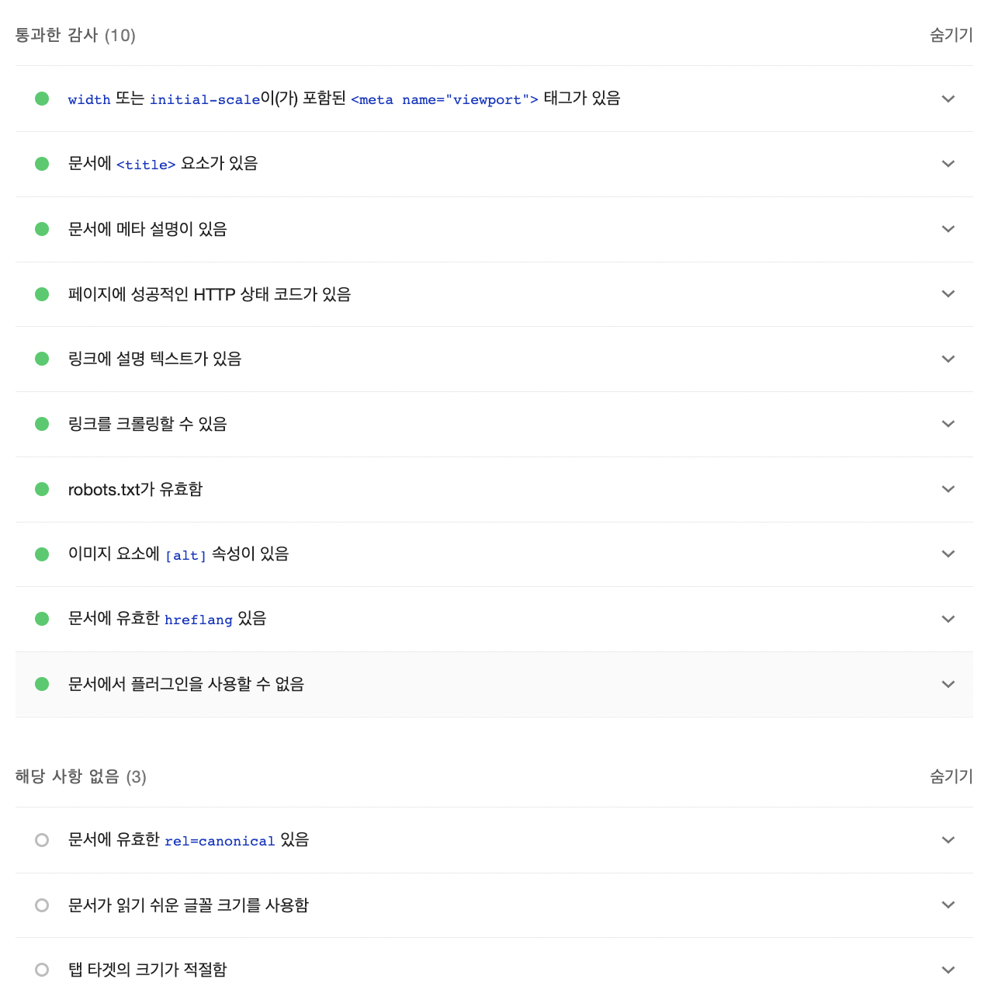

그래도 꽤나 많은 요소들을 통과했습니다.

# 마무리

블로그가 아직 3개월밖에 되지 않았지만 조금씩 성장하는 것 같아서 기분이 좋습니다.

나중에는 정말 유의미한 데이터를 들고 올 수 있었으면 좋겠습니다. 아직은 트래픽이 너무 적고, 노이즈가 조금 껴있는 것 같아서 유의미 한 것 같진 않습니다. (나중에 트래픽 많아지면 광고도 붙여서 돈도 많이 벌고 싶습니다ㅎㅎㅎㅎㅎㅎㅎㅎㅎㅎㅎㅎ)
