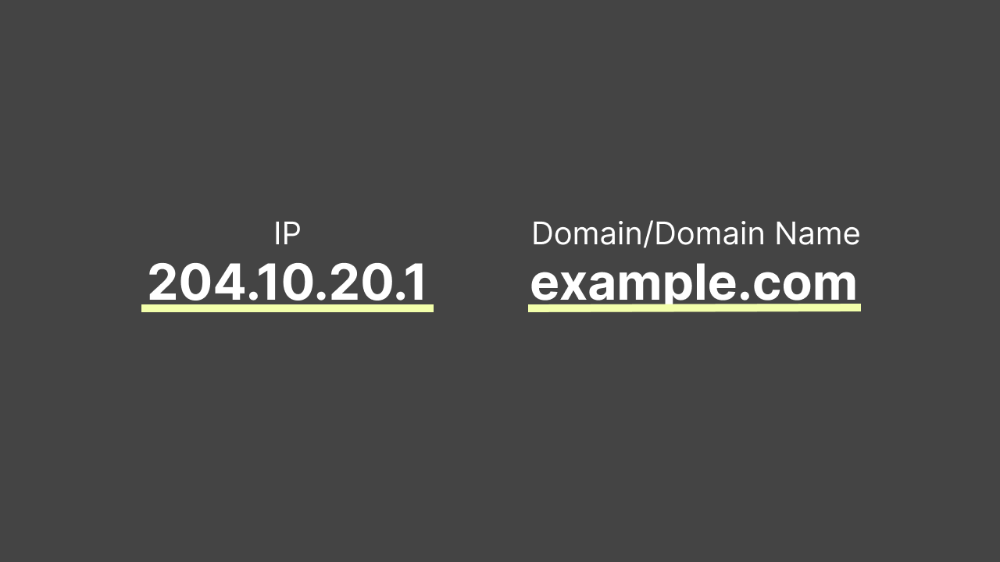
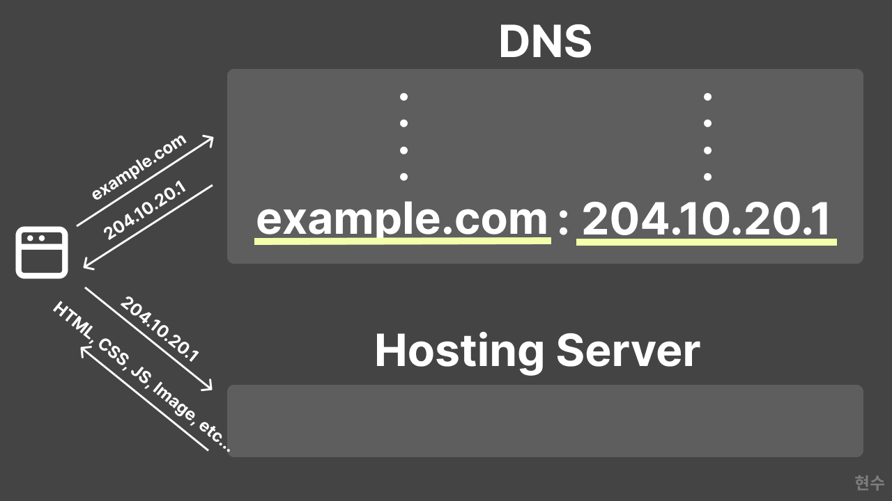
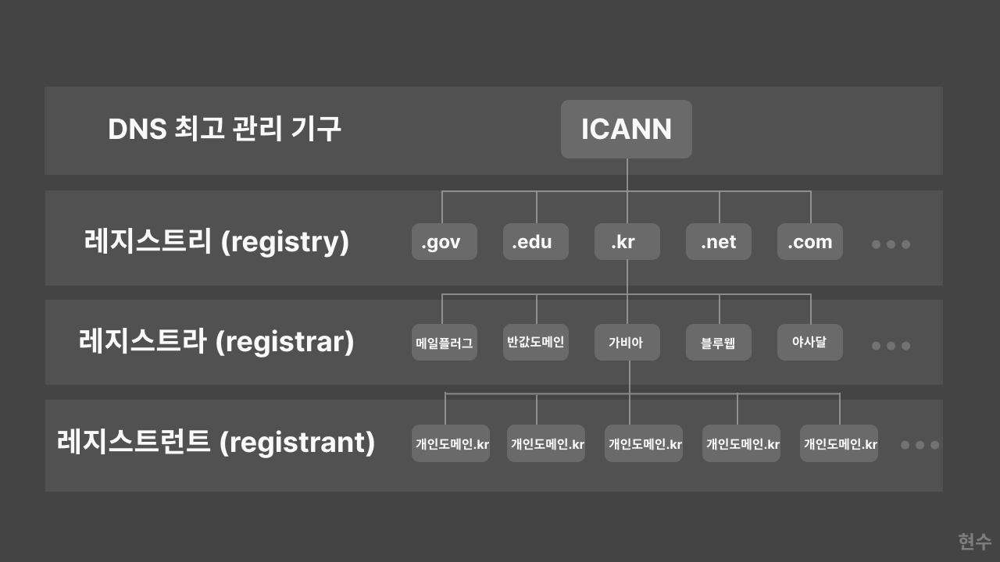

# Domain & Domain Name

> 해당 도메인에 지식이 필요하다.

위의 말 처럼 어떤 전문 분야에 대해 얘기할 때 분야, 영역, 범위를 뜻하는 의미입니다.

컴퓨터에서는 `인터넷 주소`의 의미로 확장 되었습니다.
인터넷 주소를 뜻하는 도메인도 본래 특정 분야(`com`, `net`, `org` 등)의 어떤 웹 사이트를 지칭하기 위해 의미를 확장한 단어입니다.

> 도메인 네임은 넓은 의미로는 네트워크상에서 컴퓨터를 식별하는 호스트명을 가리키며, 좁은 의미에서는 도메인 레지스트리에게서 등록된 이름을 의미합니다.

도메인 또는 도메인 네임이라고도 부릅니다. 원래 웹 사이트에 접속하려면 IP 주소를 가지고 있어야 합니다. `240.10.20.1`과 같이 숫자로만 이루어진 IP 주소를 일일이 외우고 다닐 수는 없습니다.

그래서 우리는 보통 `example.com`과 같은 기억하기 쉽고, 보다 읽기 좋은 **도메인 혹은 도메인 네임**으로 사용합니다.

# Domain Name Space

> 도메인 이름 시스템(DNS)은 사람이 읽을 수 있는 도메인 이름(예: www.example.com)을 머신이 읽을 수 있는 IP 주소(예: 192.0.2.44)로 변환합니다.

`DNS`는 도메인에 대한 요청이 들어오면 해당 도메인 네임에 맞는 IP주소를 반환합니다. 도메인 네임 - IP 주소 형태로 되어있는 사전입니다.

우선 유저가 브라우저에서 도메인 네임으로 접속을 시도하면, DNS에서 해당 도메인에 대한 IP 주소를 찾습니다.

해당 IP를 DNS가 발견하고 브라우저에 다시 반환하면, 브라우저는 다시 해당 IP 주소를 가지고 있는 호스팅 서버로 요청을 보냅니다.

그럼 해당 호스팅 서버는 웹 사이트에서 필요한 리소스들을 전달하고, 브라우저에는 받은 리소스들을 띄우는 방식입니다.

정말 간소화시켜서 얘기해서 자세한 내용들은 더 찾아보는 게 좋을 것 같습니다.

# 도메인 관리 체계

도메인이 정말 많기 때문에 하나의 서버에서 모든 요청을 처리할 수는 없기 때문에 분산시켜 관리를 합니다.

그래서 여러 개의 서버가 있고, 각각 하는 역할이 다른데 간단히 살펴보겠습니다.

> ICANN - 레지스트리(Registry) - 레지스트라(Registrar) - 레지스트란트(Registrant)

위의 구조를 가지고 있습니다.

## 1. ICANN

> Internet Corporation for Assigned Names and Numbers: (국제)인터넷주소관리기구

DNS 루트 관리 및 TLD(top-level-domain) 관리, IP 주소 관리, 레지스트리와 레지스트라의 인가 등등을 관리하는 미국 소재의 비영리기구입니다.

## 2. 레지스트리 (registry)

각각의 최상위 도메인 (TLD)를 관리하는 기관입니다.

대표적으로 `.kr`은 한국인터넷진흥원에서 관리를 합니다. 요기서 한국인터넷진흥원이 레지스트리라고 보면됩니다.

대표적인 TLD로는 `gov`, `mil`, `edu`, `com`, `net`, `org`가 있는데 대표적인 닷컴(`.com`)과 닷넷(`.net`)의 요구량을 따라갈 수가 없어서 현재는 많은 TLD를 신설했고, 현재는 많은 TLD가 있습니다.

## 3. 레지스트라 (registrar)

도메인 등록대행업체입니다. 널리 알려진 업체들이 대부분 여기에 속하는데, 레지스트리의 관리 정책에 따라 도메인 소유자에게 일정한 비용을 받고 레지스트리(registry)에 도메인을 등록하는 것을 대행해줍니다.

아래는 대표적인 `.kr` 도메인의 공식 등록대행사(레지스트라)로 지정된 업체들입니다.

- (주)가비아
- 반값도메인
- 닷네임코리아
- 메일플러그
- 호스팅케이알
- 미리내닷컴
- 블루웹
- 비아웹
- 아사달
- 아이네임즈
- 이호스트IDC
- 코리아서버호스팅
- 싼도메인
- 도레지
- 한국전자인증
- 호스트센터

## 4. 레지스트런트 (registrant)

보통 일반 도메인을 구매하면 전부 이곳에 속하게 됩니다.

실제로 도메인을 개인목적이나 사업목적 등으로 소유권을 등록하여 사용하는 사람들이 요기에 속합니다. 도메인도 개인의 자산으로 보기 때문입니다.

# 참고

- [도메인](https://namu.wiki/w/%EB%8F%84%EB%A9%94%EC%9D%B8)
- [DNS란 무엇입니까?](https://aws.amazon.com/ko/route53/what-is-dns/)
