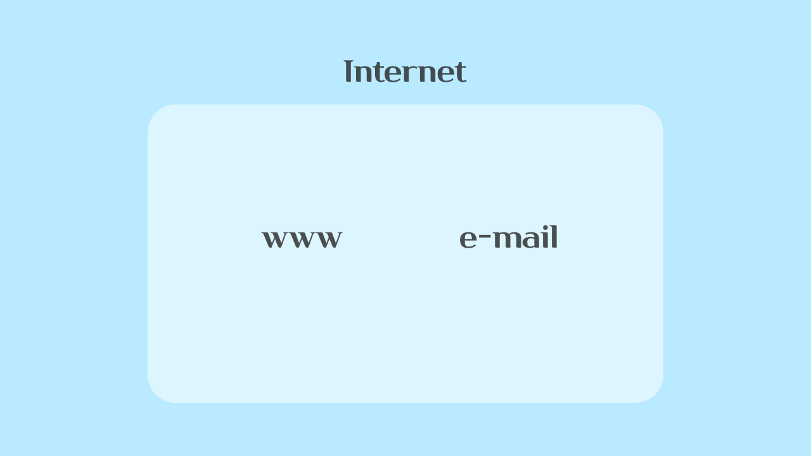

# 인터넷 어원

> Internet = International Network

인터넷이란 이름은 1973년 `TCP/IP` 프로토콜을 정립한 **빈튼 서프**와 **밥 간**이 **네트워크의 네트워크**를 구현하여 모든 컴퓨터를 하나의 통신망안에 연결하고자 하는 의도에서 **인터넷**이라고 명명했던 데 어원을 두고 있습니다.

그러니까 여러 컴퓨터를 하나의 통신망으로 연결한다가 핵심입니다.

# 인터넷 역사

인터넷의 유래는 **1960년대 미국 국방부 산하의 고등 연구국**의 연구용 네트워크가 시초라고 합니다. 미국 국방부 고등계획국에서는 핵전쟁 등의 상황에서도 살아 남을 수 있는 네트워크를 연구했는데, 기존의 **회선 교환** 방식보다는 **패킷 교환**의 방식이 견고하고 생존성이 높았다고 합니다.

1986년 미국과학재단에서 5곳의 슈퍼컴퓨터 센터를 연결해서 `NSFnet`을 만들었는데 이는 대학, 연구소, 정부기관, 기업 등 세계 모든 곳을 연결하는 국제 통신망으로 발전헀습니다.

1989년에는 그래픽 환경이 개선되고, `WWW`(월드와이드웹)가 등장하면서 네트워크 기술에 한 단계 발전된 기술이 부가되었습니다.

점점 공공목적으로 사용되던 네트워크 기술에 민간기업이 참여하면서 상업적 목적의 온라인 서비스가 추가되고, 사용자층이 점점 다양해지면서 인터넷이 점점 우리가 알고있는 **정보의 바다**로 변해왔습니다.

# WWW

> `WWW`(월드 와이드 웹)은 인터넷에 연결된 컴퓨터를 통해 사람들이 정보를 공유할 수 있는 전 세계적인 정보 공간을 말한다. 간단히 웹이라 부르는 경우가 많다.

`WWW`가 `internet`이랑 동의어로 쓰이는 경우가 많은데, 둘은 엄격히 서로 다른 개념이라고 합니다.

`WWW`은 전자 메일과 같이 `internet` 상에서 동작하는 하나의 서비스라고 합니다.

`WWW`은 인터넷상의 정보를 `Hyper Text` 방식과 멀티미디어 환경에서 검색할 수 있게 해주는 정보검색 시스템입니다. `Hyper Text` 형식으로 표현된 인터넷상의 다양한 정보들을 효과적으로 검색하는 시스템이라고 볼 수 있습니다. 세상에서 가장 성공한 시스템이죠.

`Hyper Text`는 웹 브라우저라 불리는 프로그램을 통해 `웹 서버`에서 문서나 웹 페이지 등의 정보를 읽어 브라우저에 띄우게 됩니다. `Hyper Text`를 주고 받는 통신이라고 해서 `HTTP`도 요기서 나오게 된 것이죠.

# 정리

- 인터넷: 모든 컴퓨터를 하나의 통신망안에 연결하고자 하는 의도
- WWW(웹): 연결된 인터넷에서 사람들이 정보를 공유할 수 있는 전 세계적인 정보 공간

# 참고

- [인터넷](https://ko.wikipedia.org/wiki/%EC%9D%B8%ED%84%B0%EB%84%B7)
- [월드 와이드 웹](https://ko.wikipedia.org/wiki/%EC%9B%94%EB%93%9C_%EC%99%80%EC%9D%B4%EB%93%9C_%EC%9B%B9)
