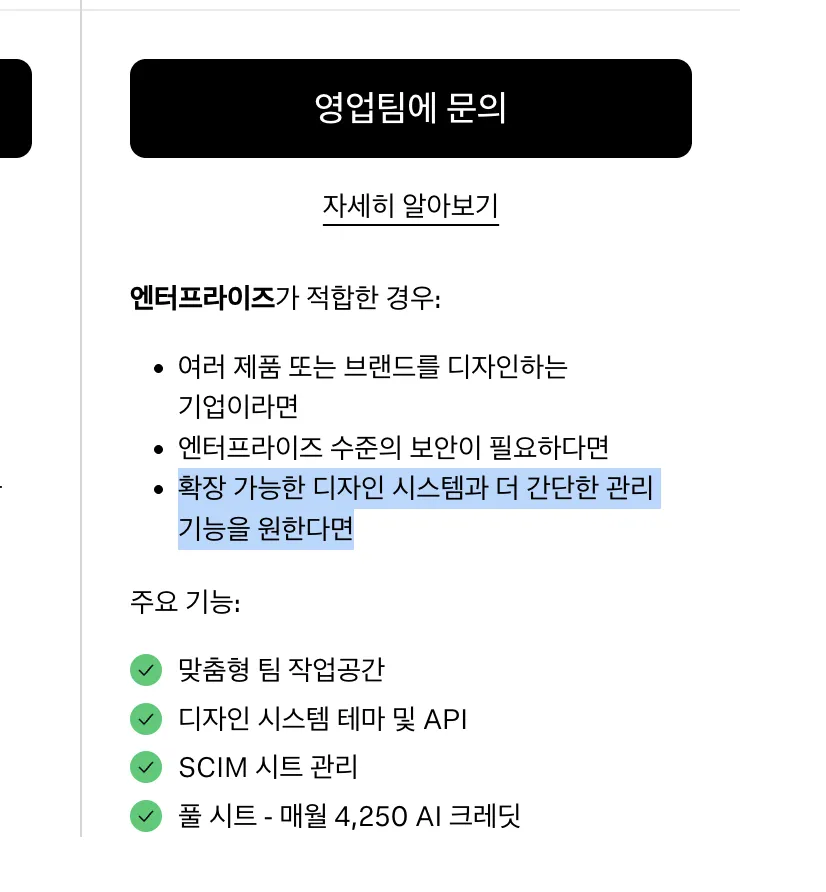
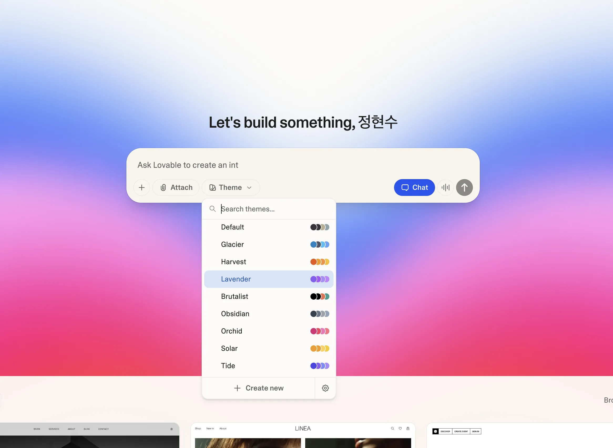
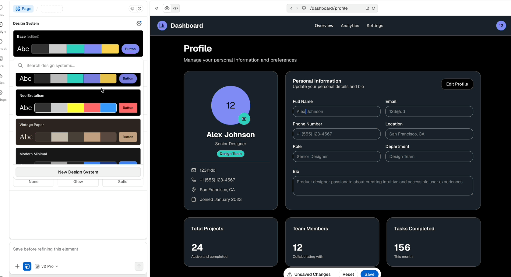

## TL;DR

- 디자인시스템 = 의사결정의 압축: 단순 컴포넌트 모음이 아니라, "어떤 버튼 쓸까?"부터 "에러 메시지 톤은?"까지 모든 의사결정을 담은 것
- 2026년 UI Generator들의 공통점: v0, Lovable, Figma 모두 디자인시스템 통합에 집중 중. UI 생성은 쉽지만 "우리답게" 정렬하는 건 여전히 어려움
- 앞으로의 방향: DS as Context Pack (모델이 읽을 수 있는 형태로 패키징) + DS as Knowledge Base (의사결정 과정 기록) → 생산이 쉬워질수록 일관성의 가치는 더 중요

## 0. 이 글의 목적

이 글은 'AI가 대단하다'를 이야기하는 글이 아닙니다.

디자인시스템을 만들고 운영하는 입장에서, UI Generator들이 디자인시스템을 어떤 식으로 다루는지 정리하고,
그 위에서 당근(그리고 디자인시스템을 만드는 조직)이 어떤 전략과 준비를 가져야 하는지 생각을 정리하기 위한 글입니다.

## 1. 디자인시스템이 왜 중요해졌는가

예를 들어 "폼" 하나를 만든다고 해도, 실제로는 아래 같은 꼬리 질문이 연쇄적으로 터집니다.

- 어떤 컴포넌트를 사용해야 할까요? (TextField? MultilineTextField? Field?, Text?, Form?)
- 컴포넌트들은 어떻게 배치해야 할까요? 어느 순서로?
- Field 컴포넌트 안에서는 error message와 description, label은 어떻게 표현할까요?
- 타이틀의 텍스트는 어느 크기를 가져야 할까요?
- 에러메시지, 디스크립션, 레이블, 타이틀의 문구는 어떤 어투, 말투를 가져야 할까요?
- 중복 체크가 필요한지, 필수 값과 선택 값의 구분은 어떻게 할까요?
- 한 페이지에 모든 정보를 나열할까요? 아니면 단계별로 구분할까요?
- 스탭 진행 상황과 같이 단계 표현이 필요할까요?
- CTA 버튼은 어디에 위치하면 좋을까요? 어떤 사이즈, 색상, Variant를 가질까요?
- CTA 버튼은 언제 disabled 되고, 언제 loading이 될까요?
- 제출에 실패 했을 때는 어떻게 할까요? 제출에 성공했을 때는 어떻게 할까요?
- 접근성은 어느정도로 만족해야 할까요? 보이스 오버? 다크모드? 최소 터치 영역?
- 개인 정보에 대한 약관동의는 어디서 받는게 좋을까요? 바텀시트? 제출 전 CTA 상단의 체크 박스 목록?
- (아마 최소 몇개는 더 있을겁니다.)

### 디자인시스템은 "의사결정의 압축"이다

디자인시스템은 단순히 컴포넌트 모음이 아니라,
위 질문들에 대한 답(또는 답을 찾는 규칙)을 압축해서 저장해 둔 것에 가깝습니다.

다르게 말하면, 디자인시스템은 'UI 생성' 자체를 대신해주기보다
'생성된 결과물을 우리 제품 기준으로 정렬'시키는 데 필요한 기준선과 제약 조건을 제공합니다.

Vercel의 최근 글 [AI-powered prototyping with design systems](https://vercel.com/blog/ai-powered-prototyping-with-design-systems)에서도 비슷한 이야기를 하고 있습니다.

UI를 빠르게 생성하는 것은 쉽습니다. 하지만 잘 정렬된 UI를, 그것도 우리 제품 기준으로 정렬된 UI를 만드는 것은 쉽지 않습니다.
그게 바로 디자인시스템의 역할입니다.

## 2. 2026년, 바이브 디자인 도구들의 행보

현 시점 UI Generator들은 많이 발전했고, 웬만한 기능들은 다 가지고 있습니다.

- Text to UI: 텍스트로 UI를 생성합니다.
- GitHub Integration: GitHub에서 코드를 관리하고 버전 관리를 합니다.
- Deploy Integration: 버튼 하나로 배포를 할 수 있습니다.
- Database Integration: 데이터베이스를 통해서 데이터를 관리할 수 있습니다.
- 그리고 자잘한 세션 관리, 세션 공유, 템플릿 시스템, 인증 관리 등등 많은 기능들을 가지고 있습니다.

그리고 이런 통합에 있어서는 자주 사용하는 도구들과의 통합이 정말 중요하다고 생각하는데,
디자이너분들이 많이 사용하는 Figma에서 이전에는 Bolt가 피그마 링크만을 통해서 화면을 만들어내서 Bolt의 강점처럼 느껴졌지만
이제는 [v0에서도 Figma 통합을 제공](https://v0.app/docs/figma)하고, Lovable은 공식적으로 지원하고 있진 않지만
[builder.io](https://www.builder.io/)와 같은 서비스들에서 Figma to Lovable 통합을 제공하고 있습니다.

저는 이런 도구들이 우리가 일하는 방식에 얼마나 잘 녹아드느냐에 따라서 유저의 선택을 많이 받을 수 있다고 생각합니다.
그래서 Figma Makes와 Figma Sites가 실제로 디자인을 하는 디자이너분들이 많이 사용하는 도구이니까 선택을 많이 받을거라고 생각했는데,
정작 중요한 기능인 디자인 시스템 기능과 테마 기능을 엔터프라이즈로 제공하고 있고, Figma Sites 출시 이후 기능 업데이트가 그렇게 빠르지 않아서 아쉬운 부분이 많습니다.
그리고 `CodeGen` 그리고 `Code Connect`와 같은 코드 핸드오프 기능들을 잘 제공하고 있어서 피그마가 잘할 수 있는 부분이 많아서 그런지 더 아쉽게 느껴지는 것 같습니다.



잠시 얘기가 샜는데, 결국 Antrophic, Google, OpenAI 등 기업들이 서로 좋은 점을 벤치마킹해서 자사 제품에 적용하는 것 처럼,
UI Generator들도 서로 좋은 점을 벤치마킹해서 자사 제품에 적용하고 있습니다. 결국 모두 동일한 목표를 가지고 있는 것이고, 결국 비슷하게 흘러갈 가능성이 큽니다.

이런 제품들의 흥망성쇠를 논하는 것은 의미가 없습니다. 제품들이 어떤 자세를 취하고 있는지 파악하고 그 위에서 우리가 어떤 전략을 취할 수 있을지 생각해보는 것이 중요합니다.

## 3. 디자인시스템과의 연결

우선 모든 플랫폼에서 제공하는 `Theme` 기능은 디자인시스템의 **일부**입니다. 이건 디자인시스템이 아닙니다.
제가 계속 이야기하는 디자인시스템은 `Theme` 혹은 `컴포넌트 모음`을 얘기하는 것은 아니고,
**특정 기업이 (혹은 개인이) 제품을 만들 때 적용되는 모든 디자인 의사결정**을 이야기합니다.

<div className="flex flex-row gap-4">
<div>

</div>
<div>

</div>
</div>

디자인시스템 관련한 기능을 엔터프라이즈 플랜에서만 제공하는 플랫폼들이 많습니다.
디자인시스템 자체가 맥락이 많고 제품의 일관성이 조금 더 화두가 되는 큰 기업에서 중요해지는 경우가 많기 때문에 전략적 선택을 한게 아닐까 싶긴합니다.
문서를 살펴보면 대충 어떤 기능을 제공하고 어떤 방향인지 유추할 수 있습니다.

### v0

v0는 `registry` 기능을 통한 디자인시스템 통합을 제공하고 있습니다.
`registry`는 디자인시스템 요소들을 기계가 읽을 수 있는 형태로 맥락을 제공하는 기능입니다.
기본적으로 `Colors`, `Fonts`, `Components`, `Blocks`에 대한 커스텀을 제공하고 있습니다.

```json
{
  "$schema": "https://ui.shadcn.com/schema/registry.json",
  "name": "my-design-system",
  "baseUrl": "https://my-domain.com",
  "items": [
    {
      "name": "button",
      "type": "ui",
      "files": [
        {
          "path": "src/components/ui/button.tsx",
          "target": "components/ui/button.tsx"
        }
      ]
    }
  ]
}
```

`registry`에 정의된 `baseUrl`과 `items`에 적힌 `path`가 유효한 경로라면,
바로 `v0`에서 해당 디자인시스템을 통해서 UI를 생성할 수 있습니다.
꼭 `Vercel`로 배포할 필요는 없고 public URL이면 됩니다.

그리고 `v0`가 확실히 잘한다고 느낀 부분은 이렇게 배포된 `registry` URL이 있으면 `shadcn CLI`를 통해서 MCP로도 활용할 수 있습니다.
그래서 Cursor나 다른 MCP 통합을 제공하는 모든 도구에서 디자인시스템을 활용할 수 있게 됩니다.

```json
{
  "mcpServers": {
    "shadcn": {
      "command": "npx",
      "args": ["-y", "shadcn@canary", "registry:mcp"],
      "env": {
        "REGISTRY_URL": "https://my-domain.com/r/my-registry.json"
      }
    }
  }
}
```

그리고 [registry starter template](https://vercel.com/templates/next.js/shadcn-ui-registry-starter)도 있어서 쉽게 시작할 수 있습니다.

### Lovable

`Lovable`은 디자인시스템 통합을 엔터프라이즈 플랜에서만 제공하고 있습니다.
Lovable에서 디자인시스템은 하나의 시스템이 아닌 하나의 Feature로 제공하고 있는 느낌입니다.

**Lovable에서의** 디자인시스템은 아래 3가지 요소로 구성됩니다.

- Components: Your React component library (public or private npm packages)
- Guidelines: Style rules, usage patterns, and component specifications
- Installation: Setup instructions and required configuration

핵심이 되는 리액트 컴포넌트, 스타일 규칙 혹은 패턴 그리고 컴포넌트의 실제 스펙, 그리고 설치 가이드와 요구사항 명세서로 나누어져 있습니다.
그리고 `.lovable` 폴더 안에서 그 요소들을 관리하는 방식입니다.

```bash
.lovable/
├── system.md (max ~500 lines)
│   ├── Installation instructions (10 lines)
│   │   - Private package setup
│   │   - Environment variables
│   │   - Sample .npmrc
│   ├── Asset links (fonts, icons, and similar)
│   ├── Directory guide (20 lines)
│   │   - What files exist
│   │   - When to reference them
│   └── General guidelines (remaining lines)
│       - Code patterns
│       - Design principles
│       - Decision trees
└── rules/
    ├── components/
    │   ├── button.md
    │   ├── input.md
    │   └── modal.md
    ├── patterns/
    │   ├── forms.md
    │   └── navigation.md
    └── styling/
        ├── colors.md
        └── typography.md
```

출처: [Lovable Design System](https://docs.lovable.dev/features/design-systems)

### Figma Makes (Figma Sites)

Figma Makes에서도 디자인시스템 맥락을 넣어줄 수 있는 공간이 있습니다.

```bash
├── guidelines/
│   └── components/
│   └── design-tokens/
│   └── Guidelines.md
│   ├── overview-components.md
│   ├── overview-icons.md
├── src/
│   ├── [your application code here]
├── package.json
├── pnpm-lock.yaml
├── postcss.config.mjs
└── vite.config.ts
```

출처: [Figma Makes Design System Guidelines](https://developers.figma.com/docs/code/write-design-system-guidelines/)

## 4. 그래서 2026년 디자인시스템은 어디로 가야 하나

플랫폼들이 디자인시스템을 다루는 방식을 살펴보면 공통적으로 보이는 부분이 있습니다. 바로 맥락을 넣을 공간이 마련되어 있는 것입니다.
하지만 맥락을 쌓는 방법과 맥락을 주입하는 것은 전부 우리의 몫입니다.

우리는 '바뀌는 것'에 집중하는 것이 아니라 '바뀌지 않는 것'에 집중해야 합니다.
아래 질문을 생각해보면 됩니다.

- 우리만의 `.lovable` 폴더엔 어떤 내용들이 들어갈까
- 우리만의 `registry`는 어떤 형태로 구성될까
- 우리만의 `guidelines` 폴더에는 어떤 내용들이 들어가야 할까

### DS as Context Pack

목표는 프롬프트가 짧아도 결과가 안정적으로 '우리답게' 나오게 만들기입니다.
디자인시스템을 구성하는 모든 요소들을 '모델이 읽을 수 있는 형태'로 패키징해서 제공해야 합니다.

컬러, 타이포그래피, 모션 등의 파운데이션 토큰 값을 제공하는 것은 물론,
컴포넌트 스펙, 컴포넌트 가이드라인, 접근성 규칙, 사용 예시 등의 맥락을 제공해야 합니다.
우리의 톤앤 매너, 에러 및 성공 메시지 카피 규칙, 로딩 상태에 대한 모든 답을 내려줄 수 있어야 합니다.

UI를 구성할 때 모든 의사결정의 분기들에 대한 답을 패키징해야 합니다.
**그리고 끼워넣으면 됩니다.** 모델이 읽는 디자인시스템을 만듭니다.

방법은 여러가지가 있습니다. MCP, LLMs.txt, Claude Skills 등 다양한 수단을 이용합니다.

### DS as Knowledge Base

디자인시스템 팀에 있으면 하나의 요소가 나오기 까지 많은 의사결정이 필요합니다.
의사결정 과정, 상충 지점, 결과를 기록합니다. 또한 그렇게 하기로 한 '약속' 또한 흘려보내지 않고 기록합니다.

디자인시스템의 범위를 늘릴 때 (플랫폼 확장 혹은 제품 확장 및 글로벌 진출 등) 해당 의사결정들을 확장되는 디자인시스템에 포함할 수 있어야 합니다.
이렇게 쌓인 맥락들은 디자인시스템 팀의 지식이 됩니다.

이런 확장에 대비는 생산성이 폭발하는 대 AI 시대에서 매우 중요합니다.
생산이 쉬워질수록, 일관성과 정렬의 가치는 더욱더 중요해지기 때문입니다.

방법은 팀이 일하는 방식을 만들어내는 것이 좋습니다. 혹은 자동화된 워크플로우를 만드세요.

## 마치며

위의 얘기들과 별개로 당연히 디자인시스템 자체를 잘 만드는 것 또한 중요합니다.
디자인시스템 팀에 속해있는 입장으로서 앞으로의 방향성을 생각해보는 것은 필요합니다.

저는 AI 시대가 발전하면서 점점 더 디자인시스템 분야가 중요하고 재밌어지고 있다고 생각합니다.
이전에는 디자인시스템이 UI 라이브러리 그 정도의 것이라고 생각했던 적이 있었지만, 알면 알수록 앞으로 디자인시스템의 중요성이 더 절실하게 느껴집니다.

2025년 중반에 Lovable과 같은 플랫폼을 만들기 위해서 당근 안에서 조금 노력했던 적이 있었는데,
그때 내린 결론은 그런 플랫폼을 만들기 보단 '디자인시스템을 더 잘 만들고 맥락을 잘 쌓는 것'이 더 중요하다고 생각했습니다.
자연스럽게 플랫폼들의 폼은 올라올테니까요. 그리고 그 결과가 2026년에 조금씩 나타나고 있는 것 같아서 기쁩니다.

우리 팀은 맥락을 부을 준비는 끝났습니다. UI가 생성되길 기다리면 됩니다.

이 글이 누군가에게 도움이 되었으면 좋겠습니다.
