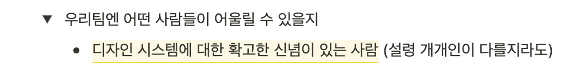

# 계기

> 아래는 제가 개인적으로 디자인 시스템에 관해 공부하며 생각을 정리한 글입니다. 안 맞는 부분이 있을 수도 있습니다.

예전에 면접을 볼 때도 디자인 시스템에 관심이 있다고 말을 한 적이 있는 것 같은데 지금 생각하면 되게 부끄럽다. 디자인 시스템이 뭔지는 알고 관심 있다고 한 것인지... 그때 당시로는 디자이너와 개발자의 간극을 좁히는 그런 도구를 만들고 싶다는 이런 식으로 얘기를 했던 것 같은데 하여튼?..

이번에 인턴 연장을 하면서 기존의 **프론트엔드코어**팀에서 바로 옆 팀인 **디자인시스템**팀으로 옮겼다.

아마 현재 팀에 프론트엔드 개발자분이 한 분밖에 안 계셔서 일손이 아주 부족해서 내가 연장되고, 일손을 돕는 역할로 연장이 된 것 같다. 그래도 명색이 디자인시스템 팀인데 디자인 시스템에 대해서는 알고 가야 하지 않겠나... (이미 일주일이 지났지만)

디자인 시스템에 대한 확고한 가치관을 가지기 위한 첫 번째 발걸음으로 디자인 시스템을 공부하기로 마음먹었다.

# 디자인 시스템

> _디자인 시스템은 디자인 원칙과 중요한 UX 전략에 의해 결합한 UI 구성 요소의 모음입니다. 디자인 시스템을 대규모 디지털 제품을 만들기 위한 레고 세트로 생각하면 좀 더 이해가 쉬울 것입니다. 디자인 시스템은 종종 스타일 가이드로 디자인 정보를 포함합니다. UI 요소 전체에서 사용되는 색상, 타이포그래피 및 스타일. 표준, 원칙 및 일관된 UI 요소의 모음은 디자인 시스템을 전체 조직에 대한 단일 소스로서 가치 있게 만듭니다._ 
>
> [디자인 시스템(Design System), 궁극의 기본 가이드(2021)](https://designlog.org/2512900)

우선 디자인 시스템은 UI를 구성하는데 필요한 것들(타이포, 색상, 컴포넌트, 패턴, etc...)을 가이드해주는 **시스템**이다. 

# 디자인 시스템은 왜 필요할까

프로젝트가 작거나 회사의 규모가 작다면 디자인에 대한 가이드가 크게 필요하지 않다. 규모가 점점 커질수록 프로젝트 안에 프로젝트가 생기고, 그 안에서 또 작은 프로젝트가 생길 수도 있다. 그렇게 되면 각각의 프로젝트에서 서로 다른 성격의 UI가 생기고, 이는 유저의 제품 경험, 브랜드 경험의 하락으로 이어질 수 있다. 유저뿐만 아니라 개발자와 디자이너도 제품 UI에 대한 전반적인 가이드가 없다면 새로운 무언가를 만들 때 낭비되는 시간과 효율이 떨어질 것이다.

보통 디자인 시스템은 처음부터 고려되지 않는다. 미래의 상황을 예측하고 현실에서는 보이지 않는 것에 대해서 예측해서 개발하고 시스템을 구축한다는 것이 쉽지 않다는 것을 우리는 알고 있다.

프로덕트를 만드는 팀과 디자인 시스템을 만드는 팀은 다른 성격을 띠고 있다. 프로덕트를 만드는 팀들은 구매율 증가, 클릭률 증가와 같은 지표들에 크게 관심이 있지, 제품의 일관성, 모든 구성원의 효율성 증가에는 큰 관심이 없다(디자인 시스템 팀 보다는?).

> **비효율의 숙달화에 대해서**
> 
> 힘센 나무꾼이 도끼질한다.
> 열심히 지치지 않고 도끼질하는데 시원치 않다.
> 지나가던 사람이 "도끼날을 한번 갈아보면 어떠하오" 했더니 나무꾼은
> "바빠서 안 되오"
> 라고 했다.

현재 나는 디자인 시스템을 구축하는 완전 초기 단계에 있어서 지금은 이 작업이 구성원들의 공감을 얻을 수 있을까, 정말로 구성원들의 효율성 향상을 일으켜줄지는 잘 모르겠다. 하지만 다양한 목적 조직에 흩어져 있고 효율적이지 않은 작업을 언제까지나 지켜보고만 있을 수는 없다. 누군가는 해야 하고 누군가는 이끌어야 한다. 나는 당일 나온 아이디어를 당일 구현할 수 있는, 구성원들의 상상력, 효율성, 일관성에 날개를 달아줄 수 있다는 것을 믿어 의심치 않는다.

# 디자인 시스템은 단순 UI 컴포넌트 모음집인가?

이렇게 디자인 시스템에 관해서 공부하다 보면 **단순히 UI 컴포넌트들을 가이드해주는 것 아닌가?** 라고 생각할 수 있다. 디자인 시스템은 시스템으로서 UI 가이드를 포함해서 UX 가이드라인, 패턴, 더 나아가서는 디자인 원칙, 브랜드의 디자인 가치관을 포함한다. 타이포, 색상, 여백, 컴포넌트, 패턴 등의 가이드를 제공하면서 유저에게 일관성을 제공한다. 요기서 일관성만 제공할 뿐만 아니라 차별화된 경험을 제공하는 것이 중요하다고 생각한다. 각 브랜드가 가진 차별화된 색상, 콘텐츠를 제공함으로써 유저에게 해당 브랜드의 가치를 통일된 컴포넌트로 제공한다.

나는 프론트엔드 개발자로 UI/UX 가이드가 미칠 수 있는 영향이 애플리케이션 그리고 기껏해야 웹 사이트 정도라고 생각했는데, 잡지, 명함, 굿즈, 템플릿 등 다양한 상황과 경험이 존재한다. 사용자에게 그리고 생산자에게 온전한 기업의 정체성을 디자인으로 느끼게 하고, 공통된 경험 그리고 높은 사용성을 제공할 수 있다.

# 내가 바라는 우리 회사의 디자인 시스템

> **확고한 가치관, 확고한 원칙**

현재 속한 회사는 외부에서 **따뜻한**, **귀여운**, **포근한** 과 같은 느낌을 많이 주고 있는데 현재 팀의 다른 구성원들은 어떻게 생각할지는 모르겠는데 나는 비슷한 가치관을 가지고 개발하고 싶다. 가벼운 어투에서부터 전체적으로는 둥글둥글한 느낌으로 가되, 어느 부분에서는 날카롭고 뾰족한 느낌을 내며 우리만의 스타일을 가져가고 싶다.

당근만의 확고한 가치관과 원칙을 가져가고 싶다.

> **세심한 가이드, 미친 편의성**

나는 개발자로서 많은 편의성을 제공하고 싶다. 사용하는 입장에서 **아니 이 부분까지 신경을 썼다고?** 할 만큼의 세심함과 편의성을 제공하고 싶다. 사용자 인터렉션, 접근성은 자동으로 고려되어 있고, 다양한 상황에 해당하는 UI 및 다양한 모션을 제공하고 싶다.

> **많은 유저, 기업이 참고하는 대표적인 레퍼런스**

업계의 표준이 되고 싶다는 포부. 많은 사람에게 영감을 줄 수 있는 레퍼런스가 되고 싶다.

# 디자인 시스템은 끝이 있나?

팀에서 회의하다가 **디자인 시스템에 끝이 있나?** 라는 얘기가 나왔었는데, 몇 분은 있다고 대답하고 몇 분은 없다고 대답했다. 그 이유를 자세하게 듣지는 못해서 그 정확한 맥락은 잘 모르는 데 결론을 우선 말하자면 나는 **끝이 없다** 고 생각한다.

시스템을 구축하고, 제작하는데 어떤 프로세스가 완성되고 절차가 구축이 되어서 추가되는 UI에 대해서는 해당 프로세스만 참고해서 작성하면 된다는 측면에서 보면 어느 정도 완성이 있다고 생각이 될 것 같기도 하고, 아니면 UI는 끝이 없어서 계속해서 제작하고 발전해야 한다는 측면에서는 끝이 없다고 생각한다.

라이브러리, 프레임워크는 계속해서 진화하고 구축된 자동화 시스템 및 설정값 모두 발전한다. 늘어나는 기기, 플랫폼, 프로덕트, 그리고 유저들에 대응하기 위해서는 고려해야 하는 부분들이 계속해서 늘어날 거로 생각한다. 산업이 바뀌고 환경이 발전함에 따라서 2D에서 3D로, 3D에서 4D로 감에 따라서 고려되는 부분들이 다 다를 거로 생각한다.

누군가는 통일된 방향성과 가치관을 지키기 위해 개발하고 회의해야 한다. 자동화도 계속해서 발전하지만, 자동화를 구축하는 것 또한 어떤 누군가가 해야 되므로 그런 측면에서 나는 디자인 시스템은 끝이 없다고 생각한다.

# 마무리

디자인 시스템이 뭔지에 대해서 간단히 알아가는 단계라 얕은 지식으로 뭔가를 많이 말한 것 같아 부끄럽지만 이런 과정을 드러내고 피드백을 통해서 배운다고 믿는다. 갑자기 디자인 시스템에 대한 확고한 가치관이 생기고, 번뜩이는 뭔가가 있을 거라고는 생각하지 않는다. 꾸준함만이 답이겠지.
