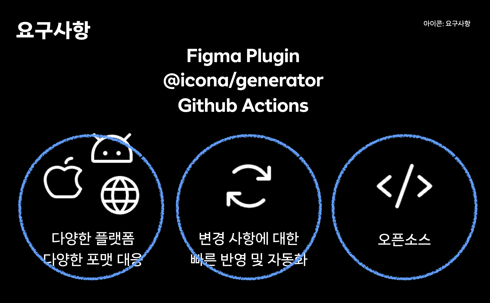
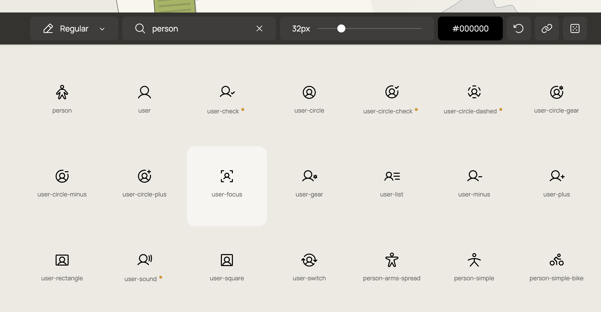
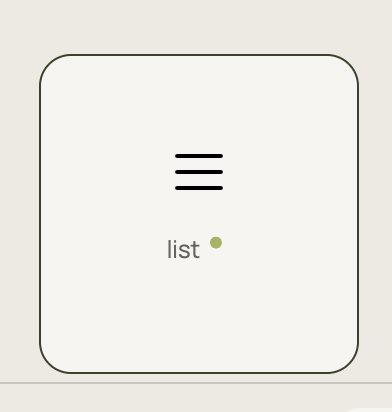

## Icona

`Icona(이코나)`에 대해서 당근 테크밋업 때 발표를 했다.

`당근 피그마에 존재하는 아이콘들을 어떻게 하면 개발단으로 옮길까` 에 대한 물음이 시작이었다.

피그마 플러그인과 제네레이터 패키지를 만들어서 피그마에서 아이콘을 추출하고,
개발단으로 옮기는 과정을 자동화 했다. 이 시스템을 `Icona(이코나)`라고 이름 지었고, 해당 내용을 발표했다.



사실 나는 아이콘이랑 되게 인연이 길고 깊다. 정말 깊은지는 아이콘의 얘기를 들어봐야 하지만

- <InternalLink to="/posts/quickly-apply-icons-that-exist-in-figma-to-your-dev-team">피그마에 존재하는 아이콘을 개발단에 빠르게 적용하기 (피그마 플러그인, 아이콘 라이브러리)</InternalLink>
- <InternalLink to="/posts/how-to-use-icons-well-in-react">리액트에서 아이콘을 잘 사용하는 방법(이라 쓰고 잘 쓰기 위한 몸부림을 써보았다.) (React Icon)</InternalLink>

뭔가 시스템화를 하려는 노력은 일찍이 있었다.
2023년 7월에 쓴 Icona 포스팅 글을 쓸땐 이미 `Icona`를 이용해서 잘 배포하고 있었고 큰 문제가 없었고,
최근까지도 잘 사용하고 있었다.

하지만 `Icona`는 **철저히** 당근에 맞춰진 시스템이다. 당근의 아이콘을 위한 시스템이다.
다른 회사에서 사용하려면 많은 작업이 필요하다.

우선 피그마를 사용해야 하고, 특정 형태의 피그마 컴포넌트로 구성되어 있어야 한다.
`icona-frame`이라는 피그마 프레임을 만들어서 그 안에 아이콘을 넣어야 하고,
이름은 `icon_` 으로 시작해야 하고, 등등... 이런식으로 많은 제약이 있다. (사실 크게 어렵지 않다.)
궁금하면 [README.md](https://github.com/daangn/icona)를 참고하자.

그리고 시스템을 커스텀해서 사용하고 싶다면 현재는 불가능한게 많다.
당근에서 딱 필요한 요구사항만 만족하는 시스템을 구축하고, 지금까지 잘 사용해왔기 때문에 큰 개선의 필요성을 못 느꼈다.

이 글은 `Icona`를 개선한다면 어떤식으로 개선할 수 있을지에 대한 이야기이다...
라고 썼지만 사실 이번에 당근에서 시스템 개편이 필요한 일이 생겨서 내가 해야하는 일에 대한 이야기다.

## Figma Plugin

### .icona/icons.json 파일

<Callout type="danger">
**AS IS**: `.icona` 디렉토리에 `icons.json` 파일을 만들어서 아이콘 정보를 저장하고 있다.
</Callout>

<Callout type="info">
**TO BE**: 피그마 플러그인에서 타겟 경로를 설정할 수 있고, 파일명도 설정할 수 있게 한다.
</Callout>

현재는 피그마 플러그인에서 배포버튼을 누르면 입력된 레파지토리의 `.icona` 디렉토리에 `icons.json` 파일을 만들어서 아이콘 정보를 저장하고 있다.

그리고 해당 파일을 `generator`에서 읽고, 설정 파일의 정보에 따라서 아이콘이 생성된다.

해당 아이콘 정보를 저장하는 파일의 경로도 따로 지정할 수 있고, 파일명도 커스텀 할 수 있게되면 좋을 것 같다.


### 메타데이터 시스템

<Callout type="danger">
**AS IS**: 아이콘에 대한 메타데이터를 저장할 수 있는 시스템이 없다.
</Callout>

<Callout type="info">
**TO BE**: 아이콘에 대한 메타데이터를 저장할 수 있는 시스템이 있다.
</Callout>

[phosphoricons](https://phosphoricons.com/?q=%22person%22)에서 `person` 이라고 검색하면 사람 모양의 아이콘들이 나온다.
하지만 이 아이콘들의 이름을 자세히보면 `person` 을 포함하고 있지 않다.



어떻게 이런 검색 시스템을 구축할 수 있을까? 바로 아이콘 이름 이외에, 아이콘에 대한 **메타데이터**를 저장하면 된다.

보통 `메뉴`를 의미하는 아이콘 중에 선 3개로 이뤄진 아이콘들이 많이 사용되고 있다.



보통 아이콘의 이름을 정할 때는 무조건 형상을 기준으로 이름을 짓는다고 한다면
위 아이콘의 이름은 **가로 라인 3개가 세로로 배치된 모양**이라고 할 수 있을 것이다.

보통 `menu` 라는 것은 사람들이 **가로 라인 3개가 세로로 배치된 모양**에 `menu` 라는 의미를 부여해서 사용하고 있다.

그렇기 때문에 아이콘의 이름은 무조건 형상을 기준으로 짓고, 나머지 사람에 의해서 의미가 부여된 정보들은 메타데이터로 저장하면 된다.

그래서 당근에서는 해당 아이콘은 `horizline3-vertical` (가로 라인 3개가 세로로 배치된 모양) 이라는 이름을 짓고,
메타데이터에는 `menu`, `list`, `hamburger` 등의 정보를 저장하면 된다.
그 정보를 이용해서 웹사이트에서 검색을 할 수 있게 구현할 수 있다.

당근에서는 아이콘 이름을 형상을 기준으로 짓기로 했고, 위와 같은 이유들로 메타데이터를 저장할 수 있는 시스템이 필요하다.

### 아이콘 생성

<Callout type="danger">
**AS IS**: 직접 피그마에서 아이콘 컴포넌트를 생성하고, `icona-frame`에 넣는다.
</Callout>

<Callout type="info">
**TO BE**: 플러그인에서 아이콘을 넣고, 아이콘 정보들을 기입하고 버튼을 누르면 자동으로 `icona-frame`에 넣어준다.
</Callout>

현재는 피그마에서 아이콘 컴포넌트를 생성하고, `icona-frame`에 넣는 작업을 직접 해야한다.

이번에 일을 하면서 디자이너 분들이 모두 피그마를 잘 다루는 것은 아니기 때문에
버튼 한번만 누르면 자동으로 `icona-frame`에 넣어주는 기능이 있으면 좋을 것 같다고 생각했다.

## Generator

### icon 파일 경로 커스텀

<Callout type="danger">
**AS IS**: 아이콘 파일 경로를 커스텀할 수 없다.
</Callout>

<Callout type="info">
**TO BE**: 아이콘 파일 경로를 커스텀할 수 있다.
</Callout>

현재는 `@icona/generator`의 `generate` 함수를 실행하면 아이콘 파일 경로가 `.icona/icons.json`으로 고정되어 있다.

```js
// icona.config.ts
// 현재는 아이콘 데이터의 경로 혹은 데이터를 받을 수 있는 방법이 없다.
generate({
  config: {
    svg: svgConfig,
    drawable: drawableConfig,
    pdf: pdfConfig,
    react: reactConfig,
    png: pngConfig,
    vue2: vue2Config,
    vue3: vue3Config,
  },
});
```

이거는 위 `Figma Plugin`의 `.icona/icons.json` 파일의 얘기와 연관이 있다.
`.icona/icons.json` 파일의 경로를 커스텀할 수 있게 되면, `generator`에서도 아이콘 파일 경로를 커스텀할 수 있게 해야한다.

```ts,6-7
// icona.config.ts
import { generate } from '@icona/generator';
import type { IconData } from '@icona/generator';

generate({
  iconDataPath?: `${유저가 입력한 경로}/${유저가 입력한 파일명}`,
  iconData?: IconData,
  config: {
    svg: svgConfig,
    drawable: drawableConfig,
    pdf: pdfConfig,
    react: reactConfig,
    png: pngConfig,
    vue2: vue2Config,
    vue3: vue3Config,
  },
});
```

뭐 대충 이런 느낌이 되지 않을까 싶다.

## Icon Package

### 모노크롬 이외의 아이콘

<Callout type="danger">
**AS IS**: 모노크롬 아이콘만 지원한다.
</Callout>

<Callout type="info">
**TO BE**: 컬러 아이콘도 지원한다.
</Callout>

현재 아이콘 패키지에서는 모노크롬(단색) 아이콘만 지원한다.

하지만 아이콘에는 모노크롬 아이콘 뿐만 아니라 색상이 고정이 되어있는 아이콘들도 많고,
한 아이콘에서 여러가지 색상을 가진 아이콘들도 많다.

현재는 모노크롬만 있기 때문에 리액트 아이콘 컴포넌트에서 색상을 지정할 수 있는 `color` prop이 있다.

```tsx
// 대충 이런 느낌
import { IconA, IconB, IconC } from '@icona/react';

function App() {
  return (
    <div>
      <IconA color="red" />
      <IconB color="blue" />
      <IconC color="green" />
    </div>
  );
}
```

하지만 의도된 컬러만 사용해야 한다거나, 색상이 이미 지정이 되어있는 아이콘을 내보내야 하는 경우들이 있다.
그럴 때는 리액트 아이콘 컴포넌트의 인터페이스가 바뀌어야 한다.
아마 `color` prop 정도가 빠지지 않을까 예상이 된다.

그리고 사실 모노크롬, 멀티컬러, 투톤, 그라디언트 등등 다양한 스타일 variant가 나뉜다면
피그마 플러그인 혹은 제네레이터 패키지에서도 시스템이 조금씩 바뀌어야 할 것 같다.

지금 예상으로는 아이콘 데이터를 커스텀해서 받을 수 있게 되고, 경로도 커스텀해서 받을 수 있게 되면
아마 문제가 없지 않을까 싶은데 해봐야 알 것 같다.

## General

### 문서화

<Callout type="danger">
**AS IS**: README.md 파일에서 사용법을 설명하고 있다.
</Callout>

<Callout type="info">
**TO BE**: 문서 사이트를 만들어서 사용법을 설명하고, 조금 더 자세히 설명한다.
</Callout>

현재는 `README.md` 파일에서 사용법을 설명하고 있다.
위에서 언급한 내용들을 모두 구현하고, 사용법을 설명하려면 `README.md` 파일이 너무 길어질 것 같다.

그리고 `icona`가 단순한 패키지가 아니라 프레임워크? 비슷한 시스템 느낌이기 때문에
문서 사이트를 만들어서 사용법을 설명하고, 조금 더 자세히 설명하는 것이 좋을 것 같다.

`generator`에도 당근에 맞춰서 구현된 기능들이 꽤나 있는데, 그런 것들도 문서화를 해야한다.

그중에 이미 구현된 기능에서 마음에 드는 기능 하나를 소개하자면...

피그마에서 SVG 데이터를 이용해서 리액트 아이콘을 만들 때 `svgr` 라이브러리를 사용하고 있다.
`svgr` 라이브러리에서는 `template` 옵션을 이용해서 커스텀 템플릿을 사용할 수 있다.

```ts,6-19
// icona.config.ts
import { generate, type ReactConfig } from '@icona/generator';

const reactConfig: ReactConfig = {
  svgrConfig: {
    template: (variables: any, { tpl }: { tpl: any }) => {
      return tpl`
        ${variables.imports};

        const ${variables.componentName} = (
          { size = 24, ...props }: SVGProps<SVGSVGElement> & { size?: number | string },
          ref: Ref<SVGSVGElement>
        ) => (
          ${variables.jsx}
        );

        ${variables.exports}
      `;
    },
    jsxRuntime: "classic",
    plugins: [
      "@svgr/plugin-svgo",
      "@svgr/plugin-jsx",
      "@svgr/plugin-prettier",
    ],
    // 중략...
  }
};
```

위와 같이 `template` 옵션을 이용해서 커스텀 템플릿을 사용할 수 있다.

근데 나는 리액트 컴포넌트를 만들 때 피그마에서 추출된 아이콘 데이터들의 정보를 넣어주고 싶었다.

그래서 `svgr`의 `template` 함수를 한번 더 감싸서 커스텀 템플릿을 만들었다.
그리고 더이상은 `svgr`의 `template`이 아니기 때문에 `svgrConfig`에서 빼내서 최상위 `prop`으로 빼냈다.

```ts,6-34
// icona.config.ts
import { generate, type ReactConfig } from '@icona/generator';

const reactConfig: ReactConfig = {
  path: "packages/react/src",
  template: (iconData) => {
    return (variables, context) => {
      const { tpl } = context;
      const { metadatas, png, name } = iconData;
      const componentName = changeCase.pascalCase(name);

      const comment = `
        /**
         * ${metadatas && `@alias ${metadatas}`}
         * ${png["1x"] && `@preview `}
         */
       `;

      return tpl`
        ${variables.imports};
        
        const Icon = (
          { size = 24, ...props }: SVGProps<SVGSVGElement> & { size?: number | string },
          ref: Ref<SVGSVGElement>
        ) => (
          ${variables.jsx}
        );

        ${comment}
        const ${componentName} = forwardRef(Icon);
        export default ${componentName};
      `;
    }
  },
  svgrConfig: {
    jsxRuntime: "classic",
    plugins: [
      "@svgr/plugin-svgo",
      "@svgr/plugin-jsx",
      "@svgr/plugin-prettier",
    ],
    // 중간 생략
  }
};
```

살펴보면 `template` 함수가 `iconData`를 받아서 `variables`와 `context`를 받아서 리턴하는 함수를 리턴한다.
그리고 그 함수 안에서 `iconData`를 이용해서 커스텀 템플릿을 만들었다.

내가 사용하기 위해서 만든 기능이지만, 문서로 소개하고, 다른 사람들이 사용할 수 있으면 되게 좋을 것 같은 기능이긴하다.

## 마치며

위의 내용들은 내가 테크밋업 발표에서 하지 못한 이야기이기도 하고
내가 해야하는 과제들이기도 하다.

발표에서는 좋은 면만 이야기를 했지만, 사실은 이런 문제들이 많이 있었다.

현재 마주한 과제들을 잘 해결하고, 나중에 후기글을 또 쓸 수 있기를...
