<Callout type="info">
**이 시리즈는 총 4개의 컨텐츠로 기획되어 있습니다.**

1. [에셋 관리 시스템을 만들어보자 (에셋타운 1편 - 개요)](https://junghyeonsu.com/posts/asset-town-introduction/)
2. **에셋 관리 시스템을 만들어보자 (에셋타운 2편 - Sanity를 이용한 어드민) [현재 글]**
3. [에셋 관리 시스템을 만들어보자 (에셋타운 3편 - Cloudflare Workers, R2를 이용한 웹훅 처리와 CDN 캐싱)](https://junghyeonsu.com/posts/asset-town-provide-cdn-using-webhook-and-cloudflare/)
4. [에셋 관리 시스템을 만들어보자 (에셋타운 4편 - Figma Plugin을 이용한 에셋 전시)](https://junghyeonsu.com/posts/asset-town-figma-plugin/)
</Callout>

<Callout type="danger">
해당 프로젝트는 일주일 만에 만들어진 프로젝트로 추후에는 많은 변경이 있을 수도 있습니다.
</Callout>

## Sanity

[Sanity](https://www.sanity.io/)는 CMS(Content Management System)로서, 에셋타운의 어드민 페이지를 만드는 데 사용할 것입니다.
Sanity는 GraphQL을 지원하며, 무료로 사용할 수 있습니다. 또한, Sanity Studio라는 어드민 페이지를 제공하므로, 별도의 어드민 페이지를 만들 필요가 없습니다.

Sanity가 없었다면 어드민 페이지를 만들고 CRUD도 직접 구현해야 합니다.
서버 및 데이터베이스를 구축하고, API를 만들어야 하며, 어드민 페이지를 만들어야 합니다.
이 모든 것을 Sanity가 대신해 주므로, 개발자는 데이터 모델링에만 집중할 수 있습니다.

데이터 스키마를 정의하면 Sanity Studio에서 데이터를 입력할 수 있으며, GROQ 쿼리를 통해 데이터를 가져올 수 있습니다.
또한 Sanity는 이미지, 비디오, 문서 등 다양한 타입의 파일을 지원하므로, 에셋 관리에도 용이합니다.
리액트 컴포넌트를 사용하여 커스텀 컴포넌트를 만들 수도 있습니다.
그래서 에셋타운에서 로띠 플레이어를 만든다던가 하는 것도 가능합니다.

완전히 개발자 친화적이며 확장성이 뛰어난 Sanity를 사용하여 에셋타운의 어드민 페이지를 만들어보겠습니다.

<Callout type="warn">
이 글은 에셋타운을 만드는 것에 초점을 맞추고 있으므로, Sanity에 대한 자세한 설명은 길게 하지 않습니다.
Sanity에 대한 자세한 개념들과 설명들은 [공식 문서](https://www.sanity.io/docs)를 참고하세요.
</Callout>

## 프로젝트 생성

Sanity를 이용해서 어드민을 생성하려면 우선 Sanity 프로젝트를 생성해야 합니다.
[Sanity 공식 홈페이지](https://www.sanity.io/)에서 직접 생성할 수 있습니다.

그다음에는 Sanity CLI를 이용해서 생성된 프로젝트와 연결해야 합니다.

```bash
npm -y create sanity@latest
```

위 명령어를 실행하면 프로젝트 생성을 위한 몇 가지 질문이 나옵니다.
질문에 대답하면 프로젝트가 생성됩니다. 프로젝트명이나 여러 가지 설정들은 자신의 프로젝트에 맞게 설정하면 됩니다.

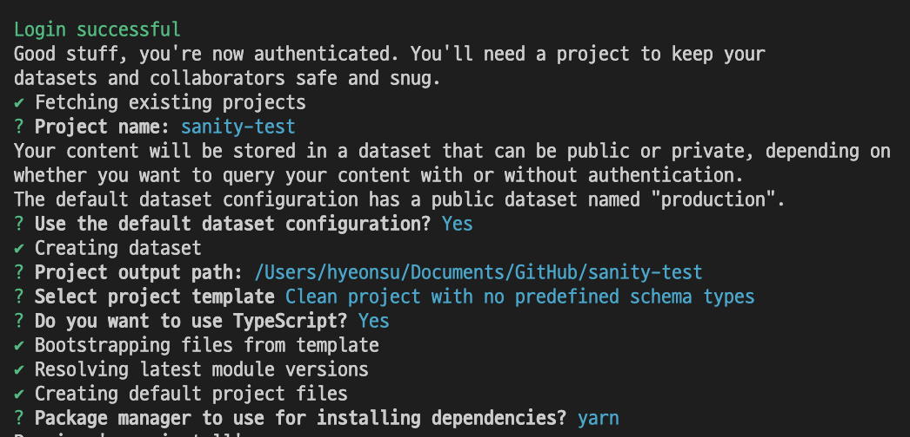

프로젝트를 생성하면 아래와 같은 폴더 구조가 생성됩니다.
기본적인 linter(eslint)와 formatter(prettier) 설정,
그리고 스키마 타입을 정의할 수 있는 폴더와 Sanity의 설정을 위한 config 파일들이 생성됩니다.

```bash
📦project-folder
 ┣ 📂schemaTypes
 ┃ ┗ 📜index.ts
 ┣ 📂static
 ┃ ┗ 📜.gitkeep
 ┣ 📜.eslintrc
 ┣ 📜.gitignore
 ┣ 📜README.md
 ┣ 📜package.json
┣ 📜sanity.cli.ts
┣ 📜sanity.config.ts
┣ 📜tsconfig.json
┗ 📜yarn.lock
```

`sanity.config.ts` 파일에 Sanity의 설정이 되어있는데 `projectId`와 `dataset`이 노출되어도 되나?라는 생각이 들 수 있습니다.
[이 곳](https://www.sanity.io/answers/hello-quick-question-is-it-safe-to-commit-p1609342625280000)에서도 얘기된 것처럼
`projectId`와 `dataset`은 노출되어도 되는 정보입니다. Sanity 내부적으로 데이터 공개 여부를 설정할 수 있으며,
데이터에 접근하는 것을 API Token을 발급해서 해당 토큰을 통해 접근 제어를 할 수도 있습니다.

본격적으로 프로젝트 개발에 앞서서 Sanity 프로젝트의 `dataset`을 하나 더 생성해야 합니다.
dataset은 데이터베이스의 개념으로 생각하면 됩니다. 기본적으로 `production` 이름으로 된 `dataset`이 생성이 되어있을 텐데
개발 환경 분리를 위해서 `development`라는 이름으로 `dataset`을 하나 더 생성해야 합니다.

Sanity 어드민 화면을 개발할 때는 `development` `dataset`을 사용하고, 배포할 때는 `production` `dataset`을 사용하면 됩니다.

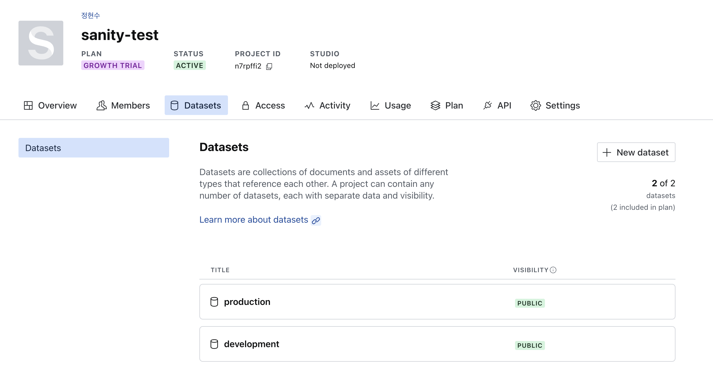

<Callout type="info">
환경 분리는 개발 환경에서의 테스트와 배포 환경에서의 테스트를 분리하기 위함입니다.
</Callout>

## 스키마 정의

<Callout type="info">**스키마**는 **데이터 구조도** 혹은 **데이터베이스 설계도** 정도로 이해하면 쉽습니다.</Callout>

위와 같이 프로젝트를 생성하고 `yarn dev` 명령어로 프로젝트를 실행하면
아래와 같은 화면을 맨 처음 보게 됩니다.

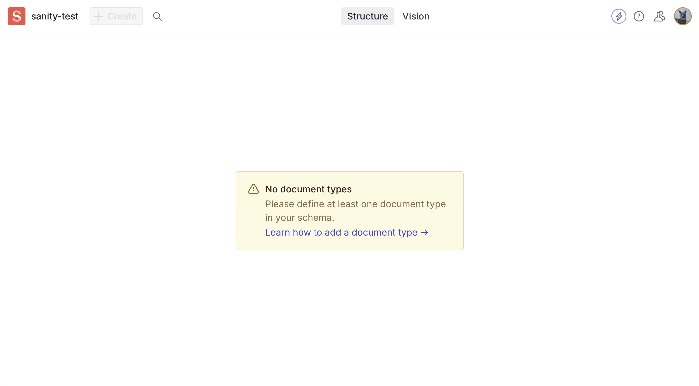

만약 기본 템플릿이 아니라 미리 정의된 스키마를 가진 템플릿으로 프로젝트를 생성했다면
위와 같은 화면이 아닐 수도 있습니다. 하지만 기본적으로는 위와 같은 화면이 나옵니다.

이유는 `schemaTypes` 폴더에 있는 `index.ts` 파일에 스키마를 정의해야 하기 때문입니다.
스키마를 정의하지 않으면 어드민 페이지에 아무것도 나오지 않습니다.

Sanity의 스키마에 대한 설명은 [공식 문서](https://www.sanity.io/docs/schema-types)에 자세하게 나와 있습니다.
우리는 로띠 파일을 올릴 수 있는 스키마를 정의해야 합니다. `schemaTypes` 폴더 안에 `lottie.ts` 파일을 만들고 아래와 같이 작성합니다.

```typescript
// schemaTypes/lottie.ts
import { defineField, defineType } from "sanity";

export const lottie = defineType({
  name: "lottie",
  type: "document",
  title: "Lottie",
  fields: [
    defineField({
      name: "title",
      type: "string",
      description: "로띠 이름을 입력해 주세요.",
      validation: (Rule) => Rule.required(),
    }),
    defineField({
      name: "description",
      type: "string",
      description: "로띠 설명을 입력해 주세요.",
    }),
    defineField({
      name: "lottie",
      type: "file",
      description: "로띠 파일을 올려주세요.",
      options: {
        accept: ".json",
      },
      validation: (Rule) => Rule.assetRequired(),
    }),
  ],

  preview: {
    select: {
      title: "title",
      subtitle: "description",
    },
  },
});
```

그리고 `schemaTypes/index.ts` 파일에 아래와 같이 추가합니다.
로띠 파일을 업로드할 때 필요한 데이터로는 `title`, `description`, `lottie`가 필요합니다.
추후에는 `category`, `tags`, `author` 등 다양한 필드들이 필요할 수 있습니다.

```typescript
// schemaTypes/index.ts
import { lottie } from "./lottie"

export const schemaTypes = [lottie]
```

위와 같이 스키마를 정의하면 어드민 페이지에 아래와 같이 나옵니다.

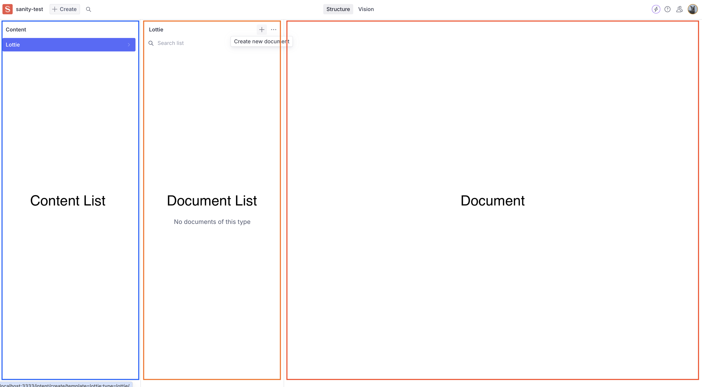

제일 왼쪽부터 총 세 개의 패널이 있는데 차례대로 살짝씩 설명을 하고 넘어가겠습니다.
(이미지에 적힌 용어들은 공식적인 용어는 아니고 이해를 위한 용어입니다.)

- `Content List`: 데이터베이스 테이블 리스트라고 생각하면 쉽습니다. 현재는 `Lottie`라는 테이블이 하나만 있지만 추후에는 `Illust`, `Video`, `Brand Character` 등 다양한 테이블이 생길 수 있습니다.
- `Document List`: 테이블의 데이터 리스트라고 생각하면 쉽습니다. 현재는 `Lottie`라는 테이블의 데이터 리스트가 나와야 하지만 아직 데이터가 없어서 나오지 않습니다.
- `Document`: 테이블의 데이터를 수정하는 화면입니다. 스키마에서 정의해 놓은 필드에 따라서 데이터를 입력할 수 있습니다.

## 데이터 넣어보기

스키마를 정의했다면, 이제 데이터를 넣어보겠습니다.

위에서 보여드렸던 것처럼 `Document List` 패널에서 플러스 버튼을 누르고 데이터를 추가할 수 있습니다.

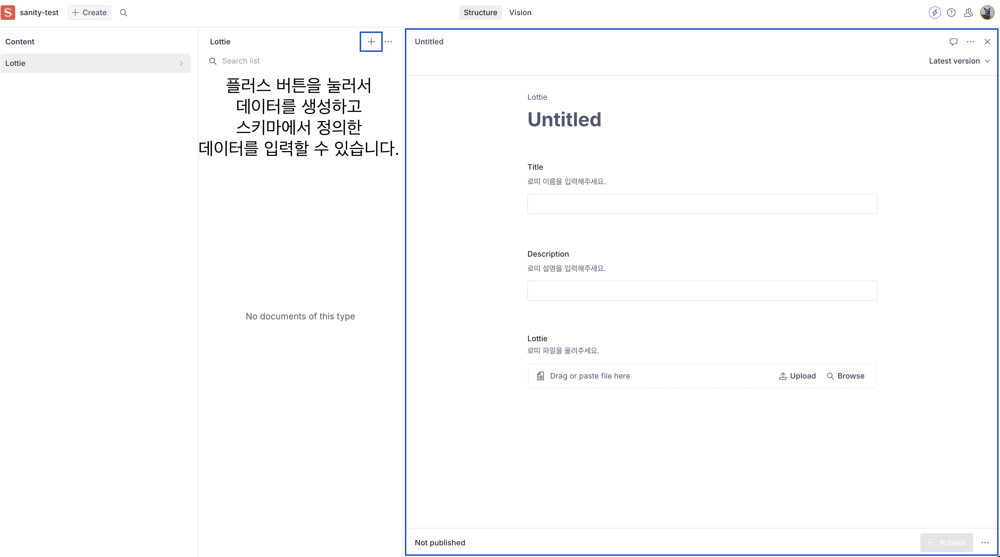

위에 스키마에서 정의한 것처럼 `lottie` 필드에는 `.json` 파일만 올릴 수 있도록 설정했기 때문에 `.json` 파일만 올릴 수 있습니다.

스키마에서 정의한 필드들을 다 채우고 오른쪽 아래에 있는 `Publish` 버튼을 누르면 데이터가 실제로 저장됩니다.

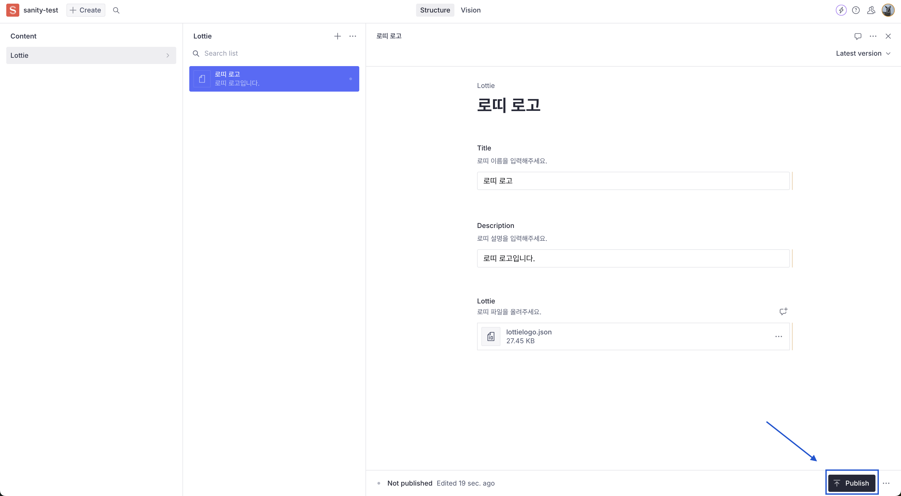

배포하는 이유는 어드민 화면에서 `title`을 입력하고 `description`을 입력하고 `lottie` 파일을 올렸다고 해서 바로 데이터베이스에 저장되는 것이 아니라
`draft` 상태로 저장이 되기 때문입니다. `draft` 상태의 데이터들은 같이 어드민을 조작하는 사람들은 볼 수 있지만, 실제로 사용자들이 접근할 수 있는 데이터가 아닙니다.

블로그 글을 예시로 들자면 같이 어드민 페이지를 조작하는 사람들은 아직 발행되지 않은 글에 대해서 볼 수 있고 편집도 할 수 있지만
실제로 사용자들이 볼 수 있는 글은 `published` 상태의 글들인 것처럼 이해하시면 됩니다.

`Publish`를 눌렀다면 Sanity에 내장된 데이터베이스에 데이터가 저장됩니다.

## GROQ 쿼리 날려보기

데이터를 적재했다면 데이터를 확인하고 가져올 수도 있어야겠죠.
Sanity는 `GraphQl`과 `GROQ` 쿼리 언어를 지원합니다.

어드민 화면 상단에 `Structure`라는 탭은 데이터를 확인하는 탭이고,
`Vision` 탭을 클릭해서 데이터베이스에 쿼리를 날려볼 수 있습니다.

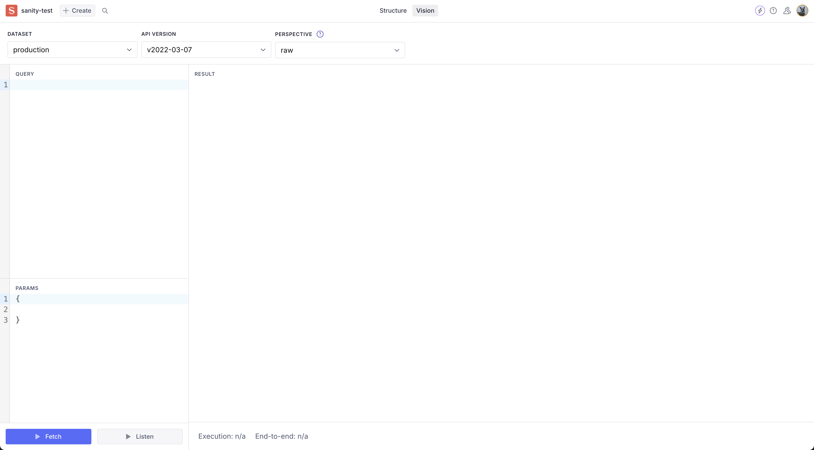

GROQ 쿼리를 통해 데이터를 가져와 보겠습니다.

```groq,2-2
// document type이 lottie인 데이터를 모두 가져옵니다.
*[_type == "lottie"]
```

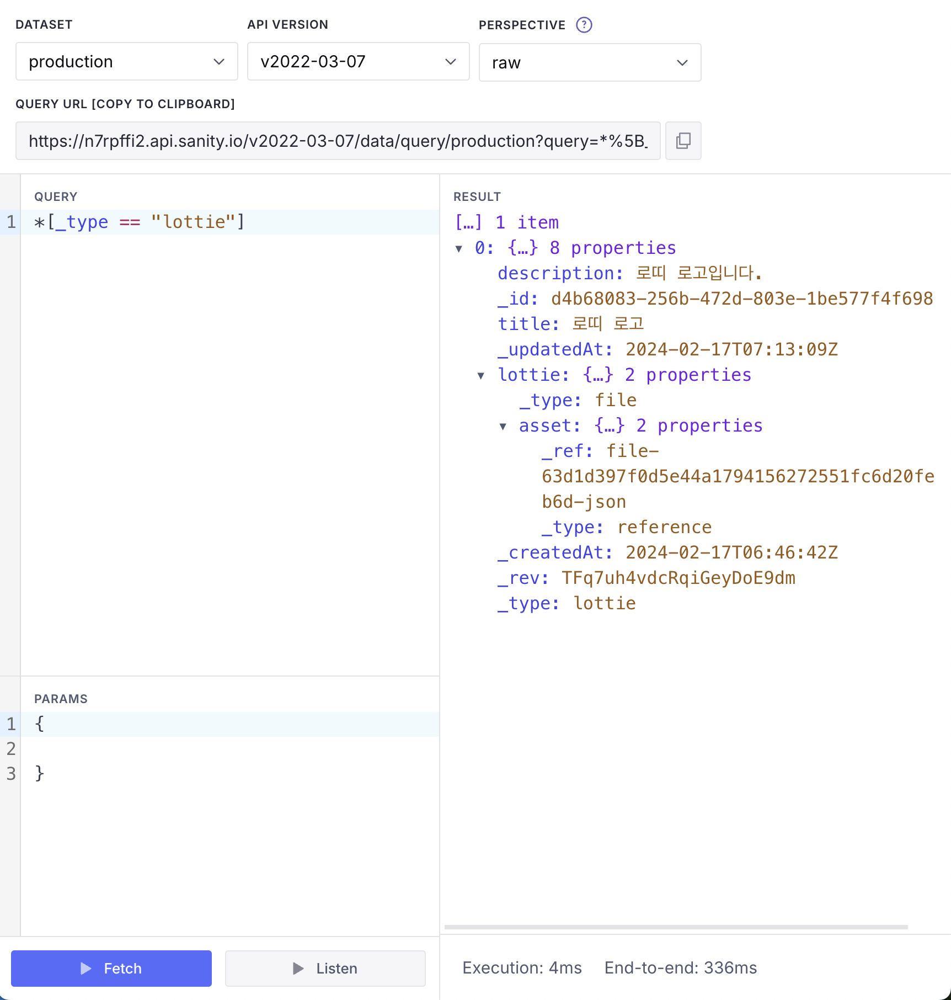

`_type == "lottie"` 조건에 해당하는 데이터들이 나오는 것을 확인할 수 있습니다.
해당 필드는 아까 위에서 정의한 스키마에서 정의한 필드에서 확인할 수 있습니다.

```typescript,5-5
// schemaTypes/lottie.ts
import { defineField, defineType } from "sanity";

export const lottie = defineType({
  name: "lottie", // _type 값에 해당하는 값입니다.
  type: "document",
  title: "Lottie",
  fields: [
    ...생략
  ],
  preview: {
    ...생략
  },
});
```

위와 같이 조건에 맞는 데이터들의 모든 필드를 가져올 수도 있고, 필요한 필드만 가져올 수도 있습니다.

```groq
*[_type == "lottie"] {
  title,
  description,
  lottie
}
```

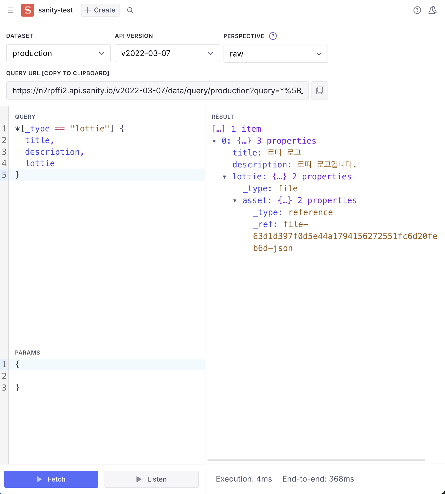

위처럼 필요한 필드만 가져올 수 있습니다.

한 가지 특이한 점은 `lottie` 필드는 `file` 타입인데, `file` 타입 혹은 추후에 넣게 될 수도 있는 `image`와 같은 타입들은
데이터를 `ref` 형태로 가져옵니다. [reference type](https://www.sanity.io/docs/reference-type)은 문서를 통해 확인할 수 있고,
간단하게 설명하면 `file` 타입의 데이터를 가져올 때 직접 데이터에 대한 정보를 가져오는 것이 아니라 `file` 데이터에 대한 `ref`를 가져오는 것입니다.
이러한 아키텍처를 통해서 스키마를 정의할 때 다른 데이터와 연결도 할 수 있고, 관심사 분리, 시스템에 대한 확장성 등 다양한 이점이 있습니다.

하지만 우리가 보고 싶은 데이터는 `file` 데이터의 `ref`가 아니라 실제 데이터를 보고 싶을 것입니다.
그럼, 아래와 같이 쿼리하면 됩니다.

```groq,7-7
*[_type == "lottie"] {
  title,
  description,
  // "lottie"는 alias입니다.
  // lottie.asset-> 을 통해서 실제 데이터를 가져옵니다.
  // 결론은 "lottie" 이름으로 lottie.asset의 참조 데이터의 모든 필드를 가져온다는 뜻입니다.
  "lottie": lottie.asset->
}
```

문법의 형태가 조금 특이한데, 위와 같이 쿼리를 날리면 아래와 같은 결과를 얻을 수 있습니다.
저장된 로띠 파일에 대한 메타데이터들을 전부 볼 수 있습니다.

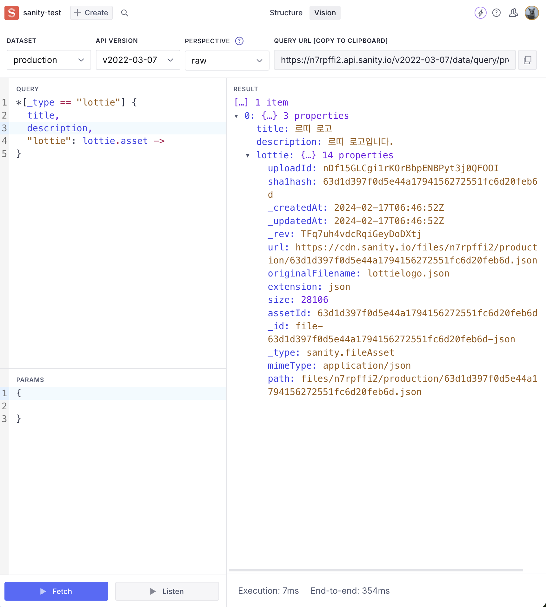

저기서도 선택적으로 필요한 필드를 가져오려면 아래와 같이 쿼리하면 됩니다.

```groq,4-7
*[_type == "lottie"] {
  title,
  description,
  "lottie": lottie.asset-> {
    originalFilename,
    extension,
    url
  }
}
```

이런 식으로 어드민에서 넣은 데이터를 확인할 수 있습니다.

`Vision` 탭을 잘 살펴보면 쿼리에 대한 고유한 URL 링크도 있어서
해당 URL로 접속하면 해당 쿼리에 대한 응답을 JSON 형태로 볼 수 있습니다.

또한 `GROQ`에서는 필터링, 정렬, 페이징, 그룹핑 등 다양한 기능을 제공하기 때문에 상상하는 웬만한 쿼리들은 다 가능합니다.
예를 들면 `lottie 파일들 중에서 가장 최근에 업로드된 파일 10개만 가져오되 description이 있고, title을 기준으로 내림차순으로 정렬하기` 혹은
`lottie 파일들 중에서 title에 특정 문자가 포함되어 있고 "event"라는 태그 혹은 카테고리를 가진 파일만 가져오기` 등 다양한 쿼리들이 가능합니다.

또한 클라이언트 라이브러리도 제공하기 때문에 리액트에서도 쉽게 쿼리를 날려서 데이터를 가져올 수 있습니다.

`GROQ` 다양한 쿼리 치트시트는 [여기](https://www.sanity.io/docs/query-cheat-sheet)에서 확인할 수 있습니다.

## 커스텀 컴포넌트 만들기

데이터 스키마를 통해서 어드민 화면을 만들면 Sanity에서 제공해 주는 기본적인 컴포넌트들로 화면이 구성되게 됩니다.
근데 그게 아니라 커스텀 컴포넌트를 만들어서 화면을 구성하고 싶다면 어떻게 해야 할까요?

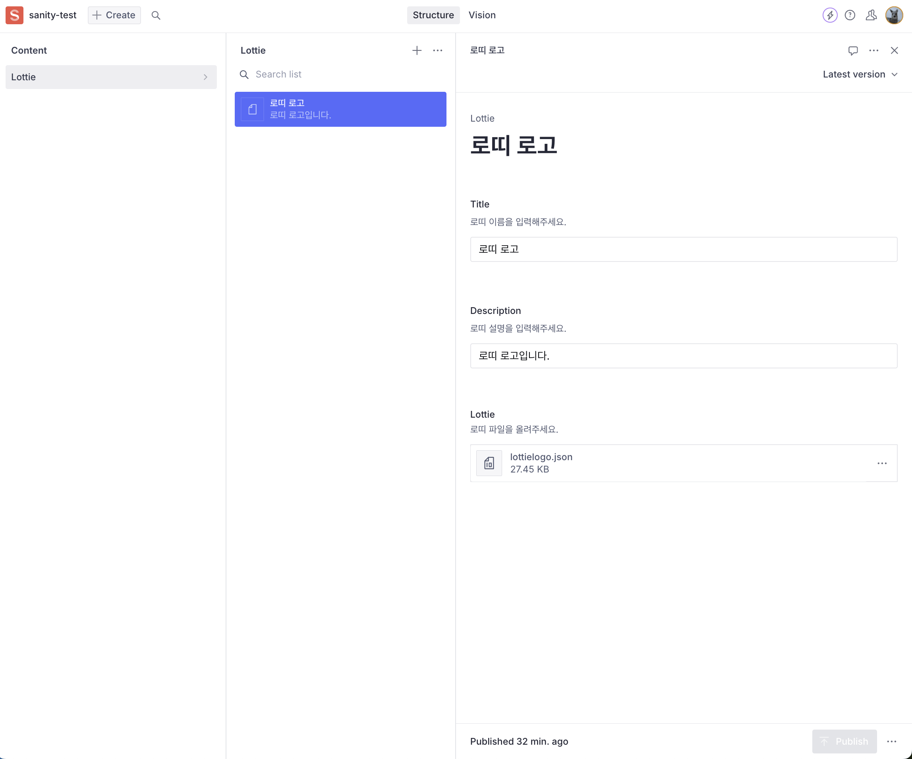

현재는 로띠 파일을 올리면 파일 이름과 파일의 크기에 대한 정보만 보이는데,
만약 로띠 파일과 같은 `json` 파일을 올렸을 때,
그 파일을 읽어서 로띠 미리 보기를 제공해 주던 가와 같은 것을 하고 싶다면 커스텀 컴포넌트를 만들어야 합니다.
Sanity에서는 React 컴포넌트를 사용하여 커스텀 컴포넌트를 만들 수 있습니다.

src/components 폴더를 만들고 `CustomLottiePlayer.tsx` 파일을 만들어서 아래와 같이 작성합니다.

```tsx
// src/components/CustomLottiePlayer.tsx
/* eslint-disable react/prop-types */
import {getFile} from '@sanity/asset-utils'
import {Stack} from '@sanity/ui'
import {ComponentType} from 'react'
import {type FileValue, type ObjectInputProps, type ObjectSchemaType} from 'sanity'
import {Controls, Player} from '@lottiefiles/react-lottie-player'

export const CustomLottiePlayerInput: ComponentType<
  ObjectInputProps<FileValue, ObjectSchemaType>
> = (props) => {
  const value = props.value
  if (!value) return props.renderDefault(props)

  const {asset} = value
  if (!asset) return props.renderDefault(props)

  const file = getFile(asset, {
    dataset: 'production', // 자신의 dataset 이름으로 변경
    projectId: 'n7rpffi2', // 자신의 projectId 이름으로 변경
  })
  
  const url = file.asset.url // lottie 파일의 url

  return (
    <Stack space={3}>
      <Player autoplay loop src={url} style={{height: '300px', width: '300px'}}>
        <Controls visible={true} buttons={['play', 'repeat', 'frame', 'debug', '']} />
      </Player>

      {props.renderDefault({
        ...props,
        onChange: (value) => {
          props.onChange(value)
        },
      })}
    </Stack>
  )
}
```

로띠 플레이어는 [@lottiefiles/react-lottie-player](https://www.npmjs.com/package/@lottiefiles/react-lottie-player) 라이브러리를 사용해서 커스텀 컴포넌트를 만들었습니다.

위 코드에서 주목해야 하는 부분은 커스텀 컴포넌트를 만들면 Sanity에서 주입해 주는 `props`들을 사용할 수 있습니다.
그중에서 우리는 `lottie` 파일의 `asset`에 대한 `url`을 가져와서 `@lottiefiles/react-lottie-player`에 `src`로 넣어주었습니다.

그리고 `props.renderDefault`는 만약에 커스텀 컴포넌트를 만들지 않고 그냥 Sanity에서 제공해 주는 컴포넌트를 렌더링 하겠다는 의미입니다.
해당 코드를 넣지 않게 되면 파일을 업로드하는 폼이 사라지게 되기 때문에 까먹지 않고 넣어주어야 합니다.

위와 같이 Sanity에서 제공해 주는 util 함수들, ui 컴포넌트를 사용해서 커스텀 컴포넌트를 만들 수 있습니다.

이렇게 커스텀 컴포넌트를 만들었으면 스키마 파일에서 해당 커스텀 컴포넌트를 사용하겠다고 선언해 주어야 합니다.

```tsx,4-4&29-31
// schemaTypes/lottie.ts
import { defineField, defineType } from "sanity";

import { CustomLottiePlayerInput } from "../src/components/CustomLottiePlayer";

export const lottie = defineType({
  name: "lottie",
  type: "document",
  title: "Lottie",
  fields: [
    defineField({
      name: "title",
      type: "string",
      description: "로띠 이름을 입력해 주세요.",
      validation: (Rule) => Rule.required(),
    }),
    defineField({
      name: "description",
      type: "string",
      description: "로띠 설명을 입력해 주세요.",
    }),
    defineField({
      name: "lottie",
      type: "file",
      description: "로띠 파일을 올려주세요.",
      options: {
        accept: ".json",
      },
      components: {
        input: CustomLottiePlayerInput,
      },
      validation: (Rule) => Rule.assetRequired(),
    }),
  ],

  preview: {
    select: {
      title: "title",
      subtitle: "description",
    },
  },
});
```

위와 같이 고치고 나면 어드민 페이지에서 아래와 같이 로띠 파일을 올리면 해당 로띠 파일을 미리보기로 볼 수 있습니다.

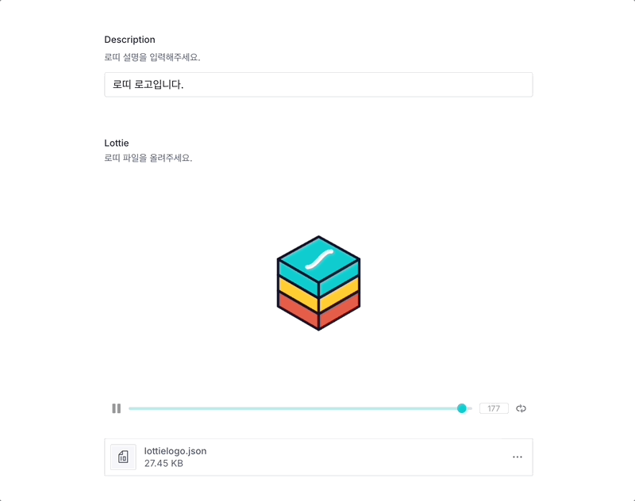

## 어드민 페이지 배포

데이터 스키마 정의를 통해서 모델링도 하고 커스텀 컴포넌트도 만들었다면
어느 정도 구색을 갖춘 어드민 페이지가 완성되는데요, 이제 해당 페이지를 배포해서 다른 사람들과 협업할 수 있게 만들어야 합니다.
현재는 제 로컬호스트에서만 어드민 페이지를 볼 수 있기 때문에 다른 사람들과 협업하기 위해서는 배포가 필요합니다.

기본적인 Sanity 템플릿을 이용해서 프로젝트를 생성했다면 `yarn build` 명령어를 통해서 빌드 결과물을 확인할 수 있습니다.

```bash
📦dist
 ┣ 📂static
 ┃ ┣ 📜.gitkeep
 ┃ ┣ 📜SanityVision-9R-J5NEI-e929e34e.js
 ┃ ┣ 📜apple-touch-icon.png
 ┃ ┣ 📜browser-6f831660.js
 ┃ ┣ 📜favicon-192.png
 ┃ ┣ 📜favicon-512.png
 ┃ ┣ 📜favicon.ico
┃ ┣ 📜favicon.svg
┃ ┣ 📜index-0LpTAOhF-3116ac06.js
┃ ┣ 📜index-c8Mnhnf1-7afa030a.js
┃ ┣ 📜index-mZQe2RMW-3bf816fa.js
┃ ┣ 📜manifest.webmanifest
┃ ┣ 📜pane-43tjD0ya-3cde43f9.js
┃ ┣ 📜pane-BJeAKwar-c57e8f53.js
┃ ┣ 📜resources-7hAPJyyn-de64d85f.js
┃ ┣ 📜resources-HZQaDS9--f4d2cb91.js
┃ ┣ 📜resources-bPLLJ09x-2fd9bbaf.js
┃ ┣ 📜sanity-c10c8c28.js
┃ ┗ 📜stegaEncodeSourceMap-D3O62d5b-8dcaa43a.js
┣ 📜favicon.ico
┗ 📜index.html
```

`dist` 폴더에 빌드 결과물이 생성되며, 해당 폴더를 정적 호스팅 서비스에 올리면 어드민 페이지를 배포할 수 있습니다.
바로 당장 사용할 수 있는 `index.html` 파일이 생성되기 때문에 정적 호스팅 서비스에 올리면 바로 사용할 수 있습니다.

여러 정적 호스팅 서비스가 있으며 그중에서도 `Vercel`, `Netlify`, `AWS S3`, `Cloudflare Pages` 등을 이용할 수 있습니다.
저는 `Cloudflare Pages`를 이용해서 배포했습니다.

이렇게 배포까지 하면 에셋을 관리하는 디자이너분이나 다른 개발자분들을
프로젝트 Admin 권한으로 이메일로 초대해서 함께 협업할 수 있습니다.

Sanity 홈페이지에서 유저에 대한 권한 설정도 할 수 있지만, 무료 플랜에서는 Admin만 가능하고
이외의 권한(Ex: Develpoer, Designer, Editor, 혹은 그 이외의 독특한 Role, etc...)은 [유료 플랜](https://www.sanity.io/docs/roles)에서만 가능합니다.

## 마무리 및 다음 글

요기까지 하면 에셋타운의 어드민 페이지가 완성됩니다.
(완성이라고 하기엔 너무 부족하지만...)

해당 글에서는 로띠 파일에만 해당하는 내용들이고 Sanity에 대한 설명과 사용법에 대한 생략도 많이 되어있습니다.
지금, 이 글을 쓰는 시점에는 약 한 달간 Sanity를 사용해 봤습니다.
사용하며 느낀 건 `이걸 내가 왜 이제 발견했지?`라는 생각이 들 정도로 만족감이 높았습니다.

Sanity는 개발자 친화적이고, 커스텀 컴포넌트도 만들 수 있고,
클라이언트 라이브러리 제공, 많은 훅 제공 또한 웹훅, 스크립트 주입 등
개발자가 상상하는 웬만한 기능들은 다 제공되어 있습니다.

위 모든 기능이 무료로도 충분히 사용할 수 있어서 추후에 컨텐츠를 관리해야 하는 프로젝트가 있다면
Sanity를 사용하고 싶다는 생각이 들었습니다. 사실 컨텐츠 관리뿐만 아니라 정말 상상력을 펼친다면 다양한 방면으로 사용할 수 있을 거 같습니다.

많은 삽질과 많은 기능들이 많지만, 현재 글에서는 생략된 게 많다는 걸 인지해 주세요.
저는 에셋타운이라는 프로젝트에 필요한 기능들만 사용했고, Sanity를 요리해서 자신의 프로젝트에 맞게 사용하는 건 여러분들의 몫입니다.
또한 꼭 Sanity가 아니더라도 다른 CMS를 사용해도 무방합니다.

다음 글에서는 Sanity의 CDN 무료 범위를 넘어서는 경우에 대한 대비책인
Cloudflare Workers와 Cloudflare R2를 이용한 웹훅 처리와 CDN에 대해 다루겠습니다.

다음 글에서 뵙겠습니다.

## 링크 정리

- [Sanity 공식 홈페이지](https://www.sanity.io/)
- [Sanity 공식 문서](https://www.sanity.io/docs)
- [Sanity projectId와 dataset에 대한 보안에 대한 질문과 답변](https://www.sanity.io/answers/hello-quick-question-is-it-safe-to-commit-p1609342625280000)
- [Sanity Roles](https://www.sanity.io/docs/roles)
- [Sanity의 reference type에 대해서](https://www.sanity.io/docs/reference-type)
- [GROQ 쿼리 치트시트](https://www.sanity.io/docs/query-cheat-sheet)
- [@lottiefiles/react-lottie-player: 로띠 플레이어 라이브러리](https://www.npmjs.com/package/@lottiefiles/react-lottie-player)
