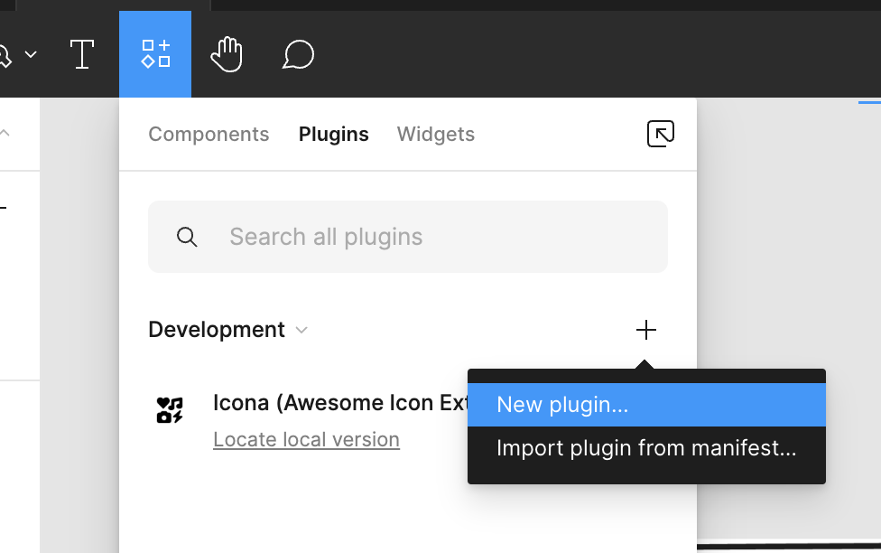
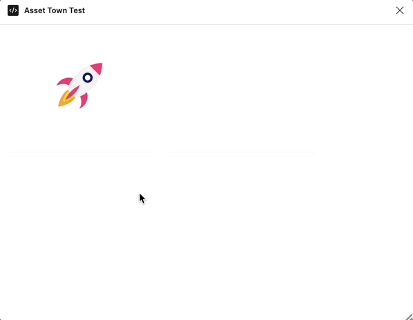

<Callout type="info">
**이 시리즈는 총 4개의 컨텐츠로 기획되어 있습니다.**

1. [에셋 관리 시스템을 만들어보자 (에셋타운 1편 - 개요)](https://junghyeonsu.com/posts/asset-town-introduction/)
2. [에셋 관리 시스템을 만들어보자 (에셋타운 2편 - Sanity를 이용한 어드민)](https://junghyeonsu.com/posts/asset-town-admin-with-sanity/)
3. [에셋 관리 시스템을 만들어보자 (에셋타운 3편 - Cloudflare Workers, R2를 이용한 웹훅 처리와 CDN 캐싱)](https://junghyeonsu.com/posts/asset-town-provide-cdn-using-webhook-and-cloudflare/)
4. **에셋 관리 시스템을 만들어보자 (에셋타운 4편 - Figma Plugin을 이용한 에셋 전시) [현재 글]**
</Callout>

<Callout type="danger">
해당 프로젝트는 일주일 만에 만들어진 프로젝트로 추후에는 많은 변경이 있을 수도 있습니다.
</Callout>

## 들어가기 전

이전 글까지는 Sanity를 이용해서 에셋을 저장 및 관리하고 Cloudflare의 서비스들을 이용하여 CDN을 제공하는 방법에 대해 알아보았습니다.
처음 이 시리즈물의 개요 글에서도 설명했지만, 해당 프로젝트는 사내에서 디자이너분들이 에셋을 관리하고
회사의 디자이너분들이 바로 에셋을 가져다 사용할 수 있는 시스템을 만드는 것이 목적입니다.

그래서 현재 설명하는 피그마 플러그인, 즉 클라이언트단은 각 환경에 맞게 변경이 될 수 있습니다.
저는 현재 회사에서 Figma를 사용하고 있기 때문에 Figma Plugin을 만들어서 에셋을 전시하는 방법에 대해 알아보겠습니다.

## 피그마 플러그인

피그마 플러그인은 Figma에서 제공하는 플러그인 시스템입니다.
개발자들이 Figma의 기능을 확장하거나, Figma의 기능을 사용하여 다른 서비스와 연동해서 원하는 기능을 구현할 수 있습니다.
현재 [많은 플러그인들](https://www.figma.com/community/plugins)이 구현되어 있습니다.
피그마 플러그인을 개발하고자 하는 개발자를 위한 [Figma Plugin Development](https://www.figma.com/plugin-docs/) 사이트를 참고해서 개발할 수 있습니다.

기본적인 피그마 플러그인의 동작방식은 다음과 같습니다.

우선 피그마 플러그인은 두 개의 레이어가 존재합니다.
`main`, `ui` 레이어가 있습니다. (이 용어는 제가 임의로 지은 것입니다.)

`main`과 `ui` 레이어는 각각 다음과 같은 역할을 합니다.

- `main`: 피그마 플러그인의 메인 로직이 동작하는 레이어입니다.
- `ui`: 피그마 플러그인의 UI를 구현하는 레이어입니다.

두 레이어가 서로 메세지를 주고 받으면서 피그마 플러그인이 동작합니다.
이렇게 구성이 된 이유는 전부 보안적인 문제 때문인데요.
플러그인을 개발하는 개발자가 피그마의 모든 정보에 접근할 수 없도록 이렇게 구성되어있습니다.
피그마 측에서는 원하는 정보만 개발자에게 공개해서 피그마 플러그인을 개발할 수 있도록 도와주고 있습니다.

## 피그마 플러그인 생성하기

피그마 플러그인을 생성하기 위해서는 피그마에서 제공해주는 기본적인 템플릿을 사용할 수 있습니다.



피그마 앱에서 화면 상단 메뉴바에서 `Resources` 탭을 클릭하고
`Plugins`를 클릭하고 `Create new plugin`을 클릭하면 피그마 플러그인을 생성할 수 있습니다.

`New Plugin`을 클릭하고 생성하고자 하는 폴더를 선택하면 기본적인 템플릿이 생성됩니다.

해당 글에서는 피그마 플러그인의 개발 방법에 대해서는 자세히 다루지 않고 넘어가곘습니다.

위에서 설명한 `ui` 레이어는 개발자가 원하는 프레임워크를 선택할 수 있습니다.
단순히 `HTML`을 사용할 수도 있고, `React`, `Vue`, `Svelte` 등의 프레임워크를 사용할 수 있습니다.

저는 `React`를 사용하여 피그마 플러그인을 개발하였습니다.

피그마 플러그인 보일러 플레이트 중에서 [create-figma-plugin](https://yuanqing.github.io/create-figma-plugin/)을 사용하여 피그마 플러그인을 생성하면
조금 더 빠르게 플러그인 개발을 진행할 수 있습니다.

단, 해당 플러그인은 `React`가 아니라 `Preact`를 사용하고 있습니다.
`Preact`는 `React`의 경량화 버전이라고 생각하시면 됩니다.
대부분의 `React`의 기능을 사용할 수 있고, `React`보다 더 가볍습니다.

그리고 위 플러그인 보일러 플레이트는 [UI 컴포넌트](https://yuanqing.github.io/create-figma-plugin/storybook/)도 제공하고
피그마 플러그인을 개발하다보면 필요한 여러 유틸함수들도 제공하고 있습니다.

## 피그마 플러그인 설정

피그마 플러그인을 개발하기 전에 꼭 해주어야 하는 설정들이 있습니다.
우리는 피그마 플러그인을 통해서 Sanity에 있는 데이터를 가져와서 피그마에 전시할거기 때문에
피그마 플러그인에서 외부 서버에 접근할 수 있도록 설정해주어야 합니다.

```json,11-11
{
  "name": "<YOUR PLUGIN NAME>",
  "id": "<YOUR PLUGIN ID>",
  "api": "1.0.0",
  "main": "dist/code.js",
  "ui": "dist/index.html",
  "capabilities": [],
  "enableProposedApi": false,
  "editorType": ["figma", "figjam"],
  "networkAccess": {
    "allowedDomains": [
      "https://cdn.sanity.io",
      "https://{YOUR SANITY PROJECT ID}.apicdn.sanity.io"
    ]
  }
}
```

위와 같이 `manifest.json` 파일에 `networkAccess`를 추가해주면 됩니다.
위 설정을 해주지 않으면 피그마 플러그인에서 외부 서버에 접근할 수 없습니다.
다른 설정들은 여러분들의 프로젝트에 맞게 설정하면 됩니다.

기본적으로 위 설정만 끝나면 크게 설정할 것은 없습니다.

## sanity에 있는 데이터를 가져오기

그 다음으로는 Sanity와 피그마 플러그인을 연동하여 Sanity에 있는 데이터를 가져와야 합니다.

Sanity에서 기본적으로 제공해주는 Client 라이브러리가 있는데요.
[@sanity/client](https://www.npmjs.com/package/@sanity/client) 라이브러리를 사용하면 쉽게 Sanity에 있는 데이터를 가져올 수 있습니다.

```typescript
// src/SanityClient.ts
import { createClient } from "@sanity/client";

export const client = createClient({
  projectId: import.meta.env.VITE_SANITY_STUDIO_PROJECT_ID,
  dataset: import.meta.env.MODE === "dev" ? "development" : "production",
  useCdn: true, // set to `false` to bypass the edge cache
  apiVersion: "2024-01-30", // use current date (YYYY-MM-DD) to target the latest API version
});
```

위와 같이 `@sanity/client` 라이브러리를 사용하여 client를 생성하고
해당 client를 이용하여 Sanity에 있는 데이터를 가져올 수 있습니다.

```typescript
// src/hooks/useLottiesQuery.ts
import { useQuery } from "@tanstack/react-query";
import type { SanityRequest } from "@asset-town/types";

import { client } from "../sanityClient";

const getLotties = () =>
  client.fetch(`
    *[_type == "lottie"] {
      _id,
      _type,
      title,
      description,
      "lottie": lottie.asset->{
        _id,
        _type,
        _createdAt,
        _updatedAt,
        url,
        originalFilename,
        uploadId,
        assetId,
        extension,
        mimeType,
        path
      },
    }
`);

export const useLottiesQuery = () => {
  return useQuery<SanityRequest[], Error, SanityRequest[]>({
    queryKey: ["lotties"],
    queryFn: getLotties,
    retry: false,
    refetchOnWindowFocus: false,
  });
};
```

위 코드의 예시는 `@tanstack/react-query` 라이브러리를 사용하여 Sanity에 있는 데이터를 가져오는 예시입니다.

아까 생성한 client의 `fetch` 메소드를 이용하여 Sanity에 있는 데이터를 가져올 수 있습니다.
그리고 `fetch` 메서드안에는 Sanity의 GROQ 쿼리를 사용하여 데이터를 가져올 수 있습니다.

위 예시는 이전 포스트까지 Sanity에 저장했던 `lottie` 데이터를 가져오는 예시입니다.

그 다음엔 해당 훅을 이용해서 컴포넌트에서 데이터를 가져와서 사용할 수 있습니다.

```tsx
// src/components/App.tsx
import { useLottiesQuery } from "../hooks/useLottiesQuery";

export const App = () => {
  const { data } = useLottiesQuery();

  return (
    <div className="flex flex-wrap break-words gap-2 p-2">
      {data?.map((obj) => (
        <LottieCard key={obj._id} {...obj} />
      ))}
    </div>
  );
};
```

이렇게까지 하고 `build`를 통해서 html, js 파일을 생성하고
피그마에서 플러그인을 확인해보면 다음과 같이 뜨는 것을 확인할 수 있습니다.



다른 부분들은 여러분들의 프로젝트에 맞게 설정하면 됩니다.

또한 지금은 피그마 플러그인을 통해서 Sanity에 있는 데이터를 가져와서 전시하는 방법에 대해서만 다뤘지만,
여러분들이 사용하는 클라이언트가 무엇이든지 위와 동일한 방법으로 데이터를 가져올 수 있습니다.
사용하는 라이브러리나 프레임워크만 다를 뿐 전체적인 흐름은 동일합니다.

## 마무리

약 두 달에 걸쳐서 에셋 관리 시스템을 만들어보는 시리즈를 마무리하게 되었습니다.
글이 점점 진행되면서 저의 귀차니즘으로 인해 글의 퀄리티가 점점 떨어지는 것을 느꼈습니다...

보는 사람이 있든 없든 나중에 `아 내가 이런 프로젝트를 했었지` 라고 회상하기 위함도 있고
다른 사람들이 비슷한 프로젝트를 진행할 때 도움이 되었으면 하는 마음으로 이 시리즈를 진행하게 되었습니다.

맨 처음에 1편 글을 쓸 때는 프로젝트가 많이 진행이 되지 않았는데
두달이 지나고 해당 프로젝트가 어느정도 진행이 되기도 했고, 얻은 인사이트도 많습니다.
그리고 요즘들어 피그마 플러그인을 많이 만들면서 얻은 것도 많아서 나중에 글로 녹여보고 싶다는 생각들도 들었습니다.

여튼 이 시리즈를 읽어주신 여러분들께 감사드리고
궁금한 점이나 피드백이 있으시면 언제든지 댓글로 알려주시면 감사하겠습니다.

감사합니다.
