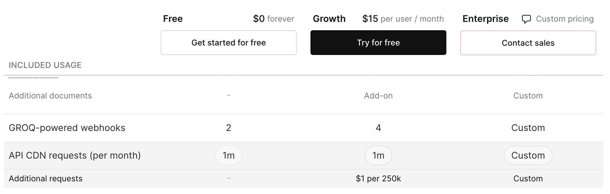
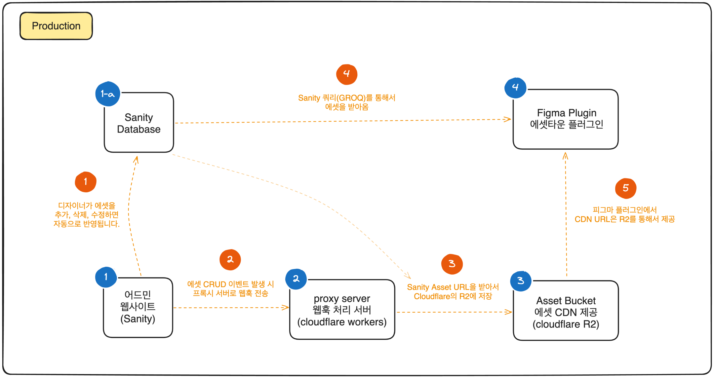
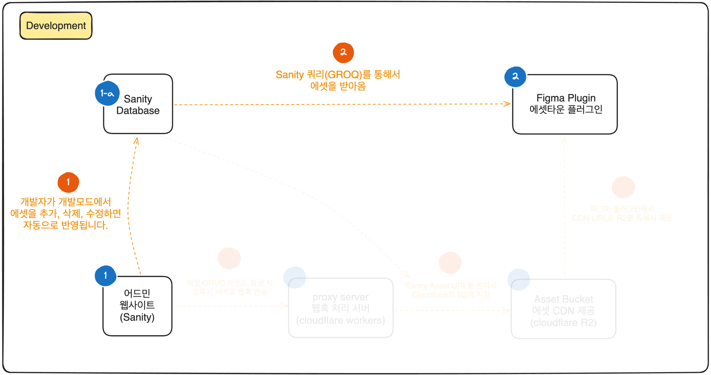

<Callout>
**이 시리즈를 다 읽고나면 다음과 같은 인사이트를 얻을 수 있습니다.**

- 에셋 관리 시스템을 만들기 위한 기본적인 아이디어
- Sanity, Cloudflare Workers, Cloudflare R2, Figma Plugin의 간단한 사용법
- CDN, Webhook, Proxy Server 등을 고려한 아키텍처와 워크플로우
- 나만의 에셋 관리 시스템을 넘어 다른 직군의 사람들과 함께 일하는 법
- 비슷한 상황에서 어떻게 해결할 수 있는지에 대한 아이디어
</Callout>

<Callout type="info">
**이 시리즈는 총 4개의 컨텐츠로 기획되어 있습니다.**

1. **에셋 관리 시스템을 만들어보자 (에셋타운 1편 - 개요) [현재 글]**
2. 에셋 관리 시스템을 만들어보자 (에셋타운 2편 - Sanity를 이용한 어드민)
3. 에셋 관리 시스템을 만들어보자 (에셋타운 3편 - Cloudflare Workers, R2를 이용한 웹훅 처리와 CDN 캐싱)
4. 에셋 관리 시스템을 만들어보자 (에셋타운 4편 - Figma Plugin을 이용한 에셋 전시)
</Callout>

<Callout type="danger">
해당 프로젝트는 일주일만에 만들어진 프로젝트로 추후에는 많은 변경이 있을 수도 있습니다.
</Callout>

## 에셋타운 개요

최근 회사에서 브랜딩팀분들이 에셋을 관리하는데 어려움을 겪고 있었습니다.
만들어진 에셋을 전시하고 디자이너분들이 찾을 수 있도록 관리하는 시스템이 필요했습니다.

이전에는 요청이 들어오면 에셋들을 직접 전달하거나 필요한 사람이 직접 찾아서 사용하는 게 일반적이었습니다.
하지만 이런 방식은 에셋을 찾는데 시간이 많이 걸리고, 에셋을 찾지 못하는 경우도 있었습니다.

피그마에서 에셋을 관리해도 되지만, 로띠와 같은 모션 파일들은 미리보기도 불가능하고,
추후에 점점 커질 브랜딩 에셋들을 관리하기에는 무리가 있었습니다.

그래서 에셋 관리 시스템, 일명 **에셋타운**을 만들어서 이 문제를 해결하고자 합니다.

에셋타운은 디자이너분들이 에셋을 올리고 수정과 업데이트를 할 수 있는 어드민 페이지,
에셋을 한눈에 탐색하고 바로 가져다 사용할 수 있는 피그마 플러그인, 그리고 CDN을 통해 개발자들이 사용할 수 있는 URL을 제공하는 것을 목표로 합니다.

<Callout type="info">
저장된 에셋을 탐색하는 도구가 피그마 플러그인인 이유는 디자이너분들이 피그마를 주로 사용하기 때문입니다.
피그마 플러그인 대신 웹페이지가 될 수도 있고, 다른 도구가 될 수도 있습니다.
</Callout>

## 에셋타운 기술스택

에셋타운은 크게 3가지의 기술스택으로 구성됩니다.

<Callout type="info">
각각의 기술스택에 대한 구현은 시리즈 안의 다른 글에서 자세히 다룰 예정입니다.
</Callout>

### 어드민 페이지 - Sanity

> 에셋을 관리하고 수정하는 CMS 어드민 페이지로 [Sanity](https://www.sanity.io/)를 사용합니다.

Sanity는 개발자가 아닌 사람들도 쉽게 사용할 수 있는 CMS(Content Management System)입니다.
어드민 페이지를 만들기 위한 스키마를 정의하고, 그에 맞게 어드민 페이지를 만들 수 있습니다.

Sanity는 정말 많은 **장점**을 가지고 있습니다. 그 중에서 몇 가지만 소개하자면 (일주일 사용한 사람의 후기)

- CMS으로써의 기능으로 완벽한 기능을 제공합니다. (버전관리, 히스토리, 동시편집, 실시간 DB 제공 등)
- 어드민 페이지 안에서 커스텀 컴포넌트를 쉽게 만들 수 있고 다양한 훅을 제공합니다. (React)
- 삭제, 수정, 생성 등의 이벤트에 대해서 웹훅을 제공합니다. (무료 2개의 웹훅을 제공)
- 꽤나 짱짱한, 사이드 프로젝트에서는 거의 공짜로 사용할 수 있는 범위의 [무료 플랜](https://www.sanity.io/pricing)을 제공합니다.
- 인증, 권한, 권한 그룹, 권한 설정 등의 기능을 제공합니다. (무료 플랜에서도 사용 가능하지만 권한 설정이 제한적)

장점도 있지만 `GROQ` 쿼리를 사용하는 것이 처음에 살짝 어색했고,
무료 플랜에서는 웹훅이 **2**개밖에 제공되지 않는다는 점이 아쉬웠습니다.
그리고 제일 중요한 CDN 요청이 한 달에 `10,000,000` (천만회)까지 무료이지만, 사내에서 사용하기엔 부족했습니다. (아래의 Cloudflare를 사용해서 아키텍처를 구성한 이유)

### Cloudflare Workers, Cloudflare R2

> 웹훅 처리와 CDN 캐싱을 위한 클라우드 서비스로 [Cloudflare](https://www.cloudflare.com/ko-kr/)의
[workers](https://workers.cloudflare.com/)와 [R2](https://www.cloudflare.com/ko-kr/developer-platform/r2/)를 사용합니다.

위에서 언급한 것처럼, CDN 요청이 한 달에 `10,000,000` (천만회)까지 무료이지만, 사내에서 사용하기엔 부족했습니다.
[Cloudflare의 CDN](https://www.cloudflare.com/ko-kr/application-services/products/cdn/#CDN-Page-Pricing-AS)은 Sanity와 다르게 요청수에 따라서 요금이 부과되지 않습니다.
그래서 Cloudflare의 Workers와 R2를 사용해서 웹훅 처리와 CDN 캐싱을 구성하였습니다.

### 피그마 플러그인 - Figma Plugin

> 에셋을 탐색하고 사용할 수 있는 피그마 플러그인으로 [Figma Plugin](https://www.figma.com/community/plugins)을 사용합니다.

피그마 플러그인은 피그마에서 사용할 수 있는 샌드박스 형태의 도구입니다.
[피그마에서 제공되는 다양한 API](https://www.figma.com/plugin-docs/)를 통해서 피그마의 기능을 확장할 수 있습니다.

## 에셋타운 아키텍처

> 에셋타운의 프로덕션 아키텍처와 개발 아키텍처입니다.

현재는 개발 환경과 프로덕션 환경이 살짝 다릅니다.
이유는 개발 환경에서는 요청이 적기 때문에 굳이 `Cloudflare CDN` 거쳐서 요청을 받을 필요가 없기 때문입니다.

<Callout type="danger">
이 모든 아키텍처는 개인적인 경험과 생각을 바탕으로 작성되었습니다.
실제로는 더 좋은 방법이 있을 수 있고, 정답이 아닙니다.
</Callout>

### 프로덕션 아키텍처

<Callout type="info">
**1. 어드민 웹사이트 (Sanity)**

디자이너분들이 에셋을 관리하고 수정하는 어드민 페이지입니다.
</Callout>

<Callout type="info">
**1-a. Sanity Database**

Sanity를 통해서 어드민을 구축하면 자동으로 생성되는 데이터베이스입니다.
피그마 플러그인 또한 사용하는 유저가 많지 않기 때문에 (사내 서비스) 직접 Sanity에 쿼리를 통해서 데이터를 가져옵니다.

만약 사내 서비스가 아니라 외부 서비스로 사용한다면, CDN을 통해서 데이터를 가져오는 것이 더 효율적일 수 있습니다.
</Callout>

<Callout type="info">
**2. proxy server: Cloudflare Workers (웹훅 처리 서버)**

Sanity에서 발생하는 이벤트를 처리하기 위한 서버입니다.
Cloudflare R2에 에셋들을 올리기 위한 서버이고, 웹훅이 들어오면 그에 맞는 처리를 해줍니다.
</Callout>

<Callout type="info">
**3. Asset Bucket: Cloudflare R2 (에셋 CDN 제공 버킷)**

에셋을 저장하고 CDN을 통해서 제공하는 버킷입니다.
Cloudflare R2는 Cloudflare의 Object Storage로, 에셋을 저장하고 CDN을 통해서 제공할 수 있습니다.
AWS의 S3와 비슷한 서비스입니다. 다만 Cloudflare에서 커스텀 도메인을 사용해야(도메인을 가지고 있어야) CDN으로 제공할 수 있습니다.
</Callout>

<Callout type="info">
**4. Figma Plugin: 에셋타운 플러그인**

피그마에서 사용할 수 있는 플러그인입니다.
에셋을 탐색하고 디자이너는 피그마에서 에셋을 드래그앤ㄷ롭으로 사용할 수 있고,
개발자는 주소를 복사해서 바로 사용할 수 있습니다.
</Callout>

<Callout type="warn">
**1. 디자이너가 에셋을 추가, 삭제, 수정하면 자동으로 반영됩니다.**

실시간으로 반영이 되기 때문에 피그마 플러그인에서 쿼리를 통해서 데이터를 가져오면 최신 데이터를 가져올 수 있습니다.
</Callout>

<Callout type="warn">
**2. 에셋 CRUD 이벤트 발생 시 프록시 서버로 웹훅 전송**

Sanity에서 발생하는 이벤트를 프록시 서버로 웹훅을 전송합니다.
무료로 제공되는 웹훅은 2개이기 때문에, PUT(생성 및 수정)을 하나의 웹훅으로 처리하고
DELETE(삭제)를 하나의 웹훅으로 처리합니다.
</Callout>

<Callout type="warn">
**3. Sanity Asset URL을 받아서 Cloudflare의 R2에 저장**

웹훅을 받으면 Sanity에서 날린 데이터를 통해 Cloudflare R2에 PUT 혹은 DELETE를 합니다.
</Callout>

<Callout type="warn">
**4. Sanity 쿼리(GROQ)를 통해서 에셋을 받아옴**

피그마 플러그인에서 Sanity에 쿼리를 통해서 데이터를 받아옵니다.
위에서 설명한대로 피그마 플러그인은 사용자가 많지 않기 때문에, Sanity를 통해서 직접 데이터를 받아옵니다.
하지만 예상 유저가 많다면 Cloudflare CDN과 같이 요청수에 따라 요금이 부과되지 않는 서비스를 이용하는 것이 더 효율적일 수 있습니다.
</Callout>

<Callout type="warn">
**5. 피그마 플러그인에서 CDN URL은 R2를 통해서 제공**

피그마 플러그인에서 에셋 주소 복사하기과 같은 버튼이 있다면 Cloudflare R2의 URL을 복사하도록 합니다.
결과적으론 피그마 플러그인에서 미리보기로 보여지는 에셋의 주소와 복사되는 주소는 달라지게 됩니다.
</Callout>

### 개발 아키텍처

개발 아키텍처는 프로덕션 아키텍처와 다르게 프록시 서버와 웹훅을 통해 버킷에 저장되는 과정을 생략합니다.
이유는 개발 환경에서는 요청이 적기 때문에 굳이 `Cloudflare CDN` 거쳐서 요청을 받을 필요가 없기 때문입니다.
또한 Sanity의 웹훅이 무료로 제공되는 것이 2개이기 때문에, 개발 환경에서는 웹훅을 통해서 버킷에 저장하기 위해서는 무료 범위를 넘어서야 합니다.

개발 환경과 프로덕션 환경의 불일치가 너무 불편하게 느껴진다면 다른 아키텍처를 선택해도 됩니다.
또한 코드안에서도 어느정도의 분기처리가 고려되어야 합니다.
모든 것은 Trade-off이고, 정답은 없고 개발에 은탄환은 없습니다.

## 끝으로

현재 에셋타운은 코드는 [이 곳(asset-town github)](https://github.com/junghyeonsu/asset-town)에서 볼 수 있습니다.
하지만 설정 파일들이나, 배포, 환경 설정에 대해서는 시리즈 안에서 다룰 예정입니다.

다음 글에서는 어드민 페이지를 만들어보겠습니다.
