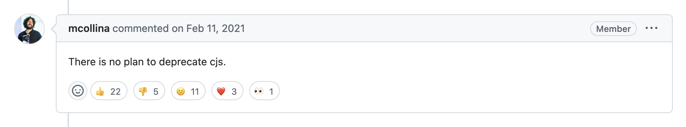
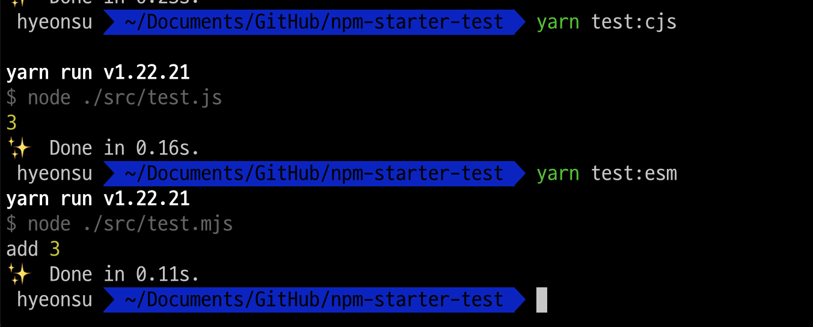
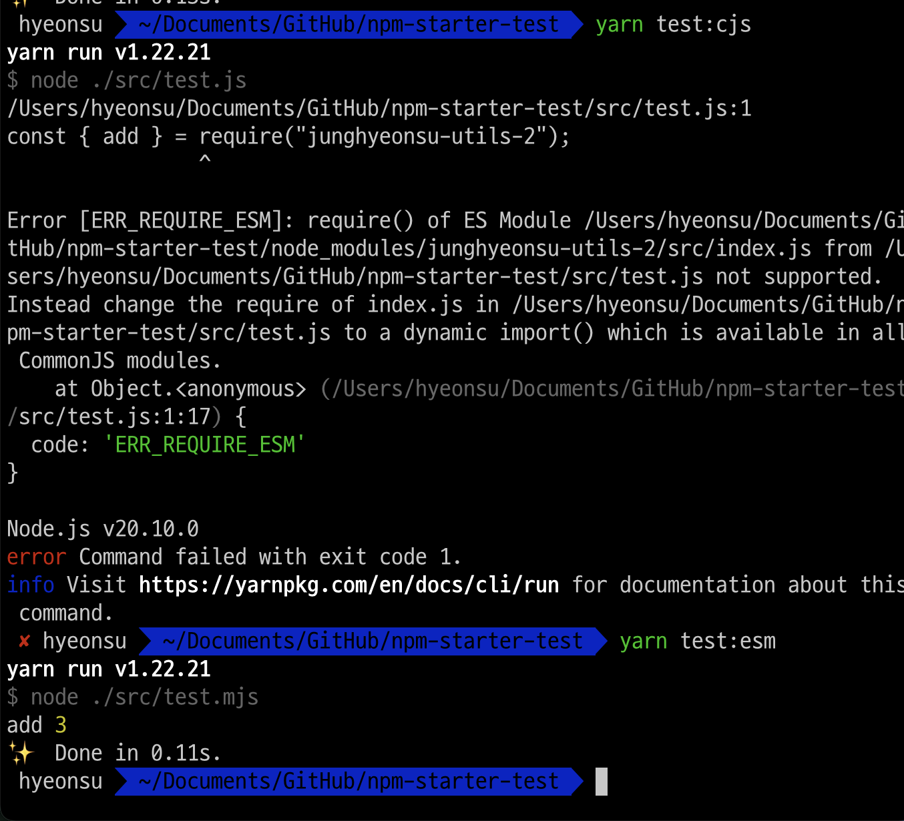
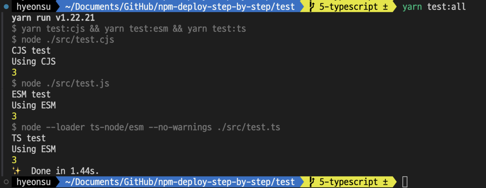
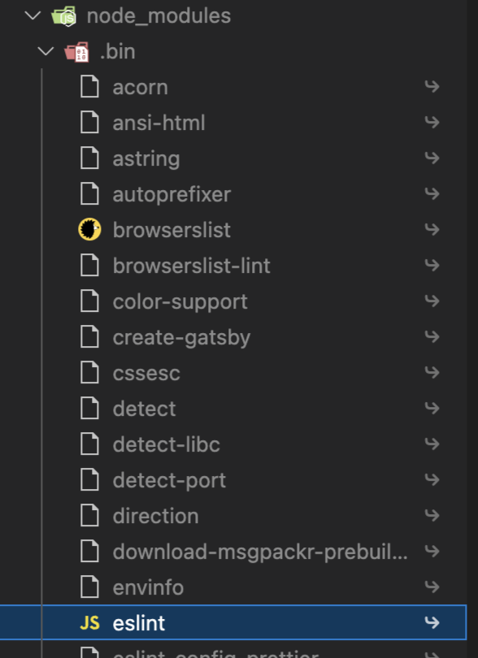
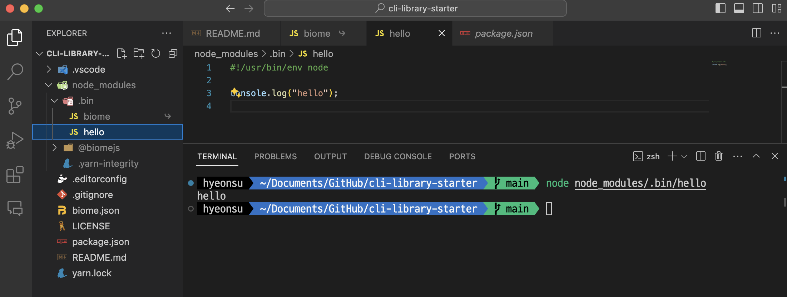
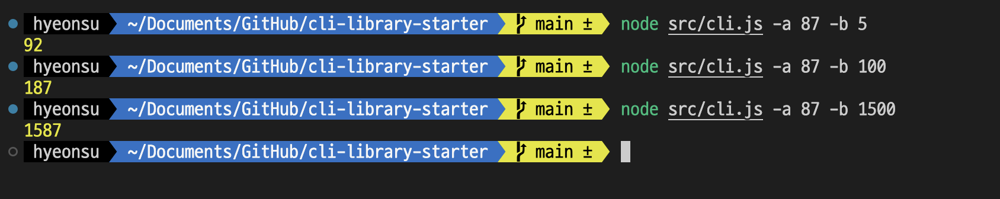

## 간단 소개

- 당근 디자인시스템팀 프론트엔드 엔지니어 1년 6개월 째
- 디자인시스템 개발, 문서, 유지보수
- 롤업 플러그인, 피그마 플러그인, 스토리북 애드온 등 다양한 라이브러리 개발 및 배포 경험 (개수가 중요한 건 아니지만 최소 20개 이상?... 모노레포는 하나로 산정)
- 작년 [해당 글](https://junghyeonsu.com/posts/deploy-simple-util-npm-library/)로 발표 경험
- 시스템 업무 이외에도 웹 개발, 웹뷰 개발, 작게 나마 서버 개발도 같이 하고 있습니다.
- 점점 영향력을 키우고 싶어서 발버둥치고 있는 2-3년차 주니어 프론트엔드 엔지니어입니다.

## 개요

이전에 [간단한 NPM 라이브러리 배포해보기](https://junghyeonsu.com/posts/deploy-simple-util-npm-library/) 글에서는 간단한 라이브러리를 만들고 배포하는 방법에 대해 알아보았습니다.
해당 발표를 하고 1년이 지나고 다시 한번 발표 요청을 주셔서 내용 고칠 것이 있으면 고치고, 추가적으로 CLI 라이브러리를 만들어보는 내용을 추가하면 좋지 않을까 해서 이 글을 작성하게 되었습니다.

<Callout type="danger">
  해당 내용은 발표 대본 용도로 작성된 글이라서 상세한 설명이 부족할 수 있습니다.
</Callout>

<Callout type="warn">
  조금 더 적극적으로 참여하고 싶으시다면 [해당 레파지토리
  (npm-deploy-step-by-step)](https://github.com/junghyeonsu/npm-deploy-step-by-step/pulls)의
  PR을 하나씩 확인하면서 직접 따라해보시는 것을 추천드립니다.
</Callout>

<Callout type="info">
해당 글의 목표는 다음과 같습니다.

- ESM, CJS, TS를 모두 지원하는 라이브러리를 만들어보자.
- CLI를 간단하게 만들어보자.

</Callout>

## ESM, CJS, TS를 모두 지원하는 라이브러리를 만들어보기

### ESM vs CJS

해당 내용은 이전 글에서 상세하게 다뤘습니다.

**핵심은 사용하는 측의 환경이 ESM 이라면 CJS, ESM 무엇이든 사용할 수 있지만 CJS 환경에서는 ESM을 사용할 수 없다는 것입니다.**

Node 생태계에서 ESM이라는 새로운 기술이 나왔지만, CJS가 없어지는 것은 아니기 때문에
우리는 ESM, CJS 모두 지원하는 라이브러리를 만들어야 합니다. (더이상 지원하지 않는 것과 라이브러리 제공자가 지원해야 한다는 것은 다릅니다.)



[CJS(CommonJS) vs ESM(ECMAScript Module)](https://toss.tech/article/commonjs-esm-exports-field)에 대해서는 이전 글에도 링크를 걸어두었지만
토스 블로그가 정리를 잘해놨습니다. 핵심만 꼽아보자면

- ES6 ECMAScript `2015` vs CommonJS by Mozilla engineer Kevin Dangoor in `2009`.
- ESM에서 CJS를 import 할 수는 있지만, CJS에서 ESM을 require 할 수는 없습니다. 왜냐하면 CJS는 Top-level Await을 지원하지 않기 때문입니다.
- ESM은 모듈간의 의존성을 정적으로 분석이 쉽기 때문에 (top-level exports) Tree Shaking이 용이합니다.
- CJS는 동적으로 모듈을 로딩할 수 있기 때문에 Tree Shaking이 어렵습니다. (정적 분석이 어렵기 때문입니다.)
- ESM은 import, export를 사용하고, CJS는 require, module.exports를 사용합니다.
- Server Side Rendering을 위한 Node 환경에서는 CJS를 사용합니다.

위와 같은 이유로 ESM, CJS 모두 지원하는 라이브러리를 만들어야 합니다.
어느 한 기술만 사용하는게 아니라 환경에 따라서 사용하는 모듈 시스템이 다릅니다.

<Callout type="warn">
**하지만 이제 곧 CJS 환경에서도 ESM을 `require()` 할 수 있습니다.**

[module: support require()ing synchronous ESM graphs](https://github.com/nodejs/node/pull/51977)

</Callout>

### STEP 1: 프로젝트 생성

<Callout>
프로젝트 생성

[브랜치에서 확인하기](https://github.com/junghyeonsu/npm-deploy-step-by-step/pull/1/files)

</Callout>

```bash
yarn init -y
```

- 린터 설정
- .gitignore

(실습)

### STEP 2: CJS만 지원하는 라이브러리 만들어보기

<Callout>
CJS으로 라이브러리를 배포해보고 ESM, CJS 환경에서 사용해보고 차이점 느껴보기: 라이브 코딩 (이전 포스트 참고)

[브랜치에서 확인하기](https://github.com/junghyeonsu/npm-deploy-step-by-step/pull/2/files)

</Callout>

- src/index.js 작성하기
- `0.0.0-onlyCJS`로 배포하기
- esm, cjs에서 테스트 해보기
- 전부 잘 되는거 확인하기



(실습)

### STEP 3: ESM으로 라이브러리를 배포해보고 차이점 느끼기

<Callout>
ESM으로 라이브러리를 배포해보고 ESM, CJS 환경에서 사용해보고 차이점 느껴보기: 라이브 코딩 (이전 포스트 참고)

[브랜치에서 확인하기](https://github.com/junghyeonsu/npm-deploy-step-by-step/pull/3/files)

</Callout>

- `type: module`, src/index.js ESM으로 변경
- `0.0.0-onlyESM`로 배포하기
- esm, cjs에서 테스트 해보기
- cjs에서 안되는 거 확인하기



(실습)

요기까지는 방대한 Node 환경에서 ESM, CJS 모두 지원해야 하는 명분에 대해서 알아보았습니다.
그럼 오픈소스 개발자는 항상 ESM, CJS 코드를 작성해야 하는걸까요?
그렇지 않습니다. 오픈소스 개발자는 단 하나의 코드를 작성하고 빌드 과정을 통해서 ESM, CJS 모두 지원하는 라이브러리를 만들어야 합니다.

### STEP 4: 하나의 코드로 ESM, CJS 모두 지원하는 라이브러리 만들어보기

<Callout>
**코딩은 한 번, 결과물은 두 개**

esbuild 빌드 결과물로 나온 걸 배포하고 테스트 환경에서 console.log 찍어가면서 확인해보기

[브랜치에서 확인하기](https://github.com/junghyeonsu/npm-deploy-step-by-step/pull/4/files)

</Callout>

- `lib`에서 esbuild 설치
- package.json 수정 (exports, main, name, files, scripts)

### STEP 5: TypeScript 지원하기

<Callout>
**코딩은 한 번, 결과물은 세 개**

TypeScript로 코드 작성하고 tsc, esbuild로 빌드해서 ESM, CJS, TS 모두 지원하는 라이브러리 만들기

[브랜치에서 확인하기](https://github.com/junghyeonsu/npm-deploy-step-by-step/pull/5/files)

</Callout>

- 테스트 환경에서 `TypeScript`, `ts-node` (TypeScript 코드를 Node에서 바로 실행할 수 있는 라이브러리) 설치 후 테스트해보기
- 안되는거 확인하고 라이브러리에 `index.d.ts` 파일을 만들어서 타입 지원하기
- 배포 후 확인해보기 (ts-node, typescript, type: module, test:ts script 추가)
- 라이브러리에도 타입스크립트로 개발 후 배포 (typescript, build:dts 명령어 추가)
- 각각 파일이 어떤 형식을 사용하고 있는지 콘솔 찍어보기



### 마무리

- ESM, CJS, TS를 모두 지원하는 라이브러리를 만들었습니다.
- 오픈소스 개발자는 TypeScript 코드 하나로 ESM, CJS, TS 모두 지원하는 라이브러리를 만들 수 있습니다.
- 빌드 도구 (esbuild, webpack, ...etc)와 같은 개발 도구들은 취향것 사용하시면 됩니다.

## CLI 라이브러리 만들기

<Callout type="info">
CLI (Command Line Interface)

[cli-library-starter](https://github.com/junghyeonsu/cli-library-starter)에서 코드를 확인하실 수 있습니다.

</Callout>

CLI 도구는 일반적인 유틸성 자바스크립트 라이브러리와는 조금 다릅니다.
커맨드라인, 즉 우리가 터미널로 부르고 있는 곳의 환경은 보통 Node.js 환경입니다.
그래서 다양한 환경을 대응하는 일반적인 라이브러리와는 다르게 CLI 도구는 Node.js 환경에서만 동작하면 됩니다.
즉, ESM, CJS, TS 모두 지원할 필요가 없습니다.

### bin 파일

대표적인 CLI 도구인 `create-react-app`, `webpack-cli` 등을 보면 `.bin`이라는 디렉토리가 있습니다.
`.bin` 디렉토리에는 해당 CLI 도구의 실행 파일이 들어있습니다.
최종적으로는 `.bin` 폴더에서 실행될 실행 파일만 있으면 CLI 도구를 만들 수 있습니다.



```js
#!/usr/bin/env node
```

`.bin` 에 들어있는 파일들을 잘 살펴보면 위와 같은 명령어들이 명시되어 있는데요,
위와 같이 명시해두면 해당 파일은 Node.js 환경에서 실행되는 파일이라는 것을 알 수 있습니다.

여러분의 프로젝트에서도 바로 테스트 해볼 수 있습니다.
아래와 같이 `node_modules` 폴더의 `.bin` 폴더에 아무런 확장자가 명시되지 않은 파일을 생성하고
그냥 쉽게 생각하면 `.bin` 폴더에 생성되고 `node` 환경에서 동작하는 파일이 `CLI` 도구입니다.

단지 실행되는 것이 아니라 다양한 `args` (인자들)을 받아서 실행되는 것이죠.



### 만들어보기

간단하게 덧셈을 하는 CLI 도구를 만들어보겠습니다.
CLI 도구를 만들 때 대표적으로 사용하는 라이브러리 [commander](https://github.com/tj/commander.js)를 이용해서 만들어보겠습니다.
인자 두개를 받고, 두 수를 덧셈하는 CLI 도구를 만들어보겠습니다.

```bash
yarn add commander
```

```javascript
// src/cli.js
#!/usr/bin/env node

const { Command } = require('commander');
const { add } = require("calculate-utils-test");

const program = new Command();

program
  .version('0.0.1')
  .description('간단한 덧셈 계산기')
  .option('-a, --a <number>', '첫 번째 숫자', parseInt)
  .option('-b, --b <number>', '두 번째 숫자', parseInt)
  .action((options) => {
    console.log(add(options.a, options.b));
  });

program.parse(process.argv);
```

정말 단순하게 `-a` 인자와 `-b` 인자를 받아서 덧셈을 하는 CLI 도구를 만들었습니다.
우리가 위에서 만들었던 라이브러리를 사용해서 덧셈을 하고 있습니다.

```json,9-11
// package.json
{
  "name": "calculate-utils-test-cli",
  "version": "0.0.1",
  "main": "src/cli.js",
  "files": [
    "src"
  ],
  "bin": {
    "calculate": "./src/cli.js"
  },
  "repository": "https://github.com/junghyeonsu/cli-library-starter.git",
  "author": "정현수 <54893898+junghyeonsu@users.noreply.github.com>",
  "license": "MIT",
  "devDependencies": {
    "@biomejs/biome": "^1.6.1"
  },
  "dependencies": {
    "calculate-utils-test": "^0.0.0-typescript",
    "commander": "^12.0.0"
  }
}
```

그리고 `package.json`에 `bin` 필드에 `calculate`라는 명령어로 실행할 수 있도록 만들었습니다.

```bash
node src/cli.js -a 1 -b 2
3
```

배포를 하기 전에 테스트 하고 싶다면 그냥 해당 파일을 `node`로 실행시켜서 테스트 해보면 됩니다.



그 다음엔 `publish` 명령어를 통해서 라이브러리를 배포하고 다른 패키지에서 설치하고 확인해봅시다.

```bash
npm publish
```

```bash
yarn add calculate-utils-test-cli
```

설치하고 실행해보면 위와 같은 결과가 나옵니다.

```bash
yarn calculate -a 1 -b 2
```


정말 간략한 예제지만, CLI 도구를 만드는 방법은 이렇게 간단합니다.

CLI 또한 개발 경험을 늘리고 싶다면 TypeScript, ESM을 이용해서 개발 경험을 늘릴 수 있습니다.
실행 파일 결과물만 잘 나오면 됩니다.

보통 CLI 도구를 이용해서 파일 시스템을 조작하거나, 파일을 읽어서 처리하는 작업을 많이 합니다.
그런 작업을 할 때는 `fs` 모듈을 이용해서 파일 시스템을 조작하거나, `readline` 모듈을 이용해서 파일을 읽어서 처리하는 작업을 많이 합니다.

요즘 인기중인 `shadcn/ui` 와 같은 라이브러리도 CLI 도구를 이용해서 컴포넌트를 생성해주고,
대표적인 리액트 생성 CLI인 `create-react-app` 도 CLI 도구입니다.

제가 설명드린 방법으로 여러 인자들을 받게끔 설정해놓고 인자에 따라서 실행되는 함수를 만들어놓은 것 뿐입니다.

### 유용한 라이브러리

- [commander](https://github.com/tj/commander.js): CLI 도구를 만들 때 사용하는 라이브러리
- [chalk](https://github.com/chalk/chalk#readme): 터미널에 색을 입히는 라이브러리
- **[nodejs-cli-apps-best-practices](https://github.com/lirantal/nodejs-cli-apps-best-practices): Node.js CLI 도구를 만들 때 참고할만한 가이드 (추천)**

## 마무리

정말 방대한 오픈소스의 세상에서 일부분만 알아보았습니다.
이외에도 다양한 라이브러리들이 있고, 다양한 방법으로 라이브러리를 만들 수 있습니다.

- 버전 관리
- 라이센스 관리
- 테스트 코드 작성
- 문서 작성
- 기여 문서 작성
- 배포 자동화
- 린트, 포맷터 설정
- etc...

라이브러리는 배포하고 나면 끝이 아니라, 지속적으로 관리해야 합니다.
그리고 다양한 라이브러리를 만들다가 예전에 만들었던 라이브러리를 오랜만에 보게 되면 내가 이걸 왜 이렇게 만들었지? 라는 생각이 들 때가 많습니다.
그때를 위해서 한번 만들 때 어떤 목적으로 만들었는지, 어떤 목적으로 사용할지, 어떤 환경에서 사용할지 등을 문서화 해두는 것이 좋습니다.
개발하는 방법까지 적어두면 더 좋습니다.

여러분도 다양한 라이브러리를 만들어보시고, 다양한 경험을 쌓아보시길 바랍니다.

감사합니다.
