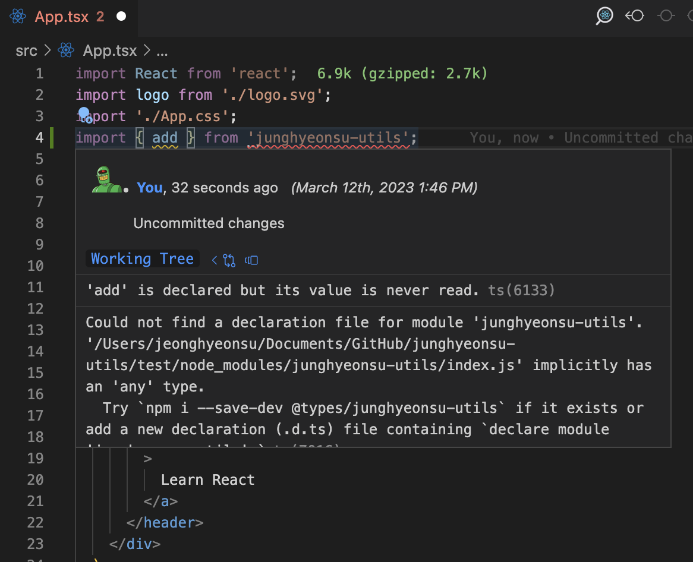
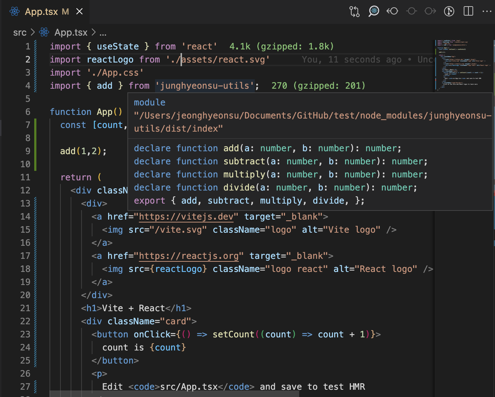
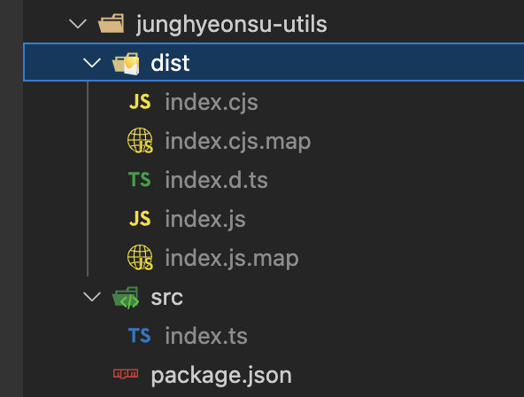

## 개요

약 1년 전에 테오의 스프린트 4기에 참여해서 [NPM 배포를 하고 후기를 작성한 적](https://velog.io/@junghyeonsu/NPM-%EB%B0%B0%ED%8F%AC-%EC%96%B4%EB%A0%B5%EC%A7%80-%EC%95%8A%EC%95%84%EC%9A%94-with-%ED%85%8C%EC%98%A4-%EA%B5%AC%EA%B8%80-%EC%8A%A4%ED%94%84%EB%A6%B0%ED%8A%B8-4%EA%B8%B0)이 있었는데
1년이 지난 지금 조금 더 발전된 모습으로 NPM 배포에 대해서 가이드를 작성해보려고 한다.

주제는 간단한 유틸 함수를 NPM 라이브러리로 배포해보는 것이고,
하나하나 직접 코드를 입력해보며 내가 작성하는 코드가 어디에서 어떻게 사용되는지를 알아보는 것이 목표이다.
요즘엔 당연하게 생각되는 TypeScript(이하 ts)와 CommonJS(이하 cjs), ECMAScript Module(이하 esm) 지원을 포함해서 배포해보자.

정말 NPM 배포를 처음 해보는 사람들을 위해서 차근차근 가이드를 작성했으니
따라해보며 배포를 해보면 어느 과정으로 배포가 되는지 알 수 있고 전반적인 느낌을 잡을 수 있을 것이다.

## 미리보기

- [utils library starter (유틸 라이브러리 깃허브 템플릿)](https://github.com/junghyeonsu/utils-library-starter)

## 개발 환경

- Node.js v18.12.1
- npm v8.19.2
- 패키지 매니저는 yarn을 사용한다.
- 리액트를 꼭 알고 있진 않아도 되지만 알고 있다면 더 좋다.

## 사전 준비

### NPM 계정 생성

npm 계정이 없다면 [npmjs.com](https://www.npmjs.com/) 에서 계정을 생성한다.

### NPM 로컬 로그인

```bash
$ npm login
$ npm whoami
```

## 첫 배포

### 폴더 생성

자신의 이름으로 된 폴더를 생성한다.
나는 `junghyeonsu-utils` 라는 폴더를 생성했다.

```bash
$ mkdir junghyeonsu-utils
$ cd junghyeonsu-utils
```

### package.json 생성

```bash
$ yarn init -y
```

```json
{
  "name": "junghyeonsu-utils",
  "version": "0.0.1",
  "main": "index.js",
  "license": "MIT"
}
```

중요한 것만 설명하자면 `name`은 NPM에 배포할 때 사용되는 이름이다.
`npm install junghyeonsu-utils` 이렇게 입력해서 설치를 할 수 있다.

`version`은 배포할 때 사용되는 버전이다.
[Semantic Versioning 체계](https://semver.org/lang/ko/)를 사용한다.
각 자리수는 순서대로 `major`, `minor`, `patch` 버전을 의미한다.
`major`가 0 이면 초기 개발 단계이고, 1 이상이면 안정화된 버전으로 통상 사용된다.
자신이 라이브러리 개발자라면 `major` 버전을 0으로 우선 유지하고, 완전히 안정화되면 1로 올리는 것이 좋다.

`main`은 라이브러리를 사용할 때 기본 진입점이다.
`index.js` 파일을 기본 진입점으로 사용하겠다는 의미이다.

`license`는 라이브러리의 라이센스를 의미한다.
MIT 라이센스를 사용하겠다는 의미인데, [자신이 사용하고 싶은 라이센스](https://docs.npmjs.com/cli/v9/configuring-npm/package-json#license)를 선택하면 된다.
라이센스에 대한 내용은 너무 많아서 여기서는 다루지 않는다.

### module 작성

우선 cjs 형태로 모듈을 작성해보자.
`index.js` 파일을 생성하고 아래와 같이 작성한다.
기본적인 사칙연산을 하는 모듈이다.

```js
function add(a, b) {
  return a + b;
}

function subtract(a, b) {
  return a - b;
}

function multiply(a, b) {
  return a * b;
}

function divide(a, b) {
  return a / b;
}

module.exports = {
  add,
  subtract,
  multiply,
  divide,
};
```

사실 이렇게 하면 끝이다.
이제 `npm publish` 명령어를 입력하면 NPM에 배포가 된다.

```bash
$ npm notice
$ npm notice 📦  junghyeonsu-utils@0.0.1
$ npm notice === Tarball Contents ===
$ npm notice 236B index.js
$ npm notice 98B  package.json
$ npm notice === Tarball Details ===
$ npm notice name:          junghyeonsu-utils
$ npm notice version:       0.0.1
$ npm notice filename:      junghyeonsu-utils-0.0.1.tgz
$ npm notice package size:  300 B
$ npm notice unpacked size: 334 B
$ npm notice shasum:        2f01de64d2c4ba507cc8c6a3c94941b5ffb4345b
$ npm notice integrity:     sha512-mmYrdon7QOWPl[...]Wyb6BcQzQ7tkw==
$ npm notice total files:   2
$ npm notice
$ npm notice Publishing to https://registry.npmjs.org/
+ junghyeonsu-utils@0.0.1
```

만약 이렇게 떴다면 배포가 성공한 것이다.
한 번 확인해보자.
새로운 `test` 라는 폴더를 만들고 거기서 `yarn init -y`로 프로젝트를 세팅하고,
`yarn add junghyeonsu-utils`로 라이브러리를 설치해보자.

```bash
$ mkdir test
$ cd test
$ yarn init -y
$ yarn add junghyeonsu-utils
```

```json,7-7
{
  "name": "test",
  "version": "1.0.0",
  "main": "index.js",
  "license": "MIT",
  "dependencies": {
    "junghyeonsu-utils": "^0.0.1"
  }
}
```

그리고 `node_modules` 폴더를 확인해보자.
`junghyeonsu-utils` 폴더가 생성되었고, `index.js` 파일이 있다.
이 파일이 우리가 작성한 `index.js` 파일이다.


라이브러리를 한 번 사용해보자.
`test` 프로젝트에서 `index.js` 파일을 생성하고 아래와 같이 작성한다.

```js
// -> junghyeonsu-utils에서 정의한 함수들을 가져온다.
const { add, divide, multiply, subtract } = require("junghyeonsu-utils");

// -> 가져온 함수들을 사용하고 결과를 출력한다.
console.log(add(1, 2));
console.log(subtract(1, 2));
console.log(multiply(1, 2));
console.log(divide(1, 2));
```

그리고 한 번 실행시켜보자.

```bash
$ node index.js
```


흐음... 잘 작동하는 것 같다!
벌써 우리는 라이브러리를 만들고 배포하고 사용하는 것까지 성공했다.
사실 이 과정만 기억하면 나머지 다른 라이브러리들을 제작하는 방법은 크게 다르지 않다.
중간 중간에 파일들을 변환하고, 빌드하는 과정들이 추가되는 것 뿐이다.

## ES Module 지원하기

지금 우리가 작성한 라이브러리는 `CommonJS` 형태로 작성되어 있다.
토스 테크에서 작성한 [CommonJS와 ESM에 모두 대응하는 라이브러리 개발하기: exports field](https://toss.tech/article/commonjs-esm-exports-field) 포스팅에서
인용을 한다면...

- CJS는 require / module.exports 를 사용하고, ESM은 import / export 문을 사용합니다.
- CJS module loader는 동기적으로 작동하고, ESM module loader는 비동기적으로 작동합니다.
- ESM은 Top-level Await을 지원하기 때문에 비동기적으로 동작합니다.
- 따라서 ESM에서 CJS를 import 할 수는 있지만, CJS에서 ESM을 require 할 수는 없습니다. 왜냐하면 CJS는 Top-level Await을 지원하지 않기 때문입니다.
- 이 외에도 두 Module System은 기본적으로 동작이 다릅니다.
- 따라서 두 Module System은 서로 호환되기 어렵습니다.

그리고 최신 브라우저에서는 대부분 `esm`을 지원하고, 대부분 코드를 작성할 때도 `esm`을 사용한다.
(`require`, `module.exports`를 이용해서 react 코드를 작성한 적이 있는가를 생각해보면 된다.)

우선 사용하는 측에서 `esm`을 작성해서 코드를 작성해보자.

```js,2-2
// -> junghyeonsu-utils에서 정의한 함수들을 가져온다.
import { add, divide, multiply, subtract } from "junghyeonsu-utils";

// -> 가져온 함수들을 사용하고 결과를 출력한다.
console.log(add(1, 2));
console.log(subtract(1, 2));
console.log(multiply(1, 2));
console.log(divide(1, 2));
```

그리고 똑같이 실행을 시켜보자.
그럼 다음과 같은 에러가 뜰 것이다.

```bash
$ node index.js

$ (node:63686) Warning: To load an ES module, set "type": "module" in the package.json or use the .mjs extension.
$ (Use `node --trace-warnings ...` to show where the warning was created)
$ /Users/jeonghyeonsu/Documents/GitHub/test/index.js:2
$ import { add, divide, multiply, subtract } from "junghyeonsu-utils";
$ ^^^^^^
$
$ SyntaxError: Cannot use import statement outside a module
```

`esm`을 사용하기 위해서는 `package.json`에 `"type": "module"`을 추가해야 한다.

```json,4-4
{
  "name": "test",
  "version": "1.0.0",
  "type": "module",
  "main": "index.js",
  "author": "junghyeonsu <jung660317@naver.com>",
  "license": "MIT",
  "dependencies": {
    "junghyeonsu-utils": "0.0.1"
  }
}
```

그리고 다시 실행시켜보자.

```bash
$ node index.js
```


다행히 잘 되는 것 같다!
그러면 이제 우리가 만든 라이브러리도 `esm`을 지원하도록 만들어보자.
`module.exports` 를 `export` 문으로 바꿔주자.

```js,18-18
function add(a, b) {
  return a + b;
}

function subtract(a, b) {
  return a - b;
}

function multiply(a, b) {
  return a * b;
}

function divide(a, b) {
  return a / b;
}

export { add, subtract, multiply, divide };
```

그리고 `package.json`에 `"type": "module"`을 추가해주자.
`type` 필드는 `commonjs`, `module` 이렇게 두 개의 옵션이 있고,
`commonjs`는 `require`를 사용하는 cjs, `module`은 `import`를 사용하는 esm이다.

```json,4-4
{
  "name": "junghyeonsu-utils",
  "version": "0.0.1",
  "type": "module",
  "main": "index.js",
  "license": "MIT"
}
```

그리고 `patch` 버전을 올려주고 다시 배포를 해보자.

```bash
$ npm version patch
$ npm publish
```

```bash
$ npm notice
$ npm notice 📦  junghyeonsu-utils@0.0.2
$ npm notice === Tarball Contents ===
$ npm notice 226B index.js
$ npm notice 98B  package.json
$ npm notice === Tarball Details ===
$ npm notice name:          junghyeonsu-utils
$ npm notice version:       0.0.2
$ npm notice filename:      junghyeonsu-utils-0.0.2.tgz
$ npm notice package size:  293 B
$ npm notice unpacked size: 324 B
$ npm notice shasum:        89aa2f7243c9603c1ed916e4e184b8164bc04277
$ npm notice integrity:     sha512-xXufGijD9quRe[...]v6AfdzfOsO3NA==
$ npm notice total files:   2
$ npm notice
$ npm notice Publishing to https://registry.npmjs.org/
$ + junghyeonsu-utils@0.0.2
```

성공적으로 배포가 됐다면 다시 `test` 프로젝트로 와서 라이브러리의 버전을 올리고 실행을 해보자.
새로 배포된 버전을 설치하려면 `@0.0.2`를 붙여주어서 명시적으로 버전을 지정해주어야 할수도 있고,
그냥 `@latest`를 붙여주어서 최신 버전을 설치할 수도 있다. 혹은 아무것도 붙이지 않아도 된다.

```bash
$ yarn add junghyeonsu-utils
$ npm install junghyeonsu-utils
```

or

```bash
$ yarn add junghyeonsu-utils@0.0.2
$ npm install junghyeonsu-utils@0.0.2
```

```bash
$ node index.js
```

아마 잘 될 것이다.


근데 항상 이렇게 `esm`만을 사용하는 것은 아니다.
`cjs`를 사용하는 프로젝트와 `esm`을 사용하는 프로젝트가 같이 존재할 수도 있다.
`cjs`는 보통 server-side rendering을 지원할 때 사용되기도 하는데,
`cjs`는 tree-shaking(트리 쉐이킹: Tree-shaking이란 필요하지 않은 코드와 사용되지 않는 코드를 삭제하여 JavaScript 번들의 크기를 가볍게 만드는 것)이 어려워서,
`esm`을 동시 지원해야 하는 경우가 다반사라고 한다. (출처 토스 테크)

그럼 이와 같은 상황에서 `test` 프로젝트가 `commonjs`를 사용해야 한다고 가정해보자.
그러면 `package.json`에 `"type": "module"`을 `type: "commonjs"`로 바꾸고 다시 실행시켜보자.
(default가 `commonjs`라서 그냥 지워도 된다.)

```json,,4-4
{
  "name": "test",
  "version": "1.0.0",
  "type": "commonjs",
  "main": "index.js",
  "author": "junghyeonsu <jung660317@naver.com>",
  "license": "MIT",
  "dependencies": {
    "junghyeonsu-utils": "0.0.2"
  }
}
```

그러면 우리가 자주 마주친 에러를 마주하게 된다.

```bash
$ (node:69037) Warning: To load an ES module, set "type": "module" in the package.json or use the .mjs extension.
$ (Use `node --trace-warnings ...` to show where the warning was created)
$ /Users/jeonghyeonsu/Documents/GitHub/test/index.js:2
$ import { add, divide, multiply, subtract } from "junghyeonsu-utils";
$ ^^^^^^
$
$ SyntaxError: Cannot use import statement outside a module
```

위에서 설명했다시피 `esm` 환경에서 `cjs`를 사용하는 것은 괜찮다.
하지만 그 반대로 `cjs` 환경에서 `esm`을 사용하려고 하면 에러가 발생한다.

라이브러리 제공자가 일일이 `cjs`와 `esm`을 모두 지원해주지 않는다면,
`cjs`를 사용하는 프로젝트에서는 `esm`을 사용하는 라이브러리를 사용할 수 없다.
그렇다면 `cjs`와 `esm`을 어떻게 하면 동시에 지원할 수 있을까?

### package.json의 exports 필드 명시하기

`exports` 필드는 [node v19.7.0 버전에 추가된 필드로](https://nodejs.org/api/packages.html), `cjs`와 `esm`을 동시에 지원할 수 있게 해준다.
`exports` 라이브러리 제공자가 입력해주는 정보로, 라이브러리 사용자가 입력하는 정보는 아니다.

`junghyeonsu-utils`의 `package.json`에 `exports` 넣어보자.

```json,6-11
{
  "name": "junghyeonsu-utils",
  "version": "0.0.2",
  "type": "module",
  "main": "index.js",
  "exports": {
    ".": {
      "import": "./index.js",
      "require": "./index.cjs"
    }
  },
  "license": "MIT"
}
```

`exports` 필드는 모두 . 으로 시작하는 상대 경로로 작성되어야 한다.
만약 맨 첫 번째 `.`을 `./util`로 바꾸면 다음과 같이 사용된다.

```js
import { add, divide, multiply, subtract } from "junghyeonsu-utils/util"; // esm
const { add, divide, multiply, subtract } = require("junghyeonsu-utils/util"); // cjs
```

하지만 지금은 상대경로를 `.` 으로 작성했기 때문에 `exports` 필드는 `junghyeonsu-utils`의 루트 폴더를 바라보게 된다.

```js
import { add, divide, multiply, subtract } from "junghyeonsu-utils"; // esm
const { add, divide, multiply, subtract } = require("junghyeonsu-utils"); // cjs
```

`exports` 필드에서 `import`는 `esm` 환경에서 사용되고, `require`는 `cjs` 환경에서 사용된다.
현재 `junghyeonsu-utils`는 `esm`을 지원하고 있기 때문에 그냥 `import`를 하게되면 `esm` 파일인 `index.js` 파일을 사용할 것이다.
하지만 `cjs` 환경에서는 `require`를 사용하기 때문에 `require`를 키로 가지는 객체 안에 `index.cjs` 파일을 바라보게 한다.

그리고 `commonjs`를 사용하는 `index.cjs`를 작성해보자.
프로그램 파일이 많아지니 소스파일을 `src` 폴더를 만들어 그 안에 넣어주자.
그리고 그에 맞게 `package.json`의 파일도 수정해주자.
그리고 우리 `junghyeonsu-utils` 폴더 구조는 이렇게 될 것이다.

```js
// src/index.cjs
function add(a, b) {
  return a + b;
}

function subtract(a, b) {
  return a - b;
}

function multiply(a, b) {
  return a * b;
}

function divide(a, b) {
  return a / b;
}

module.exports = {
  add,
  subtract,
  multiply,
  divide,
};
```

```json,5-5&8-9
{
  "name": "junghyeonsu-utils",
  "version": "0.0.2",
  "type": "module",
  "main": "src/index.js",
  "exports": {
    ".": {
      "import": "./src/index.js",
      "require": "./src/index.cjs"
    }
  },
  "license": "MIT"
}
```

```bash
📦junghyeonsu-utils
 ┣ 📂src
 ┃ ┣ 📜index.cjs
 ┃ ┗ 📜index.js
 ┣ 📜package.json
 ┗ 📜yarn.lock
```

그리고 `patch`를 올리고 `npm`에 배포해보자.
그럼 `0.0.3` 버전이 배포될 것이다.

```bash
$ npm version patch
$ npm publish
```

그럼 다시 `test` 프로젝트에서 `junghyeonsu-utils@0.0.3`를 설치하고,
다시 실행을 해보자. 그럼 아까전에는 에러가 나던 부분이 잘 실행될 것이다.

```bash
$ yarn add junghyeonsu-utils@0.0.3

$ node index.js
$ 3
$ -1
$ 2
$ 0.5
```

이렇게 해서 `cjs`와 `esm`을 동시에 지원하는 라이브러리를 만들었다.

## TypeScript 지원하기

타입스크립트는 이제 대부분의 현직 개발자들이 사용하고 있다.
많은 리액트 개발자들이 프로젝트 세팅할 때 자주 사용하는 `vite`으로 리액트 타입스크립트 템플릿을 생성할 수 있다.
한 번 생성해보고 우리 라이브러리를 설치해보자.

기존의 `test` 프로젝트안의 파일들을 전부 지우고 `vite` 리액트 프로젝트로 대체해보자.

```bash
$ rm -rf *
$ yarn create vite . --template react-ts
```

```bash
yarn create v1.22.19
$ [1/4] 🔍  Resolving packages...
$ [2/4] 🚚  Fetching packages...
$ [3/4] 🔗  Linking dependencies...
$ [4/4] 🔨  Building fresh packages...
$ success Installed "create-vite@4.1.0" with binaries:
$       - create-vite
$       - cva
$ [#############################################################################] 77/77
$ Scaffolding project in /Users/jeonghyeonsu/Documents/GitHub/test...
$
$ Done. Now run:
$
$   yarn
$   yarn dev
$
$ ✨  Done in 0.83s.
```

정상적으로 설치가 되었다면 프로젝트의 의존성을 설치하고 우리 라이브러리도 한 번 설치해보자.

```bash
$ yarn
$ yarn add junghyeonsu-utils
```

그리고 `src/App.tsx` 에서 우리가 만든 라이브러리를 사용하려고 해보자.
(지금은 단순 더하기, 빼기 등의 연산만 가능한 라이브러리지만 더 많은 기능들이 있다고 상상해보자.)
아마 에러가 날 것이다.

```tsx,,4-4
import React from 'react';
import logo from './logo.svg';
import './App.css';
import { add } from 'junghyeonsu-utils';

function App() {
  return (
    <div className="App">
      <header className="App-header">
        
        <p>
          Edit <code>src/App.tsx</code> and save to reload.
        </p>
        <a
          className="App-link"
          href="https://reactjs.org"
          target="_blank"
          rel="noopener noreferrer"
        >
          Learn React
        </a>
      </header>
    </div>
  );
}

export default App;
```



이 에러는 `junghyeonsu-utils` 라이브러리가 타입스크립트 지원을 하지 않기 때문에 발생하는 에러다.
요즘 라이브러리들은 웬만하면 타입스크립트 지원을 잘 해주지만 옛날 라이브러리 같은 경우에는 타입스크립트를 지원하지 않는 경우가 많다.
라이브러리가 `@types` 패키지를 지원해준다면 해당 패키지를 설치해서 타입스크립트를 지원할 수 있고,
만약 `@types` 패키지도 지원을 하지 않는다면 사용하는 측에서 `d.ts` 파일을 직접 만들어서 타입을 정의해줘야 한다.

하지만 우리는 유저를 만족시켜야 하는 라이브러리 제공자로서 타입스크립트를 지원해보자.

### 타입스크립트 설정

타입스크립트를 지원하기 위해서는 라이브러리 `package.json`에 `types` 필드에 `d.ts` 파일의 경로를 지정해주면 된다.
그 전에 `d.ts` 파일을 뽑아내기 위해서는 라이브러리 코드 자체에서 타입스크립트 설정을 해보자.

다시 `junghyeonsu-utils` 프로젝트로 돌아와서 타입스크립트를 설치해준다.
타입스크립트는 빌드 결과물에는 영향을 주지 않기 때문에 `devDependencies`에 설치해준다.
`@types/node`는 `node`의 타입을 지원해주는 패키지로 같이 설치해주자.

```bash
$ yarn add typescript @types/node -D
```

그리고 `tsconfig.json` 파일을 생성해준다.

```json
{
  "compilerOptions": {
    "target": "es6" /* 최신 브라우저는 es6을 대부분 지원한다. */,
    "module": "commonjs" /* 모듈 시스템을 지정한다. */,
    "lib": [
      "es5",
      "es6",
      "dom"
    ] /* 타입스크립트가 어떤 버전의 JS의 빌트인 api를 사용할건지에 대한 것을 명시해준다. */,
    "declaration": true /* 타입스크립트가 자동으로 타입정의 (d.ts) 파일을 생성해준다. */,
    "outDir": "dist" /* 컴파일된 결과물을 어디에 저장할지에 대한 것을 명시해준다. */,
    "strict": true /* 타입스크립트의 엄격한 모드를 활성화한다. */
  }
}
```

요기서 중요한 것은 `declaration`과 `outDir`이다.
`declaration`은 타입스크립트가 자동으로 타입정의 (d.ts) 파일을 생성해준다는 것이고,
`outDir`은 컴파일된 결과물을 어디에 저장할지에 대한 것을 명시해준다.
타입스크립트는 해당 라이브러리가 타입스크립트를 지원해주는지 하지 않는지를 타입정의(`d.ts`) 파일을 찾아서 결정하기 때문에 `declaration`을 `true`로 설정해준다.

기존의 `src/index.js` 파일의 내용을 `src/index.ts` 파일로 바꿔주고,
타입 에러가 발생하는 부분을 모두 수정해주자.

```typescript,2-2&6-6&10-10&14-14
// src/index.ts
function add(a: number, b: number) {
  return a + b;
}

function subtract(a: number, b: number) {
  return a - b;
}

function multiply(a: number, b: number) {
  return a * b;
}

function divide(a: number, b: number) {
  return a / b;
}

module.exports = {
  add,
  subtract,
  multiply,
  divide,
};
```

그리고 `tsconfig.json`에 `include` 필드를 추가해준다.

```json,10-10
{
  "compilerOptions": {
    "target": "es6" /* 최신 브라우저는 es6을 대부분 지원한다. */,
    "module": "ES6" /* 모듈 시스템을 지정한다. */,
    "lib": ["es5", "es6", "dom"] /* 타입스크립트가 어떤 버전의 JS의 빌트인 api를 사용할건지에 대한 것을 명시해준다. */,
    "declaration": true /* 타입스크립트가 자동으로 타입정의 (d.ts) 파일을 생성해준다. */,
    "outDir": "dist" /* 컴파일된 결과물을 어디에 저장할지에 대한 것을 명시해준다. */,
    "strict": true /* 타입스크립트의 엄격한 모드를 활성화한다. */
  },
  "include": ["src/index.ts"] /* 컴파일할 대상을 명시해준다. */
}
```

그리고 터미널에서 `yarn tsc`로 컴파일을 해도 되지만, 우리는 `package.json`에 `build script`를 작성해보자.

```json,6-9
{
  "name": "junghyeonsu-utils",
  "version": "0.0.3",
  "type": "module",
  "main": "src/index.js",
  "scripts": {
    "build": "yarn build:tsc",
    "build:tsc": "yarn tsc"
  },
  "exports": {
    ".": {
      "import": "./src/index.js",
      "require": "./src/index.cjs"
    }
  },
  "license": "MIT",
  "devDependencies": {
    "@types/node": "^18.15.0",
    "typescript": "^4.9.5"
  }
}
```

그리고 `yarn build`를 실행해보자.
그럼 `tsconfig.json`에 명시해준 `outDir`에 `dist` 폴더가 생성되고, `dist` 폴더 안에 `index.js`와 `index.d.ts` 파일이 생성된 것을 확인할 수 있다.
생성된 파일들을 가볍게 살펴보면 `index.js`는 타입이 빠진 코드가 생성되었고, `index.d.ts`는 타입스크립트가 자동으로 생성해준 타입정의 파일이다.

```js
// dist/index.js
function add(a, b) {
  return a + b;
}
function subtract(a, b) {
  return a - b;
}
function multiply(a, b) {
  return a * b;
}
function divide(a, b) {
  return a / b;
}
export { add, subtract, multiply, divide };
```

```ts
// dist/index.d.ts
declare function add(a: number, b: number): number;
declare function subtract(a: number, b: number): number;
declare function multiply(a: number, b: number): number;
declare function divide(a: number, b: number): number;
export { add, subtract, multiply, divide };
```

그리고 폴더와 컴파일된 결과물들에 맞춰서 `main`, `types` 그리고 `exports` 필드도 그에 맞게 변경해주자.
기존에는 그냥 `index.js`를 `main` 필드에 넣어주었지만, 이제는 컴파일된 결과물인 `dist/index.js`를 `main` 필드에 넣어주자.
그리고 추가적으로 `exports` 필드안에 `types` 필드를 추가할 수 있다. 생성된 `d.ts` 파일을 명시해주자.
그리고 마지막으로 `exports` 필드의 `import`에는 컴파일 결과물인 `dist/index.js`을 넣어주자. (`require`은 우선 가만히 놔둬도 된다.)

```json,5-5&12-12&14-14
{
  "name": "junghyeonsu-utils",
  "version": "0.0.3",
  "type": "module",
  "main": "dist/index.js",
  "scripts": {
    "build": "yarn build:tsc",
    "build:tsc": "yarn tsc"
  },
  "exports": {
    ".": {
      "import": "./dist/index.js",
      "require": "./src/index.cjs",
      "types": "./dist/index.d.ts"
    }
  },
  "license": "MIT",
  "devDependencies": {
    "@types/node": "^18.15.0",
    "typescript": "^4.9.5"
  }
}
```

그럼 만반의 준비는 끝났다. 다시 배포를 해보자!
우리는 `typescript` 지원이라는 새로운 기능을 추가했기 때문에 `minor` 버전을 올려주자.

```bash
$ yarn version --minor
$ npm version minor
```

```bash
$ yarn version v1.22.19
$ info Current version: 0.0.1
$ info New version: 0.1.0
$ ✨  Done in 0.02s.
```

그리고 배포하기 전에 `build` 명령어를 실행하기 위해 `prepack` 스크립트를 `package.json`에 추가해주자.
`prepack` 스크립트는 `npm publish`를 실행하기 전에 실행되는 스크립트이다.

```json,7-7
{
  "name": "junghyeonsu-utils",
  "version": "0.1.0",
  "type": "module",
  "main": "dist/index.js",
  "scripts": {
    "prepack": "yarn build",
    "build": "yarn build:tsc",
    "build:tsc": "yarn tsc"
  },
  "exports": {
    ".": {
      "import": "./dist/index.js",
      "require": "./src/index.cjs",
      "types": "./dist/index.d.ts"
    }
  },
  "license": "MIT",
  "devDependencies": {
    "@types/node": "^18.15.0",
    "typescript": "^4.9.5"
  }
}
```

그리고 `npm publish`를 실행해보자.

```bash
$ npm publish
```

```bash
$ ✨  Done in 2.40s.
$ npm notice
$ npm notice 📦  junghyeonsu-utils@0.1.0
$ npm notice === Tarball Contents ===
$ npm notice 266B dist/index.d.ts
$ npm notice 222B dist/index.js
$ npm notice 468B package.json
$ npm notice 236B src/index.cjs
$ npm notice 290B src/index.ts
$ npm notice 710B tsconfig.json
$ npm notice === Tarball Details ===
$ npm notice name:          junghyeonsu-utils
$ npm notice version:       0.1.0
$ npm notice filename:      junghyeonsu-utils-0.1.0
$ npm notice package size:  1.1 kB
$ npm notice unpacked size: 2.2 kB
$ npm notice shasum:        0afd0f07f886608b1cca34c9f4ceeec8cf1beba1
$ npm notice integrity:     sha512-00ha4+oTyEQ0z[...]1SZ7l5cPMaj0w==
$ npm notice total files:   6
$ npm notice
$ npm notice Publishing to https://registry.npmjs.org/
$ + junghyeonsu-utils@0.1.0
```

정상적으로 배포가 되었고, 한 번 테스트를 해보자.
기존에 만들어둔 `test` 프로젝트로 다시 돌아가서 minor 버전이 올라간 우리의 라이브러리를 다시 설치해보자.

```bash
$ yarn add junghyeonsu-utils@0.1.0
```

그리고 다시 `test`(vite 프로젝트)에서 `import`를 해보자.



## DX(개발자 경험) 향상시키기

이제 우리의 라이브러리는 `typescript`를 지원하고, `ESM`과 `CommonJS`를 모두 지원하고 있다.
그런데 라이브러리 코드를 수정할 때 마다 `esm`, `cjs` 둘 다 고칠수는 없다.
**타입스크립트 코드 하나로 `esm`, `cjs` 둘 다 컴파일되게 하면 좋을 것 같다.**
다양한 번들러들이 있지만 요기서는 [esbuild](https://esbuild.github.io/)를 이용해서 `esm`, `cjs` 둘 다 컴파일해보자.

### esbuild 설정

다시 `junghyeonsu-utils` 프로젝트로 돌아와서 `esbuild`를 설치해보자.

```bash
$ yarn add esbuild -D
```

`esbuild`는 커맨드라인에서도 사용할 수 있지만 스크립트 파일을 작성해서 사용할 수도 있다.
다양한 옵션들을 조정하기 위해서 `build.js` 파일을 만들어서 `esbuild`를 실행해보자.

```js
// build.js
import esbuild from "esbuild";

// 공통적으로 사용할 옵션들
const baseConfig = {
  entryPoints: ["src/index.ts"], // 컴파일할 파일
  outdir: "dist", // 컴파일된 파일이 저장될 경로
  bundle: true, // 번들링 여부
  sourcemap: true, // 소스맵 생성 여부
};

Promise.all([
  // 한번은 cjs
  esbuild.build({
    ...baseConfig,
    format: "cjs",
    outExtension: {
      ".js": ".cjs",
    },
  }),

  // 한번은 esm
  esbuild.build({
    ...baseConfig,
    format: "esm",
  }),
]).catch(() => {
  console.log("Build failed");
  process.exit(1);
});
```

위와 같이 작성했으면 `package.json`의 `scripts`에 `esbuild`로 빌드할 스크립트를 추가해주자.
그리고 추가적으로 빌드하기 전에 `dist` 폴더를 삭제하는 스크립트도 추가해주자.
또한 기존 `tsc` 명령어가 `js` 파일도 생성해주는데 `esbuild`로 자바스크립트 `cjs`, `esm`을 모두 생성해주니,
더 이상 `tsc`로는 자바스크립트 파일을 생성할 필요가 없다.

> **esbuild로 타입스크립트 타입모듈(d.ts)도 생성하면 되는 것 아닌가요?**
>
> 현재 esbuild는 타입스크립트 `d.ts` 컴파일을 지원하지 않는다.
> 그래서 `tsc`와 `esbuild`를 같이 사용해야 한다.

```json,4-7
{
  "scripts": {
    "prepack": "yarn build",
    "build": "yarn clean && yarn build:tsc && yarn build:js",
    "build:tsc": "yarn tsc --emitDeclarationOnly",
    "build:js": "node build.js",
    "clean": "rm -rf dist"
  }
}
```

이렇게 하고 나서 다시 `yarn build` 명령어로 빌드를 해보자.

```bash
yarn run v1.22.19
$ yarn clean && yarn build:tsc && yarn build:js
$ rm -rf dist
$ yarn tsc --emitDeclarationOnly
$ /Users/jeonghyeonsu/Documents/GitHub/junghyeonsu-utils/node_modules/.bin/tsc --emitDeclarationOnly
$ node build.js
✨  Done in 2.76s
```

`dist` 폴더에 `cjs`, `esm` 둘 다 생성되고, `d.ts`까지 생성된 것을 확인할 수 있다.

```bash
📦dist
 ┣ 📜index.cjs
 ┣ 📜index.cjs.map
 ┣ 📜index.d.ts
 ┣ 📜index.js
 ┗ 📜index.js.map
```

이렇게 `build` 명령어 한 번으로 모든 필요한 파일들이 생성됐으니 `src/index.cjs`는 필요없으니 삭제를 해주자.
그리고 그에 맞게 `exports`의 `require` 필드도 `dist` 폴더를 참조하도록 수정해주자.

추가적으로 `package.json`에 `files` 필드를 추가해주자.
`files` 필드는 라이브러리에 포함될 파일 또는 폴더를 명시해주는 필드다.
`build.js` 같은 경우에는 라이브러리를 사용하는 입장에서는 필요없는 파일이니 제외를 시키고,
우리는 `src` 폴더와 `dist` 폴더만 라이브러리에 포함시키자.
(`src` 폴더는 가끔 라이브러리 사용자들이 라이브러리의 소스코드를 보고 싶을 때가 있을 경우를 대비해서 포함시킨다.)

```json,3-3
{
  "exports": {
    "require": "./dist/index.cjs",
    "import": "./dist/index.js",
    "types": "./dist/index.d.ts"
  },
  "files": [
    "dist",
    "src"
  ],
}
```

이렇게 하면 정말 끝났다.
마지막으로 `junghyeonsu-utils`를 `major` 버전을 올려서 `1.0.0`으로 배포해보자.

```bash
$ npm version major
$ npm publish
```

그리고 `test` 프로젝트에서 `junghyeonsu-utils`를 설치해서
`node_modules`를 확인해보면 `dist` 폴더와 `src` 폴더 그리고 `package.json(default)` 만 포함되어 있는 것을 확인할 수 있다.



## 마무리

이렇게 `esbuild`와 `tsc`를 사용해서 `cjs`, `esm` 그리고 타입스크립트까지 모두 지원하는 라이브러리를 만들었다.
사실 위의 얘기 말고도 모든 프로젝트는 배포하고 난 후가 더 중요하다.

버전 관리, 문서화, 테스트, CI/CD 등등 많은 것들이 필요하고,
cli 라이브러리, 브라우저 라이브러리, node 라이브러리 등등 환경이 다양하다.

해당 글이 반응이 좋다면 더 많은 내용을 추가해보도록 하겠다.
[깃허브에도 라이브러리](https://github.com/junghyeonsu/utils-library-starter)를 올려놨으니 참고하면 좋을 것 같다.

## 참고

- [토스테크(장호승): CommonJS와 ESM에 모두 대응하는 라이브러리 개발하기: exports field](https://toss.tech/article/commonjs-esm-exports-field)
