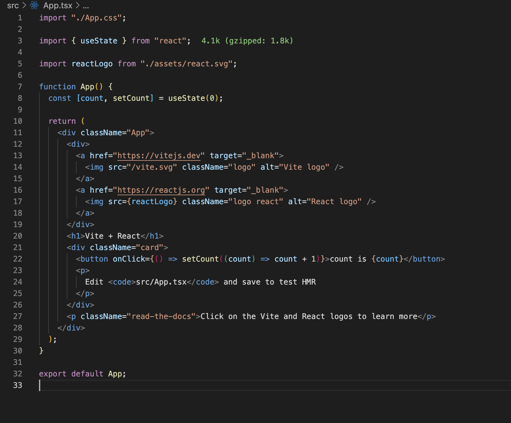

## 완성된 라이브러리 미리 보기

- [junghyoensu/configs](https://github.com/junghyeonsu/configs)

**eslint**, **prettier**는 우리의 코드를 조금 더 깔끔하고 오류가 없게끔 해 줘요.
프로젝트를 시작할 때마다 `eslint`와 `prettier` 설정하기가 귀찮지 않나요?

### BEFORE

> 이렇게 긴 `.eslintrc.js` 파일을...

```js
module.exports = {
  root: true,
  parser: "@typescript-eslint/parser",
  parserOptions: {
    project: "./tsconfig.json",
    tsconfigRootDir: __dirname,
  },
  extends: ["prettier"],
  plugins: [
    "@typescript-eslint/eslint-plugin",
    "react",
    "prettier",
    "json-format",
    "simple-import-sort",
  ],
  ignorePatterns: [".eslintrc.js", "public", "node_modules", ".cache", ".vscode"],
  rules: {
    "no-unused-vars": "error",
    "@typescript-eslint/consistent-type-imports": [
      "error",
      {
        prefer: "type-imports",
        disallowTypeAnnotations: false,
      },
    ],
    "prettier/prettier": [
      "error",
      {
        singleQuote: false,
        semi: true,
        tabWidth: 2,
        useTabs: false,
        trailingComma: "all",
        printWidth: 100,
        arrowParens: "always",
      },
      {
        usePrettierrc: false,
      },
    ],
    "simple-import-sort/imports": "error",
    "simple-import-sort/exports": "error",
  },
};
```

### AFTER

> 이런 식으로 줄일 수 있어요.

```js
// 여러분들의 이름으로 된 라이브러리를 만들어봐요.
module.exports = {
  plugins: ["@junghyeonsu"],
  extends: ["plugin:@junghyeonsu/auto"],
};
```

## 프로젝트 환경

> 라이브러리로 만들 저장소를 만들어봐요.

개발환경에 대해서 알려드릴게요.

- **monorepo**
- **yarn workspace**
- **package manager**: yarn berry
  - nodeLinker: node_modules
- **빌드**: [nanobundle](https://github.com/cometkim/nanobundle)
- **스크립트 실행**: [ultra-runner](https://github.com/folke/ultra-runner)
- **버전 관리**: [changesets](https://github.com/changesets/changesets)

해당 기술들이 뭔지를 설명하는 글은 아니지만 간략하게나마 설명을 해볼게요.

### monorepo

> 여러 패키지를 하나의 레파지토리에서 관리할 수 있어요.

저는 해당 레파지토리를 **config** 를 모아둔 레파지토리로 관리하기로 했어요.
아직은 eslint plugin밖에 없지만 추후에 더 많은 설정들이 생길 것 같아서 모노레포로 진행하기로 했어요.

대부분의 환경이 JavaScript 환경 아니면 TypeScript를 쓸 것 같고,
배포 환경이 비슷해서 여러 겹치는 부분들이 많다고 생각했어요.

### yarn workspace

> yarn workspace는 하나의 레파지토리에서 여러 패키지를 관리할 수 있게 해주는 패키지 매니저예요.

프로젝트 루트 `package.json` 파일에 다음과 같이 명시하게 되면
`yarn workspace`를 사용할 수 있어요.

```json
{
  "name": "@junghyeonsu/configs",
  "workspaces": [
    "./packages/eslint"
  ],
  "..."
}
```

[공식 문서](https://classic.yarnpkg.com/lang/en/docs/workspaces/)에서 조금 더 자세하게 살펴볼 수 있어요.

### yarn berry

> yarn berry는 yarn의 두 번째 버전이에요.

**pnp**는 지원하지 않는 패키지들이 아직 많아서 사용하지 않았어요.
**nodeLinker**는 **pnp**가 **default** 옵션이라서 **node_modules**를 다시 사용하고 싶으면 **.yarnrc.yml** 파일에서 **nodeLinker: node_modules**를 명시해 줘요.

```yml
# .yarnrc.yml
yarnPath: .yarn/releases/yarn-3.3.0.cjs

nodeLinker: node-modules
```

- [[참고] node_modules로부터 우리를 구원해 줄 Yarn Berry | toss tech](https://toss.tech/article/node-modules-and-yarn-berry)

### 빌드 도구: nanobundle

> nanobundle은 라이브러리 빌드를 도와주는 오픈소스예요. [esbuild](https://esbuild.github.io/)로 동작하고 있어요.

`package.json` 혹은 `tsconfig.json`에 적힌 정보들을 바탕으로 빌드를 알아서 해 줘요.
에러 메세지도 잘 명시되어 있어서 뭐가 잘못됐는지 바로 알 수 있어요.

설치하고, pakcage.json에 몇 가지 정보만 기입해 주고(main, exports map, ...etc),
`nanobundle build` 명령어만 입력해주면 여러 환경(ejs, cjs)에서 작동할 수 있는 코드가 나와요.

### 스크립트 실행 도구: ultra-runner

> ultra-runner는 모노레포에서 유용한 스크립트 실행기예요.

모노레포는 여러 개의 패키지로 이루어진 레파지토리라고 했죠?
현재 저는 `eslint plugin` 하나의 패키지밖에 없지만,
나중에 패키지가 4개, 5개 점점 늘어난다면 모든 패키지의 스크립트를 한꺼번에 실행시키고 싶은 욕구가 들 거예요.
그때 일일이 폴더를 찾아가서 `yarn build` 명령어를 일일이 칠 수는 없는 노릇이니까요.

ultra-runner는 해당 문제점을 해결해 줘요.
패키지가 여러 개 있어도 루트 폴더에서 단 한 번의 명령어만 입력하게 된다면
모든 패키지를 돌면서 해당 명령어가 있는지 확인하고, 전부 실행시켜 줘요.
또한 같은 명령어에 대해서 캐싱이 되어있다면, 패키지별로 판단해서 알아서 스킵해 줘요.
그리고 예쁜 콘솔창은 덤으로 가져갈 수 있어요.


### 버전 관리 도구: changesets

> changesets은 버전 관리 도구예요.

```console
yarn add -D @changesets/cli
npm install --dev @changesets/cli

{/* 이후에 프로젝트 루트에서 아래 명령어로 환경 설정을 해 줘요. */}
yarn changeset init
npm changeset init
```

changesets 또한 모노레포에서 여러 패키지를 관리할 때 유용해요.
만약 우리의 패키지에 A, B, C 패키지가 있고 모두 변경 사항이 있어서 버전 업을 해야 하는 상황이에요.
changesets를 사용하지 않으면 A, B, C 패키지를 일일이 버전을 올려주고 (package.json에 version 필드를 변경시켜주는 작업)
그리고 각 패키지 폴더에서 `npm publish` 명령어로 npm에 배포해주어야 해요.

changesets는 설치하고, 실행시키면 변경 사항이 있는 패키지를 판단해서
어떤 패키지들을 **patch**, **minor**, **major**로 버전 업 할 것인지 물어보고,
변경 사항 내용들을 입력받게 해요.


그리고 release 문서 쓰는 게 정말 귀찮은데 changeset을 사용한다면 자동으로
거저먹을 수 있어요.


## 프로젝트 세팅

> 그러면 정말 프로젝트를 한 번 만들어볼까요?

위에 소개된 오픈소스들을 활용해서 우리만의 eslint plugin을 만들 차례예요.
**레파지토리 생성** 및 **클론**과 같은 작업은 생략할게요.
아, 저희는 `yarn berry`를 사용할 거기 때문에 `yarn`으로 프로젝트 세팅을 해주세요.

### yarn berry로 설정

프로젝트에서 `yarn set version berry`을 입력하게 되면 yarn berry를 사용할 수 있어요.

```yml
# .yarnrc.yml
yarnPath: .yarn/releases/yarn-3.3.0.cjs

nodeLinker: node-modules
```

제 프로젝트에선 pnp를 사용하지 않기로 했어요.

### 필요한 의존성 설치

```console
$ yarn add @changesets/cli ultra-runner
```

changeset 설치 후에는 `yarn changeset init`으로 필요한 설정 파일을 다운해요.

추가적으로 eslint, prettier를 설정하는 건 여러분의 몫이에요.
프로젝트를 조금 더 깔끔하게 유지하고 싶다면 설치해 주세요.

그리고 현재는 타입스크립트를 사용하지 않아요.
단순히 eslint의 config들을 내보내는 라이브러리라서 설치하지 않았어요.
다른 typescript가 필요한 라이브러리라면 설치와 설정해 주세요.

만약 pnp 환경에서 typescript, eslint 그리고 prettier를 사용하게 된다면
`yarn dlx @yarnpkg/sdks vscode` 명령어를 입력해 줘요.

## 패키지 개발

최종적인 폴더 구조는 아래와 같이 될 거예요.

```console
📂.changeset
📂.yarn
📂node_modules
📂packages (yarn workspace로 관리되는 패키지들이에요)
┗ 📂eslint
┃ ┣ 📂lib (빌드 결과물이에요)
┃ ┃ ┣ 📜index.cjs
┃ ┃ ┣ 📜index.js
┃ ┃ ┗ 📜index.mjs
┃ ┣ 📂src (eslint 설정들이 모여있어요.)
┃ ┃ ┣ 📜auto.js
┃ ┃ ┣ 📜base.js
┃ ┃ ┣ 📜react.js
┃ ┃ ┗ 📜typescript.js
┃ ┣ 📜.ultra.cache.json
┃ ┣ 📜CHANGELOG.md
┃ ┣ 📜README.md
┃ ┣ 📜index.js
┃ ┗ 📜package.json
📜.yarnrc.yml
📜.gitignore
📜package.json
📜README.md
📜yarn.lock
```

**monorepo**는 **packages**에 여러 패키지 폴더를 만들고
거기에서 개발하는 형태예요. 그래서 현재는 **packages** 폴더 안에 **eslint** 패키지밖에 없어요.
(추후에는 더 생길 수 있겠죠?) 그래서 지금은 우리들의 커스텀 eslint plugin 하나를 만들어보는 데 집중해 보죠.

우선 위에 나와 있는 폴더 구조처럼 `packages/eslint` 폴더를 만들어줘요.
그리고 루트 폴더에 존재하는 **package.json** 파일에 **yarn workspace**에 관한 내용들을 적어줘야 해요.

```json,6-6
{
  "name": "@junghyeonsu/configs",
  "version": "0.0.0-thisisnotpublished",
  "description": "junghyeonsu's configs",
  "...": "추가적인 정보들",
  "workspaces": ["./packages/eslint"]
}
```

`"workspaces": ["./packages/eslint"]`로 해당 폴더를 **yarn workspace**로 관리하게 해달라고 명시해줘요.

## 저희 라이브러리의 핵심인 설정을 작성해 볼까요?

> junghyeonsu는 제 이름이니까 여러분들의 이름을 넣어서 라이브러리를 만들어봐요.

**packages/eslint** 폴더로 넘어와서 코드를 작성할 거예요.
단순하게 생각해서 **packages/eslint** 폴더도 하나의 레파지토리라고 생각해 주세요.

그래서 이 폴더 안에도 기본적인 정보들(package.json과 같은 파일들)이 다 적혀있어야 해요.
eslint 설정을 npm에 내보내는 것은 [eslint 공식 문서](https://eslint.org/docs/latest/developer-guide/shareable-configs)에 기본적인 설명들은 다 나와있어요.

간략하게 설명하자면

```js
module.exports = {
  rules: {
    semi: ["error", "always"],
    quotes: ["error", "double"],
    "no-console": "off",
  },
};
```

위와 같은 우리만의 rule을 설정해서 npm에 배포해 놔요.
그럼 사용하는 측에서는 아래와 같이 사용할 수 있어요.

```js,3-3
module.exports = {
  "plugins": [
    "my-custom-plugin"
  ],
};
```

또한 다른 플러그인들을 조합해서 하나의 플러그인으로 내보내고 싶다면 아래와 같이 하면 돼요.

```js
module.exports = {
  "extends": ["extends1", "extends2", "extends3"]
  "plugins": ["plugin1", "plugin2", "plugin3"],
  "rules": {
    "semi": ["error", "always"],
    "quotes": ["error", "double"],
    "no-console": "off"
  }
};
```

이렇게 하면 자신만의 플러그인을 만들 수 있어요.

저는 파일을 base(기본적인 js 플러그인들과 룰), react(리액트 관련 플러그인들과 룰), typescript(타입스크립트 관련 플러그인과 룰)
로 파일을 나눴고 최종적으로 `auto.js` 파일에서 따로 작성된 config 파일들을
어떤 확장자는 base를 적용하고, ts, tsx는 typescript config를 적용 그리고 마지막으로
jsx, tsx와 같은 확장자는 react config를 적용하도록 해놨어요.

그리고 저는 아래와 같은 패키지들을 설치했고 내보낼 거예요.
**dependencies**에 설치해야 저희가 만든 라이브러리를 설치하면서 같이 의존성이 설치될 거예요.

전체적인 코드는 [요기서](https://github.com/junghyeonsu/configs/blob/main/packages/eslint/package.json) 확인해주세요.

```json,3-3
{
  "...": "",
  "dependencies": {
    "@typescript-eslint/eslint-plugin": "^5.45.0",
    "@typescript-eslint/parser": "^5.45.0",
    "eslint": "^8.29.0",
    "eslint-config-prettier": "^8.5.0",
    "eslint-plugin-import": "^2.26.0",
    "eslint-plugin-json-format": "^2.0.1",
    "eslint-plugin-jsx-a11y": "^6.6.1",
    "eslint-plugin-prettier": "^4.2.1",
    "eslint-plugin-react": "^7.31.11",
    "eslint-plugin-react-hooks": "^4.6.0",
    "eslint-plugin-simple-import-sort": "^8.0.0",
    "prettier": "^2.8.0"
  },
  "...": "",
}
```

그리고 위에서 말했듯 저는 base, react, typescript로 config들을 분리시켰어요.
해당 코드들은 아래를 참조해 주세요. 단순히 eslintrc.js 파일과 비슷한 구성이고, 제가 원하는 설정을 해놨어요.
여러분은 여러분들이 원하는 rule, plugin들을 모아서 여러분만의 custom config를 만들어보세요.

- [base custom config](https://github.com/junghyeonsu/configs/blob/main/packages/eslint/src/base.js)
- [react custom config](https://github.com/junghyeonsu/configs/blob/main/packages/eslint/src/react.js)
- [typescript custom config](https://github.com/junghyeonsu/configs/blob/main/packages/eslint/src/typescript.js)

그리고 최종적으로는 각각의 config들을 적용시켜 줄 [auto 파일](https://github.com/junghyeonsu/configs/blob/main/packages/eslint/src/auto.js)을 만들었어요.
그리고 각각의 파일들에 진입할 수 있는 최초 진입점 index 파일을 만들어주면 eslint custom config 코드 작성은 끝이에요.

아래는 그렇게 완성된 `@junghyeonsu/eslint-plugin` 패키지 구조

```console
📦eslint
┣ 📂src
┃ ┣ 📜auto.js
┃ ┣ 📜base.js
┃ ┣ 📜react.js
┃ ┗ 📜typescript.js
┣ 📜README.md
┣ 📜index.js
┗ 📜package.json
```

## 코드 작성이 끝났으니 빌드를 해봐요.

코드 작성은 다 되었지만 다양한 환경에서 저희 커스텀 config를 사용할 수 있도록 빌드해볼게요.
저희는 [nanobundle](https://github.com/cometkim/nanobundle)을 사용할 건데 package.json에 꼭 적어줘야
해당 정보들을 가지고 nanobundle이 빌드를 해 줘요.

```json,5-14&16-17
{
  "name": "@junghyeonsu/eslint-plugin",
  "version": "0.0.0",
  "description": "junghyeonsu eslint custom plugin and config",
  "exports": {
    ".": {
      "source": "./lib/index.js",
      "require": "./lib/index.cjs",
      "import": "./lib/index.mjs"
    },
    "./package.json": "./package.json"
  },
  "main": "./lib/index.js",
  "files": ["index.js", "src", "lib"],
  "scripts": {
    "build": "nanobundle build --root-dir=./",
    "prepublishOnly": "npm run build"
  },
  "...": "..."
}
```

위 코드에서 `exports` field를 설명하자면,
"." 경로에는 "./lib/index.js" 파일을, 그때 `require` 문법을 사용하는 commonjs 환경에선 "./lib/index.cjs"을
`import` 문법을 사용하는 esm 환경에서는 "./lib/index.mjs"을 불러와서 사용할 수 있게끔 명시해주는 필드에요.

`main` 필드는 저희 라이브러리의 최초 진입점을 명시해주면 돼요.

`files` 필드는 저희 라이브러리에 포함될 파일이나 폴더를 명시해 줘요.

그리고 마지막으로 script를 작성해 줘요. `--root-dir` 옵션을 "./"으로 줘야 우리 프로젝트의 `index.js` 파일을 읽어서 빌드해줄거에요.
그리고 이제 packages/eslint 폴더에서 build 명령어를 수행해도 되지만, 모노레포를 사용하고 있으니
추후에 추가될 패키지들을 대비해서 ultra-runner를 통해서 빌드를 해볼게요.

그전에 저희 모노레포 루트의 package.json에 명시해줘야 할 게 있어요.

```json,8-8&18-22
{
  "name": "@junghyeonsu/configs",
  "version": "0.0.0-thisisnotpublished",
  "workspaces": [
    "./packages/eslint"
  ],
  "scripts": {
    "build": "ultra -r build",
    "release": "yarn changeset publish",
    "version": "changeset version && yarn install --no-immutable"
  },
  "devDependencies": {
    "@changesets/cli": "^2.25.2",
    "eslint": "^8.29.0",
    "prettier": "^2.8.0",
    "ultra-runner": "^3.10.5"
  },
  "ultra": {
    "concurrent": [
      "build"
    ]
  }
}
```

`ultra -r build` 명령어는 우리 패키지들을 recursive(순회적으로) 돌면서
package.json 파일들을 확인하고 `scripts` 필드에 build 명령어가 있다면 해당 명령어를 실행한다는 의미에요.

만약 루트 폴더에서 `yarn build`를 입력한다면 `packages/eslint`의 package.json 파일을 확인하고,
build 명령어가 있는 것을 보고는 해당 명령어를 수행하겠죠?

그리고 아래 적힌 "ultra" 필드는 "build" 명령어에 한해서는 명령어를 동시에 수행하겠다는 의미예요.
여러 패키지를 동시에 build해도 병렬적으로 수행하기 때문에 속도가 굉장히 빨라요.

이렇게 해놓고 `yarn build` 명령어를 모노레포 루트 폴더에서 수행하면 빌드가 진행되고,
`packages/eslint` 패키지에는 `lib` 폴더 안에 우리의 빌드 결과물들이 들어있을 거예요.

```console,2-5
📦eslint
┣ 📂lib
┃ ┣ 📜index.cjs
┃ ┣ 📜index.js
┃ ┗ 📜index.mjs
┣ 📂src
┃ ┣ 📜auto.js
┃ ┣ 📜base.js
┃ ┣ 📜react.js
┃ ┗ 📜typescript.js
┣ 📜.ultra.cache.json
┣ 📜CHANGELOG.md
┣ 📜README.md
┣ 📜index.js
┗ 📜package.json
```

## 다른 사람들이 쓸 수 있게 NPM에 배포해 봐요.

이제 빌드 결과물을 NPM에 배포해서 사람들이 설치할 수 있게 해야 해요. 그전에 준비물들이 있어요.

### 준비사항

- [NPM 회원 가입하기](https://www.npmjs.com/)
- 회원가입이 되어있다면 로컬에서 npm login 하기 (콘솔 창에 `npm login` 명령어 입력 후 아이디와 비번을 입력하고 로그인해놔요.)

그리고 changeset을 활용한 자동배포를 이루기 위해서는 아래와 같은 설정들이 필요해요.

- NPM Token을 발급받아요. 자세한 방법은 [요기](https://docs.npmjs.com/creating-and-viewing-access-tokens)를 참고해 주세요.

토큰을 발급받는 이유는 github action을 통해서 자동 배포를 할 텐데,
그때 github action ci 환경에서 npm에 배포할 때 배포자에 대한 정보가 없기 때문에
토큰을 통해서 정보를 확인하고 배포를 하는 거예요.


발급받은 토큰은 우리가 만든 레파지토리 깃허브에서 `setting` 탭에서
왼쪽 사이드바에서 `Secrets`의 탭에서 `Actions`에서 등록할 수 있어요.
`New repository secret` 버튼을 클릭해서 NPM에서 발급받은 토큰을 **NPM_PUBLISH_TOKEN**이름으로 넣어주세요.

### NPM 배포

위에 changeset 설명에도 적혀있듯, 모노레포 루트 폴더에서 `yarn changeset`을 입력하게 되면
아래와 같은 이미지 처럼될 거예요.


그럼 당황하지 않고 글을 차근차근 읽으면서 수행하면 돼요.
위아래 방향키로 움직일 수 있고, 스페이스바로 선택할 수 있으며 엔터로 다음으로 넘어갈 수 있어요.

바뀐 패키지들을 읽어서(지금은 하나일 거예요) patch(0.0.1 up), minor(0.1.0 up), major(1.0.0 up)를 선택하고
변경 사항들을 적어주고 엔터를 입력하면 마크다운 파일 하나가 생성될 거예요.
그 파일을 main에 푸시하게 되면 읽어서 changeset에서 알아서 처리해줄 거예요.

메인에 푸시하기 전에 github action을 이용한 자동 배포 코드를 작성해봐요.
프로젝트 루트 폴더에서 `.github` 폴더를 만들고 그 안에 `workflows` 폴더를 만들고
그 안에 `yml` 확장자로 된 자동 배포 코드를 작성할 수 있어요. [제가 작성한 코드](https://github.com/junghyeonsu/configs/blob/main/.github/workflows/release.yml)를 기준으로 설명드릴게요.

[github action에 대한 자세한 설명](https://docs.github.com/ko/actions)은 생략하고,
큼지막한 흐름을 기준으로 설명해 드릴게요.

```yml,1-1&6-6&17-17&23-23&28-28&35-35&38-38&41-41
name: Release Packages

on:
  push:
    branches:
      - main

jobs:
  release:
    name: Release Packages
    runs-on: ubuntu-latest
    permissions:
      contents: write
      pull-requests: write

    steps:
      - name: Checkout Repo
        uses: actions/checkout@v3
        with:
          # This makes Actions fetch all Git history so that Changesets can generate changelogs with the correct commits
          fetch-depth: 0

      - name: Setup Node.js 18.x
        uses: actions/setup-node@v3
        with:
          node-version: 18.x

      - name: Use cached node_modules
        uses: actions/cache@v3
        with:
          path: node_modules
          key: nodeModules-${{ hashFiles('**/yarn.lock') }}
          restore-keys: |
            nodeModules-
      - name: Install Dependencies
        run: yarn install --immutable

      - name: Build
        run: yarn build

      - name: 릴리즈 Pull Request를 만들거나 패키지를 배포해요
        id: changesets
        uses: changesets/action@v1
        with:
          publish: yarn release
          version: yarn version
        env:
          GITHUB_TOKEN: ${{ secrets.GITHUB_TOKEN }}
          NPM_TOKEN: ${{ secrets.NPM_PUBLISH_TOKEN }}
```

해당 자동 배포의 이름은 `Release Packages`로 깃허브 레파지토리에 `action` 탭에서 확인할 수 있어요.


해당 워크플로우의 큰 틀은 다음과 같아요. (노란색 선 기준으로 살펴봐주세요.)

1. main 브랜치에 push 이벤트가 발생했을 때 실행되는 job이에요.
2. 우리의 레파지토리를 Checkout해요. 해당 동작은 우리 레포의 히스토리를 읽어서 changeset이 changelog와 알맞은 커밋을 할 수 있게 해줘요.
3. github action 환경을 node 18 버전으로 맞춰요.
4. node_modules가 github action 환경에서 캐싱 되어 있으면 그걸 사용해요.
5. yarn install 명령어로 의존성을 설치해요.
6. yarn build로 build를 실행해요. (ultra-runner가 실행되겠죠?)
7. 마지막으로 yarn release 명령어와 yarn version으로 changeset을 이용해서 패키지를 배포하고, 풀리퀘스트를 생성해요.

`yarn release`, `yarn version` 명령어는 다음과 같아요.
모노레포 루트 package.json에 작성해 주세요.

```json,4-5
{
  "scripts": {
    "build": "ultra -r build",
    "release": "yarn changeset publish",
    "version": "changeset version && yarn install --no-immutable"
  }
}
```

요렇게까지 하면 정말 배포 준비 완료에요. 해당 자동 배포 코드를 메인에 푸시해 놓고,
yarn changeset으로 만들어진 마크다운 파일을 다시 메인에 푸시해 주면
우리가 만들어놓은 github action이 돌면서 자동으로 명령을 수행해줄 거예요.

그렇게 job이 성공적으로 수행됐다면 아마 레파지토리에 풀리퀘스트가 **Version Packages** 이름으로
자동 생성 됐을 거예요. 그럼, 그 풀리퀘스트를 메인에 머지시켜주면 해당 내용들로 npm에 자동 배포될 거예요.

이제 이렇게 되면 라이브러리 개발 플로우가 완성됐어요.
우린 앞으로 라이브러리 수정사항이 있다면 개발을 뚝딱뚝딱 열심히 하고,
개발이 끝났으면 프로젝트 루트에서 `yarn changeset` 명령어로 변경 사항에 대해서 버전들을 올려주고,
만들어진 마크다운 파일과 함께 코드를 메인에 푸시해 주면 풀리퀘스트를 만들어주고(협업할 때 변경 사항들을 같이 확인하기 위함이에요.),
해당 풀리퀘스트를 머지해주면 정식으로 버전업이 되면서 npm에 배포가 되는 플로우에요.

이렇게 라이브러리 개발 한 사이클을 한 번 쭉 돌아봤어요.
생각보다 별것 없죠? 그럼, 우리가 만든 eslint plugin을 설치해서 한 번 사용해 볼까요?

## 사용해 보기

아무 프로젝트를 생성하고, `yarn add -D 자신의-라이브러리 eslint`로 설치해서 사용해 봐요.

저는 `yarn add @junghyeonsu/eslint-plugin eslint prettier`으로 설치했어요.
제 플러그인에는 `prettier` 룰들도 들어가 있어서 같이 설치해 주었어요.
임시 vite 프로젝트를 만들어서 테스트해 봤어요.

```json,16-16
{
  "name": "my-vite-app",
  "private": true,
  "version": "0.0.0",
  "type": "module",
  "scripts": {
    "dev": "vite",
    "build": "tsc && vite build",
    "preview": "vite preview"
  },
  "dependencies": {
    "react": "^18.2.0",
    "react-dom": "^18.2.0"
  },
  "devDependencies": {
    "@junghyeonsu/eslint-plugin": "^1.0.1",
    "@types/react": "^18.0.26",
    "@types/react-dom": "^18.0.9",
    "@vitejs/plugin-react": "^3.0.0",
    "eslint": "^8.31.0",
    "prettier": "^2.8.1",
    "typescript": "^4.9.3",
    "vite": "^4.0.0"
  }
}
```

그리고 vite는 package.json에 `type` 필드가 `module`로 되어있어서
`.eslintrc.cjs`로 eslintrc 파일을 생성해서 설정했어요.

```js
module.exports = {
  root: true,
  plugins: ["@junghyeonsu"],
  extends: ["plugin:@junghyeonsu/auto"],
  rules: {
    // ...
  },
};
```

> "왜 위와 같이 이름들을 명시하나요?"에 답은 [공식 문서](https://eslint.org/docs/latest/developer-guide/shareable-configs#using-a-shareable-config)를 참고해주세요.

이렇게까지 하고 나면 vite template에서 자동 생성된 `App.tsx`에서 오류들을 뱉어낼 거예요.




제가 설정한 config대로 잘 적용이 된 것 같네요!

## 완성도 높이기

사실 라이브러리를 만들어놔도 문서가 잘 작성되어 있지 않으면 오픈소스가 아니라
단순 자기만 쓰기 위한 코드가 되어버려요. 새로 찾아온 손님은 우리가 적어놓은 코드에 대한 맥락이 하나도 없으니까요.

많은 사람이 사용하기 위해서는 [package.json에 더 명시해줄 필드들도 많고](https://docs.npmjs.com/cli/v9/configuring-npm/package-json),
혹은 리드미를 기막히게 써서 공개해놔야 해요. 이 라이브러리가 나온 이유, 설치 방법, 그리고 [CONTRIBUTING.md](https://github.com/github/docs/blob/main/CONTRIBUTING.md) 파일 같은 것도 만들어서
기여할 수 있는 환경도 만들어요.

## 마무리

오늘 이런 식으로 간단하게 **eslint config** 라이브러리를 만들었어요.
설정 파일뿐만 아니라 다양한 코드들을 오픈소스로 열어놓을 수 있어요. 컴포넌트가 될 수도 있고, 어떤 유틸 함수가 될 수도 있겠죠.

다들 이번 기회에 오픈소스를 만들어서 오픈소스 생태계를 멋지게 만들어봐요.
