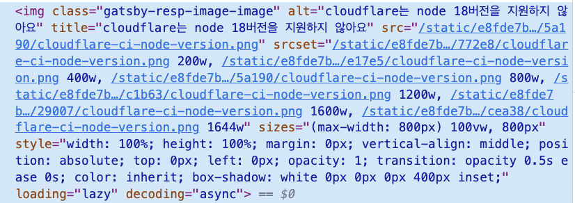
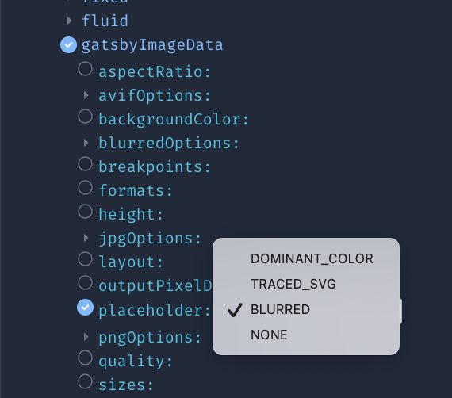
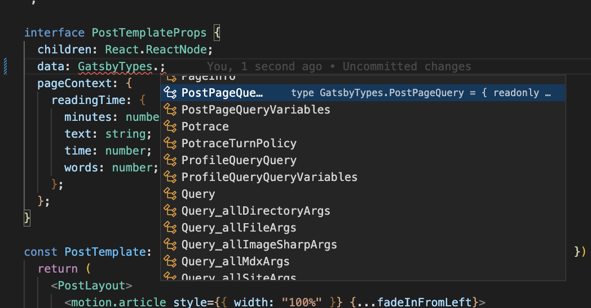
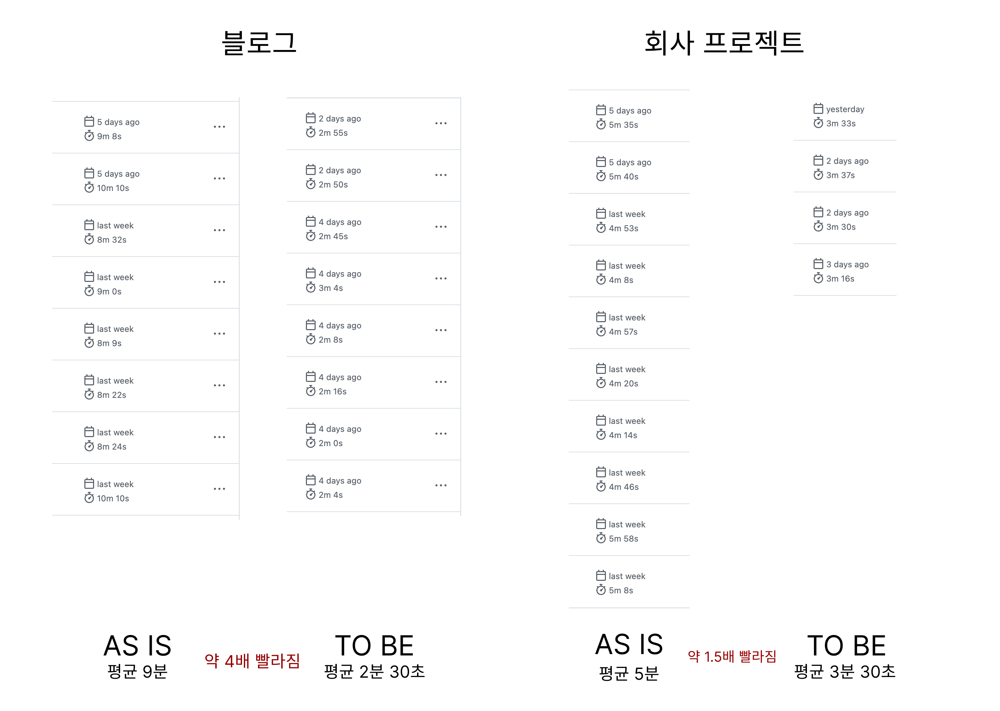
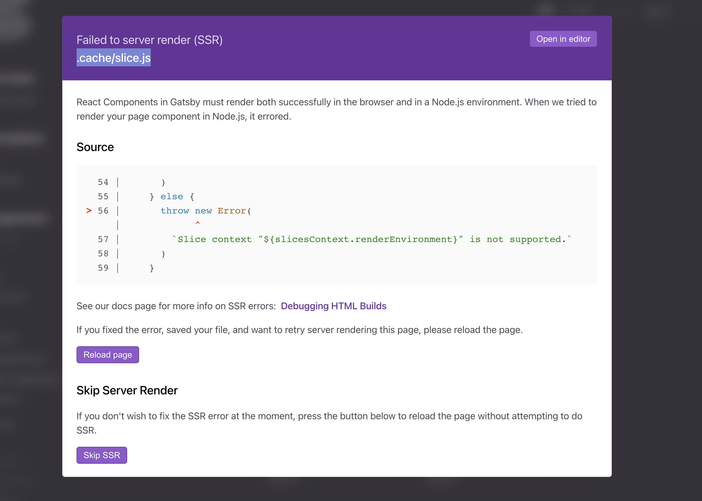
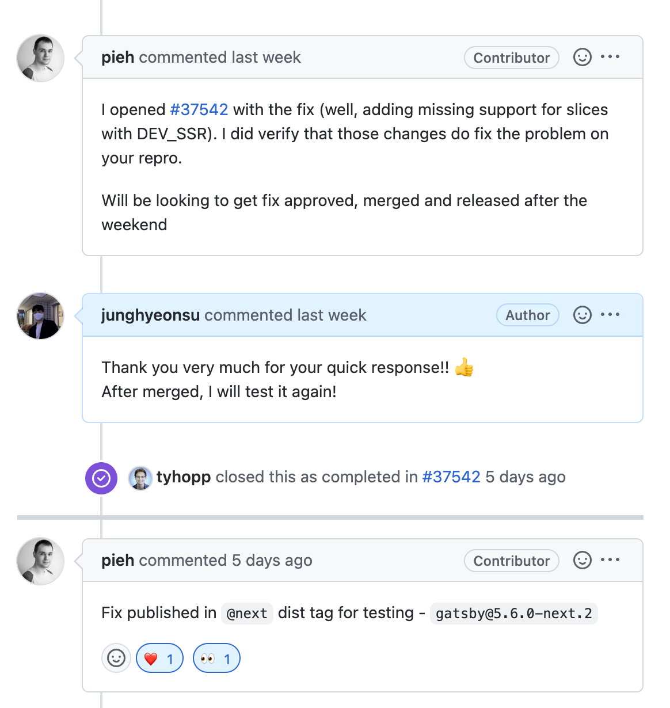
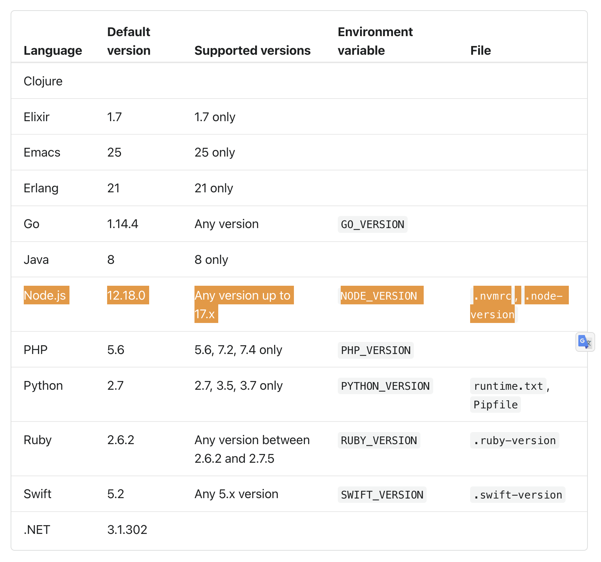
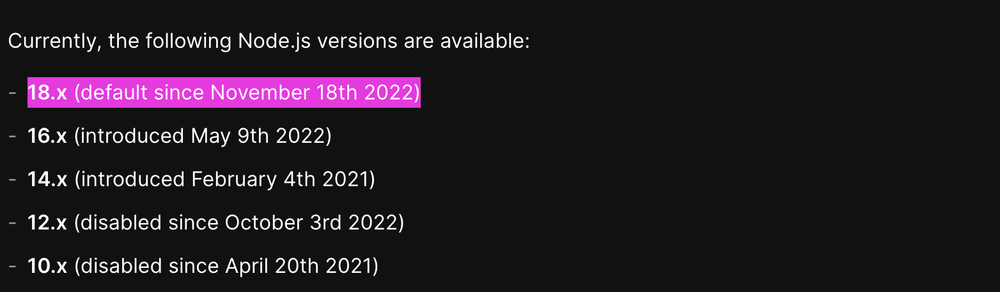
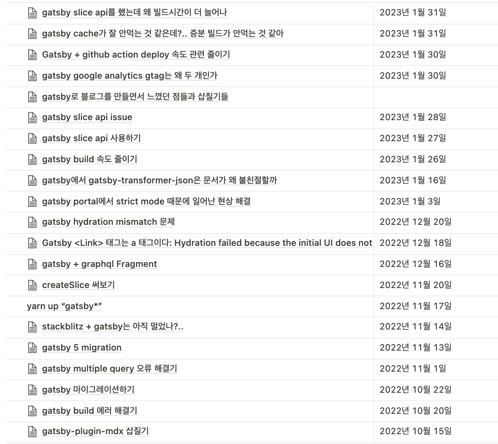

## 개요

최근 들어서 Gatsby를 이용해서 블로그를 만드시는 분이 많아진 것 같아요.
저도 최근 제 블로그를 `Next.js`에서 Gatsby로 기술 스택을 옮겼어요.

옮긴 이유는 다음과 같아요.

- 제가 회사에서 Gatsby의 사용 경험이 너무 좋아서 블로그도 Gatsby로 만들어보고 싶었어요.
- Gatsby는 `Graphql`을 이용한 **데이터 레이어**를 제공하는데 데이터 레이어를 대하는 관점이 되게 좋았어요.
- **데이터 레이어**와 **플러그인 시스템**을 이용하면, 블로그를 만들 때 더욱 편리하게 만들 수 있을 것 같았어요.

그래서 저는 Gatsby로 블로그도 만들고, 회사에서 만들고 있는 사이트도 Gatsby로 만들고 있어요.
블로그에 적용한 기술들을 회사에서 적용하기도 하고, 회사에서 적용한 기술을 블로그에 적용하기도 하고 이런저런 경험을 많이 했네요.

제가 약 4-5개월 동안 Gatsby를 사용하면서 겪은 삽질과 꿀팁들을 공유하려고 해요.
이미 제가 밟은 지뢰를 다른 분들이 밟지 않도록 도와드리고 싶고, 다른 분들은 어떤 어려움을 겪는지도 알고 싶네요.
제가 틀린 내용을 썼거나, 혹은 더 좋은 방법이나 삽질 경험을 하셨다면 댓글로 알려주세요.

## Gatsby의 특징

### Gatsby는 React를 기반으로 만들어진 정적 페이지 제작 프레임워크예요.

Gatsby는 `React`를 기반으로 만들어진 프레임워크예요. Gatsby는 빠르고 현대적인 웹 사이트 및 웹 애플리케이션을 구축하기 위한 무료의 오픈 소스 프레임워크예요.
React와 GraphQL을 기반으로 구축되어, 개발자가 빠르고 동적이며 시각적으로 매력적인 웹 사이트를 쉽게 생성 및 관리할 수 있도록 도와줘요.

Gatsby의 주요 기능 중 하나는 정적 사이트 생성기 (`Static Site Generator`)인데요,
이는 사용자가 사이트를 방문할 때 매우 순간적으로 HTML 파일을 생성하는 대신,
빌드 시에 각 웹 사이트 페이지에 대한 HTML 파일을 생성합니다.
이로 인해 Gatsby 웹 사이트는 빠르고 확장 가능하며,
CDN (`Content Delivery Network`)에서 쉽게 제공될 수 있고, 검색 엔진 최적화 (`SEO`)가 쉬워요.

### Gatsby는 Plugin System을 제공해요.

그리고 아래에서 조금 더 설명하겠지만 Gatsby의 **플러그인 시스템**은 기능을 확장하거나 개선하는 데 매우 유용해요.

예를 들어, 이미지 관련 플러그인, SEO 관련 플러그인, 데이터 소스 플러그인 등이 있어요.
Gatsby의 플러그인 시스템은 개발자가 기존 기능에서 더 많은 것을 가져오거나,
개발자가 원하는 기능을 개발하는 것을 쉽게 할 수 있어요.

Gatsby 플러그인 시스템을 사용하면, [Gatsby 커뮤니티에서 제공하는 다양한 플러그인](https://www.gatsbyjs.com/plugins/#cms)을 선택하거나,
개인적인 요구에 맞게 사용자 정의 플러그인을 만들 수도 있어요. 플러그인은 쉽게 설치하고 사용할 수 있으며,
코드를 많이 작성하지 않고도 웹 사이트를 빠르고 쉽게 사용자 정의할 수 있게 해 줘요.

저도 현재 [회사에서 진행하고 있는 프로젝트에서 Gatsby Plugin을 만들어서 제공한 경험](https://github.com/daangn/seed-design/tree/main/packages/gatsby-plugin-seed-design)도 있어요.

### Gatsby는 Graphql을 사용해요.

Gatsby의 또 다른 중요한 특징은 GraphQL과의 통합이에요.
이를 통해 개발자들은 API, 데이터베이스, CMS 등의 여러 소스에서 데이터를
쉽게 쿼리하고 조작해서 웹 사이트에서 페이지를 생성할 수 있어요.
데이터 레이어에서 필요한 데이터만 가져와서 각 컴포넌트에서 사용할 수 있어서
UI와 데이터를 분리해서 볼 수 있는 시각을 가질 수 있어요.

데이터 레이어와 플러그인 시스템을 잘 활용하면 정말 사기적으로 마법을 부릴 수 있어요.
예시로 `frontmatter` (마크다운에서 추가로 적어주는 메타데이터)에서 image 경로를 입력하면 자동으로 이미지를 불러올 수 있어요.
그리고 아래에서 설명할 플러그인을 사용하면 이미지를 알아서 Gatsby에서 최적화를 해 줘요.
근데 이게 정말 마법이에요. 사실 마법이라는 게 개발자 입장에서는 늘 좋은 것은 아니지만, 귀찮은 것들을 정말 많이 해결해 줘요.
**우리의 목적은 블로그를 만드는 것이지, 이미지를 최적화하는 것이 아니니까요.**

## 꿀팁과 삽질기들

### gatsby-plugin-image

`gatsby-plugin-image`는 Gatsby에서 이미지를 렌더링 할 때 사용하는 플러그인이에요.

요즘 최신 프레임워크에서는 대부분 `` 컴포넌트를 사용하면 웬만한 이미지 최적화를 다 해 줘요.
그래서 Gatsby에서도 마찬가지로 `<GatsbyImage />` 컴포넌트를 사용해서 이미지를 최적화할 수도 있고,
혹은 블로그를 만들고 `markdown`으로 이미지를 넣을 때 `gatsby-remark-images` 플러그인을 사용하면
`markdown`에서 이미지 경로를 입력하면 자동으로 최적화된 이미지를 불러올 수 있어요.



`srcset`이라는 것을 알고 계신가요? `srcset`은 이미지를 최적화할 때 사용하는 것인데,
이미지를 불러올 때 사용자의 디바이스에 맞는 이미지를 불러오는 것이에요.
예를 들어, 사용자가 데스크탑에서 블로그를 보고 있다면, 데스크탑에 맞는 이미지를 불러오고,
사용자가 모바일에서 블로그를 보고 있다면, 모바일에 맞는 이미지를 불러오는 것이에요.

그런데 이게 정말 귀찮은 일이에요. 왜냐하면, 이미지를 불러올 때 사용자의 디바이스에 맞는 이미지를 불러오기 위해서는
이미지를 여러 개 만들어야 하거든요. 그래서 `gatsby-plugin-image`는 이런 귀찮은 일을 대신 해 줘요.

`gatsby-plugin-image`를 사용하면, `gatsby develop`를 실행할 때 이미지를 여러 개 만들어서
`public/static` 폴더에 저장해 두고, 사용자가 블로그를 보고 있을 때, 사용자의 디바이스에 맞는 이미지를 불러오는 거예요.

또한 `gatsby-plugin-image`는 `placeholder`를 지원해요. `placeholder`는 이미지가 로딩되기 전에 보여주는 이미지를 말해요.
이미지가 로딩되기 전에 보여주는 이미지를 사용자가 직접 만들어야 하는데, `gatsby-plugin-image`를 사용하면 이런 것들을 신경 쓰지 않아도 돼요.

```graphql
query MyQuery {
  allImageSharp {
    nodes {
      gatsbyImageData(placeholder: BLURRED)
    }
  }
}
```

이렇게 하면, 이미지가 로딩되기 전에 `blur`된 이미지를 보여주게 돼요.
또한 `placeholder`에 대한 여러 옵션을 제공해 줘서 사용자가 선택적으로 사용할 수 있게 해 줘요.



정말 마법같죠?

### gatsby-plugin-typegen

[gatsby-plugin-typegen](https://www.gatsbyjs.com/plugins/gatsby-plugin-typegen/)은 Gatsby에서 `Graphql`을 사용할 때
`Graphql`의 타입을 자동으로 생성해주는 플러그인이에요.

저희 [당근마켓 동료분](https://github.com/cometkim)이 만드신 플러그인인데,
`Gatsby v4.15`버전부터 **Gatsby에 내장돼서 기본적으로 제공되는 플러그인**이에요.
해당 플러그인이 내장되기까지의 과정은 [여기](https://github.com/gatsbyjs/gatsby/discussions/35420)에서 확인할 수 있어요.

해당 플러그인을 사용하면 타입스크립트를 사용해서 조금 더 편하게 `query` 데이터를 가져오고 사용할 수 있어요.

```typescript
export const query = graphql`
  query PostPage($id: String!, $tags: [String!]!) {
    post: mdx(id: { eq: $id }) {
      frontmatter {
        slug
        title
        description
        tags
        createdAt
        updatedAt
        thumbnail {
          childImageSharp {
            gatsbyImageData
          }
        }
      }
      tableOfContents
    }
    relatedPosts: allMdx(
      filter: { frontmatter: { tags: { in: $tags } }, id: { ne: $id } }
      sort: { frontmatter: { createdAt: DESC } }
      limit: 4
    ) {
      nodes {
        frontmatter {
          slug
          title
          description
          tags
          createdAt
          updatedAt
          thumbnail {
            childImageSharp {
              gatsbyImageData
            }
          }
        }
      }
    }
  }
`;
```

위 코드는 제 블로그에서 포스트 페이지를 렌더링할 때 사용하는 `query`에요.
해당 `post`에 대한 여러 정보를 가져오고, `relatedPosts`에 대한 정보도 가져오고 있어요.

만약 타입스크립트를 이용해서 `query`에 대한 결괏값을 사용하려고 하면 원래라면 일일이 타입을 지정해줘야 했지만,
`gatsby-plugin-typegen`을 사용하면 `query`에 대한 결괏값의 타입을 자동으로 생성해 줘요.



자동 생성된 타입은 `GatsbyTypes`에 담겨있고 `query`의 이름과 뒤에 `Query` 접미사가 붙어있어요.
그래서 위 코드에서 `query`의 이름이 `PostPage`이기 때문에 `GatsbyTypes.PostPageQuery`라는 타입이 생성되었어요.

사실 위의 두 플러그인 말고도 정말 많은 플러그인들이 있어요.
[공식문서](https://www.gatsbyjs.com/plugins/)에서 확인할 수 있어요.
이 글에서 전부 설명하기에는 너무 많아서, 위의 두 플러그인만 소개하고 넘어갈게요.

### 최신버전으로 업데이트하기.

가끔 놓치고 있는 분들이 많아서 한 번 언급하고 넘어갈게요.

Gatsby는 정말 빠르게 업데이트가 되고 있어요. 현재 Gatsby의 메이저 버전은 5 버전까지 나왔어요.
또한 `Slice API`, `Head API`, `Script Component`와 같은 기능들이 추가되었어요.

그리고 Graphql Playground로 `GraphiQL`을 사용하고 있는데, `GraphiQL 2` 버전이 적용되어서
예쁜 디자인의 Playground를 즐길 수 있어요.

또한 Gatsby 5 버전에서는 React 18 버전, 또한 Node 버전도 18 버전을 사용하고 있어요.
다양한 기능들을 사용할 수 있기 때문에 최신버전으로 업데이트하는 것을 추천드려요.
Gatsby 5버전 릴리즈 노트는 [여기](https://www.gatsbyjs.com/docs/reference/release-notes/v5.0/)에서 확인할 수 있어요.

### github action을 이용해서 자동으로 배포할 때 빌드 속도를 높여보자.

많은 분들이 페이지 배포를 하실 때 `github action`을 이용해서 자동 배포를 많이 하실 텐데요,
`github action`을 이용해서 자동 배포를 할 때 빌드 속도를 높이는 방법을 알려드릴게요.

보통 `cache`를 이용해서 빌드 속도를 높이는 방법을 많이 사용하시는데요,
Gatsby의 경우 `cache`를 이용해서 빌드 속도를 높이는 방법이 조금 다릅니다.

Gatsby는 `yarn build` 명령어로 빌드를 하게 되면 `public` 폴더와 `.cache` 폴더가 생성돼요.
`public` 폴더는 빌드된 결과물이고, `.cache` 폴더는 빌드를 하면서 생성되는 캐시 파일들이에요.
그래서 github action 빌드를 할 때 `public` 폴더와 `.cache` 폴더를 둘 다 캐시를 해야 해요.

특히나 블로그 같은 경우는 이미지를 정말 많이 사용하기 때문에 빌드 속도가 느려지는데요,
잘 캐싱해주지 않으면 빌드 속도가 엄청 느려요. 제 블로그도 이미지가 점점 늘어나서 캐싱을 해주지 않았을 때 9분 걸리던 빌드 속도를
캐싱을 해주니 평균 2-3분 정도 걸리는 것 같네요. **(약 4배 정도 빨라졌어요.)**



두 프로젝트가 개선된 정도가 다른 이유는 블로그는 이미지 파일이 많고, 기존에 이미지 처리하는데 빌드 시간이 많이 걸렸어요.
하지만 캐싱 처리를 해준 덕분에 불필요한 이미지 처리가 줄어들어서 시간이 눈에 띄게 줄어들었어요.
그리고 캐싱 처리를 해주어도 기존에 CD 프로세스에서 처리를 해줘야 하는 Step(의존성 설치, 배포 등등)이 있기 때문에 똑같이 4배가 빨라져서 5분 걸리는 것들
1분 정도로 줄일 수는 없는 거죠. 아마 더 줄이려면 `zero-install`을 적용해서 의존성 설치를 줄인다던지 하는 과정이 있으면 더 줄일 수 있을 것 같아요.

그래서 제가 작성한 github action workflow 파일을 조금 공유하자면 다음과 같아요.

```yaml,3-3&7-7&15-15&19-19
- name: 의존성 설치 과정...

- name: Cache Gatsby `.cache` Folder
  uses: actions/cache@v3
  id: gatsby-cache-folder
  with:
    path: .cache
    key: ${{ runner.os }}-cache-gatsby
    restore-keys: |
      ${{ runner.os }}-cache-gatsby

- if: steps.gatsby-cache-folder.outputs.cache-hit == 'true'
  run: echo 'gatsby-cache-folder cache hit!'

- name: Cache Gatsby `public` Folder
  uses: actions/cache@v3
  id: gatsby-public-folder
  with:
    path: public
    key: ${{ runner.os }}-public-gatsby
    restore-keys: |
      ${{ runner.os }}-public-gatsby

- name: 빌드 및 배포...
```

코드를 보면 `gatsby-cache-folder`와 `gatsby-public-folder` 두 개의 캐시를 만들어서 사용하고 있어요.
`gatsby-cache-folder`는 `gatsby build` 과정에서 생성되는 `.cache` 폴더를 캐시하고 있고,
`gatsby-public-folder`는 `gatsby build` 과정에서 생성되는 `public` 폴더를 캐시하고 있어요.

혹은 아래와 같이 `public`, `.cache` 폴더들을 한꺼번에 캐싱할 수도 있어요.

```yaml,8-9
- name: 이전 과정들...

- name: Caching Gatsby
  id: gatsby-cache-build
  uses: actions/cache@v3
  with:
    path: |
      public
      .cache
    key: ${{ runner.os }}-gatsby-build-${{ github.run_id }}
    restore-keys: |
      ${{ runner.os }}-gatsby-build-

- name: 이후 과정들...
```

적절한 캐싱 처리를 통해서 빌드 시간을 많이 줄여봐요.

### gatsby v5부터 나온 slice api 이용하기.

최근에 [gatsby v5](https://www.gatsbyjs.com/gatsby-5/)가 나왔는데요, v5에서는 `slice` api가 추가되었어요.

`slice` API를 간단히 설명하자면 만약 우리가 만들어야 하는 페이지가 **10,000개**라고 가정해 봅시다.
그럼 `createPage` API가 **10,000번** 호출되고, 각 페이지마다 `<Header />` 컴포넌트가 있다고 생각하면
`<Header />` 컴포넌트가 **10,000번** 렌더링이 되겠죠? 만약 모든 페이지가 다시 빌드가 되어야 하지만,
`<Header />` 컴포넌트는 변경사항이 없어서 빌드가 되지 않아도 되는 경우에는 불필요한 빌드가 다시 발생하게 되죠.

이런 경우를 위해서 `slice` API는 `<Header /> Slice`를 생성해서 캐싱을 해놓고,
페이지에서는 Slice의 `alias` 값을 통해서 `<Header />` 컴포넌트를 불러오는 방식으로 사용할 수 있어요.
그러면 `<Header />` 컴포넌트는 한 번만 빌드가 되고 나머지 페이지에서는
`slice` API를 통해서 `<Header />` 컴포넌트의 키 값을 통해서 참조만 하기 때문에 빌드 시간을 줄일 수 있어요.

조금 더 자세한 내용은 [공식문서](https://www.gatsbyjs.com/docs/reference/release-notes/v5.0/#slice-api)를 참고해 주세요.
그리고 [slice API가 나오게 된 배경](https://github.com/gatsbyjs/gatsby/discussions/36339)의 링크도 첨부할게요.

![slice 과정을 도식화 [출처 Gatsby 공식문서]](./using-slices-build.png)

근데 며칠 전에 `slice` API를 한 번 사용해 보려고 시도를 했는데 에러를 만나게 됐어요.
단순하게 `slice` API를 간단하게 사용하는 코드였는데 에러가 났고, 나온 지 별로 되지 않은 따끈한 API였어서 해당 오류를 참고할 레퍼런스도 거의 없었어요.
제가 개발하는 Gatsby 환경은 `DEV_SSR` flag를 사용해서 개발 환경에서도 SSR을 사용하고 있어요.



그래서 그냥 Gatsby [공식 레파지토리에 issue를 올렸어요.](https://github.com/gatsbyjs/gatsby/issues/37537)
그리고 다음 날 바로 [핫픽스해서 올려주셨어요.](https://github.com/gatsbyjs/gatsby/pull/37542)



그래서 지금은 `gatsby@5.6.0-next.2` 버전에서 사용하면 `DEV_SSR` flag와 함께 사용할 수 있어요.

**이후에 `slice`를 적용해 봤지만 극명한 빌드 시간을 줄이는 효과는 없었어요.**
그 이유는 다음과 같아요.
우선 `slice` API가 효과가 있으려면 페이지가 1,000개, 10,000개 정도의 프로젝트에서 효과가 나지,
제 프로젝트처럼 몇 십 개 정도의 페이지에서는 효과가 없어요. `slice` API도 마법처럼 보이지만
내부적으로는 전부 `slice`를 생성하는 과정도 필요하고, 코드상에서 `<Slice alias="header" />` 이런 식으로 사용하는 것도
페이지를 분석해서 `Slice` 컴포넌트가 참조하고 있는 `alias`를 찾아서 `slice`를 붙여주는 과정도 필요해요.
그래서 페이지가 적은 프로젝트에서는 **배보다 배꼽이 더 커지는 것**이죠.

**그렇기 때문에 자신의 프로젝트 수준을 잘 파악하고 적절하게 사용해서 효과를 보는 것이 중요해요.**

### gatsby v5부터는 node 18 버전만 지원한다. (cloudflare 자동 배포하기)

`gatsby` 5 버전부터는 `node` 18 버전을 사용해야 해요.

이것과 관련해서 문제들이 조금 생길 수 있는 게, 저는 `cloudflare` 혹은 `vercel`을 이용해서 배포를 하고 있었어요.
하지만 [cloudflare의 CI 머신은 node 18 버전을 지원하지 않아요. (현재 글을 작성하는 2023년 2월 5일 기준)](https://developers.cloudflare.com/pages/platform/build-configuration/#language-support-and-tools)



[`vercel`은 작년 2022년 12월에 지원을 시작](https://vercel.com/docs/concepts/functions/serverless-functions/runtimes/node-js#node.js-version)했어요.



그렇기 때문에 `cloudflare`를 이용해서 배포를 하려면 추가적으로 자동 배포 코드를 작성해야 해요.
(그냥 `vercel`을 사용하면 되는 거 아니냐고 생각할 수 있지만, 비용 이슈로 `cloudflare`를 사용하고 있어요.)

그래서 `cloudflare`에 Gatsby 5 버전 프로젝트를 배포하려면 `cloudflare`에서 제공하는 `wrangler`를 이용해서 배포를 해야 해요.
github actions와 `wrangler cli`를 이용하면 자동 배포를 할 수 있어요.

```yaml,3-3&12-12
- uses: actions/setup-node@v3
  with:
    node-version: 18.12.1
    cache: yarn

- name: 중간 과정들...

- name: Deploy `Your Project` at Cloudflare pages
  uses: cloudflare/wrangler-action@2.0.0
	with:
    apiToken: ${{ secrets.CF_API_TOKEN }}
    command: pages publish ./public --project-name=your-project-name
```

`CD` 과정을 시작할 때 node 버전을 18 버전으로 세팅해 주고, `wrangler`를 이용해서 배포를 해요.
그럼 `cloudflare`을 사용하더라도 `gatsby` 5 버전을 사용할 수 있어요.

## 마무리

뭔가 거창하게 글을 많이 써놨는데 Gatsby에 대한 설명이 대부분이었던 걸로...
지금까지 그래도 Gatsby를 사용하면서 겪었던 문제들을 간단하게라도 노션에 정리를 해놨지만,
너무 간단한 것들과 제가 멍청하게 실수한 부분들이 대부분이었어서 글을 쓰기가 애매했어요.



그래도 이 글을 보고 Gatsby를 사용하시는 분들이 조금이라도 도움이 되었으면 좋겠어요.
저도 Gatsby를 사용한 지 4개월 정도 된 것 같은데 아직 많이 부족하지만 확실한 건... Gatsby는 정말 좋은 프레임워크라는 거예요.
거의 사랑에 빠진 것처럼 얘기를 하고 있는데 그만큼 정말 경험이 좋았다는 얘기겠죠?

그리고 최근에 [Gatsby가 Netlify에 인수되었다는 소식을 들었어요.](https://www.gatsbyjs.com/blog/gatsby-is-joining-netlify/)
확실히 Gatsby는 잘 구축되어 있는 플러그인 시스템과 데이터 레이어 그리고 클라우드 서비스를 이용해서
대규모 컨텐츠를 빠르게 배포할 수 있는 프레임워크로 나아가고 있는 것 같아요.
개발자와 컨텐츠 제작자를 위한 종합 플랫폼 서비스로 나아가고 있답니다.
**사람들이 Gatsby는 단순 블로그를 만드는 데 사용하는 프레임워크라고 생각하고 있지만,,, Gatsby는 이런 야망을 가지고 있답니다.**

이제 사용한 지 4개월밖에 되지 않은 응애 사용자이지만 Gatsby를 많이 애용할 것 같아요.
앞으로의 Gatsby의 행보가 기대가 되네요.
