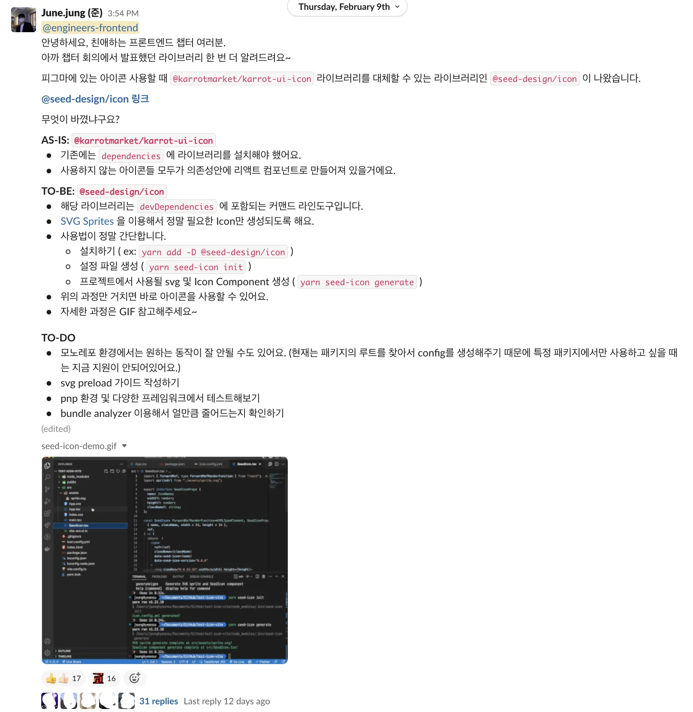
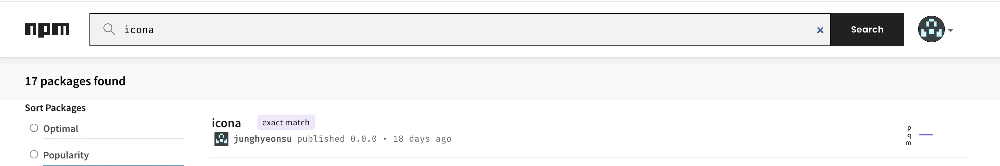
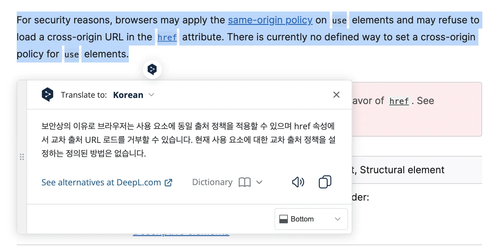
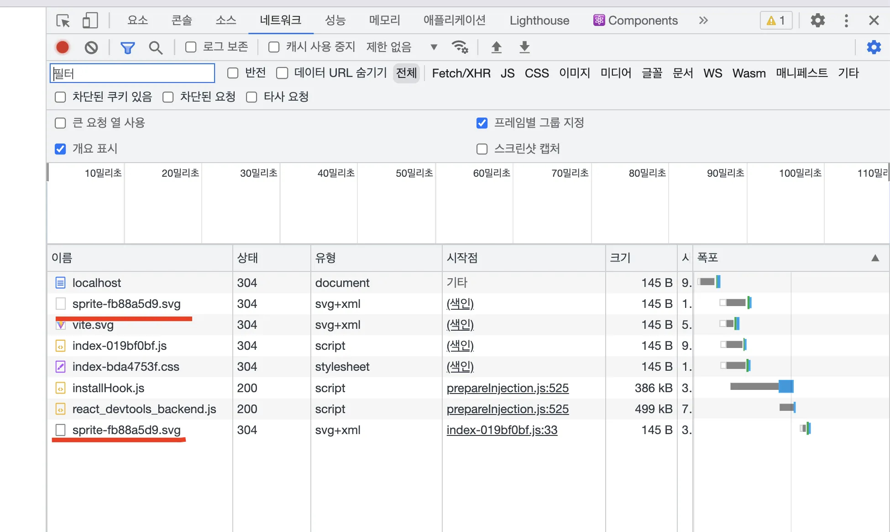
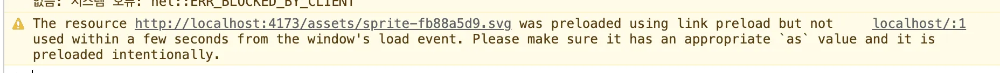
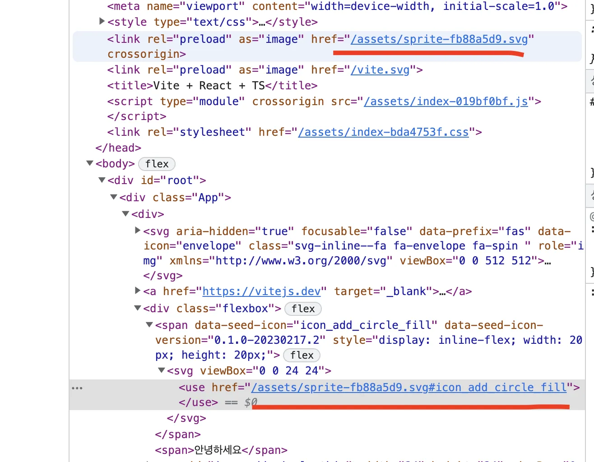
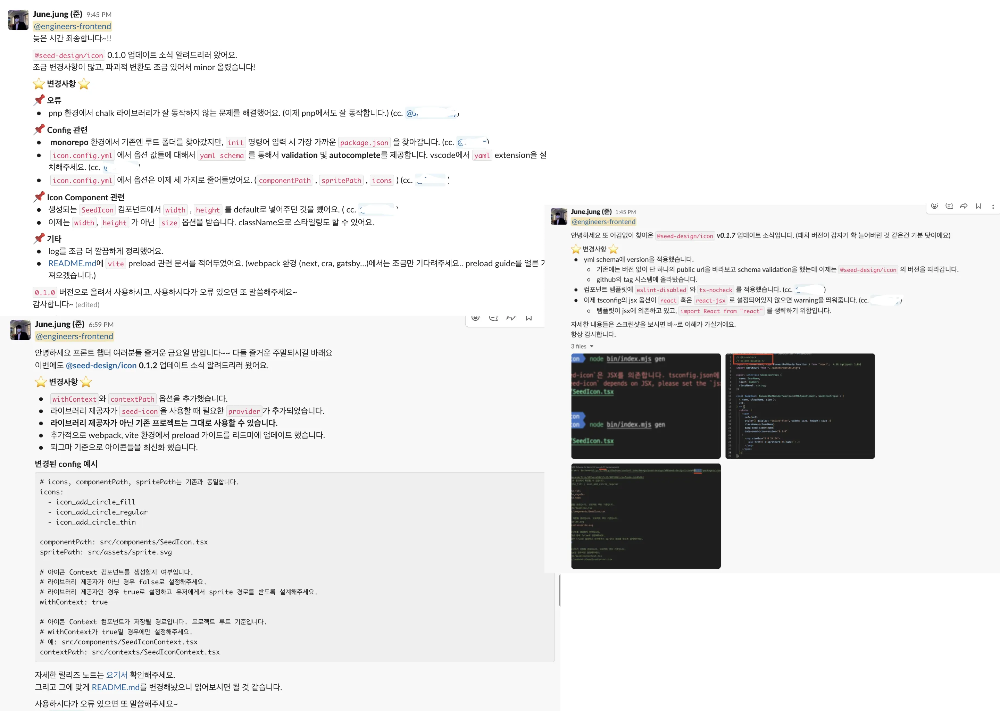

## 개요

리액트에서 어떤 어떻게 아이콘을 제공해줘야 하는지 한 번 딥다이브 해보고,
**내 의사결정들의 과정**과 이유를 조금 더 풀어보려 이 글을 썼다.

## TL;DR

- 어떤 기술을 도입할 때는 조금 더 다양한 아티클 들과 정보들을 찾아보고 도입하자.
- inline svg 방식은 생각보다 괜찮았다.

## 아이콘은 귀찮음의 영역

항상 내가 하는 모든 프로젝트에서는 아이콘은 귀찮음의 영역이었다.
어떤 아이콘 라이브러리를 쓸지, 어떤 방식으로 아이콘을 관리할지, 어떤 방식으로 아이콘을 사용할지 등등

나는 디자인시스템 팀에 속해 있었고, 각 컴포넌트 안에서 아이콘을 사용할 필요가 있었다.
원래 기존에, 회사에서 아이콘을 제공해 주던 방식이 있었다. 기존의 방식에는 문제가 조금 있었고 해결해야 하는 상황이었다.

누군가가 정말 간단하고 쉽고 번들 크기도 작으면서 최고의 성능을 낼 수 있는 프로젝트를 하지 않았을까?..
라고 생각했지만, 그런 프로젝트는 잘 없었다.

## 기존은 어떻게: karrot-ui-icon

[karrot-ui-icon](https://github.com/daangn/karrot-ui-icon)은 기존에, 회사에서 사용하던 아이콘 라이브러리였다.
기존의 방식과 인식된 문제점은 다음과 같았다.

- **리액트 아이콘 컴포넌트 라이브러리**
- yarn add `karrot-ui-icon`
- js 번들에 아이콘 컴포넌트들이 포함됨.
- 모든 svg 컴포넌트 (span으로 감싸진 것도 아닌, 그냥 쌩 SVG를 사용하고 있었음)
- 어떤 아이콘을 사용하는지에 대한 인식이 어렵다.

## 내 생각의 트리거

그러던 찰나에 어떤 글을 보게 되었다. [The "best" way to manage icons in React.js](https://benadam.me/thoughts/react-svg-sprites/)라는 글을 보게 되었다.
해당 글을 짧게 요약하자면 `sprite.svg`를 사용하면 리액트에서 더 효율적으로 `svg`를 관리할 수 있다고 한다.

`sprite.svg`와 `<symbol />`, `<use />` 태그를 사용해서 아이콘을 관리하는 방법을 모르는 분들을 위해 짧게 설명하자면,

```html
<!-- sprite.svg -->
<svg
  xmlns="http://www.w3.org/2000/svg"
  xmlns:xlink="http://www.w3.org/1999/xlink"
>
  <symbol viewBox="0 0 24 24" id="icon-1">
    <path
      d="M6.84 5.76L8.4 7.68H5.28l-.72 2.88H2.64l.72-2.88H1.44L0 13.44h3.84l-.48 1.92h3.36L4.2 18.24h2.82l2.34-2.88h5.28l2.34 2.88h2.82l-2.52-2.88h3.36l-.48-1.92H24l-1.44-5.76h-1.92l.72 2.88h-1.92l-.72-2.88H15.6l1.56-1.92h-2.04l-1.68 1.92h-2.88L8.88 5.76zm.24 3.84H9v1.92H7.08zm7.925 0h1.92v1.92h-1.92Z"
    />
  </symbol>
  <symbol viewBox="0 0 24 24" id="icon-2">
    <path
      d="M0 0h24v24H0V0zm22.034 18.276c-.175-1.095-.888-2.015-3.003-2.873-.736-.345-1.554-.585-1.797-1.14-.091-.33-.105-.51-.046-.705.15-.646.915-.84 1.515-.66.39.12.75.42.976.9 1.034-.676 1.034-.676 1.755-1.125-.27-.42-.404-.601-.586-.78-.63-.705-1.469-1.065-2.834-1.034l-.705.089c-.676.165-1.32.525-1.71 1.005-1.14 1.291-.811 3.541.569 4.471 1.365 1.02 3.361 1.244 3.616 2.205.24 1.17-.87 1.545-1.966 1.41-.811-.18-1.26-.586-1.755-1.336l-1.83 1.051c.21.48.45.689.81 1.109 1.74 1.756 6.09 1.666 6.871-1.004.029-.09.24-.705.074-1.65l.046.067zm-8.983-7.245h-2.248c0 1.938-.009 3.864-.009 5.805 0 1.232.063 2.363-.138 2.711-.33.689-1.18.601-1.566.48-.396-.196-.597-.466-.83-.855-.063-.105-.11-.196-.127-.196l-1.825 1.125c.305.63.75 1.172 1.324 1.517.855.51 2.004.675 3.207.405.783-.226 1.458-.691 1.811-1.411.51-.93.402-2.07.397-3.346.012-2.054 0-4.109 0-6.179l.004-.056z"
    />
  </symbol>
</svg>
```

`sprite.svg`는 위와 같이 생겼다. `svg` 태그 안에 `symbol` 태그를 사용해서 아이콘을 정의하고 `id`를 부여한다.
그리고 `symbol` 태그 안에는 기존에 SVG를 사용하는 것과 같이 `path` 태그를 사용해서 아이콘을 정의한다.

그리고 사용할 때는 `use` 태그를 사용해서 `href`에 `sprite.svg`의 `id`를 넣어주면 된다.

```jsx
const icons = ["icon-1", "icon-2"];

function Icon({ id, ...props }) {
  return (
    <svg {...props}>
      <use href={`/sprite.svg#${id}`} />
    </svg>
  );
}
```

## 희망

그래서 기존에 모든 아이콘을 컴포넌트로 먼저 선언해 놓고 사용하던 방식에서
**`sprite.svg`를 사용자가 원하는 아이콘만** 생성해 주고,
**`use` 태그를 이용해서 ID값을 참조하는 이미 완성된 아이콘 컴포넌트를 제공**해줄 수 있지 않을까 하는 생각을 했다.

이 라이브러리를 사용하는 개발자가 원하는 아이콘만 사용하게끔 하기 위해서는 모든 아이콘을 미리 다 선언해 놓을 수 없었다.
그래서 `sprite.svg`와 `use` 태그를 이용한 아이콘 컴포넌트를 **생성**해주는 커맨드라인 라이브러리를 만들게 되었다.
**사용자가 config 파일에 원하는 아이콘을 넣고 커맨드를 실행하면 `sprite.svg`와 `use` 태그를 이용한 아이콘 컴포넌트를 생성해 주는 라이브러리**를 상상했다.

상상이 현실이 된다면 아래와 같은 장점이 있을 것 같았다.

- 번들 사이즈를 줄일 수 있다.
- 커맨드라인 도구이기 때문에 dependency에 추가할 필요가 없다.
- **리액트에서 아이콘을 사용하는 여러 방법 중 fancy 한 방법인 `sprite.svg`를 사용할 수 있다.**

하지만 이렇게 깔끔하게 아이콘을 제공해 주는, 번들 크기도 작고 (자신이 원하는 것만 사용할 수 있으니까)
fancy 한 방법을 사용하는 라이브러리를 상상했지만, 현실은 녹록지 않았다. 자세한 얘기는 아래에서 하겠다.

## 상상이 현실로: @seed-design/icon

> [@seed-design/icon](https://github.com/daangn/seed-design/tree/main/packages/icon)

위에 상상했던 것을 빠르게 검증하기 위해서 `@seed-design/icon` 라이브러리를 만들었다.



특징은 요약하자면 다음과 같다.

- yarn add `--dev` `@seed-design/icon` : devDependency
- 리액트 아이콘 컴포넌트 **생성해 주는 CLI 라이브러리**
- sprite SVG를 이용해 js 번들에 포함하지 않음
- 필요한 icon만 채택해서 사용 가능
- yml config 파일을 통해 프로젝트에서 어떤 아이콘을 사용하는지 추적 가능

사용법은 다음과 같다. 우선 `yarn seed-icon init`으로 `config.yml` 파일을 생성할 수 있다.
`config.yml` 파일에는 사용할 아이콘을 정의하고, 아이콘 컴포넌트를 생성할 위치, sprite SVG를 생성할 위치를 정의할 수 있다.

```yml
# config.yml
# yaml-language-server: $schema=https://raw.githubusercontent.com/daangn/karrot-ui-icon/main/schema/schema.json

icons:
  - icon_add_circle_fill
  - icon_add_circle_regular
  - icon_add_circle_thin

componentPath: src/components/SeedIcon.tsx
spritePath: src/assets/sprite.svg
# 라이브러리 제공자만 필요한 옵션
# contextPath: src/contexts/SeedIconContext.tsx
```

추후에 블로그 포스팅을 쓸 예정이지만, yaml schema를 이용해서 config 파일의 형식을 검증 및 자동 완성도 제공할 수 있다.


그리고 `yarn seed-icon generate`로 `config.yml`에 정의한 아이콘을 이용해서 `sprite.svg`와 `use` 태그를 이용한 아이콘 컴포넌트를 생성해 준다.
생성된 컴포넌트와 `sprite.svg`는 다음과 같다.

```tsx
/* eslint-disable */
import { forwardRef, type ForwardRefRenderFunction } from "react";
import svg from "../assets/sprite.svg";

export interface SeedIconProps {
  name: IconName;
  size?: number | string;
  className?: string;
}

const SeedIcon: ForwardRefRenderFunction<HTMLSpanElement, SeedIconProps> = (
  { name, className, size },
  ref
) => {
  return (
    <span
      ref={ref}
      style={{ display: "inline-flex", width: size, height: size }}
      className={className}
      data-seed-icon={name}
      data-seed-icon-version="0.1.0-20230217.2"
    >
      <svg viewBox="0 0 24 24">
        <use href={`${svg}#${name}`} />
      </svg>
    </span>
  );
};

export default forwardRef(SeedIcon);

type IconName =
  | "icon_add_circle_fill"
  | "icon_add_circle_regular"
  | "icon_add_circle_thin";
```

```html
<svg
  xmlns="http://www.w3.org/2000/svg"
  xmlns:xlink="http://www.w3.org/1999/xlink"
>
  <symbol
    id="icon_add_circle_fill"
    width="24"
    height="24"
    viewBox="0 0 24 24"
    fill="none"
    xmlns="http://www.w3.org/2000/svg"
    data-karrot-ui-icon="true"
  >
    <path
      fill-rule="evenodd"
      clip-rule="evenodd"
      d="M19.0711 19.0711C15.1658 22.9763 8.83418 22.9763 4.92893 19.0711C1.02369 15.1658 1.02369 8.83418 4.92893 4.92893C8.83418 1.02369 15.1658 1.02369 19.0711 4.92893C22.9763 8.83418 22.9763 15.1658 19.0711 19.0711ZM12.6478 7.37056C12.6478 7.0126 12.3577 6.72241 11.9997 6.72241C11.6417 6.72241 11.3516 7.0126 11.3516 7.37056V11.352H7.37007C7.01211 11.352 6.72192 11.6422 6.72192 12.0002C6.72192 12.3582 7.01211 12.6483 7.37007 12.6483H11.3516V16.6298C11.3516 16.9878 11.6417 17.278 11.9997 17.278C12.3577 17.278 12.6478 16.9878 12.6478 16.6298V12.6483H16.6293C16.9873 12.6483 17.2775 12.3582 17.2775 12.0002C17.2775 11.6422 16.9873 11.352 16.6293 11.352H12.6478V7.37056Z"
      fill="currentColor"
    />
  </symbol>
  <symbol
    id="icon_add_circle_regular"
    width="24"
    height="24"
    viewBox="0 0 24 24"
    fill="none"
    xmlns="http://www.w3.org/2000/svg"
    data-karrot-ui-icon="true"
  >
    <path
      d="M11.9996 6.72231C12.3576 6.72231 12.6478 7.0125 12.6478 7.37046V11.3519H16.6293C16.9872 11.3519 17.2774 11.6421 17.2774 12.0001C17.2774 12.3581 16.9872 12.6482 16.6293 12.6482H12.6478V16.6297C12.6478 16.9877 12.3576 17.2779 11.9996 17.2779C11.6417 17.2779 11.3515 16.9877 11.3515 16.6297V12.6482H7.37001C7.01205 12.6482 6.72186 12.3581 6.72186 12.0001C6.72186 11.6421 7.01205 11.3519 7.37001 11.3519H11.3515V7.37046C11.3515 7.0125 11.6417 6.72231 11.9996 6.72231Z"
      fill="currentColor"
    />
    <path
      fill-rule="evenodd"
      clip-rule="evenodd"
      d="M12 2C6.47715 2 2 6.47715 2 12C2 17.5228 6.47715 22 12 22C17.5228 22 22 17.5228 22 12C22 6.47715 17.5228 2 12 2ZM3.48148 12C3.48148 7.29535 7.29535 3.48148 12 3.48148C16.7046 3.48148 20.5185 7.29535 20.5185 12C20.5185 16.7046 16.7046 20.5185 12 20.5185C7.29535 20.5185 3.48148 16.7046 3.48148 12Z"
      fill="currentColor"
    />
  </symbol>
  <symbol
    id="icon_add_circle_thin"
    width="24"
    height="24"
    viewBox="0 0 24 24"
    fill="none"
    xmlns="http://www.w3.org/2000/svg"
    data-karrot-ui-icon="true"
  >
    <path
      d="M6.71698 12C6.71698 11.6874 6.9704 11.434 7.28302 11.434H11.434V7.28302C11.434 6.9704 11.6874 6.71698 12 6.71698C12.3126 6.71698 12.566 6.9704 12.566 7.28302V11.434H16.717C17.0296 11.434 17.283 11.6874 17.283 12C17.283 12.3126 17.0296 12.566 16.717 12.566H12.566V16.717C12.566 17.0296 12.3126 17.283 12 17.283C11.6874 17.283 11.434 17.0296 11.434 16.717V12.566H7.28302C6.9704 12.566 6.71698 12.3126 6.71698 12Z"
      fill="currentColor"
    />
    <path
      fill-rule="evenodd"
      clip-rule="evenodd"
      d="M2 12C2 6.47715 6.47715 2 12 2C17.5228 2 22 6.47715 22 12C22 17.5228 17.5228 22 12 22C6.47715 22 2 17.5228 2 12ZM12 3.13208C7.10238 3.13208 3.13208 7.10238 3.13208 12C3.13208 16.8976 7.10238 20.8679 12 20.8679C16.8976 20.8679 20.8679 16.8976 20.8679 12C20.8679 7.10238 16.8976 3.13208 12 3.13208Z"
      fill="currentColor"
    />
  </symbol>
</svg>
```

config 파일에서 아이콘 컴포넌트의 경로와 sprite.svg의 경로를 설정해 줄 수 있었다.
그럼 아이콘 컴포넌트에서 `sprite.svg` import 할 때는 사용자가 입력한 경로를 바탕으로 상대경로를 계산해서 import 해야 했다.
node에서 기본으로 제공해 주는 path 모듈을 사용해서 상대경로를 계산해 주었다.

이렇게 아이콘 컴포넌트를 만들고, `sprite.svg`도 생성이 되었으면 사용하는 건 그냥 쉽다.

```tsx
import SeedIcon from "src/components";

const App = () => {
  return (
    <div>
      <SeedIcon name="add_circle_thin" size={20} />
    </div>
  );
};
```

이렇게 하면 바로 우리 사내에 정의되어 있는 아이콘을 빠르게 사용할 수 있다.

## 원대한 꿈

이렇게 깔끔하게 아이콘을 제공해 주는, 번들 크기도 작다.
그리고 현재는 어떤 사연이 있어서 `karrot-ui-icon`에 의존성을 가지고 있다. 사내의 아이콘 데이터를 해당 라이브러리에서 생성해주고 있었다.
하지만 이것도 레이어를 잘 나눠서 아이콘 데이터를 주입할 수 있는 로직만 넣으면 다른 회사나 사용자들도 자기만의 아이콘 셋을 이용해서 아이콘 제네레이터 라이브러리를 만들 수 있지 않을까 하는 꿈을 가지고 있었다.
그래서 `icona`라는 npm 패키지도 먹어놨고,,, (프랑스어인가 독일어인가 지금은 기억이 안 나는데 분명 어딘가에서 icon을 icona라고 쓴다고 했던 것 같다.)

비하인드 스토리로 이렇게 아이콘을 제공해 주는 참신한 라이브러리가 세상에 많이(거의) 없었다.
회사에서 동료분과 npm 패키지 이름 빨리 정하고 먹어놔야 하는 것 아니냐면서 npm 검색해 보면서 찾았던 기억이 난다.
그래서 `icona`라는 이름으로 npm 패키지를 먹어놓고, 지금은 우선 사내의 디자인시스템에 의존성이 걸려있으니 `@seed-design/icon`으로 이름을 짓고
추후에 의존성을 떼면서 다른 사람들도 사용할 수 있도록 `icona`로 이름을 바꾸면서 나가려고 했다.



이때까지는 괜찮았다. 사내 동료분들이 내가 만든 라이브러리를 사용하기 시작하고 조금씩 문제가 나오기 시작했다.
그리고 그 문제들을 몇몇은 해결했는데 몇몇은 해결하지 못했고 기술적인 한계들이 발견되기 시작했다.
어떤 문제들과 한계가 있는지 밑에 적어보려고 한다.

## 많은 고통과 삽질

### 기존 아이콘 컴포넌트에서 sprite.svg 경로를 내 라이브러리에서 직접 입력해주고 있었다. (해결)

생성된 아이콘 컴포넌트를 잘 보면 아래와 같이 `sprite.svg` 경로를 직접 입력해주고 있다.

```tsx
/* eslint-disable */
import { forwardRef, type ForwardRefRenderFunction } from "react";
import svg from "../assets/sprite.svg";

export interface SeedIconProps {
  name: IconName;
  size?: number | string;
  className?: string;
}

const SeedIcon: ForwardRefRenderFunction<HTMLSpanElement, SeedIconProps> = (
  // 이하 생략...
```

이게 그냥 단순 프로젝트에서는 문제가 없다. 하지만 **라이브러리 프로젝트**에서는 문제가 발생한다.
(그러니까 이 라이브러리를 사용하는 사람이 어떤 라이브러리를 만드는데, 거기서 아이콘을 사용하고 싶을 때를 말한다.)

라이브러리 프로젝트에서 아이콘을 사용하려면 이 `sprite.svg` 경로를 라이브러리에서 입력하는 것이 아니라 사용자가 입력을 하도록 해야 한다.
이유는 svg 로더를 어떤 것을 쓰는지 모르고, 해당 `sprite.svg` 경로가 어떻게 될지 라이브러리 입장에서는 아예 모르기 때문이다.

그래서 이 `sprite.svg` 경로를 사용자가 입력하도록 provider를 제공해 주는 것이 맞다.
그래서 `config.yml`에 `contextPath`라는 옵션을 추가해서 사용자가 입력한 경로를 받아서 `sprite.svg` 경로를 만들어주도록 했다.

만약 `contextPath`를 입력하게 되면 다음과 같이 컴포넌트가 만들어진다.

```tsx
/* eslint-disable */
import { forwardRef, useContext, type ForwardRefRenderFunction } from "react";
import { SeedIconContext } from "../contexts/SeedIconContext";

export interface SeedIconProps {
  name: IconName;
  size?: number | string;
  className?: string;
}

const SeedIcon: ForwardRefRenderFunction<HTMLSpanElement, SeedIconProps> = (
  { name, className, size },
  ref
) => {
  const spriteUrl = useContext(SeedIconContext);
  return (
    <span
      ref={ref}
      style={{ display: "inline-flex", width: size, height: size }}
      className={className}
      data-seed-icon={name}
      data-seed-icon-version="0.1.8-test-inject.2"
    >
      <svg viewBox="0 0 24 24">
        <use href={`${spriteUrl}#${name}`} />
      </svg>
    </span>
  );
};

// 이하 생략...
```

그리고 추가로 `SeedIconContext` 파일이 생성되는데 이 파일은 다음과 같다.

```tsx
/* eslint-disable */
import { createContext, type PropsWithChildren } from "react";

interface SeedIconProviderProps {
  spriteUrl: string;
}

export const SeedIconContext = createContext("");

export const SeedIconProvider = ({
  children,
  spriteUrl,
}: PropsWithChildren<SeedIconProviderProps>) => {
  return (
    <SeedIconContext.Provider value={spriteUrl}>
      {children}
    </SeedIconContext.Provider>
  );
};
```

이제 사용자가 `spriteUrl`을 입력하면 `sprite.svg` 경로를 만들어주고, `SeedIconContext`를 통해서 `sprite.svg` 경로를 전달해 주는 것이다.
**라이브러리 제공자**는 해당 `Provider`를 내보내주고, **라이브러리 사용자**는 `Provider`를 사용해서 `spriteUrl`을 입력해 주면 된다.

해당 문제는 위와 같이 해결을 했다.

### 기본적으로 라이브러리에서 아이콘은 CDN에서 제공해주고 싶었다. (불가능)

현재는 사용자가 입력한 아이콘만 생성이 되는 형식이다. 근데 `all-sprite.svg`를 만들어서 CDN에 올려놓고
사용자가 icon generate를 하지 않으면 `all-sprite.svg`를 사용하도록 하고 싶었다. 최대한 간편하게 바로 사용할 수 있었음 했다.
그러니까 `config.yml`에 `icon`들의 이름을 적지 않아도 바로 사용할 수 있도록.

그럼 `use` 태그에서 `href` 속성에 CDN에 올라가 있는 `all-sprite.svg`를 입력하면 되지 않겠느냐?라고 생각했다.
그건 불가능했다. [`use` 태그에서 `href` 속성에 외부 경로를 입력하면 브라우저 정책에서 막혀서 사용을 하지 못한다.](https://developer.mozilla.org/en-US/docs/Web/SVG/Element/use#usage_notes)



이거는 내가 몰랐던 부분이었고, 어떻게 해결할 수 있는 방법이 없었다.

### inline SVG를 벗어난 순간 critical rendering path을 벗어나서 첫 로딩 시 아이콘이 깜빡거리는 현상 발생했다. (해결하지 못함)

inline SVG는 critical rendering path에 포함이 되어서 첫 로딩 시 아이콘이 깜빡거리지 않는다.
하지만 `use` 태그를 사용하면 critical rendering path를 벗어나게 되고, 첫 로딩 시 아이콘이 깜빡거린다.

아, 그럼 preload를 해서 해결하면 되지 않겠느냐,,, 요기서부터 문제가 발생했다.
`vite` 환경에서 preload를 해도 preload를 한 SVG를 사용하는 게 아니라 sprite.svg를 한 번 더 불러오는 현상이 발생했다.



위의 사진을 잘 보면 `sprite.svg`를 두 번 불러오는 것을 볼 수 있다.
첫 번째 `sprite.svg`는 preload를 한 것이고, 두 번째 `sprite.svg`는 아이콘 컴포넌트에서 `use` 태그를 사용해서 불러오는 것이다.
**원래는 preload를 한 `sprite.svg`를 사용해야 하는데, preload를 한 `sprite.svg`를 사용하지 않고 또다시 불러오는 것이다.**



나도 검색을 정말 열심히 했다. 대부분 preload를 한 URL과 사용하는 URL이 달라서 preload가 제대로 동작하지 않는다고 하는데,
나는 **분명히** preload한 URL과 사용하는 URL이 똑같은데 preload가 제대로 동작하지 않는다.


웃기는 게 ``를 사용해서 href에 preload URL을 넣어주면 **warning은** 없앨 수 있다.
하지만 근본적인 문제는 해결하지 못한다. 똑같이 preload가 동작하지 않는다.



**컴포넌트에서 뒤에 `#`을 붙여서 아이콘 `id` 값을 적어주는 저것 때문에 브라우저가 `URL`이 다르다고 인식을 하는 것이 아니냐**는
동료의 의견이 있었다. 하지만 그것도 아니었다.
해당 라이브러리는 다양한 환경에서 사용할 수 있는 가이드를 제공해줘야 하는 데 우선 많이 사용하는 `vite`에서도 일단 안 되는 것이다.
`webpack`에서는 preload가 제대로 동작하는지 확인도 해보지 못하고 미제 사건으로 남아버렸다.

사실 브라우저에서 `sprite.svg`를 한 번 캐시 하면 깜빡거리는 현상이 없어지는데,
맨 처음 로딩에 깜빡거리는 것을 해결하지 못했고 완벽하고 싶었던 나의 마음이 조금씩 사그라지던 그때... 해당 글을 발견했다.

## 부하 테스트를 통한 아이콘 사용 방식 측정

[Which SVG technique performs best for way too many icons?(많은 아이콘에 가장 적합한 SVG 기술은 무엇일까요?)](https://cloudfour.com/thinks/svg-icon-stress-test/)라는 글이었다.
이 글에서는 svg 아이콘을 사용하는 방식에 대한 벤치마크를 제공 해준다.
**External symbol sprite, Image element, Symbol Sprite (내가 사용한 방식), Inline SVG** 등의 기법들이 있었고, 결론은 다음과 같다.

**만약 아이콘의 최적화가 잘 되어있고 아이콘의 개수가 많지 않다면 간단하고 성능이 좋은 inline SVG가 가장 좋은 방법이라고 한다.**

댓글에 **아이콘 폰트**와 같은 기술이 더 빠르지 않냐는 댓글도 있었다. 하지만 아이콘 폰트에는 비용이 많이 들고,
기본적으로 접근성이 떨어지고 안정성도 별로며 SVG보다 기능이 적다고 한다. 그리고 두 개를 토론하는 것은 **사과와 오렌지**를 토론하는 것과 같다고 한다.
("사과와 오렌지를 비교한다"는 둘 다 비슷한 것 같지만 비교하기 어려운 두 가지를 비교하려고 할 때 사용되는 표현입니다. 즉, 완전히 다른 것들을 비교하거나 대등한 비교가 어렵거나 무의미한 비교를 하려는 상황에서 사용됩니다.)

또한 해당 글은 **단순 클라이언트 사이드에서의 렌더링 성능을 측정한 것이고, 서버 사이드 렌더링에서의 성능은 측정하지 않았다고 한다.**
아이콘이 DOM에 렌더링 되는 시간을 측정한 것이고, Data URL을 사용하는 방식에서의 네트워크 비용은 전혀 측정하지 않은 글이다.

하지만 대부분의 경우에서 inline svg 방식이 접근성, 성능, 안정성, 기능적인 면에서 평균 이상의 성능을 보여준다.
그리고 사실 많은 프로젝트에서 한 페이지에 100개 이상의 아이콘이 사용되는 경우는 드물다.

## 사실 모든 곳에서 inline을 쓰고 있었다.

해당 글을 읽고 나서 다른 사이트에서는 어떤 방식으로 사용하고 있나 궁금해졌다.
사실 이 과정이 먼저 선행되고 나서 프로젝트를 진행했어야 했는데, 그렇게 하지 않았다.


이미 많은 회사에서 시도가 없진 않았을 텐데, 조금 더 조심스럽게 접근했어야 했나 하는 생각을 했다.
사실 내가 추구하는 그것이 성공하려면 지금 현존하는 프레임워크에 대응을 다 해주어야 한다.
그렇게 하는 리소스도 엄청나게 들고, 그에 비해 성능이 크게 나는 것도 아니었다.

## 지금은 고민의 기로에 서 있다.

지금 `@seed-design/icon` 라이브러리는 공개되어 있고, 사용하고 있는 사람들도 있을 것이다.

`Symbol` 형태로 제공해 주는 것과 `inline svg` 형태로 둘 다 제공해 줄까,
혹은 그냥 생성된 `sprite.svg`를 html에 직접 넣어주는 방식을 제공해 줄까,
아니면 `inline svg`만 제공해 줄까 고민이 정말 많았다.


사실 이 모든 게 이번 2주 동안 일어난 일이다.

기존 아이콘 라이브러리에 대한 불편한 인식
→ sprite.svg, use tag, symbol tag 방식 발견
→ 라이브러리 구현
→ 배포 및 업데이트 및 버그 수정 (yml 스키마를 통해 yml config 파일 auto completion, validation 구현, loader 대응, 라이브러리 제공자를 위한 대응, 등등.. 하나씩 썰을 풀어도 블로그 글이 하나씩 나올 것 같긴한데…)
→ 결국 여러 버전 업을 통해 현재 `v0.1.8`
→ 해당 기술의 한계 발견
→ 고민 및 블로그 글 작성…

정말 열심히 몰두하기도 했고, 정말 정말 대단한 팀원분들이 아이디어와 기술적인 도움을 많이 주기도 했다.
지금 inline SVG로 넘어갈 것 같은 이 순간,
저번 목요일에 내 팀원분이 **“그래도 얻은 건 있죠?”** 라고 물었는데 살짝 몽글한 느낌이 들었다.
성과적으로는 제자리로 돌아왔지만, 해당 문제들을 삽질하면서 얻은 인사이트들은 너무나도 값진 경험이었다.



또한 한국에서 이런 기술적인 한계적인 돌파가 많이 나왔으면 좋겠다는 그런 생각을 했다.
정말 정말 이런 자료들이 없더라. 리액트에서 아이콘을 어떻게 쓰면 되는지에 대한 간단한 포스팅들은 정말 차고 넘친다.
어떤 라이브러리를 사용한다던가 혹은 컴포넌트에서 어떻게 사용하는지에 얘기들은 많았다.
하지만 조금 더 딥다이브 해서 경험을 제공해 주는 블로그가 조금 더 많아졌으면 하는 마음이다.
이를 위해 나도 열심히 노력할 예정이다. 추후에 더 나은 방법이 있거나 변경 사항이 있으면 또 글을 쓸 것이다.

제가 말한 모든 것들이 맞진 않을 수 있습니다. 혹시 틀린 부분이 있다면 댓글로 알려주세요.
혹은 더 나은 방법이 있다면 저에게 제발 알려주세요… (저에게 희망을 주세요)

읽어주셔서 감사합니다.
