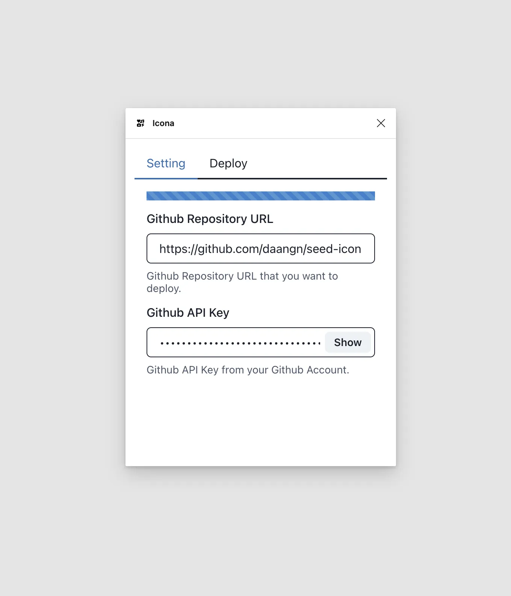
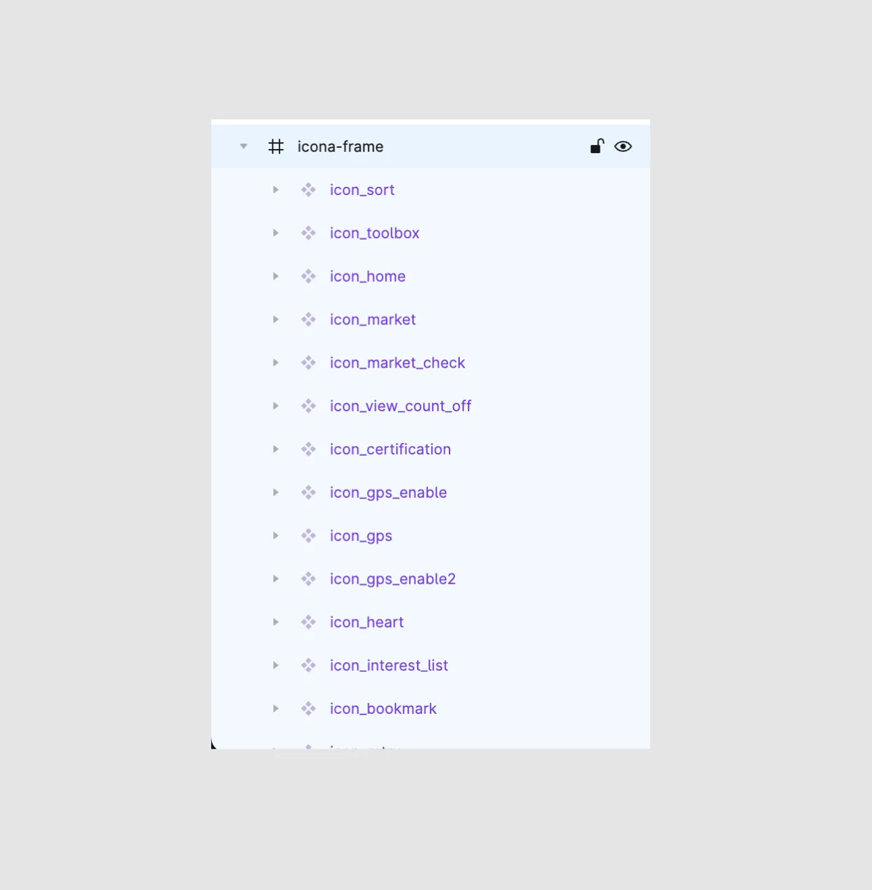
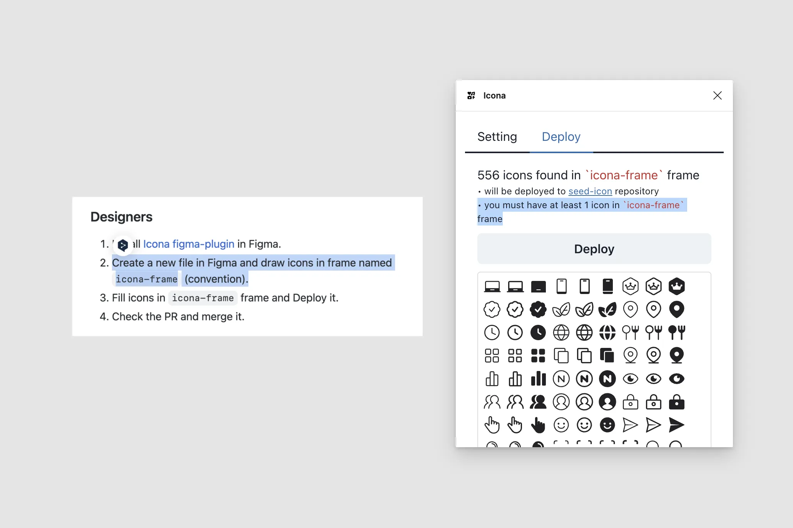
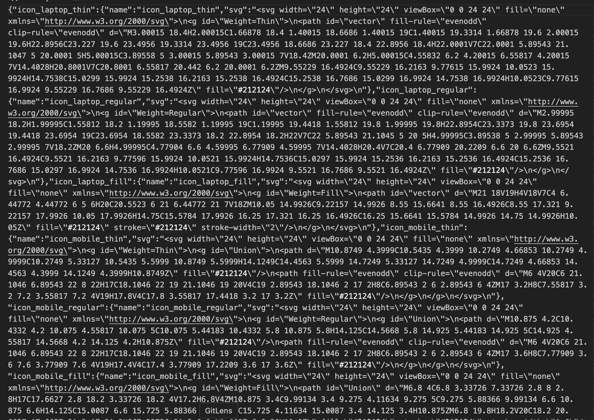
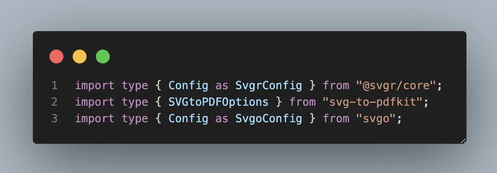
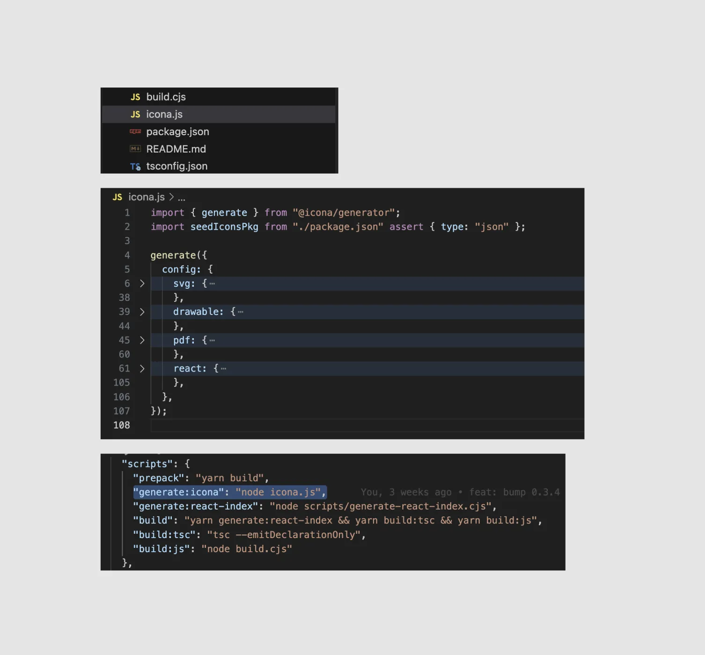
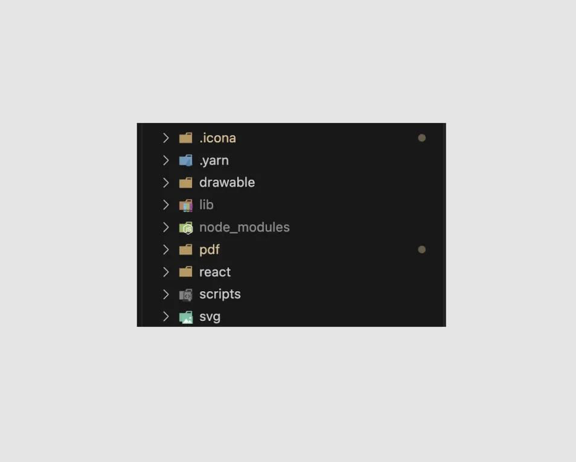

## Intro

Icons are used in a variety of places, such as websites and mobile applications.
You can use icons that are publicly available on the internet, or if you're a company of some size, have your own colors, or are specialized in a particular domain, you may need to manage your own icons.
applications that have their own colors or are domain-specific, you may need to manage your own icons.

What does it mean to manage your icons?

First of all, you probably have a designer who designs your icons for you, and once they're done, you need to push them to the development team.
Your designer may export the image as an SVG or PNG and hand it over to the developers.
Or, if you're using Figma or another prototyping tool, your developers can export the assets themselves.

If you have a lot of icons used on a single screen, this process can take longer than you think,
If an icon design is modified, you have to find all the screens that use that icon and apply it.

So usually you have to have a design systems team that manages these assets, or you have to have someone who takes ownership of the icons.
But a lot of companies don't have a design systems team, and even if they do, it's really not easy.

In this post, I'm going to share my experience as a Design System front-end developer at Carrot Market and how I manage icons.
and how to synchronize Figma and GitHub.

And furthermore, I don't want to make it an in-house tool, but open source it so that other teams or companies can use it.
so that other teams and companies can quickly deploy it to GitHub if they use Figma to manage their icons.
that other teams and companies can quickly deploy to GitHub if they manage icons with Figma.

<Callout type="warn" title="Won't do:">
  This article does not include a detailed implementation of the Figma plugin or
  the icon generator. icon generator.
</Callout>

<Callout type="info" title="Will do:">
  In this article, we'll discuss how the author solved the flow of deploying
  icons and how to ensure consistency. flows and how the author solved the
  problem of consistency.
</Callout>

## Goals

> What are we trying to accomplish?

I've outlined it above, but you may not have realized exactly what the problem is yet.
Let's get the requirements down on paper and move on. **This article assumes you're using Figma and GitHub:** 1.

- _We want to **easily** manage icon assets designed by a designer._
- _We want to make sure that the icons in Figma and the icons deployed to our development team always look the same._

These two requirements are just a broad overview of the problems we're trying to solve.
Let's write down some more detailed requirements.

- I'd like to be able to change an icon on Figma and push a PR to GitHub with the press of a button.
- Managing icons in too many places is distracting and unmanageable, so I'm sticking with Figma as the source of truth.
- We need assets in `drawable` (`XML`) format for Android and image assets in `PDF` format for iOS.
- Most of the web uses `React`, so it would be nice to have a React component library that uses `svg` in a ready-to-use form.

## Solve

> Let's develop to accomplish the above goal.

We wrote down 4 detailed requirements above.
I think we can divide them into two problems.

- _I want a designer on Figma to be able to change the icon and push the PR to GitHub with a single button._
- _Managing icons in too many places is distracting and unwieldy, so I'm sticking with Figma as the source of truth._

These two problems can be solved with a **Figma plugin**.
It takes the icons in Figma as the source of truth, recognizes the icons on the Figma page, and sends a PR blast to GitHub.
A plugin that recognizes icons on GitHub pages and sends PR to GitHub would be fine.

- _Android requires assets in `drawable` (`XML`) format and iOS requires image assets in `PDF` format._
- _We're mostly using `React` on the web, so it would be nice to have a React component library with a ready-to-use form of `svg`._

The above two issues were too problematic to solve with just the **Figma plugin**.
The Figma plugin reads all the icons that exist in Figma using the Github API,
convert them to various formats (XML, SVG, PDF,...), and create a PR for them was too much work.

If you have 500 icons, you have to do the following tasks

- Read 500 icons and extract them into `SVG`.
- Convert `SVG` to `PDF`, `XML`, `React Component`, etc.
- But even this conversion has a lot of options (and creating a UI that accepts these options would be quite difficult and annoying).
- Then we need to create a PR using the Github API and push all the created files (!).

But if the Github API that pushes the files says there are 500 icons in Figma.
that's 1500 in total, and if I push the SVGs to Github as well, that's 2000 files. It's a lot of work.

**I wanted to do this on the developer's local machine rather than in a Figma plugin**.

There are a number of libraries that can convert the assets received from Figma as SVG to PDF, XML, and React Component.
It's better to let the developer adjust the option values in the various libraries than to do it in the Figma plugin,
simply jump on the `TypeScript` system (more on that below).

In the Figma plugin, you only need to send a single file to GitHub (the file with the information about the SVGs),
GitHub just needs to generate the `PDF`, `XML`, and `React Component`s from that file.

## Wrap up

I've just described the steps I've taken to solve this problem, so let's take a moment to recap.

We need a Figma plugin and something that can generate assets locally for us as developers.
So I created it. a Figma plugin ([Icona](https://www.figma.com/community/plugin/1246320822364150095/Icona)) and a library to generate assets locally, called
([@icona/generator](https://github.com/daangn/icona/tree/main/packages/icona-generator)).

## Figma plugin: Icona

> **[Icona](https://www.figma.com/community/plugin/1246320822364150095/Icona): Icon at spanish**

So how should Icona be built? Since Icona was going to be developed as a public plugin rather than a carrot-only plugin
rather than a carrot-only plugin, there were a number of things we had to consider.

First, we needed to send APIs from the Figma plugin to GitHub.
We needed a UI to get a GitHub address and a GitHub API key.



Next, we needed a UI to export the icons to GitHub.
This was a bit tricky to design, because the main problem was where and how the icons were located.
In other words, in order to export the icons, I needed to know where they existed on the Figma page and in what form.

So I decided to make the `Icona` plugin conditional on placing the icons in a frame called `icona-frame`.
in a frame called `icona-frame`.



And you want to make sure that these conditions are well represented in the plugin. We've made sure that they're well documented in the
documentation, as well as in the plugin's internal UI.



And a UI for how well it recognized the icons in the `icona-frame`,
how many icons will be sent to GitHub in total.

When you press the `Deploy` button, the GitHub repository you entered in the `Settings` tab will contain one file (`icons`) with the information about your icons.
file (`icons.json`) containing information about your icons will be sent in a pull request.

That's what the `Icona` Figma plugin does for you.

## Asset Generate Library: @icona/generator

> [@icona/generator](https://github.com/daangn/icona/tree/main/packages/icona-generator): Icona asset generator

The single file that Figma drops off is not a special file,
It simply extracts all of the icons in the `icona-frame` as `svg`s,
object with the name and `svg`.

```json
{
  "icon_sort": {
    "name": "icon_sort",
    "svg": "<svg><path>...</path></svg>"
  },
  "icon_sort_light": {
    "name": "icon_sort_light",
    "svg": "<svg><path>...</path></svg>"
  }
}
```


The idea is to just minify and send the above shapes, and generate the various assets from the information above.
the idea is to let the developer do it locally.

The `@icona/generator` will read the received `icons.json` and extract it into a
SVG file, XML file, PDF file, and React Component file.

Since SVG is a universally used format, we can convert from SVG to other formats,
There are many libraries that do `svg-to-*`.
In `@icona/generator`, we use the following libraries in a single wrap.

- [svgo(svg optimization)](https://github.com/svg/svgo)
- [svg2vectordrawable(svg to xml)](https://github.com/Ashung/svg2vectordrawable)
- [PDFKit(pdf optimization)](https://pdfkit.org/docs/getting_started.html#document-structure)
- [SVG-to-PDFKit(svg to pdf)](https://github.com/alafr/SVG-to-PDFKit)
- [svgr(svg to react component)](https://react-svgr.com/)

The `@icona/generator` provides the `generate` function.
The `generate` function can have many different options, and I've included the ones I think users will need first.
We also expose the options provided by each conversion library so that developers can customize them.

```ts
import { generate } from "@icona/generator";

generate({
  config: {
    svg: {
      active: true, // you can disable svg generator if you set false
      path: "svg", // will generate svg files in svg folder
      svgoConfig: {},
    },
    drawable: {
      active: true, // you can disable drawable generator if you set false
      path: "drawable", // will generate xml files in drawable folder
      svg2vectordrawableConfig: {},
      defaultColor: "#000000", // default color for android vector drawable
    },
    pdf: {
      active: true, // you can disable pdf generator if you set false
      path: "pdf", // will generate pdf files in pdf folder
      pdfKitConfig: {},
      svgToPdfOptions: {},
    },
    react: {
      active: true, // you can disable react generator if you set false
      path: "react", // will generate react component files in react folder
      svgrConfig: {},
    },
  },
});
```

The folder location where each asset will be created,
active, which determines whether each asset should be created or not,
and the option to include the options from each conversion library as is.
These options carry over the option types from each conversion library so that the user experience doesn't suffer.



And [seed-icon](https://github.com/daangn/seed-icon), which currently uses `icona`, uses
I'm using it like this Create an `icona.js` file and use the `generate` function in it to add the options you want
with the `generate` function.

Then, in `scripts` of `package.json`, add the `generate:icona` command to the previously created
In `scripts` of `package.json`, enter `node icona.js`, which is the command to run `icona.js`.



If you run `yarn generate:icona` or `npm run generate:icona`, it will create assets in a folder structure like this
assets in the following folder structure.



The generated assets are now available to native developers via GitHub raw URLs,
web developers just need to build the React component and deploy it with NPM to make it available to people.
(This would not be the role of the generator, but rather the developer managing the assets).

To take this a bit further, a designer presses a button in Figma and a PR goes up, and the `icons.json` file goes up.
But the developer has to do the `generate` command, which we can also skip.
We have a very good CI tool called `github actions`.

```yml
# generate svg github action
on:
  Push:
    branches:
      - "icona-update-**" # When a PR is created in the Icona plugin, it has a convention on that branch.
    paths:
      - ".icona/icons.json" # You can make it run only when icons.json is changed.

name: Generate SVG files from icons.json

jobs:
  deploy:
    name: Generate SVG files from icons.json
    runs-on: ubuntu-latest

    steps:
      - uses: actions/checkout@v3
      - uses: actions/setup-node@v3
        with:
          node-version: 18

      # This is an example of a package using yarn.
      # Include a command to install the dependencies of your package manager.
      - name: Install Packages
        run: |
          yarn install

      # This is the generate process.
      # Nothing special, just run the `generate` script and commit as a user with a
      # and commit as a user with a "Github Action".
      - name: Generate Stuffs
        run: |
          yarn generate:icona
          git config --global user.email "41898282+github-actions[bot]@users.noreply.github.com"
          git config --global user.name "GitHub Action"
          git add .
          git commit -m "[Icona] Generate Files"
          git push
```

If we were to create the above `workflows`, we'd hit the `Deploy` button from Figma to the Icona plugin, and then click the
Once the PR is created, the CI will automatically spin up and upload all the updated assets.

## Still missing features

As a solo developer and with a small number of use cases, there are probably a lot of missing features and clunky things.

**There is no functionality for `name format`.**

Currently, it subtracts the svg name from the node name of the icon.
There is no UI or functionality to allow the user to rename each icon or specify a name format.

**There are no features such as versioning or releases.**

When a designer works on an icon in Figma and pushes it to GitHub.
There are no features like patch notes or release notes or versions.

## Open Source

> Why was it `icona` and not just `seed-icon`?

Actually, the `icona` plugin and `@icona/generator` were developed as a carrot, not a stick.
I was able to develop them without releasing them, so I didn't think about how other people would use them.
It wouldn't have taken as long if they were carrot-only plugins.

But that's not how I wanted to develop it. Creating a tool or something that's only going to be used in certain situations is not the way to go.
is easier than developing with the possibility of everyone using it. So, I developed it with the following idea in mind.

- I create an icon platform called `Icona` and pretend to be a user of `Icona`.
- Icona bridges the icon management gap between Figma and GitHub.
- Carrot's icon management repository, `seed-icon`, is created through `Icona`.
- (The same goes for `@icona/generator`).

But as I went through this process, I realized, what do I need to consider when it comes to multiple people using it,
and thinking about a little bit of a broader situation instead of a specific situation, I think it really broadened my mind and broadened my horizons.

Instead of just thinking about my own product, I was able to take a step back and think about it from a
and develop plugins and libraries from a third-party perspective, and then become a user myself and use those plugins and libraries
I used those plugins and libraries to manage my icons.


It's been out for about 16 days now (as of 7/16/2023), and about 650 people have `tried it out`.
I've gotten about 6 hearts, which doesn't really matter, but I just wanted to show it off.
