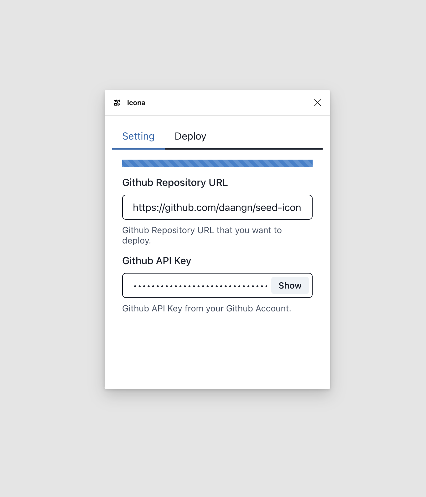
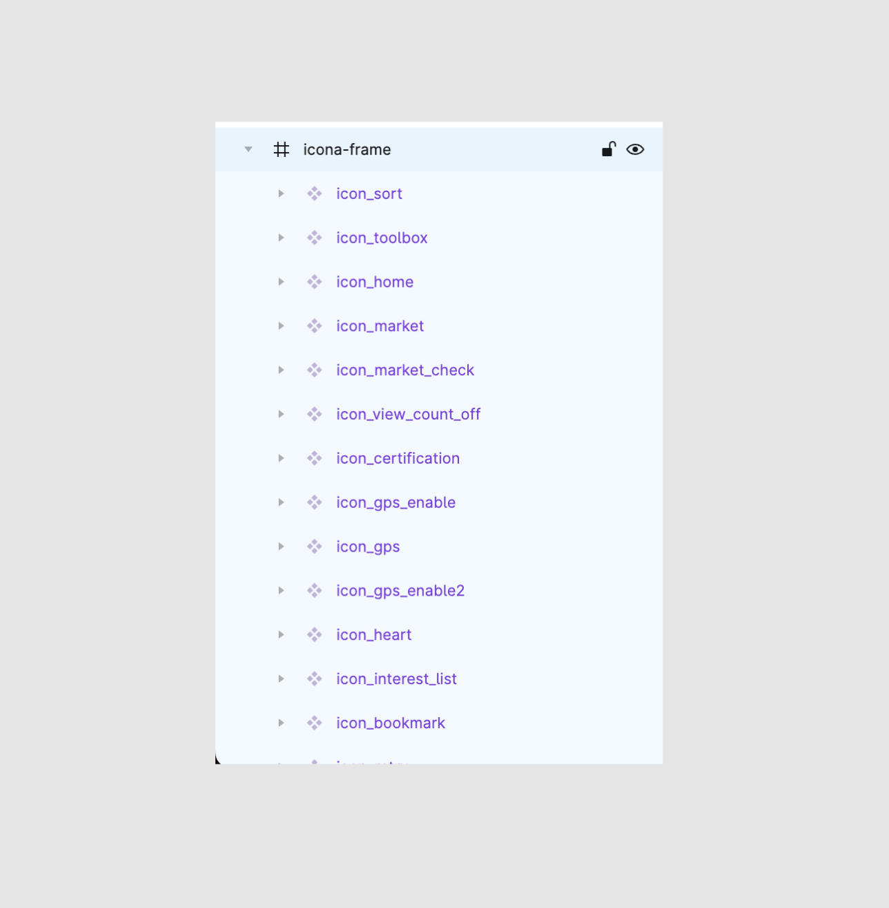
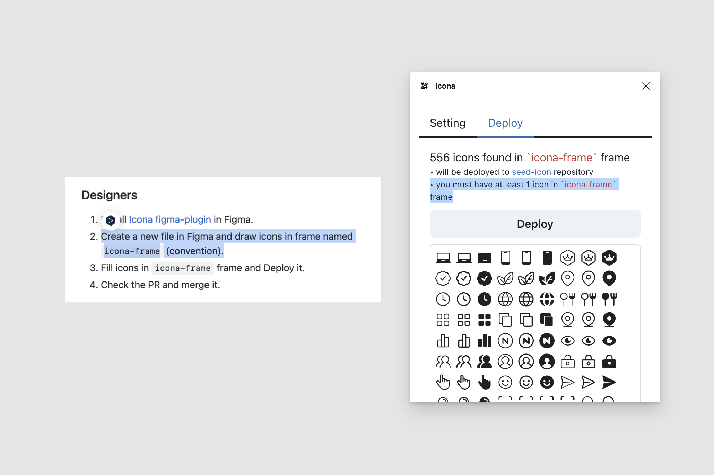
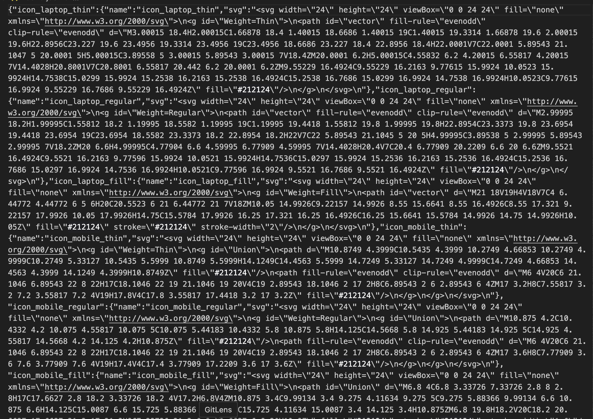
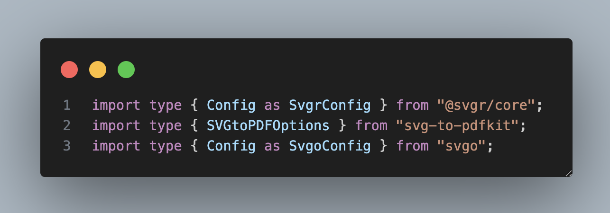
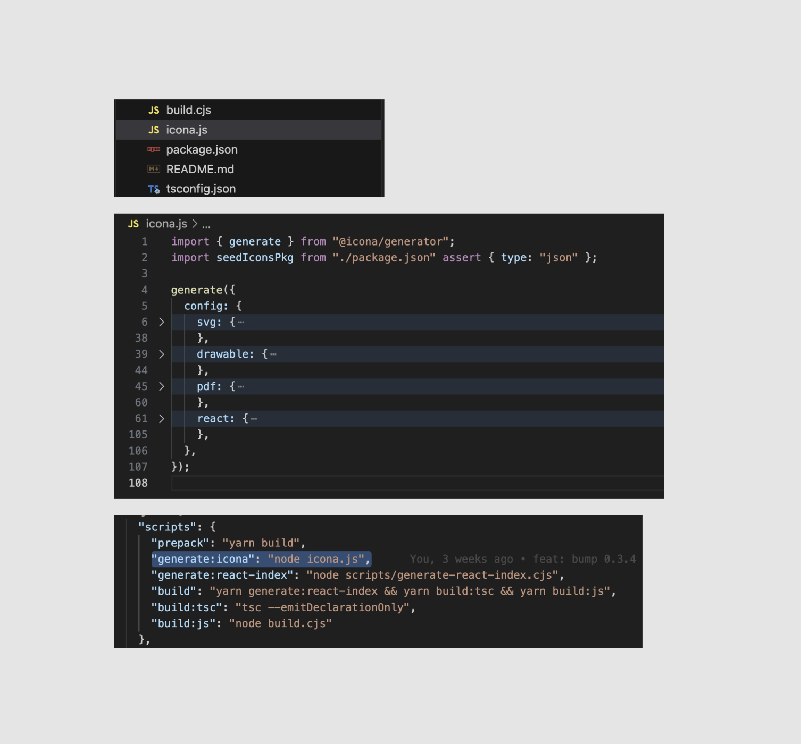
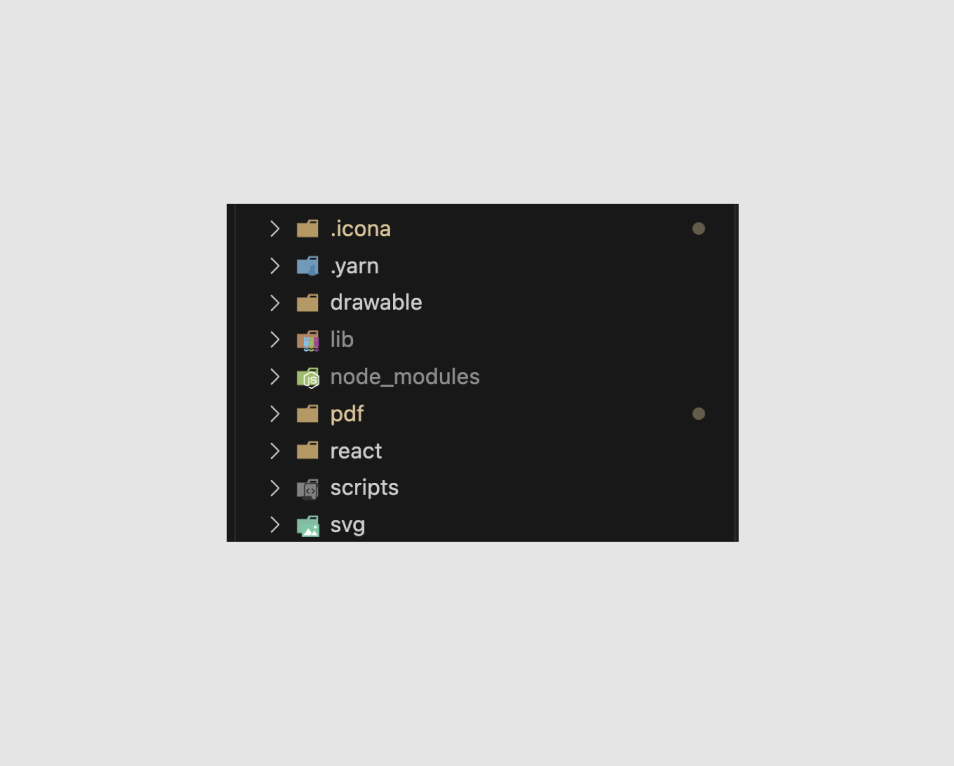

## 들어가며

웹 사이트나 모바일 애플리케이션 등 다양한 곳에서 아이콘이 사용됩니다.
보통 인터넷에 공개되어 있는 아이콘을 사용할 수도 있고, 어느 정도 규모가 있는 회사나
자신만의 색을 가지거나 혹은 특정 도메인에 특화된 애플리케이션이라면 아이콘을 직접 관리해야 할 수도 있습니다.

아이콘을 관리한다는 것은 무엇일까요?

우선 아이콘을 디자인해 주시는 디자이너가 계실 겁니다. 디자인이 끝나면 개발단에 적용해야 합니다.
디자이너분이 svg 혹은 png로 이미지를 내보내서 개발자분께 전달할 수도 있습니다.
혹은 피그마나 다른 프로토타입 툴을 사용한다면 개발자가 직접 에셋을 export 해서 사용할 수도 있습니다.

한 화면에서 사용되는 아이콘이 많다면 이런 과정이 생각보다 시간이 오래 걸리고,
아이콘 디자인이 수정되기라도 하면 해당 아이콘을 사용하는 모든 화면을 찾아 적용해야 합니다.

그래서 보통은 디자인시스템팀이 있어서 이런 에셋을 관리한다던가, 혹은 아이콘을 관리하는 오너십을 가진 사람이 있어야 합니다.
하지만 많은 회사가 디자인시스템팀을 가진 것은 아니고, 누군가가 관리를 한다 해도 정말 쉽지 않은 일입니다.

이 글은 제가 당근마켓에서 디자인시스템 프론트엔드 개발자로 있으면서 어떤 식으로 아이콘을 관리하는지
어떤 식으로 피그마와 깃허브의 Sync를 맞추는지에 대한 글입니다.

그리고 더 나아가 사내에서만 쓰이는 툴로 만든 것이 아닌, 오픈소스로 공개해서
다른 팀이나 회사에서 피그마로 아이콘을 관리한다면 빠르게 깃허브로 배포할 수 있는
피그마를 만든 이야기까지 포함합니다.

<Callout type="warn" title="Won't do:">
  이 글에서는 피그마 플러그인에 대한 자세한 구현 혹은 아이콘 제네레이터에 대한
  자세한 구현은 포함하지 않습니다.
</Callout>

<Callout type="info" title="Will do:">
  이 글에서는 어떤 플로우로 아이콘을 배포하고, 일관성을 지킬 수 있는지에 대한
  플로우를 글쓴이가 해결한 방식을 설명합니다.
</Callout>

## 목표

> 우리가 이루고자 하는 것은 무엇일까요?

위에서 간략하게나마 설명을 했지만, 아직 문제가 무엇인지 정확하게 인식이 잘 안 됐을 수도 있습니다.
요기서 요구사항을 잘 정리하고 넘어가 보겠습니다. **이 글에서는 피그마와 깃허브를 사용한다고 가정합니다.**

- _우리는 디자이너분이 디자인해 주신 아이콘 에셋들을 **쉽게** 관리하고자 합니다._
- _피그마의 아이콘과 개발단에 배포되는 아이콘들은 항상 **동일하게** 유지되어야 합니다._

위 두 개의 요구사항은 우리가 이루고자 하는 문제들을 가볍고 넓게 얘기해 봤습니다.
그럼 자세한 요구사항도 몇 개 적어보겠습니다.

- _피그마에서 디자이너분이 아이콘을 변경하고 버튼하나만 누르면 깃허브로 PR이 올라가는 형식이었으면 좋겠습니다._
- _아이콘들을 너무 많은 곳에서 관리하면 집중도 분산되고 관리가 힘드므로 피그마를 진실의 원천으로 삼습니다._
- _안드로이드에는 `drawable`(`XML`) 형식의 에셋이, iOS에는 `PDF` 형식의 이미지 에셋이 필요합니다._
- _웹에서는 대부분 `React`를 사용하므로 `svg`를 바로 사용할 수 있는 형태인 리액트 컴포넌트 라이브러리가 있으면 좋겠습니다._

## 해결하기

> 위 목표를 이루기 위해서 개발을 해봅시다.

우리는 위에서 4개의 자세한 요구사항을 적어봤습니다.
크게 두 개의 문제로 나누어서 해결할 수 있을 것 같습니다.

- _피그마에서 디자이너분이 아이콘을 변경하고 버튼하나만 누르면 깃허브로 PR이 올라가는 형식이었으면 좋겠습니다._
- _아이콘들을 너무 많은 곳에서 관리하면 집중도 분산되고 관리가 힘드므로 피그마를 진실의 원천으로 삼습니다._

이 두 개의 문제는 **피그마 플러그인**으로 해결할 수 있습니다.
피그마에 있는 아이콘들을 진실의 원천으로 삼고, 피그마 페이지에 있는 아이콘들을 인식해서
깃허브로 PR을 날려주는 플러그인 정도면 괜찮을 것 같습니다.

- _안드로이드에는 `drawable`(`XML`) 형식의 에셋이, iOS에는 `PDF` 형식의 이미지 에셋이 필요합니다._
- _웹에서는 대부분 `React`를 사용하므로 `svg`를 바로 사용할 수 있는 형태인 리액트 컴포넌트 라이브러리가 있으면 좋겠습니다._

위 두 가지 문제는 **피그마 플러그인**만으로 해결하기엔 문제가 있었습니다.
피그마 플러그인에서 Github API로 피그마에 존재하는 모든 아이콘을 읽고,
다양한 형태로(XML, SVG, PDF,...) 만들어서 PR을 만들어주는 것은 너무 큰 작업이었습니다.

만약 500개의 아이콘이 있으면 아래와 같은 작업들을 해야 합니다.

- 500개의 아이콘을 읽어 `SVG`로 추출
- `SVG`를 `PDF`, `XML`, `React Component` 등의 형태로 변환하는 작업
- 하지만 이 변환 작업에서도 여러 가지 옵션이 들어갑니다. (이 옵션을 받는 UI를 만드는 것도 상당히 어렵고 귀찮은 작업이겠네요)
- 그리고 Github API를 이용해서 PR을 만들고 만들어진 모든 파일들(!)을 push를 해야 합니다.

그런데 Github API에 file을 올리는 API가 500개의 아이콘이 피그마에 있다고 하면
총 1500개, SVG까지 깃허브에 같이 올린다고 하면 2000개의 파일이 되겠네요. 너무 큰 작업입니다.

**저는 이 작업을 피그마 플러그인에서 하기보다 개발자의 로컬 컴퓨터에서 하고 싶었습니다.**

피그마에서 `SVG` 형태로 받은 에셋을 `PDF`, `XML`, `React Component`로 변환해 주는 다양한 라이브러리들이 있습니다.
다양한 라이브러리에서 옵션 값들을 개발자가 직접 조정가능하게 하는 것을 피그마 플러그인에서 해당 작업을 하는 것보단,
그냥 단순히 `TypeScript` 시스템에 올라타기만 하면 됩니다. (자세한 내용은 아래에서 설명하겠습니다.)

피그마 플러그인에서는 깃허브로 단 하나의 파일(svg들의 정보가 담긴 파일)을 보내기만 하고,
깃허브에서는 해당 파일을 통해서 `PDF`, `XML`, `React Component`들을 생성해주기만 하면 됩니다.

## 잠시 정리

지금까지 제가 해당 문제를 해결하면서 겪어왔던 과정들을 그냥 서술했는데요, 잠시 정리하고 갑시다.

우리는 피그마 플러그인과 개발자 로컬에서 에셋들을 생성해 줄 수 있는 무언가가 필요합니다.
그래서 제가 만들었습니다. 피그마 플러그인([Icona](https://www.figma.com/community/plugin/1246320822364150095/Icona))와 로컬에서 에셋을 생성해 주는 라이브러리인
([@icona/generator](https://github.com/daangn/icona/tree/main/packages/icona-generator))를요.

## 피그마 플러그인: Icona

> **[Icona](https://www.figma.com/community/plugin/1246320822364150095/Icona): Icon at spanish**

그럼 Icona는 어떤 식으로 만들어야 할까요? Icona는 당근 한정 플러그인이 아닌 공개 플러그인으로
개발할 예정이었기 때문에 여러 가지가 고려되어야 했습니다.

우선 피그마 플러그인에서 깃허브로 API를 보내야 하기 때문에
깃허브 주소와 깃허브 API Key를 받는 UI가 필요했습니다.



그다음으로는 아이콘을 깃허브로 내보낼 UI가 필요했습니다.
요기서 설계가 살짝 어려웠는데요, 제일 문제였던 것은 **아이콘이 어디에, 어떻게 있는가** 였습니다.
그러니까, 아이콘을 내보내기 위해서는 아이콘이 피그마 페이지에서 어디에 존재하는지 그리고 어떤 형태로 있는지를 알아야 했습니다.

저는 그래서 `Icona` 플러그인을 사용하려면 `icona-frame`이라는 프레임 안에
아이콘들을 위치시키는 것을 조건으로 만들었습니다.



그리고 이런 조건들을 플러그인에 잘 표시해 줘야겠죠? 해당 조건에 대한 것은
문서에도 잘 명시해 두고, 플러그인 내부 UI에도 표시를 해뒀습니다.



그리고 `icona-frame` 안에 있는 아이콘을 잘 인식했는지에 대한 UI도 있고,
총 몇 개의 아이콘이 깃허브로 보내질 건지에 대한 UI도 포함합니다.

`Deploy` 버튼을 누르면 `Setting` 탭에 입력한 깃허브 레파지토리에 해당
아이콘에 대한 정보들을 담은 파일 하나(`icons.json`)가 Pull Request에 담겨 날라 가게 됩니다.

요기까지가 `Icona` 피그마 플러그인이 해주는 역할입니다.

## 에셋 제네레이트 라이브러리: @icona/generator

> [@icona/generator](https://github.com/daangn/icona/tree/main/packages/icona-generator): Icona asset generator

피그마에서 내려주는 단 하나의 파일은 특별한 파일이 아니라,
단순히 `icona-frame` 안에 있는 아이콘들을 전부 `svg` 형태로 추출하고,
이름과 `svg`를 담은 객체 형태입니다.

```json
{
  "icon_sort": {
    "name": "icon_sort",
    "svg": "<svg><path>...</path></svg>"
  },
  "icon_sort_light": {
    "name": "icon_sort_light",
    "svg": "<svg><path>...</path></svg>"
  }
}
```



위 형태를 그냥 minify 해서 보내고, 위의 정보들을 통해서 다양한 에셋들을 생성하는 건
개발자 로컬에서 하도록 하는 아이디어입니다.

`@icona/generator`는 이렇게 받아온 `icons.json`을 읽어
SVG 파일, XML 파일, PDF 파일, React Component 파일로 추출해 줍니다.

svg는 범용적으로 사용되는 포맷이라서 svg에서 다른 포맷으로,
즉 `svg-to-*`을 해주는 다양한 라이브러리들이 존재합니다.
`@icona/generator`에서는 아래의 라이브러리를 한 번 감싸서 사용합니다.

- [svgo(svg optimization)](https://github.com/svg/svgo)
- [svg2vectordrawable(svg to xml)](https://github.com/Ashung/svg2vectordrawable)
- [PDFKit(pdf optimization)](https://pdfkit.org/docs/getting_started.html#document-structure)
- [SVG-to-PDFKit(svg to pdf)](https://github.com/alafr/SVG-to-PDFKit)
- [svgr(svg to react component)](https://react-svgr.com/)

`@icona/generator`는 `generate` 함수를 제공합니다.
`generate` 함수에는 다양한 옵션들을 넣을 수 있고, 유저들이 필요할 것 같은 옵션들을 우선 넣어놨습니다.
그리고 각 변환 라이브러리에서 제공해 주는 옵션들도 그대로 드러내서 개발자가 직접 조절할 수 있게 해 줍니다.

```ts
import { generate } from "@icona/generator";

generate({
  config: {
    svg: {
      active: true, // you can disable svg generator if you set false
      path: "svg", // will generate svg files in svg folder
      svgoConfig: {},
    },
    drawable: {
      active: true, // you can disable drawable generator if you set false
      path: "drawable", // will generate xml files in drawable folder
      svg2vectordrawableConfig: {},
      defaultColor: "#000000", // default color for android vector drawable
    },
    pdf: {
      active: true, // you can disable pdf generator if you set false
      path: "pdf", // will generate pdf files in pdf folder
      pdfKitConfig: {},
      svgToPdfOptions: {},
    },
    react: {
      active: true, // you can disable react generator if you set false
      path: "react", // will generate react component files in react folder
      svgrConfig: {},
    },
  },
});
```

각 에셋이 생성될 폴더 위치,
각 에셋들이 생성될지 말지 결정하는 active,
그리고 각 변환 라이브러리의 옵션을 그대로 넣을 수 있는 옵션도 있습니다.
해당 옵션들은 각 변환 라이브러리의 옵션 타입을 그대로 전달하기 때문에 유저 경험이 떨어지지 않게 만들었습니다.



그리고 현재 `icona`를 사용하는 [seed-icon](https://github.com/daangn/seed-icon)에서는
아래와 같이 사용하고 있습니다. `icona.js` 파일을 만들고 거기서 `generate` 함수로
원하는 옵션을 넣어줍니다.

그리고 `package.json`의 `scripts`에 `generate:icona` 명령어로 앞에 만든
`icona.js`을 실행시켜 주는 명령어인 `node icona.js`을 입력해 주면 끝입니다.



그렇게 `yarn generate:icona` 혹은 `npm run generate:icona`으로 실행시키면 아래와 같은 폴더구조로
에셋들이 생성이 될 겁니다.



이제 생성된 에셋들을 네이티브 개발자분들은 깃허브 Raw Url을 통해서 사용할 수 있고,
웹 개발자분들은 리액트 컴포넌트를 빌드하는 것과 NPM 배포만 해서 사람들이 바로 사용할 수 있게 하면 됩니다.
(이건 generator의 역할은 아니고 에셋 관리를 하는 개발자의 몫이겠죠.)

조금 더 나아가서 디자이너분이 피그마에서 버튼을 눌러 PR이 올라오면 `icons.json` 파일이 올라옵니다.
근데 개발자가 `generate` 하는 명령어를 일일이 수행해줘야 합니다. 이 과정도 생략할 수 있습니다.
우리에겐 `github actions`라는 아주 좋은 CI 도구가 있죠.

```yml
# generate svg github action
on:
  push:
    branches:
      - "icona-update-**" # Icona 플러그인에서 PR이 생성되면 해당 브랜치의 컨벤션을 가집니다.
    paths:
      - ".icona/icons.json" # icons.json이 변경됐을 때만 실행하도록 할 수 있습니다.

name: Generate SVG files from icons.json

jobs:
  deploy:
    name: Generate SVG files from icons.json
    runs-on: ubuntu-latest

    steps:
      - uses: actions/checkout@v3
      - uses: actions/setup-node@v3
        with:
          node-version: 18

      # 이것은 yarn을 사용하는 패키지의 예시입니다.
      # 자신이 사용하는 패키지 매니저의 디펜던시 설치하는 명령어를 넣어줍니다.
      - name: Install Packages
        run: |
          yarn install

      # 생성하는 과정입니다.
      # 특별한 것은 없고, `generate` 스크립트를 실행하고
      # "Github Action"으로 된 유저로 commit 하는 스크립트입니다.
      - name: Generate Stuffs
        run: |
          yarn generate:icona
          git config --global user.email "41898282+github-actions[bot]@users.noreply.github.com"
          git config --global user.name "GitHub Action"
          git add .
          git commit -m "[Icona] Generate Files"
          git push
```

위 `workflows`를 작성한다면 피그마에서 Icona 플러그인으로 `Deploy` 버튼을 누르고
PR이 생성되면 자동적으로 해당 CI가 돌아서 업데이트된 에셋들이 전부 올라올 겁니다.

## 아직 부족한 기능

혼자 개발하고, 사용 사례가 적다 보니 빠진 부분도 많고 어설픈 부분도 많을 겁니다.

**`name format`에 대한 기능이 없습니다.**

현재는 아이콘의 Node(피그마의 요소 단위) 이름으로 svg 이름을 빼줍니다.
유저가 아이콘 하나하나 이름을 변경한다던가, 이름 format을 지정할 수 있는 UI나 기능이 없습니다.

**버저닝 혹은 릴리즈와 같은 기능이 없습니다.**

피그마에서 디자이너분이 아이콘 작업을 하고 깃허브로 배포한다고 했을 때
패치 노트 혹은 릴리즈 노트나 버전과 같은 기능이 없습니다.

## 오픈소스로

> 단순히 `seed-icon`이 아니라 `icona` 였던 이유

사실 `icona` 플러그인과 `@icona/generator`는 공개하지 않고 당근에서만
사용하는 느낌으로 개발할 수 있었습니다. 그러니까 다른 사람이 어떻게 사용할지는 생각하진 않고
당근에서만 한정해서 쓰이는 플러그인이면 시간이 오래 걸리진 않았을 겁니다.

하지만 그렇게 개발하고 싶진 않았습니다. 특정 상황에서만 사용되는 도구나 무언가를 만드는 것은
모두가 사용 가능성을 염두하고 개발하는 것보다는 쉽습니다. 그래서 저는 아래와 같은 생각을 가지고 개발을 했습니다.

- 나는 `Icona`라는 아이콘 플랫폼을 만들고, `Icona`의 사용자가 된 것처럼 행동한다.
- `Icona`는 피그마와 깃허브 사이의 아이콘 관리에 있어서 간극을 좁혀주는 역할을 한다.
- 당근의 아이콘 관리 레파지토리인 `seed-icon`는 `Icona`을 통해서 만든다.
- (`@icona/generator`도 같은 맥락입니다.)

하지만 저는 이 과정을 거치면서 여러 사람이 사용할 때는 무엇을 고려해야 하는지,
특정 상황이 아니라 조금 더 넓은 상황을 고려하며 만들다 보니 생각도 넓어지고, 시야도 넓어졌던 것 같습니다.

그냥 단순히 내 프로덕트만 생각하는 게 아니라 한 발짝 물러서서
3자의 입장으로 플러그인과 라이브러리를 개발하고 제가 직접 사용자가 되어서
해당 플러그인과 라이브러리를 사용해 아이콘을 관리했습니다.


현재 배포한 지 16일 정도 됐고(2023년 7월 16일 기준), 약 650명 `try it out` 해주셨고
6개 정도의 하트를 받았네요. 사실 이건 중요한 건 아닌데 그냥 자랑하고 싶어서 올려봤습니다.
