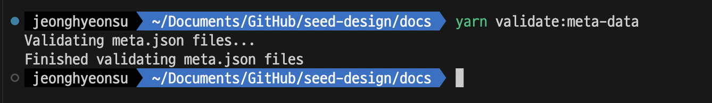
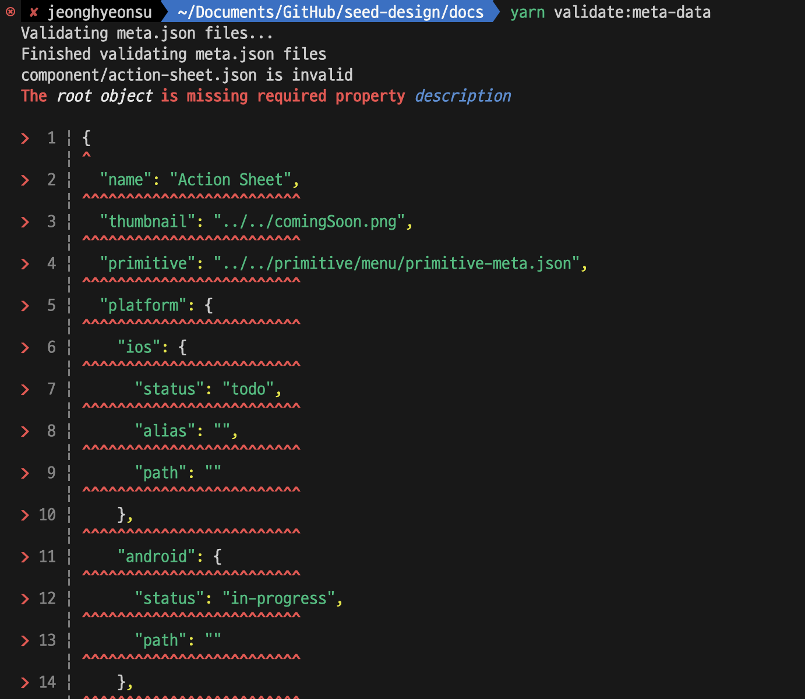
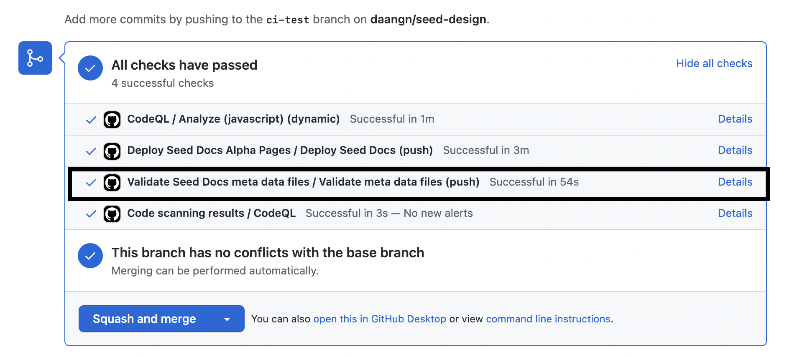
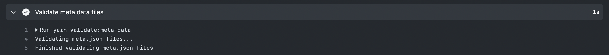
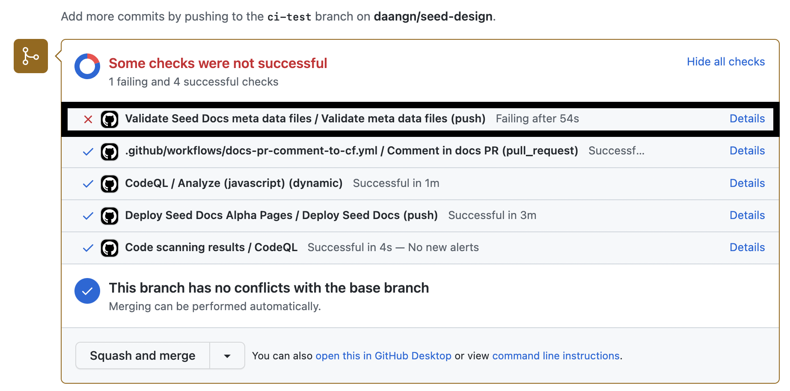
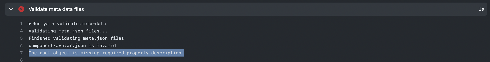

## TL;DR

This article is for

- Want to easily manage metadata with a Source of Truth.
- Want to automate the execution and validation of scripts on demand
- Want to know how to validate JSON data?

to validate JSON data.

This article will also help you

- You'll learn how to validate JSON files using AJV.
- You will learn how to automate the validation script using Github Actions.

## Jump in

First of all, what is metadata?
\*\*Metadata is "data that serves some purpose".
A classic example of metadata that we often use is `package.json`.
It contains the name, version, description, author, dependency libraries, and other data that is essential to the project.

In my project, [Seed Design] (https://github.com/daangn/seed-design) repository, we have a `docs` folder that contains the documentation project.
`docs` folder that contains the documentation project. This is the documentation project for the design system. Let's take the `Avatar` component as an example.

You create separate mdx documents to manage style information, usage information, overview information, etc. for `Avatar`.
Let's say you're using a `coverImage` in each of these documents, then you'd have `overview.mdx`, `style.mdx`, and `usage.mdx` all looking like this.

```mdx,2-2
{/* We're calling coverImage directly */}

```

```sh,4-6
# AS-IS
📦avatar
 ┣ 📜coverImage.png
 ┣ 📜overview.mdx # coverImage in use
 ┣ 📜style.mdx # coverImage in use
 ┗ 📜usage.mdx # coverImage in use
```

But let's say the specification for coverImage changes and the extension changes from `png` to `jpeg`.
We'd have to move three files around to fix the extension of coverImage.
But if this happens a lot, we could end up spending all day just fixing data.

So we set aside a metadata file.
Like this

```sh,4-4
# TO-BE
📦avatar
 ┣ 📜coverImage.png
 ┣ 📜component-meta.json # Metadata file
 ┣ 📜overview.mdx
 ┣ 📜style.mdx
 ┗ 📜usage.mdx
```

And in that JSON file, it should look like this.

- [Example of a metadata JSON file for an Avatar component](https://github.com/daangn/seed-design/blob/main/docs/content/component/avatar/component-meta.json)

```json,2-2
{
  "coverImage": "./coverImage.jpeg"
}
```

Rather than directly importing and using `coverImage` from the three files `overview.mdx`, `style.mdx`, and `usage.mdx`.
We want the three files to look at the metadata JSON file and display information based on that data.
The idea is to put the metadata JSON file as the Source of Truth.

What does this do for you?

- It favors change.
- It makes it easier to communicate and more productive.
- It ensures that data is described consistently, making it easier to interpret and manage.
- Quality goes up because data becomes more accurate, complete, and relevant.

But as with everything, there are downsides.

- Because metadata is human-generated data, you need someone to manage it.
- You need to make sure it's always up to date.
- You need to have a good discussion with your team about what data to include. (Matching costs)

Most of the disadvantages are **management costs**.
In this article, we'll work on keeping the management costs as low as possible.

What if the metadata JSON file contains the wrong values?
A design system consists of dozens of components. It's impossible to check the metadata of all these components
metadata for all of them manually is impossible.

\*\*You can use a JSON Schema Validator (AJV) to validate the metadata when the metadata JSON file is modified.
to validate the metadata and automate the logic behind that validation so that we can automatically check it before it becomes merged.

## Create a custom JSON schema with AJV and write a validation script

[AJV](https://ajv.js.org/) is a `JSON schema validator`.
It allows you to declaratively write down a data type for JSON and validate that a JSON file conforms to that data type.

Let's take a quick look at an example of using AJV.

```js
const Ajv = require("ajv");

// Declare a JSON schema
const schema = {
  type: "object",
  properties: {
    name: { type: "string" },
    age: { type: "number" },
  },
  required: ["name", "age"],
};

// Create a validator instance using the schema.
const ajv = new Ajv();
const validate = ajv.compile(schema);

// Validate some JSON data against the schema.
const data = {
  name: "Alice",
  age: 30,
};
const isValid = validate(data);

if (isValid) {
  console.log("Data is valid!");
} else {
  console.log("Data is invalid:");
  console.log(validate.errors);
}
```

That's it, here's what we need to do.

- Declare the JSON schema
- Create a script to validate it

### Declaring the JSON schema

I wrote a separate file to declare the schema.
The file is a bit long, but you don't need to read it all.
The important thing about the code below is that we can validate all the different patterns.
\*\*I can check for specific characters through regular expressions, and I can check if they are required or optional.
You can also decide if only certain properties are allowed, or if additional properties are allowed.

See the [official documentation](https://ajv.js.org/json-schema.html)

```js
const statusSchema = {
  type: "string",
  pattern: "^(todo|in-progress|done)$",
};

const stringSchema = {
  type: "string",
};

const storybookSchema = {
  type: "object",
  properties: {
    path: stringSchema,
    height: { type: ["string"] },
  },
  required: ["path"],
  additionalProperties: false,
};

const mdxSchema = {
  type: "string",
  pattern: "^.*.mdx$",
};

const jsonSchema = {
  type: "string",
  pattern: "^.*.json$",
};

const pngSchema = {
  type: "string",
  pattern: "^.*.png$",
};

const platformSchema = {
  type: "object",
  properties: {
    ios: {
      type: "object",
      properties: {
        status: statusSchema,
        alias: { type: "string" },
        path: { type: "string" },
      },
      required: ["status", "alias", "path"],
      additionalProperties: false,
    },
    android: {
      type: "object",
      properties: {
        status: statusSchema,
        path: { type: "string" },
      },
      required: ["status", "path"],
      additionalProperties: false,
    },
    react: {
      type: "object",
      properties: {
        status: statusSchema,
        path: { type: "string" },
      },
      required: ["status", "path"],
      additionalProperties: false,
    },
    figma: {
      type: "object",
      properties: {
        status: statusSchema,
        path: { type: "string" },
      },
      required: ["status", "path"],
      additionalProperties: false,
    },
    docs: {
      type: "object",
      properties: {
        overview: {
          type: "object",
          properties: {
            status: statusSchema,
            storybook: storybookSchema,
            mdx: mdxSchema,
          },
          additionalProperties: False,
        },
        usage: {
          type: "object",
          properties: {
            status: statusSchema,
            mdx: mdxSchema,
          },
          additionalProperties: False,
        },
        style: {
          type: "object",
          properties: {
            status: statusSchema,
            mdx: mdxSchema,
            additionalProperties: False,
          },
        },
      },
      required: ["usage", "style", "overview"],
      additionalProperties: true,
    },
  },
  required: ["ios", "android", "react", "figma", "docs"],
  additionalProperties: false,
};

export const componentMetaSchema = {
  type: "object",
  properties: {
    name: stringSchema,
    description: stringSchema,
    thumbnail: pngSchema,
    primitive: jsonSchema,
    group: stringSchema,
    platform: platformSchema,
  },
  required: ["name", "description", "thumbnail", "platform"],
};

export const primitiveMetaSchema = {
  type: "object",
  properties: {
    name: stringSchema,
    description: stringSchema,
    thumbnail: pngSchema,
    primitivie: mdxSchema,
  },
  required: ["name", "description", "thumbnail", "primitive"],
};
```

### Create a validation script

I need a script that will validate through that Schema. My requirements were as follows

```sh,4-4&6-6&8-8&12-12&14-14&16-16
📦content
 ┣ 📂component
 ┃ ┣ 📂action-sheet
 ┃ ┃ ┣ 📜component-meta.json
 ┃ ┣ 📂actionable-callout
 ┃ ┃ ┣ 📜component-meta.json
 ┃ ┣ 📂alert-dialog
 ┃ ┃ ┣ 📜component-meta.json
 ┃ ┃ ...
 ┣ 📂primitive
 ┃ ┣ 📂avatar
 ┃ ┃ ┣ 📜primitive-meta.json
 ┃ ┣ 📂button
 ┃ ┃ ┣ 📜primitive-meta.json
 ┃ ┣ 📂checkbox
 ┃ ┃ ┣ 📜primitive-meta.json
 ┃ ┣ ...
```

- Validate component schema by reading only the `component-meta.json` file inside all folders in the `./content/component` folder at root
- Validate the primitive schema by reading only the `primitive-meta.json` file in all folders in the `./content/primitive` folder in the root.
- If the validation fails, **print out the name of the failed file and why it failed**.

In code, this looks like this

```js
import Ajv from "ajv";
import { prettify } from "awesome-ajv-errors";
import fs from "node:fs/promises";
import path from "node:path";

import {
  componentMetaSchema,
  primitiveMetaSchema,
} from "./meta-data-schemas.mjs";

const ajv = new Ajv();

// ---------Start the execution part--------- //

console.log("Validating meta.json files...");

validateJsonInDir({
  dir: path.resolve("./content/component"),
  validate: ajv.compile(componentMetaSchema),
  type: "component",
});
validateJsonInDir({
  dir: path.resolve("./content/primitive"),
  validate: ajv.compile(primitiveMetaSchema),
  type: "primitive",
});

console.log("Finished validating meta.json files");

// ---------Start the implementation part--------- //

async function validateJsonInDir({ dir, validate, type }) {
  try {
    // NOTE: Read the files and folders in the folder corresponding to dir.
    const filesOrFolders = await fs.readdir(dir);

    for (const fileOrFolder of filesOrFolders) {
      const filePath = path.join(dir, fileOrFolder);

      const stats = await fs.stat(filePath);

      // NOTE: We're only looking for folders.
      if (!stats.isDirectory()) {
        continue;
      }

      } const subfiles = await fs.readdir(filePath);

      // NOTE: Only look for json files in the folder for each component.
      for (const subfile of subfiles) {
        if (path.extname(subfile) !== ".json") {
          continue;
        }

        } const data = await fs.readFile(path.join(filePath, subfile), "utf8");

        const json = JSON.parse(data);
        const isValid = validate(json);
        const fileName = `${json.name.replaceAll(" ", "-").toLowerCase()}.json`;

        if (!isValid) {
          // NOTE: Executed when validation fails.
          console.log(`${type}/${fileName} is invalid`);
          console.error(prettify(validate, { data: json }));

          process.exit(1);
        } else {
          // NOTE: You don't need to print this when it passes.
          // console.log(`${type}/${fileName} is valid`);
        }
      }
    }
  } catch (err) {
    console.error(err);
  }
}
```

Once you've written the script like this, write the commands to the script in `package.json`.

```json,3-3
{
  "scripts": {
    "validate:meta-data": "node scripts/validate-meta-data.mjs"
  }
}
```

Let's run it once, shall we?



Looks like it works!

But what if the data format isn't right?
In my component's metadata JSON file, I made sure that the `description` was in the form of a `string`.

```js,5-5&11-11
export const componentMetaSchema = {
  type: "object",
  properties: {
    name: stringSchema,
    description: stringSchema,
    thumbnail: pngSchema,
    primitive: jsonSchema,
    group: stringSchema,
    platform: platformSchema,
  },
  required: ["name", "description", "thumbnail", "platform"],
};
```

And let's take the `description` out of the `action-sheet` component of `component` for a moment.
And then if we run the script again?

```json,,3-3
{
  "name": "Action Sheet",
  "description": "A custom action sheet that replaces the OS system action sheet",
  ...
}
```



- Which component failed
- Which property is wrong

Looks like you're doing a good job!

> See the [awesome-ajv-errors](https://github.com/grantila/awesome-ajv-errors#readme) library for pretty error messages.

## Integrate AJV with GitHub Actions for automated validation

If you've made it this far, you've probably gotten as far as creating your favorite validation scripts via `AJV`.
You could manually run a script to check every metadata change, but people are too busy.
It would be nice to have an Action that automatically runs a script when a PR is raised and the corresponding Pull Request changes the metadata.

The `Github Action` is the perfect tool to fulfill this need.
Run only when there are changes in the folder you want, on the branch you want, only on the behavior you want (on push, on pull request, ...etc)
and so on.

Let's go ahead and write an Action

```yml,1-7&27-30
on:
  # every time a push is made
    branches: # check all branches
      - '**'
    paths: # action only fires when json files in the desired paths are changed
      - 'docs/content/component/**/component-meta.json'
      - 'docs/content/primitive/**/primitive-meta.json'

name: Validate Seed Docs meta data files

jobs:
  build:
    name: Validate meta data files
    runs-on: ubuntu-latest

    steps:
    - uses: actions/checkout@v3

    - uses: actions/setup-node@v3
      with:
        node-version: 18.12.1
        cache: yarn

    - name: Install Dependencies
      run: yarn install --immutable

    # Run a validation script
    - name: Validate meta data files
      working-directory: ./docs
      run: |
        yarn validate:meta-data

    - name: Report success
      run: echo "Script ran successfully!"
```

And let's create a PR and push it.





Looks like it's working!

But what does it look like if it fails?





In the script we wrote earlier, we had code to exit the process if it failed.
Without that code, the Action will look like it succeeded even though the script failed, so it's important to put it in.

```js,5-5
if (!isValid) {
  // NOTE: This is executed when validation fails.
  console.log(`${type}/${fileName} is invalid`);
  console.error(prettify(validate, { data: json }));
  process.exit(1); // If it fails, we should end the process of the Github Action.
} else {
  // console.log(`${type}/${fileName} is valid`);
}
```

## Conclusion

Using AJVs and GitHub Actions together can help ensure consistent meta information across your project's JSON files.
By validating your data against your schema, you can catch errors early and avoid subsequent issues.
Setting up automated validation with GitHub Actions can further streamline your workflow and reduce the chance of human error.
We hope this post has helped you see how you can use these tools together to improve the quality and consistency of your data.
