<Callout>
[Config](https://config.figma.com/london/)는 Figma에서 주최한 컨퍼런스입니다.
</Callout>

## Config를 다녀오다

2025 Config가 5월 13일부터 15일까지 San Francisco에서 열렸습니다.

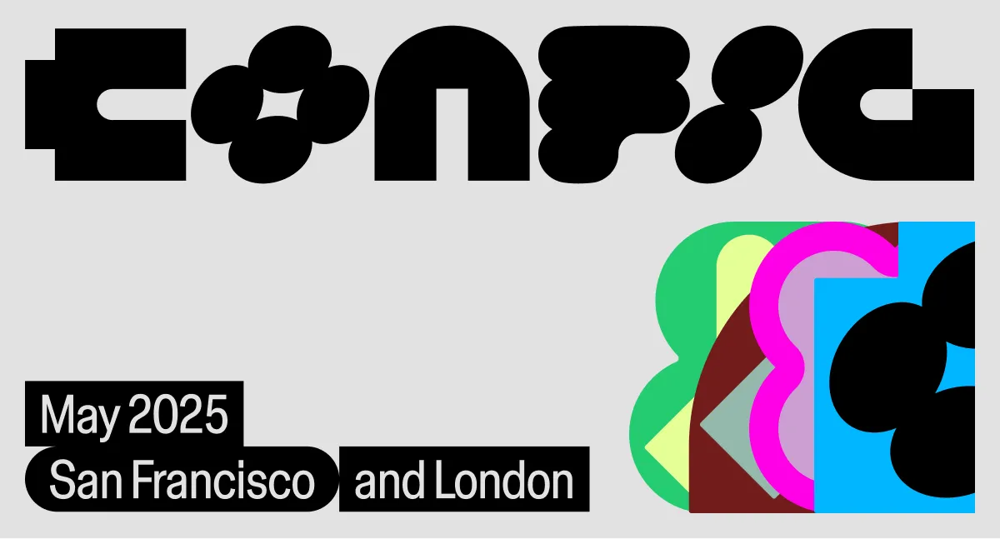

피그마의 다양한 제품 소개와 딥다이브 세션들, 그리고 피그마뿐만 아니라 Linear, Anthropic, GitHub, Atlassian 등
많은 파트너 기업들의 세션들도 있었습니다.

저는 운이 좋게도 회사에서 받은 Config 초대권을 받아 미국을 다녀왔습니다.

[Dylan Field가 발표하는 키노트](https://www.youtube.com/live/5q8YAUTYAyk?si=2KZdZEQkYmhhelA9)를 직접 들었습니다.
현장에서 직접 들으니 느껴지는 바가 다르긴 하더라구요. 조금 더 웅장하고 시야가 넓어지는 느낌이었습니다.

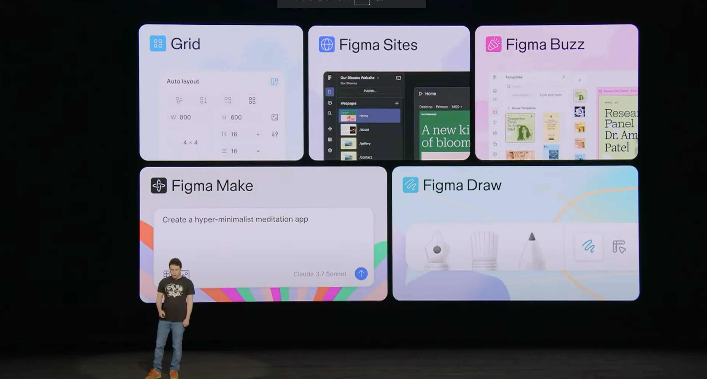

- Grid
- Figma Sites
- Figma Make
- Figma Buzz
- Figma Draw

단순히 기능만 소개하는 글이나 영상들은 많이 올라와있습니다.
한국에서는 기능 소개만 한다던지 아니면 정말 Figma가 시장을 다 잡아먹겠구나 하는 반응이 대부분이었습니다.

분명히 좋은 기능들이 많이 추가되었지만, 저는 아직 갈 길이 멀었고 해결해야 하는 문제들이 많다고 느꼈습니다.
이 글에서는 키노트에서 소개된 Figma의 신규 제품과 기능 총 5개를 디자인시스템 개발자의 시선에서 분석해보려고 합니다.

## Grid

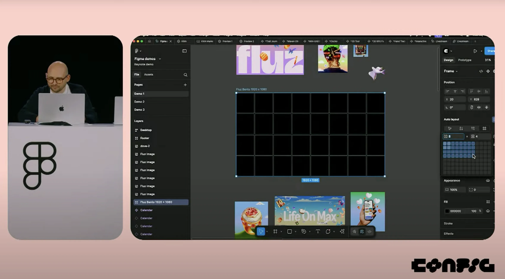

<Callout type="info">
Grid는 갤러리, 일반적인 웹 레이아웃 패턴과 같은 2차원 레이아웃을 만들 수 있는 Auto Layout의 새로운 옵션입니다.
Grid를 사용하여 가로 및 세로로 흐르는 반응형 레이아웃을 만들 수 있습니다.
</Callout>

### 기능 소개

- 새로운 Auto Layout 옵션(New auto layout option): 자동 레이아웃 옵션으로 그리드를 선택하면 행과 열로 서식을 지정할 수 있습니다.
- 여러 트랙에 걸쳐 배치(Span multiple tracks): 단일 셀에 국한되지 않고 여러 그리드 열 또는 행에 걸쳐 늘릴 수 있습니다.
- 고정 트랙 크기 조정(Fixed track sizing): 열 또는 행의 너비와 높이를 제어할 수 있습니다.
- CSS: 개발 모드에서 그리드 CSS에 정렬하여 디자인에서 개발로 원활하게 핸드오프할 수 있습니다.

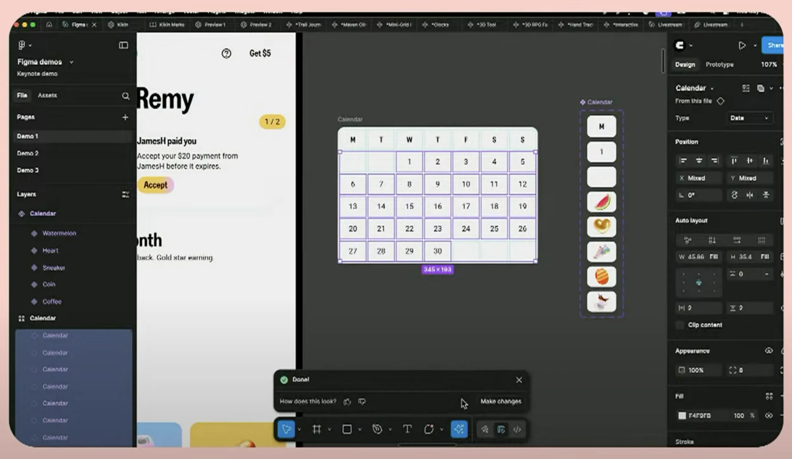

### 아쉬운 점 1. Selection 기능의 부재

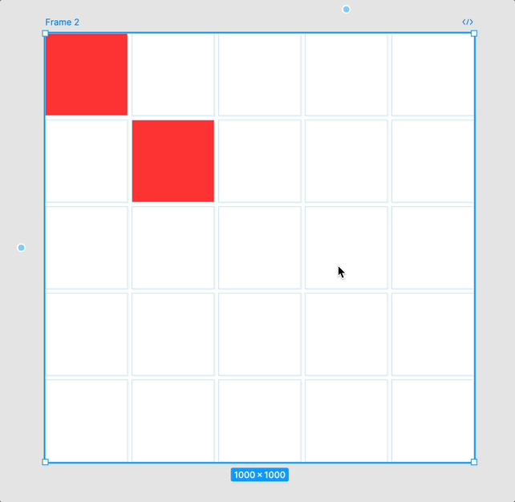

Grid를 편집하는 경험이 좋지 않았습니다.
특정 Cell만 선택한다던지, 특정 행이나 열을 선택한다던지와 같은 기능이 없었습니다.

보통 테이블 형태의 UI를 디자인하거나 개발을 진행할 때에도
`3열과 5열에만 Width를 조정하고 싶다` 라는 경우가 있을텐데 그런 Selection 기능이 없었습니다.

- 특정 행이나 열을 선택할 수 없음
- 여러 Cell이나 행이나 열을 선택해서 한 번에 편집할 수 없음
- 열이나 행을 선택해서 `cmd` + `D` 로 복사할 수 없음

### 아쉬운 점 2. Grid에 컨텐츠가 있으면 줄일 수 없음

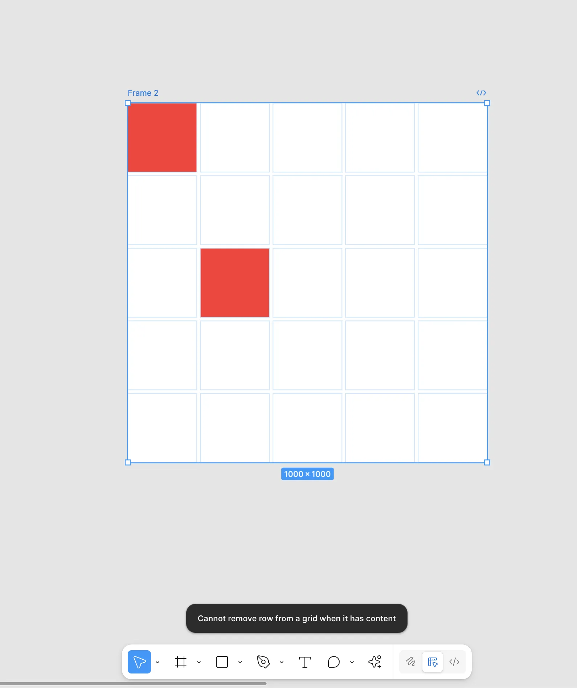

제가 웹 개발자라서 더 그런 것 같긴한데, 보통 행이나 열에 컨텐츠가 있어도 Grid 시스템이 알아서 잘 줄어들 것이라고 생각했습니다.

3열에 있던 컨텐츠가 없어지면 2열로 옮겨가던가, 혹은 3열이 없어지면 2열이 늘어나는 등 자연스럽게 컨텐츠가 줄어들 것이라고 생각했습니다.

### 아쉬운 점 3. 유연하지 못한 Sizing 기능

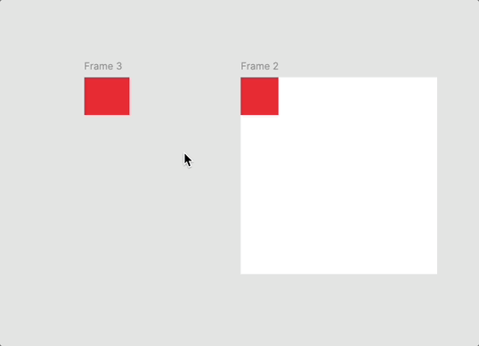

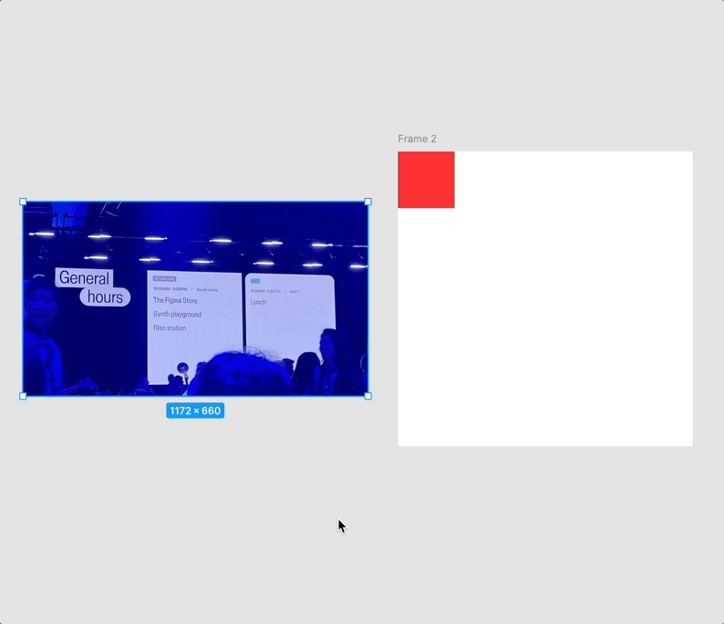

지금 Figma Grid에 컨텐츠를 넣게 되면 Figma 프레임과 같은 요소는 Grid Cell 크기에 맞춰서 들어가고
이미지는 사이즈 그대로 들어가는데 Cell 크기는 그대로 유지됩니다.

보통은 컨텐츠에 맞게 Cell이나 Row, Column의 크기가 자동으로 조정되는 것을 기대했습니다.
이미지도 이미지 크기에 맞게 Grid가 조정되는 걸 기대했습니다.

피그마의 `hug`, CSS의 `width: 100%` 와 같은 기능이 있어서 Grid가 조금 더 유동적으로 동작하면 좋을 것 같습니다.

### 기대하는 점 1. Codegen

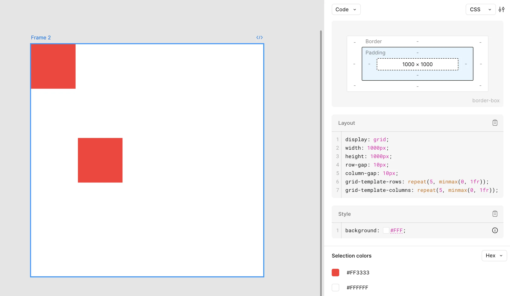

제 주변에서 늘 듣는 말이 `CSS가 제일 어렵다`, `스타일링 왜 이렇게 어렵냐` 등등 많은 분들이 그런 말을 하곤 했습니다.
저도 그런 사람중에 한명인데요, Figma에서는 기존에도 자동으로 제공해주는 CSS Codegen이 있었습니다.

Codegen의 제일 큰 효용중에는 디자인 - 개발간의 hand off 비용이지 않을까 싶습니다.

웹 페이지 개발을 하면 Layout을 CSS로 지정하는 일이 정말 많은데 기존의 `flex`로 할 수 있던 부분들 이외에도
`grid`와 관련된 Code를 Figma가 [알잘딱깔센](https://namu.wiki/w/%EC%95%8C%EC%9E%98%EB%94%B1%EA%B9%94%EC%84%BC)으로 생성해준다면 우리의 시간을 많이 아껴줄 수 있지 않을까 생각합니다.

## Figma Sites

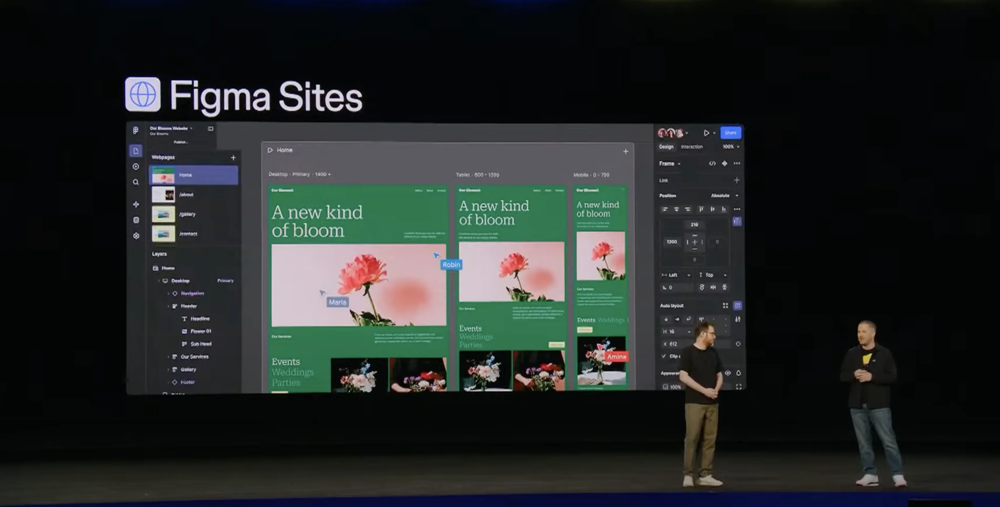

<Callout type="info">
완전 반응형 웹사이트를 디자인하고, 프로토타입을 제작하고, 게시하는 모든 작업을 Figma Sites를 통해 Figma 내에서 수행할 수 있습니다.
</Callout>

### 기능 소개

- Figma에서 복사(Copy from Figma): 피그마 디자인을 복사하여 피그마 사이트에 붙여넣어 쉽게 마이그레이션할 수 있습니다.
- 템플릿(Templates): 50개의 기성 웹사이트 템플릿으로 시작하세요.
- 에셋 및 블록(Assets & blocks): 디자인 시스템과 사전 구축된 웹 요소를 가져옵니다.
- 반응형 디자인(Responsive design): 중단점, 텍스트, 구성요소가 다양한 화면 크기에 맞게 조정됩니다.
- 상호 작용(Interactions): 몇 번의 클릭만으로 마키, 스크롤 시차 등의 인터랙션을 적용할 수 있습니다.
- 미리보기 및 게시(Preview & publish): 캔버스에서 실시간 HTML 미리 보기를 확인하고 웹에 바로 디자인을 게시할 수 있습니다.

아마 사람들이 제일 많이 사용할 것 같은 제품이고 현장 반응도 좋았습니다.

여러 Break Point를 지정할 수 있고, 각 Break Point에 대해 다른 레이아웃을 설정한다던지
혹은 한 Break Point에서 수정을 가하면 다른 Break Point에도 적용되는 등 더 복잡한 레이아웃을 위한 기능도 같이 추가됐습니다.

그리고 웹 배포를 위해서 아래와 같은 기능들도 추가됐습니다.

- 커스텀 도메인
- Google Analytics ID 넣기
- `<head />`, `<body />` HTML Tag 조작 가능 (커스텀 코드 주입)
- Route 분리
- Break Points
- Interations (애니메이션과 링크 이동 설정 탭)
- Content Management System (출시 예정)
- Code Layer (출시 예정)

### 아쉬운 점 1. 고려되지 않은 접근성

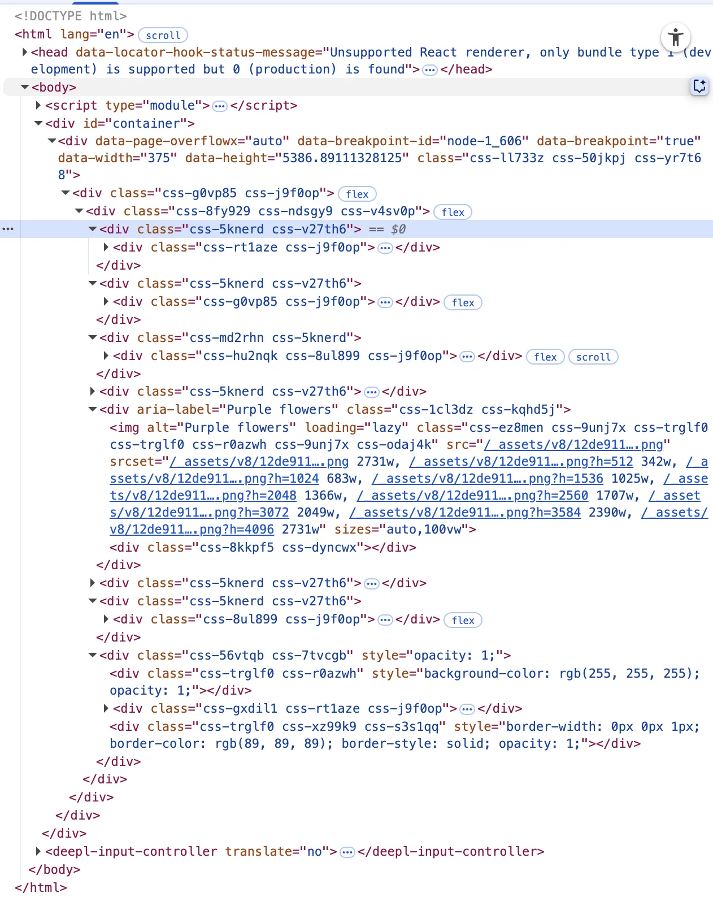

Figma Sites에서 웹 페이지를 만들면 기본적으로 아래와 같이 div로 도배된 페이지가 만들어집니다.
시맨틱 구조를 따르지 않는 것, `aria-label`가 DOM 어디에나 붙어있는 문제, 보이스 오버가 정상적으로 동작하지 않는 문제 등 접근성 측면에서 문제가 있습니다.

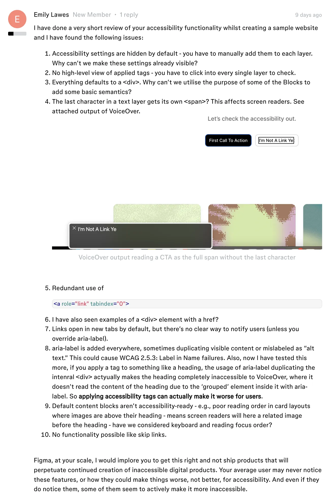

이렇게 유지된다면 실제 프로젝트에서 사용하기에는 큰 무리가 있고,
일회성으로 필요한 단순한 페이지에서 밖에 사용하기 어려울 것 같습니다.

[Figma Sites에 대한 피드백 게시판](https://forum.figma.com/share-your-feedback-26/config-2025-figma-sites-is-here-let-s-hear-what-you-think-40303?tid=40303&fid=26)에도
접근성 관련한 피드백이 많이 있습니다.

### 아쉬운 점 2. 시스템화 하기엔 부족한 Interaction

만약에 피그마를 관리하고 피그마에서 디자인시스템을 운영하는 입장이라면 여러 트랜지션이 산발적으로 사용되는 것을 원치 않을겁니다.
또한 duration이나 easing과 같은 값들이 Variable로 따로 관리되거나 팀에서 정의된 값을 사용하는 것을 원할 겁니다.

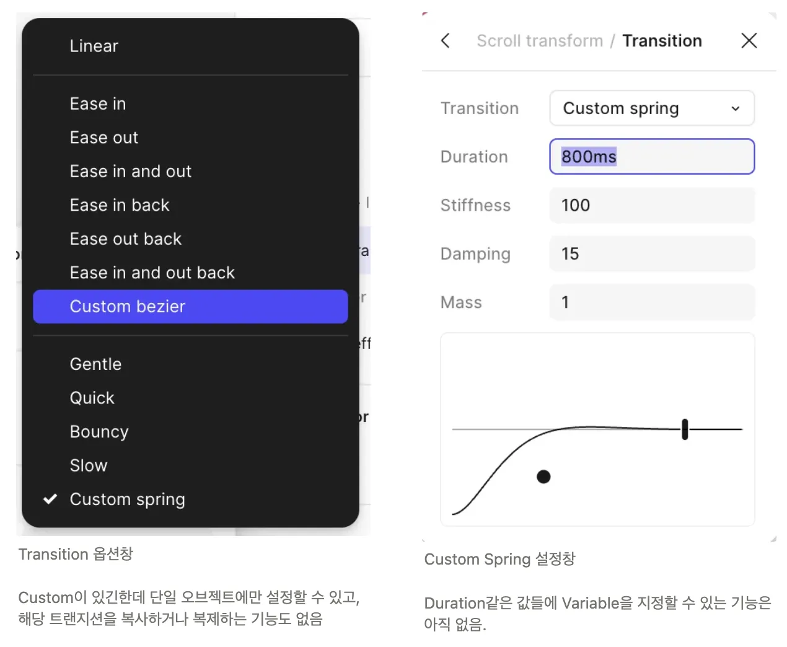

현재 기능으로는 `Custom Bezier`, `Custom Spring`과 같이 커스텀 값을 넣을 수 있는 기능이 있습니다.
하지만 한 요소에 설정된 커스텀 트랜지션을 팀 내부 변수로 관리하거나 미리 사전 정의된 트랜지션으로 등록할 수 있는 UI나 기능이 없습니다.
이렇게 되면 만약에 `A`에서 사용한 트랜지션을 `B`에서 사용하고 싶다면 easing값과 duration 값들을 일일이 다 설정해줘야 합니다.
예를 들면 `Smooth Reveal`, `Expressive Reveal` 등과 같이 관리할 수 있으면 좋을 것 같습니다.

그리고 커스텀 트랜지션의 설정 값들이 Figma Variable로 관리할 수 있는 것이 아니라 그냥 raw 값으로 들어갑니다.
Figma가 아직 모션과 관련한 것들을 시스템화해서 관리하기엔 부족한 것 같습니다.

또한 커스텀 트랜지션을 복사하고 붙여 넣을 수 있는 단순 편의성 기능도 아직은 부족합니다.

### 기대되는 점 1. 마케팅 페이지, 랜딩 페이지 등 간단한 웹 페이지 제작하기

최근에는 Figma로 포트폴리오를 만드시는 개발자분들도 늘어났습니다. (좋은지는 잘 모르겠습니다.)

그리고 단발성 마케팅 페이지나 랜딩 페이지의 경우에는 Figma 리소스를 잘 활용해서 만들면 생산성이 많이 늘어날 것 같습니다.

특히 마케팅 페이지는 마케팅이 많은 조직이면 자주 사용하는 패턴이나 컴포넌트를 마케터분들이 빠르게 웹사이트를 제작할 수 있게 웹 빌더 형태로 운영하는 곳들이 있을텐데
그런 경우 웹 빌더를 운영하는 개발 리소스도 많이 필요하기 때문에 Figma를 통해서 마케터분들이 직접 웹 페이지를 제작할 수 있지 않을까 싶습니다.

### 우려되는 점 1. Content Management System

Figma Sites의 기능중에 하나로 CMS도 추가됐습니다.

Figma에서 어떻게 쓰길 원하는지 용도는 나와서 좀 사용을 해봐야 알 것 같습니다. (지금은 출시 예정)

편집 기능이 띄어나다면 블로그도 대체를 할 수 있을 것인지, API가 제공돼서 코드적으로 데이터를 관리할 수 있을 것 그리고 외부 CMS와 통합이 되는지 등 아직 명확하지 않은 부분이 있습니다.

그냥 Figma에서만 편집 가능하고 외부 CMS와 통합이 되지 않는다면 어떻게 사용해야 할지는 잘 모르겠습니다.

디자인시스템의 여러 메타데이터나 변수들을 관리할 수 있을까 싶었는데, CMS 기능이 Figma Sites에 묶여있는 형태라서
그것도 가능할진 잘 모르겠습니다.

### 우려되는 점 2. Code Layer의 활용 범위

Code Layer를 이용해서 Figma에서 직접 React 컴포넌트를 만들 수 있습니다.

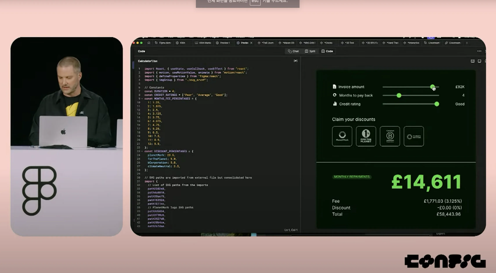

만약 해당 컴포넌트에서 `fetch`로 데이터를 부르거나 혹은 특정 데이터를 넣어서 렌더링 하는 것이 필요하다면 어떻게 해야할까요?
Data Fetching 라이브러리를 사용할 수 있는지, Code Layer간의 상태관리는 어떻게 될것인지 등 더 많은 고민이 들어갑니다.
근데 그때부터 모두가 괴로워지는 것 같습니다.

시중에 많은 코드 에디터를 제치고 Figma에서 코드를 직접 작성하는 것은 쉽지 않을 것 같습니다.
Figma에서 Git과 같은 형상 관리 시스템과의 통합이 이뤄지거나 하는 방향도 있을 것 같은데
그렇게 되면 Figma의 코드 편집은 무슨 의미가 있을까 싶기도 합니다. 그렇게 되면 개발자들이 알아서 Cursor켜서 코드를 작성할텐데 말이죠.

단순히 위에서 쓴 것 처럼 마케팅 페이지나 랜딩 페이지로만 쓰고,
일회성 프로젝트라면 상관이 없지만 계속해서 유지보수를 해야하는 프로젝트라면 조금 더 깊은 고민이 들어가야 할 것 같습니다.

## Figma Make

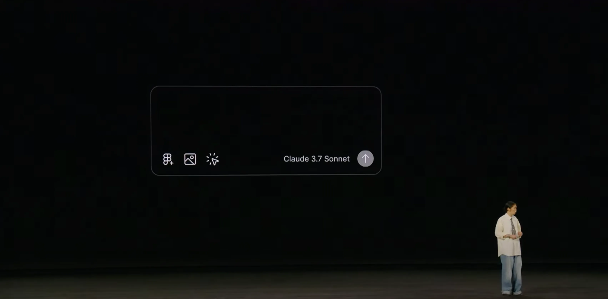

<Callout type="info">
Figma Make는 코딩 경험에 관계없이 아이디어와 기존 Figma 디자인을 기능적인 프로토타입, 웹 앱, 대화형 UI로 구현할 수 있는 AI 기반의 즉시 코딩 가능한 도구입니다.
</Callout>

### 기능 소개

- 여러분의 디자인으로 시작하세요(Start with your designs): 간단한 복사-붙여넣기로 기존 디자인에 생명을 불어넣을 수 있습니다.
- 프롬프트(Point to prompt): 개별 요소를 선택하고 프롬프트를 통해 다듬을 수 있습니다.
- 인라인 도구 모음(Inline toolbar): 텍스트 요소, 컨테이너, 이미지를 직접 편집할 수 있습니다.
- 코드 편집(Code editing): Figma Make에서 생성된 코드를 직접 편집할 수 있습니다.
- 배포(Publish): 아이디어를 완전한 기능의 웹 앱으로 출시할 수 있습니다.

### 우려하는 점 1. 정말 잘 동작할까

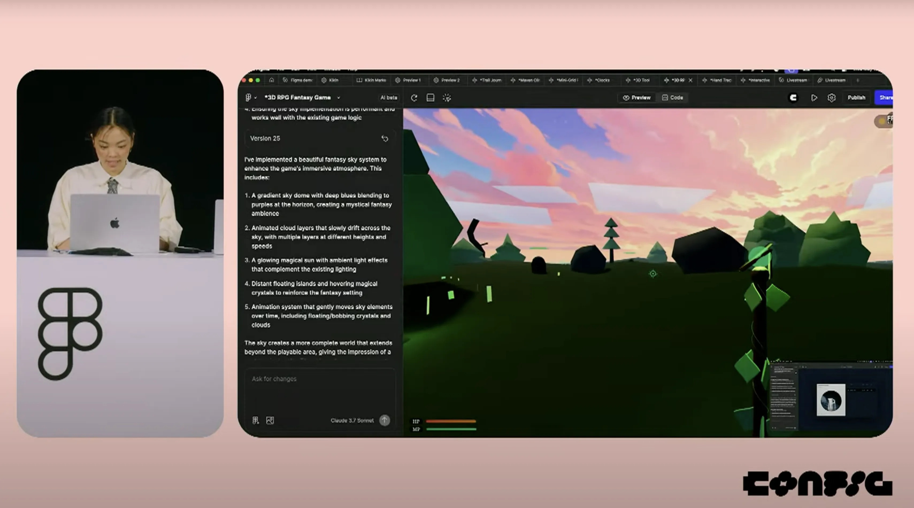

기존에 UI Generate 해주는 AI들이 많이 있습니다.
엄청 많이 사용은 해보지 않았는데 프로토타입 단계에서 사용하기엔 적당하고 그 이후에 프로젝트를 발전시키기에는 많이 부족하다고 생각하고 있었습니다.

그런 생각을 가지고 Figma Make를 봤는데, 시연할 때도 Figma와는 크게 관련없는 것 같은 3D 게임을 보여줘서 살짝 이상하다고 생각했습니다.
이런 것들까지 할 수 있다는 걸 보여주는 건 좋긴한데 이거는 기존에 다른 LLM에서도 할 수 있지 않나하는 생각이 들었습니다.

실제로 유저가 기대하는 건 Figma의 여러 요소들을 맥락으로 쉽게 첨부할 수 있고,
실제 결과물도 기대하는 것과 같이 잘 나오고 이런 것들을 기대할 것 같습니다.

생성되는 Layer들은 이름이 잘 지어져서 나오는지,
뭔가 반복되는 구조는 컴포넌트로 적절하게 만들어서 나오는지,
Auto Layout은 잘 지정되고 `Fill`, `Hug`는 적절하게 지정이 되는지,
라이트 / 다크 모드는 잘 지정되고 적용되는지,
모션 관련 설정은 잘 되는지,
Break Point 설정은 잘 되는지,
기존의 Variable을 잘 활용해서 쉽게 적용할 수 있는지와 같은 여러 걱정들이 있습니다.

아직은 일부 유저들에만 풀린 것 같아서 사용해보진 못했습니다.
[Figma Make에 대한 피드백 게시판](https://forum.figma.com/share-your-feedback-26/config-2025-figma-make-is-here-let-s-hear-what-you-think-40302?tid=40302&fid=26)에도 비슷한 우려들이 있습니다.

## Figma Buzz

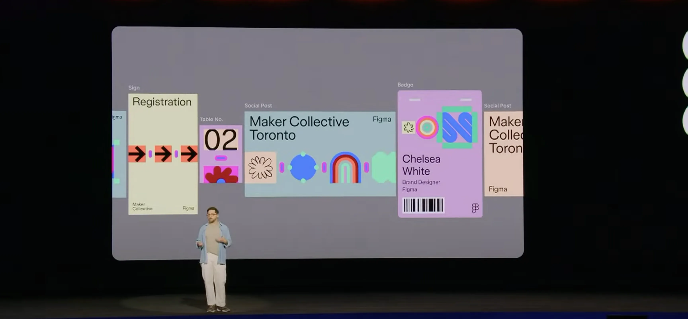

<Callout type="info">
브랜드 디자이너가 브랜드 내 에셋을 만들고 공유할 수 있는 Figma Buzz를 사용하면 팀원들이 필요할 때 필요한 것을 바로 사용할 수 있습니다. 버즈의 간단한 디자인 에디터를 사용하면 마케터나 다른 팀에서 필요한 에셋을 빠르게 만들 수 있습니다. 소셜 미디어 게시물, 디지털 광고, 이벤트 자료 등의 에셋을 만들 때 Figma Buzz를 사용하세요.
</Callout>

### 기능 소개

- 템플릿을 게시합니다(Publish templates): 피그마 디자인에서 피그마 버즈에 복사하여 붙여넣고 디자인 모드에서 필요한 수정을 한 다음 피그마 버즈에 게시하여 동료들이 쉽게 액세스하고 사용할 수 있도록 하세요.
- 편집에 초점을 맞추기(Focused editing): 팀은 게시된 템플릿 내에서 일부 섹션을 편집하여 항상 브랜드에 맞게 유지할 수 있습니다.
- 자유 형식 편집(Freeform editing): 팀 템플릿에서 편집 제한을 제거하거나, 처음부터 다시 시작하거나, Figma에서 만든 템플릿을 사용하여 자유롭게 편집하고 필요한 것을 정확하게 만들 수 있습니다. 간소화된 에디터에서 디자인 도구를 사용하여 수정하고 다듬으세요.
- 대규모 제작(Creation at scale): 수천 개의 에셋을 한 번에 빠르게 만들고 편집할 수 있습니다. 크기에 관계없이 모든 에셋을 하나의 보기에서 확인할 수 있습니다.

### 우려되는 점 1. 마케팅 목적으로 사용하려면?

Figma Buzz에서 `XLSX`, `CSV` 파일을 불러와서 여러 에셋을 만들 수 있는 기능이 있습니다.

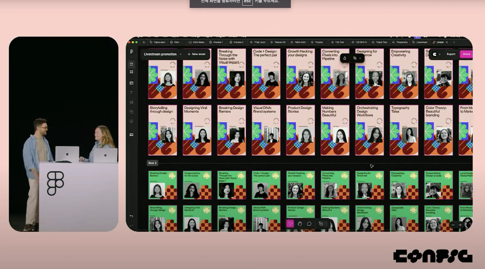

이번 키노트에도 해당 부분을 많이 강조하고 시연에도 해당 부분을 많이 보여주었습니다.

지금은 CSV 파일 불러와서 해당 데이터로 여러 에셋을 만드는 것 까지는 좋은데,
마케팅 목적의 에셋들은 한 가지의 사이즈만 있는 경우가 많진 않을 것 같습니다.

사용한다해도 정말 다양한 기기에 대응되는 사이즈의 에셋들이 필요합니다.
마케팅 목적의 웹페이지에 들어가는 에셋들은 당장 모바일, 데스크탑, 태블릿 등 다양한 기기에 대응되는 사이즈의 에셋들이 필요합니다.

뿐만 아니라 광고 형식이나 소셜 미디어에 노출될 에셋이라면 다양한 사이즈의 에셋들이 필요합니다.

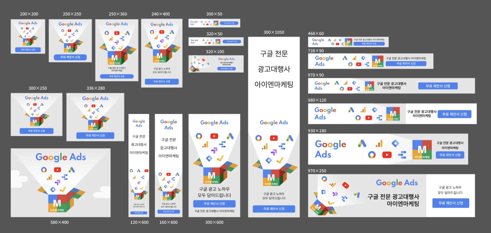

그리고 사이즈가 변함에 따라 자동으로 요소가 배치되고 그게 정말 다양한 사이즈로 `잘` 뽑혀져나와야 합니다.
저런 것들을 해주는 AI들이 많이 나와있긴한데, Figma가 이런 것들까지 해주면 더 좋을 것 같습니다.

## Figma Draw

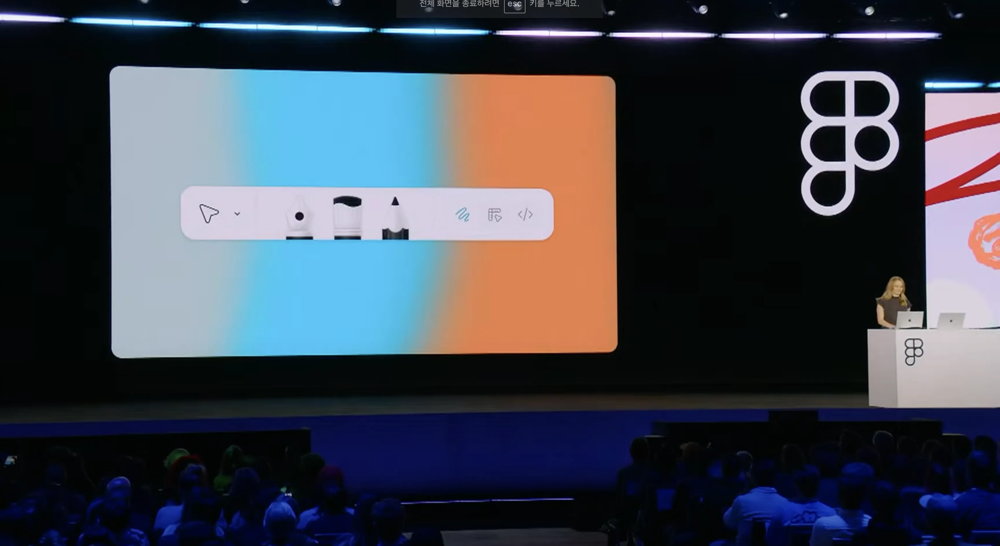  

<Callout type="info">
Figma Draw를 사용하면 브러시, 변형, 시각 효과와 같은 일러스트레이션 도구에 Figma 디자인 파일 내에서 바로 액세스할 수 있습니다.
</Callout>

### 기능 소개

- 향상된 벡터 편집 기능(Enhanced vector editing): 모양 빌더, 올가미, 다중 편집 등의 새로운 도구로 더 정확하고 세밀한 벡터 일러스트를 만듭니다.
- path에 텍스트 넣기(Text on a path): 벡터 경로를 따르는 텍스트 레이어 만들기
- 패턴 채우기(Pattern fills): 레이어의 채우기 또는 획에 패턴을 추가하세요
- 브러시(Brushes): 다양한 브러시 스트로크로 창의력을 발휘하세요
- 새로운 효과(New effects): 텍스처와 노이즈를 추가하여 미묘한 입자 효과
- 다이나믹 스트로크(Dynamic stroke): 스트로크의 빈도와 흔들림을 사용자 지정합니다.

Figma Draw는 저와는 많이 거리가 멀기도 하고, 일러스트 작업을 잘 모르기 때문에 피드백 게시판 링크만 첨부해두겠습니다.

[Figma Draw에 대한 피드백 게시판](https://forum.figma.com/share-your-feedback-26/config-2025-figma-draw-is-here-let-s-hear-what-you-think-40305?tid=40305&fid=26)

## 마무리

`Grid`는 나와야 했던 기능인 것 같고
`Figma Sites`, `Figma Make`로 이력서, 랜딩 페이지, 마케팅 페이지와 같은 간단한 페이지부터
`Bolt.new`, `Lovable`, `v0`와 같은 UI를 Generate 하는 것 부터 퍼블리싱까지 모든 과정에 관여하고 싶은 것 같습니다.
`Figma Buzz`는 기존에 Figma Component 시스템으로는 부족했던걸 조금 더 채워준 느낌 + 마케팅 도구이고
`Figma Draw`는 프리크리에이트나 어도비 일러스트를 대체할 수 있는 포지션을 먹겠다는 의지인 것 같습니다.

너무 비판적인 얘기가 많은 것 같은데, 저는 Figma가 잘 되었으면 좋겠습니다.

저는 디자인 시스템 개발자로서 Figma 컴포넌트도 직접 만들어보고, Figma 플러그인도 정말 많이 만들었습니다.
이번에 Config 직접 다녀오면서 Figma에 대한 애정도 생기고 Figma 본사도 가서 만들어진 곳을 보니까 더욱더 와닿는 부분도 있습니다.

그래도 작년부터 `Figma Variable`, `Dev Mode`와 같이 개발 관심사에 대한 기능들이 많이 추가되고 있고,
이번에는 그런 부분들은 많이 부족했지만 사업적으로 여러 시도를 해보고 있는 것 같습니다.

이제 Figma에서 각 제품들의 피드백을 반영해서 퀄리티를 더욱 높이고,
시스템으로 관리할 수 있는 기능과 통합을 제공할 수 있으면 시중에 많은 제품들을 대체할 수 있지 않을까 합니다.
