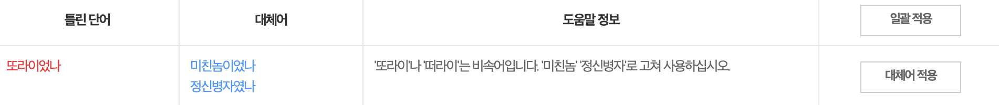

# 글쓰는 또라이 7기

> 2022년 5월 5일부터 2022년 10월 16일까지

5개월 동안 느꼈던 글또 7기 활동에 관해서 얘기해보려 한다.

우선 글또장인 **변성윤**님은 정말 대단하다고 생각한다. 많은 사람을 이끈다는 것이 사실 쉽지 않은데, 꾸준히 공지글을 올려주시거나 생일인 사람들에게 축하 메세지도 매일 같이 보내주신다. 사소한 거지만 사소한 것에 감동을 느끼는 나에게는 조금 크게 다가왔나 보다.

언제나 그렇듯 모든 사람이 열정적일 수는 없다. 거기에 굴복하지 않고 자신이 해야 하는 일을 꾸준히 한다는 건 대단한 일인 것 같다. 나도 언젠가 이런 커뮤니티를 이끌 수 있는 사람이 될 수 있을까.

# 글

지금까지 약 5개월 동안 이 글까지 포함해서 12개의 글을 썼다.

5월에 글또를 시작하면서 블로그 시리즈를 제작하겠다고 다짐했었는데 4개의 포스팅을 했으니 나름? 성공했다고 볼 수 있을 것 같다. 그러고는 쓸 글이 없어가지고 회고 글 쓰고 이상한 글 쓰고 그랬던 것 같다.

그래도 글 하나하나에 최대한 정성을 들여서 쓰려고 했다. 대충은 싫다. 썸네일도 정성스럽게 만들고, 글도 최대한 구조를 갖춰 쓰려고 했다. 그래서인지는 모르겠지만 내가 우리 조원 중에서는 이모지를 많이 받은 편인 것 같다. 하하. (아주 주관적인 나의 생각이다.)

# 적극성

사실 엄청 열정적으로 참여했나? 하고 물어보면 그렇진 않은 것 같다. 맨 처음에 글또에 사람들이 "조원이 잘 걸리면 좋다"라고 얘기했던 것이 조금 이해가 되는 것 같다. 같은 조원들 탓을 하는 건 아니고, 우리 조원들이 그렇게 느꼈을 것 같아서 하는 얘기다.

나는 글또 시작할 때 취준생이기도 했고, 대전에 있다 보니까 적극적으로 무슨 활동을 하기가 조금 어려웠다. 그러다 보니 글만 쓰고 이런저런 활동은 주최라든지, 사람들을 모아서 무언가를 할 생각을 아예 하지 못했다. 아마 같은 조원분들도 같은 마음이지 않았을까 하는 생각이다.

누군가가 나서서 얘기해주거나 주최해주면 편하지만, 선뜻 나서서 무언가를 한다는 건 엄청난 용기가 필요하다. 우리 조에 모두가 그런 생각을 가졌는지는 모르겠지만 선뜻 무언가를 하기에 어려운 분위기가 형성됐다는 건 모두가 공감할 것이다.

# 다시?

만약 글또 8기를 진행한다면 나는 참여할 생각이 있다.

글또에 참여하는 기간 내 상황이 조금 바뀌었다. 당근마켓 썸머테크 인턴에 합격해서 인턴을 하고, 연장돼서 또 다른 팀에서 일하고 있다. 그래서 서울에서 거주하고 있고, 만약 내가 원하는 상황이 만들어진다면 서울에 계속 거주하고 싶다.

그래서 서울에 있으면 조금 내가 적극적으로 무언가를 주최할 수 있지 않을까 하는 근거 없는 자신감이 생겨버렸다. 이제는 "지방 살아서요..."라는 핑계는 통하지 않는다. 나로 인해 같은 조원들이 긍정적인 방향으로 "역시 조원이 잘 걸려야 해" 라고 회고할 수 있었으면 좋겠다.

그리고 요즘 느끼는 건 티스토리가 정말 SEO가 잘되어있고, 조회수가 정말 잘 나온다는 것이다. 그래서 티스토리로 돌아가야 하나 하는 생각을 정말 잠깐 했지만, 그래도 이왕 시작한 거 끝을 보고 싶다. 내 블로그는 다듬어야 할 것도 많고 고치고 싶은 것도 많고 개발하고 싶은 것도 많다.

그렇게 하기 위해서는 꾸준히 블로그 글을 써야 한다고 생각한다. 내가 쓰면서 불편함을 느껴야 고칠 테니까. 그리고 어떤 글을 쓸지에 대한 것은 글또 8기 시작 글에 쓸 것 같으니 요기서는 패스하도록 하겠다.
