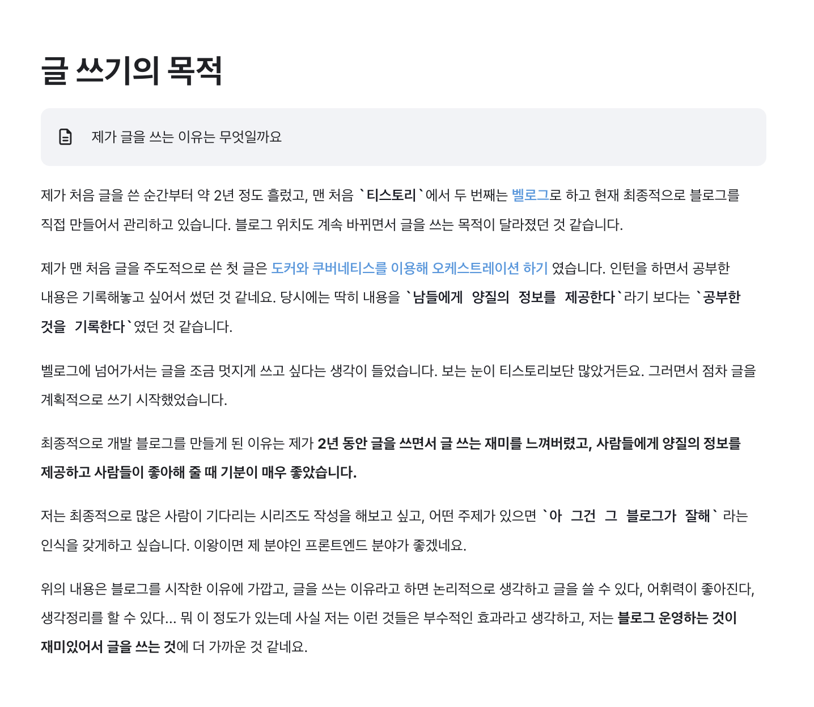
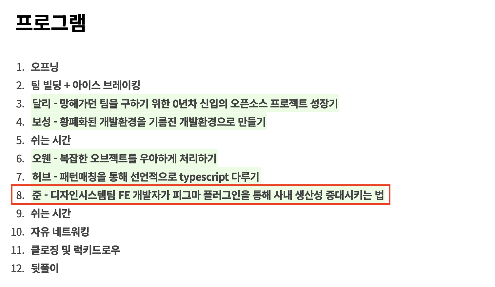
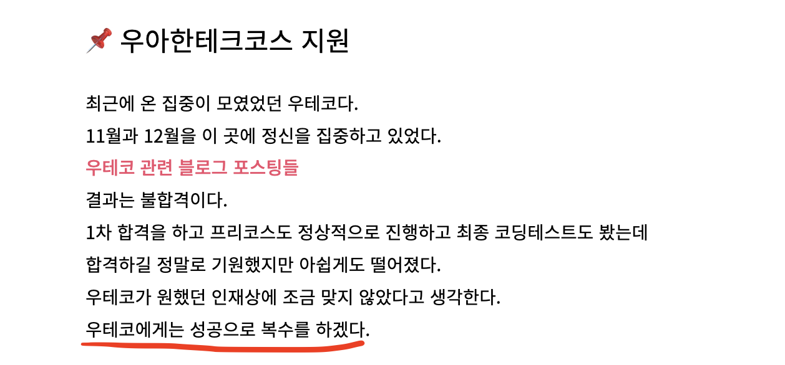

## 내가 기록하는 진짜 이유

위 스크린샷은 제가 글쓰는 또라이 7기를 처음 들어가면서 썼던 글입니다.
저 때 당시로 글을 처음 쓰고 2년이 지났으니까, 현재는 3년 반 정도 됐네요. (시간이 정말 빠르네요.)

글또 7기부터 8기를 지나 현재 9기까지 1년 반 정도의 시간 동안 `20개` 정도의 글을 썼습니다. (shorts나 짧은 글을 제외했습니다.)
글또를 진행하면서 쓰는 글들은 최대한 전문성(?)을 갖추려고 노력했어요.
내가 당근을 다니면서 얻은 지식을 다른 사람들에게 알려줄 수 있지 않을까 하는 생각이 많이 들었습니다.
그리고 굵직한 프로젝트가 끝나면서 제가 개인적으로 회고하는 목적도 있었어요.

약 한 달 전 테오가 주최한 [테오 컨퍼런스 2기](https://www.jumpit.co.kr/contents/428)에서 발표 했어요. ([발표 자료](https://github.com/junghyeonsu/teoconf2))

발표가 끝나고 발표에 오신 분들과 얘기 나눌 기회가 있었는데, 다들 제 블로그 너무 잘 보고 있다고 해주셔서 기분 좋았습니다.
제 블로그를 잘 봐주시는 모든 분께 감사드리고, 또한 이 글을 봐주시는 모든 분도 감사합니다.

근데 저 발표를 기점으로 블로그 글을 하나도 올리지 못했어요.
그전에도 약 두 달 정도 글을 쓰지 않았으니까 지금 약 3개월 정도 글을 쓰지 않고 있어요.

그 이유에는 글또 8기가 끝나고 방학 기간이기도 했고, 딱히 쓸 주제가 떠오르지 않았습니다.
그리고 제일 중요한 건 글을 쓰는 원동력이 많이 떨어진 것 같아요.
최근 1년 동안 쓴 글들을 보면 그래도 퀄리티를 최대한 챙기려고 많은 에너지를 쏟았어요.
그 이유에서인지 새롭게 글을 쓰려고 마음먹기가 참 어렵더라고요.
기획, 준비, 글 쓰기, 다듬기의 과정들이 꽤 버겁게 다가왔습니다.

바로 어제 글또 운영진 회의가 있었는데 거기서 주니어인 운영자분께서
자신도 다른 사람들의 글에 피드백을 주고 싶은데 아직 아는 게 많이 없어서
피드백을 주기가 부끄럽고 할 말이 없다고 얘기하셨습니다.

저는 거기에 피드백을 너무 피드백이라고 생각하지 말고
"단순히 **감상평**이라고 생각하면 조금 더 쉽게 다가갈 수 있지 않을까요?"와 같은 말을 했습니다.
어제 제가 했던 얘기를 저한테 다시 해야 할 것 같은 느낌이네요.

너무 글을 잘 써야 한다는 압박감 때문에 오히려 글을 더 많이 안 쓰게 되는 아이러니한 상황에
저한테 너무 `글`이라고 생각하지 말고 `기록`이라고 생각하며 글을 쓰면 어떨지 하는 생각이 드네요.
이번 글또 9기에서는 `기록`을 해보려고 합니다.

본론으로 돌아와서 제가 기록하는 이유는 여러 가지가 있어요.

**저는 퍼스널 브랜딩에 관심이 되게 많아요.** 티스토리나 벨로그나 미디엄 같은 블로그 플랫폼을 쓰지 않고
개인적인 웹사이트로 만든 것도 같은 맥락입니다. 저는 제가 다니고 있는 회사에서 만약에 하루아침에 잘리면 과
같은 생각을 하는데 어디에다 내다 버려져도 혼자 살아남을 수 있는 사람이 되려고 노력합니다.

**저는 돈을 많이 벌고 싶어요.** 돈과 관련한 제 생각에 대해서는 따로 글을 쓰고 싶기도 한데,
저는 정말 많은 돈을 벌고 싶어요. 사람들이 `돈` 그 자체가 목적이 되면 안 된다, 돈이 전부가 아니라고 얘기합니다.
저도 충분히 공감하고 돈이 전부가 아니라는 것도 알아요.
하지만 제가 인생에서 하고 싶은 많은 것들을 걱정과 부담 없이 그리고 시간과 공간적 제약이 없는 상태에서 하기 위해서는
돈이 많이 필요하다고 생각했어요. 목적이 아닌 수단으로써 돈을 많이 벌고 싶어요.

제가 만약 그냥 `돈` 자체가 목적이었다면 `돈` 자체를 많이 벌 수 있는 것들을 많이 했을 것 같지만 현재 그렇게 하고 있지 않기도 하고,
저는 `돈`은 수단이기 때문에 제가 좋아하는 것들을 열정적으로 하다 보면 돈은 따라온다고 생각합니다.
그리고 저에게 가치 있는 것들을 하며 돈을 많이 벌고 싶어요. 저는 **기록하는 것**을 그와 같은 맥락으로 대하고 있습니다.

**저는 공유를 좋아해요.** 그냥 어떤 지식을 알려주고 그런 걸 떠나서 내 생각, 내가 만든 것, 내가 한 것들을
남들에게 보여주고 알려주는 것에 대해 거리낌이 없습니다. 그리고 그 반응을 보는 게 너무 재미있어요.
3년 반 정도 동안 지속할 수 있었던 이유 중에 가장 큰 이유가 아닐까 싶네요.

저는 제 미래를 생각하면 너무 설레요. 진짜 성공해 있을 것만 같거든요.
돈을 많이 벌고, 이 블로그가 유명해지고... 뭐 그런 것들도 성공의 기준이 될 수 있겠지만
그거 말고 제가 생각하는 제 인생에서 제가 하고 싶은 것들을 하며 사는 삶(이건 연말 회고에 얘기할 생각입니다.), 그게 이뤄져 있다고 생각하면 정말 설레요.
그리고 말만 하는 게 아니라 실천도 하고 있어요.

이 블로그는 그 과정으로 가는 기록들입니다. 스냅샷이라고 얘기하죠, 각각의 기록들은
제가 기록하는 그 당시의 모습을 사진기로 찰칵 찍어서 앨범에 꽂아두는 느낌입니다.
그 당시에 내가 무슨 생각을 했고, 어떤 고민을 하고 어떤 문제를 해결했는지 어떤 것을 만들었는지와 같은 것들을 볼 수 있어 좋거든요.

그리고 이렇게 기록하고 나서 느낀 점은 예전에 썼던 기록을 다시 보는 게 좋더라고요.
예전에 썼던 기록을 보며 부끄러움이 느껴지면 기분이 좋습니다. 성장했다는 증거거든요.

이 글을 쓰면서 [예전에 썼던 2021년 회고록](https://junghyeonsu.tistory.com/236)이 궁금해서 다시 보고 왔는데 너무 부끄러웠습니다. _(오히려 좋아.)_
우선 글 자체에 가독성은 1도 신경 쓰지 않은 것, 문단을 아예 나누지 않네요. 형식에 안 얽매이고 기록이라는 목적에는 아주 부합하네요.
1일 1커밋에는 왜 그렇게 목매서 했는지 그리고 웹 사이트 배포하기를 목표로 삼았다는 게 정말 귀엽네요.
그리고 저 때 1년 휴학을 했으면 지금 나는 어떻게 됐을지와 같은 많은 생각들을 하게 해 주네요.

올해도 당연히 회고하고 내년 목표를 잡을 예정입니다.
아마 크리스마스 전 주말에 제가 정말 좋아하는 사람들과 매년 이벤트로 자리 잡은 회고와 신년 계획을 하지 않을까 싶네요.

예전에 [제로초님의 회고글 (링크는 2022년 회고)](https://www.zerocho.com/category/etc/post/639fec47b7da21913e4bcd40) 혹은
[벨로퍼트님의 회고글 (링크는 2022년 회고)](https://velog.io/@velopert/2022.log)와 같은 글들을 정말 재미있게 읽었습니다.
매년 하는 이벤트처럼 영향을 많이 받은 분들의 회고 글을 보며 나도 나중에 저렇게 매년 기다리게 하는 회고 글, 그리고 그 안에 많은 컨텐츠를 넣을 수 있으면 좋겠다고 생각했습니다.

제로초님과 벨로퍼트님이 저에게 영향을 주고, 거기에 영감을 받아 저도 다른 분들께 영향을 주고
이런 연쇄 작용이 기록이 주는 엄청난 힘이 아닐까 싶네요. 제가 기록하는 `진짜` 이유이기도 합니다.

## 목표

이번 글또 9기에서 이루고자 하는 목표는 단순해요.

- 패스 한 번도 하지 않고 다 제출하기
- 프론트엔드 챕터에서 커피챗 한번 열어보기
- 모각글 한번 진행해 보기

너무 많은 목표를 잡지 않았습니다. 예전보다 조금 현실적으로 변한 것 같기도 하고
많은 경험을 통해서 내가 지금 상태일 때는 어느 정도로 목표를 잡으면 되겠구나,
내가 무엇에 집중해야하는지 조금 분별할 수 있게 된 것 같아요.

이번에 전부 제출하고 나면 총 10개의 글이 더 생기겠네요.
글또 9기도 잘 진행되길!
