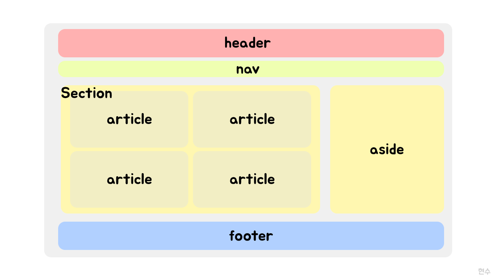

# Semantic Tag

> Semantic: 의미론적

구글 번역기에 `Semantic`의 의미를 찾아보면 `의미론적` 이라는 뜻으로 나옵니다.

그럼 `Semantic Tag`는 말 그대로 의미론적 태그입니다.
태그는 `HTML`의 태그라는 것을 알겠는데, 의미론적 태그는 무엇일까요?

아래의 코드를 살펴봅시다.

```html
<div>
  <div>Header입니다.</div>
  <div>
    <div>네비게이션 바입니다.</div>
    <div>
      <div>컨텐츠 카드입니다.</div>
      <div>컨텐츠 카드입니다.</div>
      <div>컨텐츠 카드입니다.</div>
    </div>
    <div>사이드 바입니다.</div>
  </div>
  <div>Footer입니다.</div>
</div>
```

```html
<main>
  <header>Header입니다.</header>
  <section>
    <nav>네비게이션 바입니다.</nav>
    <article>
      <article>컨텐츠 카드입니다.</article>
      <article>컨텐츠 카드입니다.</article>
      <article>컨텐츠 카드입니다.</article>
    </article>
    <aside>사이드 바입니다.</aside>
  </section>
  <footer>Footer입니다.</footer>
</main>
```

위의 두 코드중에 어느 것이 의미를 파악하기 쉽나요?

`main`, `header`, `section`, `footer`... 등등 위에서 사용된 태그들은 전부 `div`와 같은 동작을 합니다.

하지만 그냥 `div`를 나열해서 HTML을 구성하는 것 보다는 각각의 태그에 역할을 부여해서 조금 더 나은 코드를 작성할 수 있습니다.

그래서 의미있는 태그, 안에 들어갈 내용을 예측할 수 있는 태그를 `Semantic Tag`라고 부르고 사용하고 있습니다.

# Semactic Tag의 장점

> Semactic Tag를 잘 작성하면 어떤 장점이 있을까요?

## SEO

검색 엔진은 `Semantic Markup`을 페이지의 검색 랭킹에 영향을 줄 수 있는 중요한 키워드로 간주합니다. 그래서 자신의 페이지에 의미에 맞고, 적당한 위치에 의미론적 태그를 잘 사용한다면 검색엔진최적화, 즉 `SEO(Search Engine Optimization)`에 좋은 영향을 줄 수 있습니다.

## 웹 접근성

시각 장애가 있는 사용자가 화면 판독기로 페이지를 탐색할 때 의미론적 마크업을 푯말로 사용할 수 있습니다.
또한 적절한 시멘틱 태그로 잘 만들어진 웹 이라면 스크린리더, 키보드로만 문제 없이 동작할 수 있습니다.

## 개발자 경험

그냥 `div`로 `HTML`을 채우는 것 보다는 의미있는 태그로 작성하는 것이 개발자 경험을 좋게합니다. 의미론적 태그를 사용해서 해당 태그 안의 내용을 제안할 수 있습니다.

또한 코드를 수정해야할 때도 `div`들로 나열된 코드에서 찾는 것 보다 의미있는 태그들 사이에서 찾는 것이 훨씬 빠르고 쉽습니다.

# Semantic Tag의 종류

HTML elements는 [백 여개 정도의 태그](https://developer.mozilla.org/en-US/docs/Web/HTML/Element)가 있지만, 우리가 페이지를 구성하는데 자주 사용되는 대표적인 태그들은 아래와 같습니다.



> 자세한 내용들은 MDN 문서에 정말 잘 소개되어 있습니다

- [article](https://developer.mozilla.org/ko/docs/Web/HTML/Element/article)
- [aside](https://developer.mozilla.org/ko/docs/Web/HTML/Element/aside)
- [details](https://developer.mozilla.org/ko/docs/Web/HTML/Element/details)
- [figcaption](https://developer.mozilla.org/ko/docs/Web/HTML/Element/figcaption)
- [figure](https://developer.mozilla.org/ko/docs/Web/HTML/Element/figure)
- [footer](https://developer.mozilla.org/ko/docs/Web/HTML/Element/footer)
- [header](https://developer.mozilla.org/ko/docs/Web/HTML/Element/header)
- [main](https://developer.mozilla.org/ko/docs/Web/HTML/Element/main)
- [mark](https://developer.mozilla.org/ko/docs/Web/HTML/Element/mark)
- [nav](https://developer.mozilla.org/ko/docs/Web/HTML/Element/nav)
- [section](https://developer.mozilla.org/ko/docs/Web/HTML/Element/section)
- [summary](https://developer.mozilla.org/ko/docs/Web/HTML/Element/summary)
- [time](https://developer.mozilla.org/ko/docs/Web/HTML/Element/time)

# 참고

- [Semantics | MDN](https://developer.mozilla.org/ko/docs/Glossary/Semantics)
