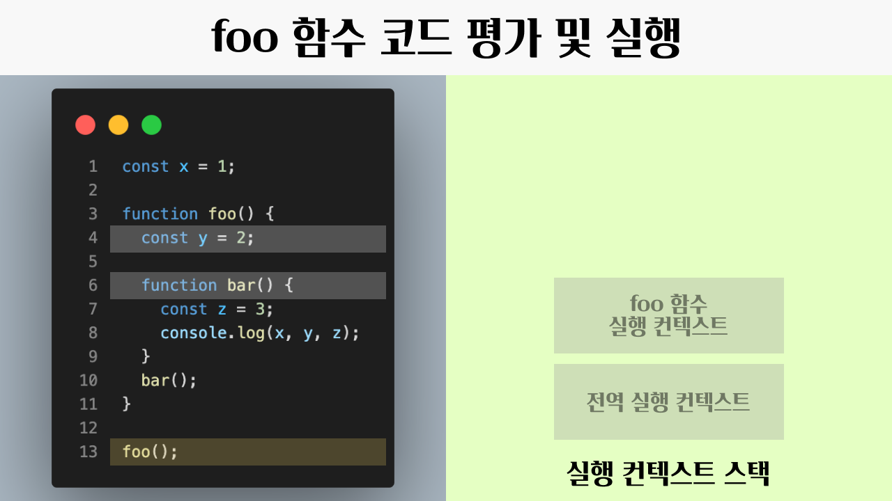
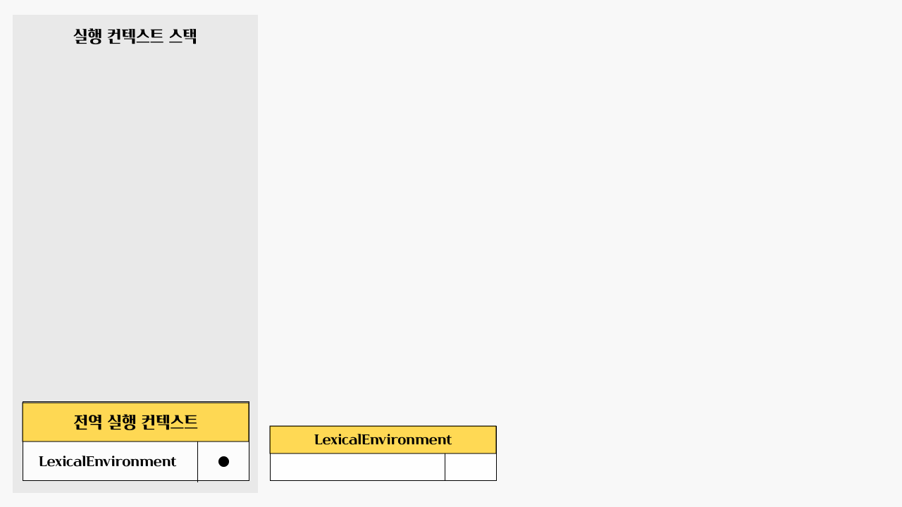

> 해당 글은 모던 자바스크립트 딥다이브 실행 컨텍스트와 스코프 파트를 읽고 개인적인 의견과 합쳐서 정리한 글입니다.

# 실행 컨텍스트

> 실행 컨텍스트는 자바스크립트의 동작 원리를 담고 있는 핵심 개념입니다. 실행 컨텍스트를 바르게 이해하면 자바스크립트가 스코프를 기반으로 식별자와 바인딩된 값(식별자 바인딩)을 관리하는 방식과 호이스팅이 발생하는 이유, 클로저의 동작 방식, 그리고 테스크 큐와 함께 동작하는 이벤트 핸들러와 비동기 처리의 동작 방식을 이해할 수 있습니다.

## 소스코드의 평가와 실행


자바스크립트는 **소스코드의 평가**와 **소스코드의 실행**으로 나누어 처리합니다.

평가 과정에서는 실행 컨텍스트를 생성하고, 변수, 함수 등의 선언문만 먼저 실행하여 생성된 변수나 함수 식별자를 키로 실행 컨텍스트가 관리하는 스코프에 등록합니다.

평가 과정이 끝나면 선언문을 제외한 소스코드가 순차적으로 실행됩니다. 즉 런타임이 시작됩니다. 이떄 소스코드 실행에 필요한 정보, 즉 변수나 함수의 참조를 실행 컨텍스트가 관리하는 스코프에 검색해서 사용합니다. 변수값의 변경이나 소스코드의 실행 결과는 다시 실행 컨텍스트가 관리하는 스코프에 등록됩니다.

## 실행 컨텍스트가 하는 일

1. 선언에 의해 생성된 모든 식별자(변수, 함수, 클래스 등)를 스코프를 구분하여 등록하고 상태변화(식별자에 바인딩된 값의 변화)를 지속적으로 관리할 수 있어야 합니다.

2. 스코프는 중첩 관계에 의해 스코프 체인을 형성해야 합니다. 즉, 스코프 체인을 통해 상위 스코프로 이동하며 식별자를 검색할 수 있어야 합니다.

3. 현재 실행 중인 코드의 실행 순서를 변경(예를 들어, 함수 호출에 의한 실행 순서 변경)할 수 있어야 하며 다시 되돌아갈 수도 있어야 합니다.

이 모든 것을 관리하는 것이 **실행 컨텍스트**입니다.

**실행 컨텍스트는 식별자(변수, 함수, 클래스 등의 이름)를 등록하고 관리하는 스코프와 코드 실행 순서 관리를 구현한 내부 메커니즘으로, 모든 코드는 실행 컨텍스트를 통해 실행되고 관리됩니다.**

식별자와 스코프는 실행 컨텍스트의 **렉시컬 환경**으로 관리하고,
실행 순서는 **실행 컨텍스트 스택**으로 관리합니다.

## 실행 컨텍스트 스택

> 말 그대로 실행 컨텍스트가 쌓이는 스택입니다. 스택 자료구조는 후입선출을 따르고 있습니다.

```javascript
const x = 1;

function foo() {
  const y = 2;

  function bar() {
    const z = 3;
    console.log(x, y, z);
  }
  bar();
}

foo();
```

위의 코드를 실행시킨다고 했을 때 어떻게 실행 컨텍스트 스택이 쌓이고 빠지는지 확인해봅시다.


우선 코드 실행 전에는 실행 컨텍스트가 전부 비워진 상태로 시작합니다.


그리고 전역 코드를 평가해서 전역 컨텍스트를 생성합니다. 전역 코드에는 변수 `x`와 `foo` 함수가 있고, 이를 전역 실행 컨텍스트에 등록합니다.

평가가 끝나면 전역 코드를 실행하고, `x`에 1을 할당하고, 전역 함수인 `foo`를 호출하게 됩니다.



`foo` 함수가 호출되면 전역 코드의 실행은 잠시 중단되고, 코드의 제어권이 `foo` 함수로 넘어갑니다. 자바스크립트 엔진은 `foo` 함수 실행 컨텍스트를 스택에 푸시하고, 지역 변수 `y`와 지역 함수 `bar`가 `foo` 실행 컨텍스트에 등록됩니다.

`foo` 함수의 평가가 끝났으면 `foo` 함수를 실행해서 `bar` 함수 실행 코드를 만나게 됩니다.


`bar` 함수가 호출되면 `bar` 실행 컨텍스트가 실행 컨텍스트 스택에 푸시되고, `foo` 함수 실행은 잠시 중단되고, `bar` 함수 내부로 제어권이 이동합니다. 이때 `bar` 함수 내부의 코드를 평가합니다. 지역 변수 `z`가 `bar` 실행 컨텍스트에 등록됩니다.

그리고 `bar` 함수를 실행합니다. `z`에 3이 할당되고, console.log 메서드를 호출한 이후 `bar` 함수는 종료됩니다.


`bar` 함수가 종료되면 코드의 제어권은 다시 `foo` 함수로 이동합니다. `bar` 실행 컨텍스트는 컨텍스트 스택에서 팝하여 제거합니다. 그리고 `foo` 함수 또한 더이상 실행할 코드가 없으므로 종료합니다.


`foo` 함수가 종료되면 코드의 제어권은 다시 전역 코드로 이동합니다. 이때 자바스크립트 엔진은 `foo` 함수 실행 컨텍스트를 실행 컨텍스트 스택에서 팝하여 제거합니다.

전역 함수에서도 더 이상 실행할 코드가 없으므로, 전역 함수 실행 컨텍스트 또한 실행 컨텍스트 스택에서 팝하여 제거합니다.


이처럼 실행 컨텍스트 스택은 코드의 실행 순서를 관리합니다.
스택에서 제일 최상단에 있는 실행 컨텍스트가 현재 실행중인 컨텍스트입니다.

## 렉시컬 환경

> 실행 컨텍스트는 코드의 실행 순서를 관리했고, 렉시컬 환경은 스코프와 식별자를 관리합니다.

렉시컬 환경은 키와 값을 갖는 객체 형태의 스코프(전역, 함수, 블록 스코프)를 생성하여 식별자를 키로 등록하고 식별자에 바인딩된 값을 관리합니다.

즉, 렉시컬 환경은 **스코프를 구분**해서 **식별자를 등록**하고 관리하는 저장소 역할을 하는 렉시컬 스코프의 실체라고 볼 수 있습니다.


실행 컨텍스트에는 `LexicalEnvironment` 컴포넌트와 `VariableEnvironment` 컴포넌트가 있고, 렉시컬 환경에는 `EnvironmentRecord`, `OuterLexicalEnvironmentReference` 컴포넌트가 있습니다.

`LexicalEnvironment` 컴포넌트와 `VariableEnvironment` 컴포넌트는 하나의 동일한 렉시컬 환경을 참조합니다. 책에서는 두 개의 컴포넌트를 구분하지 않고 하나로 보기로 했습니다.

렉시컬 환경에서 `EnvironmentRecord`는 스코프에 포함된 스코프에 포함된 식별자를 등록하고 등록된 식별자에 바인딩된 값을 관리하는 저장소입니다.

그리고 렉시컬 환경에서 `OuterLexicalEnvironmentReference`은 상위 스코프에 대한 참조입니다. 단방향 링크드 리스트인 스코프 체인을 구성해서 상위 스코프를 참조하고 있습니다.

## 실행 컨텍스트의 생성과 식별자 검색 과정

```javascript
var x = 1;
const y = 2;

function foo(a) {
  var x = 3;
  const y = 4;

  function bar(b) {
    const z = 5;
    console.log(a + b + x + y + z);
  }

  bar(10);
}

foo(20);
```

위의 코드에 대한 실행 컨텍스트 생성 과정과 식별자 검색 과정을 살펴봅시다.

### 1. 전역 객체 생성

> 전역 객체는 전역 코드가 평가되기 이전에 생성됩니다.

전역 객체에는 동작 환경에 따라 클라이언트 Web API (DOM, BOM, Canvas, XMLHTTPRequest, fetch, requestAnimationFrame, SVG, Web Storage, Web Component, Web Worker 등) 또는 특정 환경을 위한 호스트 객체를 포함합니다.

### 2. 전역 코드 평가


전역 코드에 대한 평가는 다음과 같은 순서로 진행됩니다.

- 1. 전역 실행 컨텍스트 생성
- 2. 전역 렉시컬 환경 생성
  - 2.1. 전역 환경 레코드 생성
    - 2.1.1. 객체 환경 레코드 생성
    - 2.1.2. 선언적 환경 레코드 생성
  - 2.2. this 바인딩
  - 2.3. 외부 렉시컬 환경에 대한 참조 결정


우선 전역 실행 컨텍스트를 실행 컨텍스트 스택에 푸시합니다.



그 다음에 전역 렉시컬 환경(LexicalEnvironment)을 생성하고 전역 실행 컨텍스트에 바인딩합니다.

그 다음에 렉시컬 환경의 컴포넌트 중에 하나인 전역 환경 레코드를 생성합니다.

전역 환경 레코드에는 **객체 환경 레코드**와 **선언적 환경 레코드**가 있습니다.

**객체 환경 레코드**에는 `var`로 선언한 전역 변수와 전역 함수 혹은 빌트인 전역 프로퍼티, 빌트인 전역 함수, 표준 빌트인 객체를 관리합니다.

**선언적 환경 레코드**에는 ES6의 `let`, `const` 키워드로 선언한 전역 변수를 구분하여 관리합니다.


그렇게 렉시컬 환경, 전역 환경 레코드까지 생성하고 나면 위와 같은 모양이 됩니다.

전역 변수 `y`는 `let`, `const`로 선언한 변수이므로 전역 객체의 프로퍼티가 되지 않습니다. 그리고 `const` 키워드로 선언한 변수는 **선언 단계**와 **초기화 단계**가 분리되어 진행되기 때문에, **선언 단계**가 일어나고, **초기화 단계**에 도달할 때 까지 일시적 사각지대 (`Temporal Dead Zone`)에 빠지게 됩니다.


그 다음에는 전역 환경 레코드 내부 슬롯에 `this`가 바인딩 됩니다. 일반적으로 전역 코드에서 `this`는 전역 객체를 가리키므로 전역 객체가 바인딩 됩니다.


그리고 최종적으로 외부 렉시컬 환경에 대한 참조를 합니다.
외부 렉시컬 환경에 대한 참조는 상위 스코프를 가리키는데, 전역 렉시컬 환경의 상위 스코프는 존재하지 않습니다. 전역 렉시컬 환경이 스코프 체인의 종점에 존재함을 의미합니다.

### 3. 전역 코드 실행

전역 코드에 대한 평가가 끝났으면 전역 코드를 실행합니다.
전역 변수들에 값이 할당됩니다. 그리고 `foo` 함수가 호출됩니다.


변수를 할당하거나 함수를 호출할 때는 **식별자**인지 확인을 해야합니다. 해당 작업을 할 때는 **실행 중인 실행 컨텍스트**의 **렉시컬 환경**에서 식별자를 검색하기 시작합니다.

만약 해당 렉시컬 환경에서 찾을 수 없다면 상위 스코프의 렉시컬 환경으로 이동해서 식별자를 찾습니다.

이것이 **스코프 체인**의 동작 원리이고, 만약 상위 스코프가 없을 때 까지 식별자를 찾지 못한다면, 해당 식별자는 참조 에러를 띄우게 됩니다.

### 4. foo 함수 코드 평가


foo 함수가 호출되면 전역 코드의 실행을 잠시 중단하고, foo 함수 내부로 코드의 제어권이 이동합니다.

함수 코드의 평가는 다음과 같이 진행됩니다.

- 1. 함수 실행 컨텍스트 생성
- 2. 함수 렉시컬 환경 행성
  - 2.1 함수 환경 레코드 생성
  - 2.2 this 바인딩
  - 2.3 외부 렉시컬 환경에 대한 참조 결정


우선 `foo` 함수 실행 컨텍스트를 생성하고 실행 컨텍스트 스택에 푸시합니다.


그 다음엔 `foo` 함수의 렉시컬 환경을 생성합니다. 렉시컬 환경에는 2개의 컴포넌트, 환경 레코드와 외부 렉시컬 환경에 대한 참조로 구성됩니다.


`a`는 매개 변수이고, `arguments` 객체, 그리고 함수 몸체에서 선언된 식별자들을 등록하고 관리하게 됩니다.


그 다음에는 `this` 바인딩을 하게 됩니다. this는 함수 호출 방식에 따라 결정됩니다. `foo` 함수는 일반 함수로 호출되었으므로 `this`는 전역 객체를 가리키게 됩니다.


최종적으로 외부 렉시컬 환경에 대한 참조를 결정합니다. 현재 `foo` 함수는 전역 코드에 정의된 전역 함수이기 때문에, 전역 실행 컨텍스트를 참조하게 됩니다.

### 5. foo 함수 코드 실행

`foo` 함수 평가가 끝나고 나면 `foo` 함수를 실행시킵니다.

실행하고나면 `foo` 내부에서 선언된 변수들에 값이 할당됩니다.


### 6. bar 함수 코드 평가


다음엔 `bar` 함수 코드를 평가하게 됩니다.
`foo` 함수를 평가한 것 처럼 똑같이 동작하게 됩니다.


`bar` 함수 평가가 끝났을 때의 모습은 위와 같습니다.

우선 `bar` 실행 컨텍스트를 생성했고, 렉시컬 환경을 생성해서 바인딩 했습니다.

그 다음에는 함수 환경 레코드를 생성해서 매개변수, arguments, 함수 내부 변수에 대해서 선언을 해주었습니다.

그 다음엔 this를 바인딩하고, 외부 렉시컬 환경 참조 또한 바인딩 해주었습니다.

이렇게 되면 `bar` 함수의 평가가 끝났습니다.

### 7. bar 함수 코드 실행

`bar` 함수 평가가 끝나고 `bar` 함수가 실행됩니다.


`bar` 함수 안에는 `console.log(a + b + x + y + z)`가 실행됩니다.
우선은 `console` 식별자를 스코프 체인에서 찾습니다.

1. `bar` 렉시컬 환경에서 찾습니다. 없어서 외부 렉시컬 환경 참조를 통해서 상위 스코프로 이동합니다. 상위 스코프는 `foo` 입니다.
2. `foo` 렉시컬 환경에서 찾습니다. 없어서 외부 렉시컬 환경 참조를 통해서 상위 스코프로 이동합니다. 상위 스코프는 전역입니다.
3. 전역 렉시컬 환경에서 `console`을 찾습니다. `console`은 객체 환경 레코드의 `BindingObject`를 통해 전역 객체에서 찾을 수 있습니다.

`console` 식별자를 찾고 난 이후에는 `log` 메서드를 검색합니다.
그리고 난 다음에는 `a + b + x + y + z`를 평가하기 위해서 각각의 식별자를 검색합니다.

`console` 식별자를 찾은 것 처럼 `bar` 렉시컬 환경에서 외부 렉시컬 환경 참조를 통해서 타고타고 올라가서 식별자를 찾습니다. 요기서 전역 렉시컬 환경에서까지 찾지 못한다면 참조 에러가 뜨게 됩니다.

### 8. bar 함수 코드 종료

`console.log` 메서드가 호출되고 나면 더이상 실행할 코드가 없어서 `bar` 함수를 종료하게 됩니다.


`bar` 함수 실행 컨텍스트가 종료되고 제거되었다고 해서 `bar` 함수의 렉시컬 환경까지 즉시 제거되지 않습니다. 렉시컬 환경은 실행 컨텍스트에서 참조하기는 하지만 독립적인 객체라서 해당 렉시컬 환경을 누군가가 참조하고 있다면 소멸되지 않습니다.

그리고 만약 참조하고 있는 실행 컨텍스트가 없다면 가비지 컬렉터에 의해서 소멸하게 됩니다.

### 9. foo 함수 코드 종료


`bar` 함수가 종료되고 그 다음으로 `foo` 함수가 종료합니다.
실행 컨텍스트 스택에서 팝하여 `foo` 함수 컨텍스트를 없애게 됩니다.

### 10. 전역 함수 코드 종료

최종적으로 전역 함수 실행 컨텍스트도 팝하여 없애게되면 실행 컨텍스트에는 아무것도 남지않게 되어 코드의 실행이 끝나게 됩니다.

## 실행 컨텍스트와 블록 레벨 스코프

> `var` 키워드는 함수 레벨 스코프, `let`, `const` 키워드는 블록 레벨 스코프를 따릅니다.

블록에는 함수, `if`문, `for`문, `while`문, `try/catch`문 등 지역 스코프로 인정하는 블록 레벨 스코프들이 있습니다.

```javascript
let x = 1;

if (true) {
  let x = 2;
  console.log(x); // 2
}

console.log(x); // 1
```

위와 같은 코드가 있다고 생각하면 `if` 문의 코드 블럭이 실행되면 `if`문의 코드 블록을 위한 블록 레벨 스코프를 생성합니다.

이를 위해서 선언전 환경 레코드를 갖는 렉시컬 환경을 새롭게 생성해서, 기존의 전역 레시컬 환경을 교체합니다. 이때 새롭게 생성된 `if`문의 코드 블록을 위한 렉시컬 환경의 외부 렉시컬 환경에 대한 참조는 `if`문이 실행되기 이전의 전역 렉시컬 환경을 가리킵니다.


그 다음에 `if`문이 종료되면 원래의 렉시컬 환경으로 되돌리게 됩니다.


