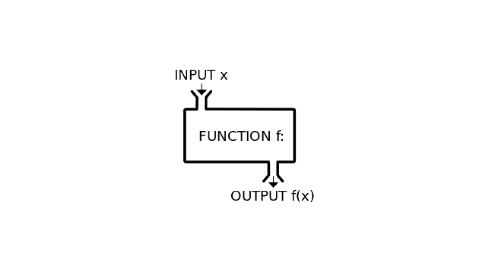
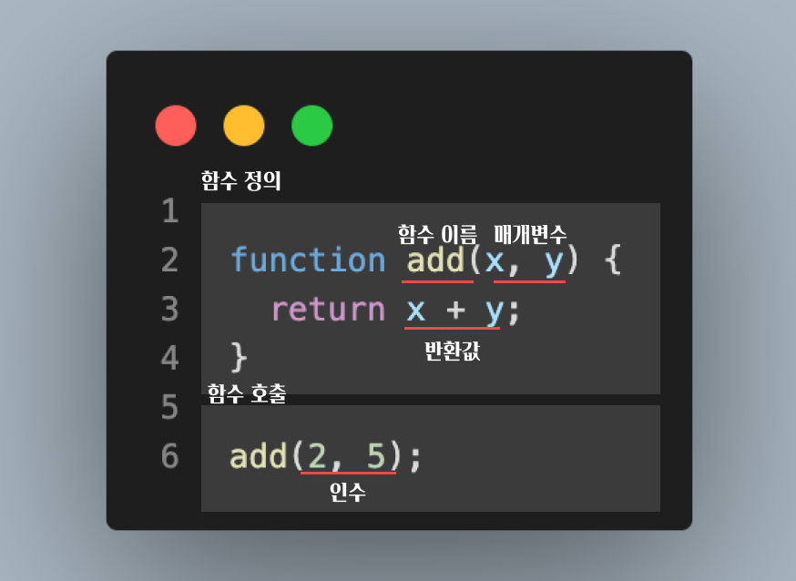

> 해당 글은 모던 자바스크립트 딥다이브 함수 파트를 읽고 개인적인 의견과 합쳐서 정리한 글입니다.

# 함수란?



> 자바스크립트에서 가장 중요한 핵심 개념입니다.

자바스크립트의 핵심 개념들인 스코프, 실행 컨텍스트, 클로저, 생성자 함수에 의한 객체 생성, 메서드, this, 프로토타입, 모듈화 등이 모두 함수와 관련이 있습니다.

수학의 함수는 입력(`input`)과 출력(`output`)을 내보내는 일련의 과정을 의미합니다.



# 함수를 사용하는 이유?

- 같은 코드를 여러 번 작성하는 것이 아니라 한번만 작성하고 호출할 수 있습니다. (코드의 재사용성, 편의성)
- 코드의 중복을 억제하고 재사용성을 높이면 실수를 줄일 수 있습니다. (코드의 신뢰성)
- 함수 이름을 잘 지으면 내부 코드를 이해하지 않아도 코드를 이해할 수 있습니다. (코드의 가독성)

# 함수 리터럴

> 리터럴: 사람이 이해할 수 있는 문자 또는 약속된 기호를 사용해 값을 생성하는 표기 방법

```typescript
var f = function add(x, y) {
  return x + y;
};
```

함수 리터럴의 구성 요소로는 함수 이름, 매개변수 목록, 함수 몸체로 되어있습니다.

함수 이름은 식별자이기 때문에 식별자 네이밍 규칙을 준수해야 합니다.
함수 이름은 생략 가능합니다. (무명, 익명 함수)

매개변수는 0개 이상이고, 쉼표로 구분합니다.
매개변수에는 순서에 의미가 있습니다. 그래서 지정한 순서대로 읽을 수 있습니다.

함수 몸체는 **함수 호출**에 의해 실행됩니다.

자바스크립트에서 함수는 객체 타입의 값입니다. 그래서 함수도 함수 리터럴로 생성할 수 있습니다.
그래서 함수를 변수에 할당하는 것 또한 가능합니다.

함수는 객체지만 일반 객체와는 좀 다릅니다.

- 함수는 호출 가능, 일반 객체는 호출 불가능
- 함수는 일반 객체에 없는 고유한 프로퍼티를 가지고 있음

# 함수 정의

함수를 정의하는 방법에는 크게 4가지 방법이 있습니다.

1. 함수 선언문
2. 함수 표현식
3. Function 생성자 함수
4. 화살표 함수 (ES6)

하나씩 살펴보고 각각의 차이점들을 살펴보겠습니다.

## 함수 선언문

함수 선언문은 다음과 같이 생겼습니다.

```typescript
function add(x, y) {
  return x + y;
}
```

> 함수 선언문의 함수 이름은 생략 불가능 합니다.

```typescript
function (x, y) {
  return x + y;
}
// SyntaxError: Function statements require a function name
```

자바스크립트 엔진은 함수 선언문을 해석해서 함수 객체를 생성합니다.
이 때 함수 이름은 함수 몸체 내부에서만 유효한 식별자라서 외부에서 함수 이름에 대한 참조가 불가능합니다.
근데 가능한 이유는 자바스크립트 엔진이 암묵적으로 함수 이름과 동일한 이름의 **식별자**를 생성하고, 거기에 **함수 객체**를 할당하기 때문입니다.

```typescript
var add = function add(x, y) {
  return x + y;
};

console.log(add(2, 5)); // 7
```

자바스크립트 엔진이 암묵적으로 식별자를 생성했다고 생각하고 코드를 짜보면 위와 같습니다.

그래서 함수 선언문은 **함수 이름**인 `add`가 호출이 된 것이 아닌, 식별자 `add`로 호출된 것입니다.

## 함수 표현식

```typescript
var add = function (x, y) {
  return x + y;
};

console.log(add(2, 6)); // 8
```

함수 표현식은 위와 같이 생겼습니다.

아까보았던 함수 선언문에 자바스크립트 엔진이 암묵적으로 동작하는 코드와 비슷하게 생겼습니다. 결론적으로는 자바스크립트 엔진은 **함수 선언문**을 **함수 표현식**으로 변환해 함수 객체를 생성한다고 볼 수 있습니다.

**함수 표현식**은 **일급 객체**처럼 동작합니다.
일급 객체는 함수를 값처럼 자유롭게 사용할 수 있다는 의미입니다.
자바스크립트 함수는 값처럼 변수에 할당도 가능하고, 프로퍼티의 값도 될 수 있고, 배열의 요소가 될 수도 있습니다.

위의 코드와 같이 **함수 표현식**은 **함수 선언문**과 다르게 함수 이름을 생략할 수 있습니다.

```typescript
var add = function foo(x, y) {
  return x + y;
};

// 함수 객체를 가리키는 식별자로 호출
console.log(add(2, 5)); // 7

// 함수 이름으로 호출
// 함수 이름은 함수 몸체 내부에서만 유효한 식별자다.
console.log(foo(2, 5)); // ReferenceError: foo is not defined
```

## Function 생성자 함수

```typescript
new Function('x', 'y', 'return x + y + a');
```

Function 생성자 함수는 클로저를 생성하지 않습니다.
함수 선언문이나 함수 표현식으로 생성한 함수와 다르게 동작합니다.
책에서도 일반적이지 않고, 바람직하지 않다고 합니다.

넘어가도록 하겠습니다.

## 화살표 함수

```typescript
const add = (x, y) => x + y;
console.log(add(2, 6)); // 8
```

화살표 함수는 `=>` 키워드를 사용해 좀 더 간략한 방법으로 함수를 선언할 수 있습니다.

- 화살표 함수는 항상 **익명 함수**로 정의합니다.
- 표현만 간략한 것이 아니라 내부 동작 또한 간략화되어 있습니다.

### 화살표 함수가 일반함수와 다른 점

> 화살표 함수는 인스턴스를 생성할 수 없습니다.

```javascript
const Foo = () => {};

new Foo(); // TypeError: Foo is not constructor
```

> 중복된 매개변수 이름을 선언할 수 없습니다.

```javascript
// 일반 함수에서는 매개변수를 중복 선언할 수 있습니다.
function normal(a, a) {
  return a + a;
}
console.log(normal(1, 2)); // 4

// 화살표 함수는 매개변수를 중복 선언할 수 없습니다.
const arrow = (a, a) => a + a;
// SyntaxError: Duplicate parameter name not allowed in this context
```

> 화살표 함수는 함수 자체의 `this`, `arguments`, `super`, `new.target` 바인딩을 가지지 않습니다.

화살표 함수는 스코프 체인 상에서 가장 가까운 상위 함수 중에서 화살표 함수가 아닌 함수의 `this`, `arguments`, `super`, `new.target`을 참조합니다.

화살표 함수와 일반 함수의 가장 큰 차이점은 `this`입니다.
`this`는 다루어야 하는 부분이 많기 때문에 추후에 별도로 다루겠습니다.

## 함수 생성 시점과 함수 호이스팅

- 일반 함수

```javascript
console.log(add(2, 5)); // 7
console.log(sub(2, 5)); // TypeError: sub is not a function

function add(x, y) {
  return x + y;
}

var sub = function (x, y) {
  return x - y;
};
```

- 화살표 함수

```javascript
console.log(mul(2, 5)); // TypeError: mul is not a function

var mul = (x, y) => x * y;
```

`함수 선언문`을 정의한 함수를 함수 선언문 이전에 호출하면 함수 호이스팅에 의해 호출이 가능합니다.

`함수 표현식`은 변수 선언문과 변수 할당문을 한 번에 기술한 축약 표현이므로, 변수 선언만 끌어올려가고, 함수를 변수에 할당하는 작업은 해당 코드가 실행되는 시점에 할당됩니다.
그래서 그 전에 사용한다면 `undefined`를 호출하는 것이기 때문에 타입 에러가 뜨게 됩니다.

`화살표 함수` 또한 `함수 표현식`과 같은 이유로 호이스팅이 일어나지 않습니다.

함수 호이스팅은 함수를 호출하기 전에 반드시 함수를 선언해야 한다는 당연한 규칙을 무시합니다.
그러므로 [JSON을 만든 더글라스 크락포드](https://ko.wikipedia.org/wiki/%EB%8D%94%EA%B8%80%EB%9D%BC%EC%8A%A4_%ED%81%AC%EB%A1%9D%ED%8F%AC%EB%93%9C)는 **함수 선언문** 대신에 **함수 표현식**을 사용할 것을 권장한다고 합니다.

# 함수 호출

## 매개 변수

자바스크립트 함수의 인수의 개수와 타입에는 제한이 없습니다.
매개변수보다 인수가 더 많은 경우에 나머지 인수는 무시됩니다.

> 함수는 한 가지 일만 해야 하며 가급적 작게 만들어야 하기 때문에 매개변수는 최대 3개 이상을 넘지않는 것을 책에서는 권장하고 있습니다.

```javascript
function add(x, y) {
  return x + y;
}

console.log(add(2, 6, 10)); // 8
```

버려지는 것은 아니고 모든 인수는 암묵적으로 `arguments` 객체의 프로퍼티로 보관됩니다.

```javascript
function add(x, y) {
  // arguments에 보관됩니다.
  console.log(arguments); // Arguments(3) [2, 5, 6, callee: ƒ, Symbol(Symbol.iterator): ƒ
  return x + y;
}

add(2, 5, 6);
```

매개변수는 함수 몸체 내부에서만 참조할 수 있고 몸체 외부에서는 참조할 수 없습니다.

```javascript
// 함수 선언
function add(x, y) {
  console.log(x, y); // 2 5
  return x + y;
}

// 함수 호출
add(2, 5);

// x, y는 함수 내부 변수이기 때문에 외부에서는 참조할 수 없습니다. (스코프)
console.log(x, y); // ReferenceError: x in not defined
```

## 반환문

함수는 `return` 키워드를 통해서 실행 결과를 함수 외부로 반환할 수 있습니다.
함수의 `return` 키워드 이후에는 실행되지 않습니다.
그리고 함수에 `return` 키워드가 없다면, `undefined`를 반환합니다.

```javascript
function add(x, y) {
  return x + y;
  console.log(x, y); // return 이후에는 실행되지 않습니다.
}

add(2, 5);
```

```javascript
function add(x, y) {
  // return 키워드가 없다면 undefined를 반환합니다.
  var result = x + y;
}

add(2, 5); // undefined
```

```javascript
function add(x, y) {
  return // 세미콜론 자동 삽입 기능에 의해 세미콜론이 추가됩니다.
  x + y; // 무시됩니다.
}

add(2, 5); // undefined
```

# 참조에 의한 전달과 외부 상태의 변경

```javascript
// 단순히 인자로 받은 값을 변경하는 함수
function changeVariable(primitive, object) {
  primitive += 100;
  object.name = 'Kim';
}

// 외부 상태
var num = 100;
var person = { name: 'Jung' };

console.log(num); // 100
console.log(person); // {name: 'Jung'}

// 원시 값은 자체가 복사되어 전달, 객체는 참조 값이 복사되어 전달
changeVariable(num, person);

// 원시 값은 훼손되지 않는다.
console.log(num); // 100

// 객체는 원본이 훼손된다.
console.log(person); // {name: 'Kim'}
```

> 원시 타입 인수(`string`, `number`, `boolean` 등등)은 값 자체가 복사되어 매개변수에 전달되기 때문에 함수 몸체에서 그 값을 변경해도 원본은 훼손되지 않습니다.

> 객체 타입 인수는 값 자체가 아닌, 참조 값이 복사되어 매개변수에 전달되기 때문에 함수 몸체에서 참조 값을 통해 객체를 변경할 경우 원본이 훼손된다. 한 마디로 부수효과가 나타납니다.

그래서 객체를 매개변수로 넘길 때는 주의해야합니다. 복잡한 코드에서 의도치 않은 객체의 변경을 추적하는 것은 어려운 일이기 때문에 이러한 코드는 작성하지 않는 것이 좋습니다.

객체를 넘기고 싶다면 불변 객체를 만들어 사용해야 합니다.
원본 객체를 완전히 복제하는 **깊은 복사**를 통해 새로운 객체를 생성하고 재할당을 통해 교체할 수 있습니다.

이를 통해 외부 상태가 변경되는 부수 효과를 없앨 수 있습니다.

# 다양한 형태의 함수들

## 즉시 실행 함수

> 함수 정의와 동시에 즉시 호출되는 함수를 즉시 실행 함수 (IIFE)라고 합니다.
> 즉시 실행 함수는 단 한 번만 호출되며 다시 호출할 수 없습니다.

```javascript
// 일반 함수
(function () {
  // 함수 몸체
}());

// 화살표 함수로도 선언 및 사용할 수 있습니다.
(() => {

}());

// 리액트에서 useEffect에서 async-await 구문을 사용하고 싶다면 즉시 실행 함수를 사용해야 합니다.
useEffect(() => {
  (async () => {
    const data = await fetching();
  }());
}, [])
```

보통 즉시 실행 함수를 사용할 땐 익명으로 함수를 사용합니다.
기명으로 함수를 선언 및 호출을 할 수는 있습니다만, 재사용은 불가능합니다.

```javascript
/* 
 * 그룹 연산자 () 내의 기명 함수는 함수 선언문이 아니라 함수 리터럴로 평가됩니다. 
 * 함수 이름은 함수 몸체에서만 참조할 수 있는 식별자이므로 즉시 실행 함수를
 * 다시 호출할 수 없습니다.
 */
(function foo() {
   // 함수 몸체
}());

foo() // ReferenceError: foo is not defined
```

즉시 실행 함수는 함수 리터럴을 평가해서 함수 객체를 생성할 수 있으면 아래와 같이 그룹 연산자 `()` 이외의 연산자를 사용해도 괜찮습니다.

하지만 첫번째 방법이 제일 흔하고, 일반적이라고 책에서는 설명하고 있습니다.

```javascript
// 가장 일반적입니다.
(function (){
  // ...
}())

(function () {
  // ...
})()

!function() {
  // ...
}();

+function() {
  // ...
}();
```

## 재귀 함수

> 함수가 자기 자신을 호출하는 것을 재귀 호출이라 합니다.
> 재귀 함수는 자기 자신을 호출하는 행위, 즉 재귀 호출을 수행하는 함수를 의미합니다.

```javascript
function factorial(n) {
  // 탈출 조건: n이 1이하일 때 멈춥니다.
  if (n <= 1) return 1;

  // 재귀 호출
  return n * factorial(n - 1);
}

console.log(2) // 2! = 2 * 1 = 2
console.log(3) // 3! = 3 * 2 * 1 = 6
console.log(4) // 4! = 4 * 3 * 2 * 1 = 24
```

함수 선언문으로 선언한 함수 이름은 함수 내부에서만 유효하기 때문에 `factorial`을 함수 내부에서 다시 부를 수 있습니다.

재귀 함수는 자기 자신을 무한으로 호출하기 때문에 탈출 조건이 없으면 함수가 무한히 호출되어 스택 오버플로 에러가 발생합니다.

그리고 대부분의 재귀 함수는 `while` 또는 `for` 문으로 해결이 됩니다. 재귀 함수는 스택 오버플로우와 같은 에러를 야기할 수 있기 때문에, 재귀 함수를 사용하는 것이 직관적일 경우가 아닐 때에는 사용하지 않는 것이 좋습니다.

## 중첩 함수

> 함수 내부에 정의된 함수를 중첩 함수 또는 내부 함수라고 합니다. 그리고 중첩 함수를 포함하는 함수는 외부 함수라고 합니다.

```javascript
function outer() { // 외부 함수
  var x = 1;

  function inner() { // 중첩 함수 or 내부 함수
    var y = 2;

    console.log(x + y); // 3
  }

  inner();
}

outer();
```

중첩 함수(내부 함수)는 외부 함수 내부에서만 호출할 수 있습니다.
중첩 함수는 스코프와 클로저에 깊은 관련이 있습니다.

## 콜백 함수

> 함수의 매개변수를 통해 다른 함수의 내부로 전달되는 함수를 콜백 함수라고 합니다.

```javascript
// n만큼 반복하는 함수
function repeat(n) {
  for (let i = 0; i < n; i++) console.log(i);
}
```

지금 위의 `repeat` 함수는 n번 만큼 반복하면서 로그를 출력하는 함수입니다.

만약에 `console.log` 대신에 다른 로직을 넣고 싶다면 현재의 `repeat` 함수로는 불가능하기 때문에 함수를 새롭게 만들어야 합니다.

```javascript
function repeat2(n) {
  for (let i = 0; i < n; i++) {
    if (n % 2) console.log(n);
  }
}
```

`i`가 홀수일 때만 출력하도록 하는 `repeat2` 함수를 만들었습니다.

지금 위 두 개의 `repeat` 함수와 `repeat2` 함수는 **반복**이라는 공통적인 수행 아래 로그를 출력하는 조건만 조금 다릅니다.

함수의 변하지 않는 공통 로직은 미리 정의해 두고, 경우에 따라 변경되는 로직은 추상화해서 함수 외부에서 함수 내부로 전달할 수 있습니다.

```javascript
function repeat(n, f) {
  for (let i = 0; i < n; i++) {
    f(i); // i를 전달하면서 호출
  }
}

const logAll = function (i) {
  console.log(i);
};

repeat(5, logAll); // 0, 1, 2, 3, 4

const logOdds = function (i) {
  if (i % 2) console.log(i);
}

repeat(5, logOdds); // 1, 3
```

위와 같이 함수 `f`를 추상화해서 외부에서 받고 있습니다. 자바스크립트의 함수는 일급 객체이므로 함수의 매개변수를 통해서 함수를 전달할 수 있습니다.

이렇게되면 `repeat` 함수는 더 이상 내부 로직에 강력히 의존하지 않고 외부에서 로직의 일부분을 함수로 전달받아 수행하므로 더욱 유연한 구조를 가질 수 있습니다.

> 매개변수를 통해 함수의 외부에서 콜백 함수를 전달받은 함수를 고차 함수라고 합니다.

콜백 함수는 고차 함수에 의해 호출되며 이때, 고차 함수는 필요에 따라 콜백 함수에 인자를 전달할 수 있습니다. 따라서 고차 함수에 콜백 함수를 전달할 때 콜백 함수를 호출하지 않고 함수 자체를 전달해야 합니다.

```javascript
// ❌
// 익명 함수 리터럴은 repeat 함수를 호출할 때마다 평가되어서 함수 객체를 생성합니다.
repeat(5, function(i) {
  if (i % 2) console.log(i);
}); // 1, 3
```

```javascript
// 🙆‍♂️
// logOdds 함수는 단 한 번만 생성됩니다.
const logOdds = function (i) {
  if (i % 2) console.log(i);
}

// 고차 함수에 함수 참조를 전달합니다.
repeat(5, logOdds); // 1, 3
```

콜백 함수는 함수형 프로그래밍 패러다임뿐만 아니라 비동기 처리(이벤트 처리, Ajax 통신, 타이머 함수 등)에 활용되는 중요한 패턴입니다.

```javascript
// 콜백 함수를 사용한 이벤트 처리
// myButton 이라는 ID를 가진 element를 클릭하면 콜백 함수가 실행됩니다.
document.getElementById('myButton').addEventListener('click', function() {
  console.log('button clicked');
});

// 콜백 함수를 이용한 비동기 처리
// 1초 후에 메세지를 출력합니다.
setTimeout(function() {
  console.log('1초 경과');
}, 1000);
```

또한 배열 고차 함수에서도 콜백 함수는 사용할 수 있습니다.

```javascript
const twiceResult = [1, 2, 3].map(function (item) {
  return item * 2;
});

console.log(twiceResult) // 2, 4, 6
```

## 순수 함수와 비순수 함수

> 함수형 프로그래밍에서는 어떤 외부 상태에 의존하지도 않고 변경하지도 않는, 즉 부수 효과가 없는 함수를 순수 함수라고 합니다. 또한 외부 상태에 의존하거나 외부 상태를 변경하는, 즉 부수 효과가 있는 함수를 비순수 함수라고 합니다.

```javascript
// ❌
// 비순수 함수는 외부 상태를 변경하는 부수 효과가 있습니다.
let outer = 0;

function impureIncrease() {
  return ++outer;
}

const returnedOuter = impureIncrease();
// 외부 상태가 변경되었습니다.
console.log(outer) // 1
console.log(returnedOuter) // 1
```

```javascript
// 🙆‍♂️
// 순수 함수는 외부 상태를 변경하지 않습니다.
let outer = 0;

function pureIncrease(number) {
  return number + 1;
}

const returnedOuter = pureIncrease(outer);
console.log(outer) // 0
console.log(returnedOuter) // 1
```

함수가 외부 상태를 변경하면 상태 변화를 추적하기가 어려워집니다. 따라서 함수 외부 상태의 변경을 지양하는 순수 함수를 사용하는 것이 좋습니다.

함수형 프로그래밍은 순수 함수와 보조 함수의 조합을 통해서 외부 상태를 변경하는 부수 효과를 최소화해서 불변성을 지향하는 프로그래밍 페러다임입니다. 로직 내에 존재하는 **조건문**과 **반복문**을 제거해서 복잡성을 해결하며, 변수 사용을 억제하거나 생명주기를 최소화해서 상태 변경을 피해 오류를 최소화하는 것을 목표로 합니다.

조건문이나 반복문은 로직의 흐름을 이해하기 어렵게 해서 가독성을 해치고, 변수의 값은 누군가의 의해 변경될 수 있어서 오류 발생의 근본적인 이유가 될 수 있습니다.

함수형 프로그래밍은 순수 함수를 통해 부수 효과를 최대한 억제해 오류를 피하고 프로그램의 안정성을 높이려는 노력의 일환이라고 볼 수 있습니다.
