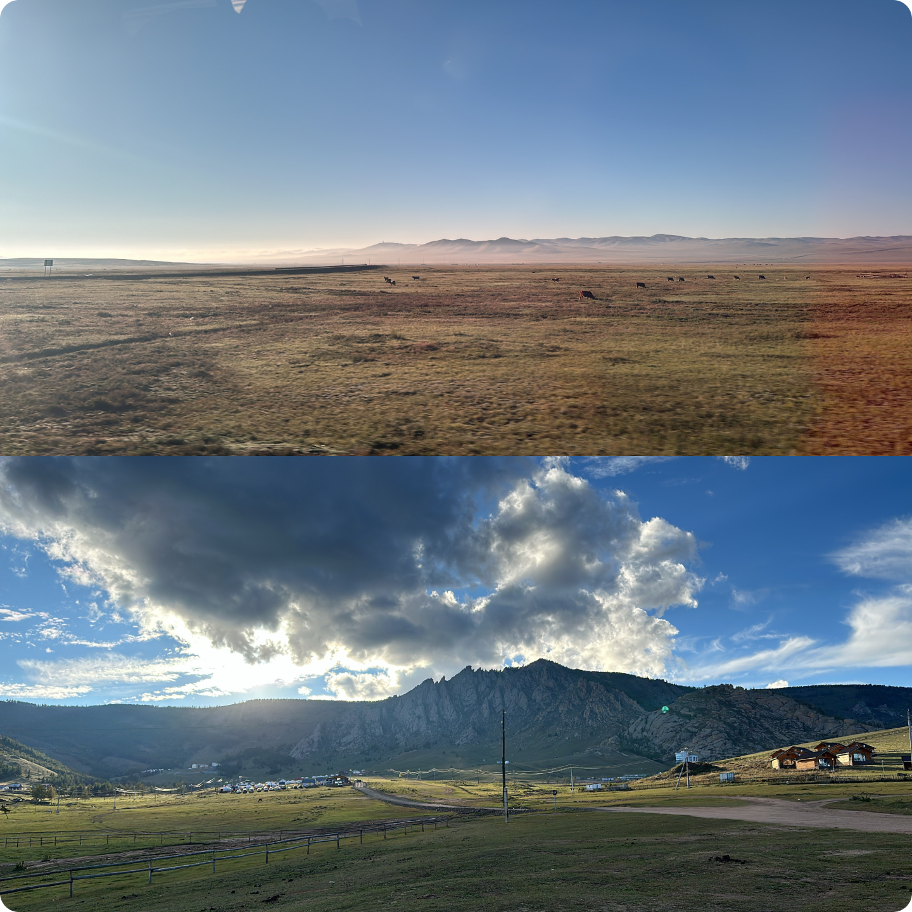

## 몽골 다녀왔어요.

작년 2024년 9월 1일부터 4박 5일간 몽골 여행을 갔다왔다.
내가 좋아하는 사람들과 함께가서 더 값진 추억이었던 것 같다.

우리 일행은 오직 하늘에서 떨어지는 수많은 별을 보기 위해 몽골 여행을 갔다해도 과언이 아니었다.
수많은 별 뿐만 아니라 광활한 대지, 사막과 초원이 공존하는 이질적인 풍경들이 정말 인상적이었다.

나는 별똥별이 떨어지는 걸 실제로 눈으로 볼 수 있다는 걸 몽골가서 처음 알았다.
사막에 있었던 날 밤에 일행들과 다같이 바닥에 누워서 가만히 별만 한시간은 쳐다본 것 같다.
그 풍경을 보는 실시간으로 감정이 벅차올랐다.
초점을 맞추지 않고 흐릿하게 있으면 점점 별이 나한테로 쏟아지는 느낌과 별이 점점 많아지는 현상을 신기해하면서 그렇게 끝없이 빠져들었다.

몽골은 사실 편하게 다녀올 수 있는 휴양지 느낌의 여행지는 전혀 아니다.

몽골은 워낙 땅이 넓어서 이동 시간이 하루에 길게는 7시간 걸리는 하루도 있고, 숙소 퀄리티도 너무 복불복이었다.
시간을 정해서 전기가 사용한 곳도 있었고, 50명은 넘게 있는 곳에서 샤워실은 하나 밖에 없어서 줄서서 기다리거나
그 마저도 샤워실이 너무 빈약해서 발 두개를 겨우 딛을 수 있는 좁고 높은 욕조 위에서 샤워를 해야했다.
게르의 침대는 정말 딱딱했고, 일교차는 얼마나 심한지 낮에는 반팔을 입어도 더운데 밤에는 옷을 걸쳐도 추웠다.

그럼에도 불구하고 차를 타고 가다가 만나는 동물 떼들, 차에서 삶의 전반적인 토론을 하면서 흘러나오는 노래를 흥얼거리고
아침 일찍 일어나 언덕 위를 올라가서 숙소 앞에서 친구들이 캐치볼을 하는 모습을 보는 것
그리고 밤에 하는 보드게임과 캠프파이어, 그리고 마지막으로 끝없이 달려도 끝나지 않을거 같던 넓은 대지와
사막 정상에서 모래썰매를 타다 저 멀리 매드맥스처럼 오토바이를 타고 사막을 가로지르는 모습은
다시금 몽골을 떠올리게 하기에 충분했다.

약 4개월이 지난 다시 회상을 해도 다시 가고싶다.

## 몽골 여행을 간다는 것

울란바토르(몽골의 수도)로 가는 비행기를 끊었다면 그때부터 차근차근 스탭을 밟으면서 여행 준비를 해야한다.

### 기간

몽골의 성수기는 6월부터 9월까지로 그 이후는 날씨가 한국에서 웬만한 겨울보다 춥기 떄문에 선호하지 않는다.
가고싶다면 말리진 않는다.

그리고 가는 날짜도 중요한데, 밤하늘의 별을 보기 위해서는 달의 위상을 꼭 확인해봐야 한다.
달이 없거나 달의 위상이 월삭에 가까운 날짜를 골라서 가야 달빛의 영향을 받지 않기 때문에 별이 잘 보인다.
보통 사막 지역에 갔을 때 별이 잘 보이기 때문에 달이 없는 날에 사막을 가는 경우가 많다. (우리가 그랬다.)

### 날씨

내가 갔던 9월초는 햇빛이 뜨거운 낮에는 반팔을 입고 돌아다닐 정도로 더웠고, 에어컨이 필수였다.
그리고 해가 지면 급격하게 온도가 내려가서 바람막이를 입고 다녔다.

성수기에 간다면 패딩까지는 챙기지 않아도 된다.
특히 잘 때는 추울 수 있기 때문에 핫팩을 챙겨서 침낭 아래에 두고 자면 전기 장판 느낌이나서 좋다.

### 장소

몽골은 크게 두가지 코스로 나뉜다. 중부 코스 혹은 고비사막 코스 이렇게 크게 두가지로 나뉜다.
아래 사진에서 빨간색 원과 파란색 원이 그 두가지 코스다.

고비사막 코스는 이번에 내가 갔다온 코스로, 몽골을 온전히 느낄 수 있었다.

대표적으로 울란바토르(수도)를 시작으로 아래로 쭈욱 내려가서 바양작, 헝거링 엘스(고비사막), 욜링암, 차강소브라가와 같은 장소들을 들리게 된다.
욜링암과 같이 산악 트래킹을 하는 느낌의 장소도 있고 초원과 사막이 섞인 이국적인 고비사막, 그리고 협곡 같은 차강소브라가와 같은 장소도 있다.

중부 코스는 고비 사막보다는 휴양의 느낌을 조금 더 낼 수 있다.

주된 장소는 홉스골이다. 홉스골은 거대한 담수호인데, 몽골에서 가장 큰 민물 호수인데 호수 자체 크기만 제주도의 1.5배 크기니까
거의 바다를 상상하면 될거같다. 엄청나게 맑은 호수에서 투명 카약을 타는 액티비티도 있다고 하니 나도 꼭 몽골에 다시간다면 중부 코스로 갈 것 같다.

홉스골을 가기전에 쳉헤르 온천, 테리힝차강호수, 신이데르 등 다양한 곳들을 들릴 수도 있다.

### 차량

몽골은 대한민국(남한)의 면적보다 15.6배 넓은 대지 면적을 가지고 있다. (몽골: 1,564,116km²
대한민국(남한): 100,210km²)

그러다보니 이동시간이 되게 길다. 보통 하루에 한 장소씩 방문하고, 그 근처의 숙소에 머무르는 것이 대부분의 패키지 형식인데
한 장소에서 한 장소로 이동하는 시간이 길면 7시간에서 8시간까지도 걸린다. 나의 경우는 아침 8시에 출발해서 오후 5시에 도착한 곳이 있었다.

또한 몽골의 지형은 대부분이 오프로드다. 나는 맨 처음에 오프로드라고 하길래 `아 그냥 한국에서 비포장도로 정도의 느낌인가?` 하고 안일하게 생각했다.
근데 그렇게 생각하고 가면 지옥을 맛볼 수 있다. 일반적인 도로도 구멍이 뚫려있거나, 깨진 곳이 엄청 많기 때문에
운전사분이 운전 중간에 좌우로 흔들어대는데 그게 일부러 그러는게 아니라 깨진 도로를 피하기 위해 트위스트를 추는 것이다.

그리고 본격적으로 길이 없는 오프로드로 진입하게 되면 안에서 책을 읽거나, 잠을 편하게 자는건 불가능하다.
그래서 이동시간이 긴 만큼 차량 안에서 뭐할건지도 되게 중요한 문제지만 차량 자체 선택도 되게 중요하다.

여행사에서 제공하는 차량은 대표적으로 두 가지 중에 하나다.

- **푸르공**을 선택할 것이냐.
- **푸르공**을 선택하지 않을 것이냐. (스타렉스, 하이스, 도요타 등)

푸르공은 본래 짐을 옮기는 목적의 차량으로 사람을 옮기기 위해 설계된 차는 아니다.

덕분에 짐을 실을 공간이 다른 차량보다 더 많다고는 하는데, 나는 그게 크게 눈에 띌 만큼의 정도인가 싶긴했다.
(지인이 같은 날에 여행을 갔는데 나는 스타렉스, 지인은 푸르공을 탔다.)

그리고 오프로드에 잘 달린다. 이 부분을 제일 뼈저리게 느낀 곳은 욜링암 가는 길이었다.
욜링암은 협곡지대다 보니까 가는 길이 험하다.

푸르공은 차 몸통 자체가 높고, 바퀴와 되게 떨어져있어서 땅에 찰싹 잘 붙어서 굴러간다.
하지만 스타렉스는 차 몸통 높이가 되게 낮고, 바퀴와 밀착되어 있는 느낌인데 그러다 보니 4개의 바퀴가 지면에 한꺼번에 닿지 않을 때 문제가 된다.
그런 곳이 있냐고? 당신이 무엇을 상상하든 그 이상이다.

이렇게만 들으면 푸르공을 무조건 타야할 것 같은데, 푸르공도 나름의 단점이 있다.

일단 에어컨이 없다. 더울 땐 창문을 열면 되지 않느냐 하지만 사막과 같이 모래가 많은 곳을 달릴 때는 창문을 열고 있으면 흙 먼지를 그대로 마시게 된다.

그리고 아무래도 짐을 위한 차량이다 보니 승차감은 아무래도 다른 승용차들 보단 기대하면 안된다.

제공되는 차량 자체의 연식이나 운전 기사분의 운전 실력, 섬세함에 따라서 조금씩 달라질 순 있어도 대부분의 장단점은 이정도로 축약할 수 있다.

아마 푸르공을 선택하는 대부분의 사람들은 길게 가는 여행도 아니니 사진 찍기 좋고 (푸르공은 차 위에 올라가서 사진을 찍을 수 있다.),
몽골 갬성이 풍부하게 느끼고 싶어서 승차감과 에어컨은 포기해도 가곘다는 사람이 있고

나는 그래도 에어컨은 꼭 있어야 하고, 모래 바람은 너무 힘들고 갬성 사진은 필요없다는 사람들이 있다.

이거는 같이 가는 사람들과 논의해서 잘 선택하면 되는 부분이다.

### 여행사

자 이제 날짜와 장소 그리고 차량까지 정해졌다면 이 요구사항을 받아줄 여행사가 필요하다.

몽골 여행이 처음이라면 여행사를 거의 필수로 구해야 한다.
쓰는 언어도 너무 다르다 보니 몽골어를 아는게 아니라면 그냥 여행사를 구해서 가이드와 운전 기사분과 함께 여행을 하는게 낫다.

이 부분이 아마 모든 사람들이 어려워 하는 부분이 아닐까 싶다.

[네이버 러브몽골 카페](https://cafe.naver.com/lovemongol)에 들어가서 가입을 하고 `견적문의` 탭에서
지금까지 정한 사항들을 잘 정리해서 글을 올리면 여러 여행사들이 댓글을 달아준다. 거기서 적당한 여행사를 선택해서 연락하면 된다.
아니면 몽골을 갔다온 지인중에 여행사를 추천받을 수 있다면 그것도 좋다.

구글이나 네이버에 여행사 이름을 한번 쳐보고 사이트가 있다면 들어가서 잘 관리가 되는지 정도를 확인하고,
아니면 그냥 연락해서 견적서를 한번 받아보는게 빠를 수도 있다. 보통 카카오톡으로 연락하고 `제가 이런 요구사항이 있어요.` 라고 말하면
그 요구사항을 반영해서 PDF 파일로 견적서를 보내주는게 대부분 인 것 같았다. 해당 파일을 보고 판단을 해도 된다.

### 동행 구하기

보통 여행사에서는 6명을 구해왔을 때 인당 가격이 제일 싸진다. 그래서 동행을 구해서 많이 가는 편이다.

동행을 구하는 것도 일인데, 네이버 러브몽골 카페에서 `몽골에 함께 갈 사람!!!` 탭에서 글을 꾸준히 올리다 보면
댓글로 희망한다는 사람이 있다거나, 아니면 그냥 오픈카카오톡방을 만들어놓고 거기로 연락을 하게끔 한다.

우리는 거의 1-2주 동안 매일 카페에 글을 20개 정도씩 올려서 겨우겨우 구했다.

우리 일행은 3명이었는데, 여행사에 연락해보니 남자가 아예 6명이거나 남녀가 반반 나뉘는게 낫다고 하더라.
왜냐하면 숙소가 3명 혹은 4명이서 머무는 곳이 많다보니 여자만 1명이거나 2명이면 숙소 분배가 되게 애매해진다고 했다.
근데 맨 처음에 여성분 한분이 연락을 주셔서 자연스럽게 그 이후론 여성분을 구하게 됐다.

난 어찌저찌 좋은 사람들을 만나서 가기전에 저녁도 한번 같이 먹고
가서도 별탈 없이 잘 다녀왔던 것 같다. 하지만 이건 운이 좋은 케이스이고 아닌 케이스도 있다고 했다.

우여곡절 끝에 이렇게 몽골 여행을 잘 다녀왔다.

## 보이는 문제점들

나는 위의 정보들을 내가 직접 찾아보고 경험하면서 획득했는데 그 사이에 느낀 불편함들이 너무 많았다.

여러 측면에서의 불편함과 비효율 그리고 가능성을 느꼈는데,
여행 시장, 처음 여행가는 여행자의 측면, 여행사와 소통 측면, 마지막으로 동행 구하기의 측면이 있었다.

### 여행 시장

다양한 여행 관련 플랫폼들이 많다. 야놀자, 여기어때, 트립닷컴, 아고다, 마이리얼트립, 트립소다, 인터파크 등...
이 플랫폼들의 공통점은 **모든 나라를 대상으로 한다는 것**이다. 사실 여행지 하나만 해도 해당 여행지에만 필요한 정보나 꿀팁들이 있을거다.
어느 누가 몽골 여행가서 운전 기사분이 깨진 도로를 피하기 위해 트위스트를 하루에 몇십번은 넘게 경험할거라고 상상이나 했겠는가.

해당 플랫폼들은 모든 나라를 대상으로 하다보니, 아무래도 기능이나 모든 정보들이 한 나라를 대상으로 하는 플랫폼보다는 자세하지 않을 가능성이 높다.
모든 나라를 아우를 수 있는 폼을 만들지, 한 나라에만 사용되는 폼을 만들지 않을거같았다.
아마 내 예상과 다르게 이미 하고 있어도 시간이 갈수록 그 간극은 더 벌어질 수 있다고 생각했다.

내가 이 여행 시장을 평정할 프로덕트를 만들면 참 좋겠지만, 내가 먹을 수 있는 파이만 충분하다면 해볼만한 싸움이라고 생각했다.

### 처음 여행가는 여행자의 측면

일단 내가 위에서 설명한 장소, 날짜, 차량, 여행사, 동행 말고도 액티비티, 준비물, 여행사에 요구할 수 있는 물품, 추가적인 꿀팁 등
필요한 정보가 너무 많고, 직접 경험해보기 전에는 알려주는 사람이 없다. 지인이 있다면 물어볼 수 있는데, 지인도 이 모든걸 설명하다가 지칠거고
세세한 내용까지는 놓치는 경우가 많을거다.

나는 지인이 여행사에서 받은 견적서를 나한테 줬는데, 당연히 참고하는데 많은 도움이 됐지만
정답지를 보고 문제를 푸는 것과 내가 생각할 수 있는 여러 선택지를 열어놓고 고민을 하는 것은 결과의 차이가 또 달라진다고 생각한다.

### 여행사와 소통 측면

나는 이 부분에서 상당히 많은 불편함을 느꼈다.

일단 맨 처음에 여행사를 구할 때는 러브몽골에 내 요구사항을 열심히 적어서 올렸더니
`요기로 카톡주세요.` 하는 댓글만 10개 정도가 달려있었다. `이걸 원해요, 얼마일까요?` 질문을 했는데,
`자, 이중에서 어떤 여행사를 고를거에요?` 와 같은 또 다른 질문을 받은 느낌이었다.

그럼 여행객이 일일이 카톡 아이디 입력하고, 다시 요구사항을 복사하거나 일일이 다시 쳐서 카톡을 보내야한다.
그렇게 연락에 성공하면 여행사의 인사를 겨우 받을 수 있다.

나는 돈을 지불하는 고객이 왕이니까 여행사가 먼저 연락해야지 이런 측면이 아니다.

최근에 이사를 하면서 당근의 전문가 모드에서 반포장 이사를 하게 됐는데 그 경험이 되게 좋았다.
내가 옮겨야 하는 짐을 사진으로 찍고, 요구사항을 적으면 여러 이사업체에서 나에게 가격 제시를 해준다.
그럼 나는 여행사의 후기와 평점 그리고 제시해준 가격을 보고 결정만 하면 된다.

이런 시스템을 `역경매` 시스템이라고 하는데 다양한 곳에서 이런 흐름으로 가는건 이유가 있다고 생각했다.
여행객이 여러 여행사를 비교하고 선정할 수 있는 최적의 환경은 아니었다.

또한 금전 거래도 여행사에서 그냥 계좌번호를 나에게 주고 요기로 이체하면 된다고 했다.
그때는 별 생각없이 이체하고 확인 부탁한다는 식으로 신뢰기반 거래를 했었는데 지금 생각하면 아찔하다.

### 동행 구하기의 측면

동행을 구할 때도 여러 불편한 점이 있었다.

우리는 여행사를 정해놓고 동행을 구하기 시작했는데 러브몽골에 하루에 20개의 글을 올리면서 동행을 구했다.
그 도중에 여행사에서 계획을 살짝 틀어서 우리가 동행을 구하기 위해 입력해놓은 정보들이 가짜가 되어버렸다.
몇십개가 넘는 글을 일일이 찾아서 바꿀 수는 없는 노릇이었다.

최근에는 [해당 기사(60만 여행 유튜버도 당할 뻔…몽골 가려다 288만원 날린 사연)](https://www.seoul.co.kr/news/society/2024/12/24/20241224500180?wlog_tag3=naver)처럼
개인간 금전 거래에 대한 사기도 있었다. 아무래도 신뢰 기반으로 거래를 하다보니 이런 문제가 생기는건 당연한 수순인 것 같았다.

동행을 구할 때 쓰는 글의 내용과 여행사에 요구하는 요구사항의 글이 비슷하다. 그래서 어느정도 정형화된 데이터 포맷이 있다고 생각했고
글을 여러번 써서 소통하기 보다는 진실의 원천을 한 곳에 두고 그걸 바탕으로 소통하면 좋을거같았다.

이 모든 정보들을 유튜브를 찾아보거나 블로그들을 전전하며 직접 수집해야한다.
그리고 주변에 몽골을 다녀온 친구가 직접 붙어서 케어를 해주는게 아니면 직접 경험하진 않고서는 사전에 알 수 있는 정보가 너무 한정적이다.
위에서 설명한 여러 문제점 이외에도 엑셀 시트로 유저 관리를 한다던지와 같은 문제들도 플랫폼으로 해결할 수 있지 않을까 했다.

그래서 생각했다.

모든 SaaS는 엑셀에서 시작하고, 네이버 카페에서 성장하며, 독립적인 플랫폼으로 진화하는 것처럼
내가 네이버 카페를 대체할 수 있는 플랫폼을 만들 수 있지 않을까? 더 나아가 오지 여행을 쉽고 안전하게 갈 수 있는 플랫폼을 만들 수 있지 않을까 했다.
목표는 뾰족하게 꿈은 원대하면 좋으니까.

**아, 몽골 여행을 위한 플랫폼을 만들자.**

## 그래서 만들었습니다. Pack & Go

<Callout>
[Pack & Go, 팩앤고, pkng.kr](https://pkng.kr/), 몽골 여행을 쉽게 설계할 수 있는 플랫폼
</Callout>

아직은 기능들이 많이 부족하지만 일단 시장에 내놓고 계속 발전시켜 나가면 되니까 일단 공개를 한다.

이름은 `너는 짐만 싸서 가` 라는 느낌으로 `Pack and Go`로 지었다.

어쨌든 모든 문제를 한꺼번에 풀 수는 없으니 MVP를 위한 페르소나를 정의했다.

- 몽골 여행을 가고싶은데 아무 정보도 모르는 사람
- 몽골 여행에 대한 대략적인 계획은 잡혔는데 동행이나 여행사를 구해야 하는 사람

이 글을 쓰는 시점에 제공하는 기능은 다음과 같다.

### 유저 가이드 문서

<Callout>
[Pack & Go 몽골 유저 가이드 문서](https://pkng.kr/mongolia/user-guide), 몽골 여행에 대한 대략적인 정보가 궁금하면 들어와.
</Callout>

해당 페이지는 블로그 컨텐츠의 성격이 강하다.

일단 필요한 정보를 한 눈에 볼 수 있는 페이지가 그래도 있어야 할거같아서 만들었다.
지금 이 글로도 대체할 수 있을거같긴하지만 일단 페이지 유입을 많이 늘리기 위해서도 있다. 그래야 신뢰가 쌓이고 SEO가 높아질 것 같았다.

어쨌든 몽골 여행을 가는 사람들끼리 서로 공유할 수 있는 페이지를 만들고 싶었다.
이 페이지만 봐도 대충 어느정도 대략적인 느낌을 잡을 수 있게 만들었다.

달 없는 날을 쉽게 볼 수 있는 달 위상 달력도 제공하고,
차량에 대한 장단점을 살펴보고, 주요 명소의 내가 찍은 대표 사진들도 올려놨다.

동행을 구할 때 사람들이 많이 쓴 내용들을 바탕으로 템플릿도 만들어놓고,
여행사에 문의할 때 어떤식으로 문의하면 되는지 대략적인 내용들을 적어놨다.

현재는 `꿀팁 모음집` 정도의 느낌이지만, 추후에는 폼을 연결해서
해당 페이지에서 그냥 가볍게 체크하고 넘어가면 해당 데이터를 기반으로 계획을 어느정도 만들어주는 기능도 생각하고 있다.

### 계획 만들기

<Callout>
[Pack & Go 몽골 계획 만들기](https://pkng.kr/mongolia/funnel), 몽골 여행 계획을 만들자.
</Callout>

들어오면 몽골 여행에 필요한 전반적인 정보를 퍼널만 따라오면 입력할 수 있고,
그렇게 생성된 계획을 기반으로 동행을 구할 때도 링크 공유해서 쓰고, 여행사와 소통할 때도 사용할 수 있다.

`날짜` -> `장소` -> `차량` -> `현재 동행 정보` -> `원하는 동행` -> `여행사 관련` 정보를 차례대로 입력하고 나면
하나의 계획이 만들어진다. 만들어진 계획의 링크를 러브몽골에 올리면 된다.

만들어진 계획의 링크를 공유했을 때 서버에서 계획의 데이터를 읽어서 계획의 여러 데이터를 통해서
링크의 title, description 그리고 OG Image까지 동적으로 생성할 예정이다.

그럼 대략적인 정보를 링크만 공유해서 나오는 Open Graph를 통해서 알 수 있고, 자세한 내용이 궁금하다면 들어가서 보면된다.
내용이 수정되어도 작성자가 교체하면 되고 해당 내용을 바탕으로 추후에는 여행사에 견적문의를 버튼 하나로 하고
여행사는 해당 계획을 보고 가격 제시를 하는 식으로 `역경매`의 시스템을 구축할 수 있다.

### 혹시나 몽골 여행을 고려중인가요?

자, 이제 이 글을 보고 몽골 여행을 가고싶어졌거나 주변에 가려는 지인이 있다면 해당 글을 공유해주고 `Pack & Go`를 공유하면 된다.
(그리고 계획을 생성하고 러브 몽골에 공유해주면 정말 감사합니다...)

- 요기 정리 진짜 잘 해놓은 [몽골 가이드 문서](https://pkng.kr/mongolia/user-guide) 있어!
- 팩앤고에서 계획 만들고 그걸로 동행이랑 여행사 구하면 되던데?

혹은 `jung660317@naver.com` 으로 연락을 주시거나, [유저가이드 문서](https://pkng.kr/mongolia/user-guide)에 채널톡도 달아놓았으니 몽골 여행에 관심을 표출해준다면 제가 직접 나서서 도와줄수도...?
새로운 아이디어나 불편한 부분의 의견을 주신다면 적극적으로 반영해보겠다. (꾸벅)

## 이제 시작이다.

아직 개발해야 하는 기능과 과제들이 많다.

- 어떻게 하면 러브몽골에 자연스럽게 녹아들까?
- 여행사를 어떻게 하면 입점시킬까?
- 지인 추천을 통해 자연스러운 유입이 일어나려면 어떻게 해야할까?

최우선 과제는 `어떻게 하면 러브몽골에 자연스럽게 녹아들까?` 에 대해서 계속 고민을 하고 있다.

일단 지속적으로 링크 공유가 일어나야한다. 동행을 구할 때 모든 사람들이 팩앤고를 통해서 소통하고, 자신의 계획에 대해서 설명하는 것.
사실 유저 유입만 있으면 그 이후의 단계는 쉬워질거라고 감히 예상한다. `우리 이만큼 유저 가지고 있고, 여행사 네가 들어오면 우리 유저들 소개시켜줄게` 라고 하면 들어오지 않을 여행사가 있을까?
근데 거기까지 가기가 쉽지 않을 것 같다.

이런 블로그 글을 쓰고, 유튜브 영상을 만들고 SNS에 공유하고 하는건 사실 `간접적 공유` 에 가깝다.
이 글을 보는 사람 대부분은 몽골 여행을 생각해본 적도 없는 사람이 대부분일테고, 관심이 없을 가능성이 높다.

`직접적 공유`는 인스타그램 광고를 하거나, 구글 광고를 붙여보는 것
그리고 러브 몽골에서 지금 동행을 구하고 있는 사람들에게 직접 연락하는 것 정도가 될 수 있을 것 같다.

아무래도 회사를 다니면서 진행하는 말그대로 `사이드 프로젝트`다 보니까 아직 완성도가 높지 않고 개발이 좀 더뎌지는 느낌이 있다.
그래도 꾸준히 하나하나씩 해결해나가려고 한다. 그리고 이 열정을 꾸준히 유지하는 것도 정말 어려운데 이건 수많은 사람들이 경험해봤을 것 같다.

앞으로 꾸준히 블로그에도 개발 일지를 올릴 예정이다.

내가 팩앤고로 몽골 여행을 다시 가는 날까지, 팩앤고로 여행가는 유저가 생길 때까지 화이팅!
