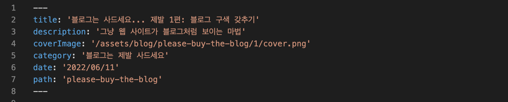
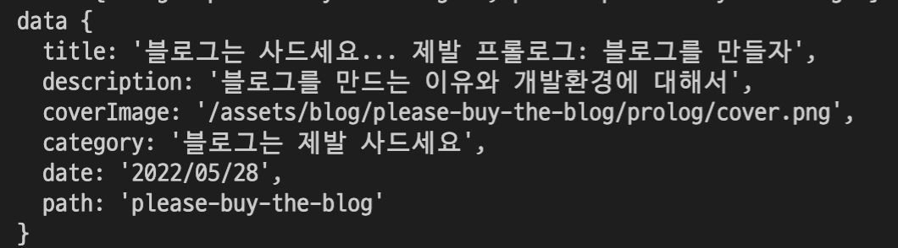
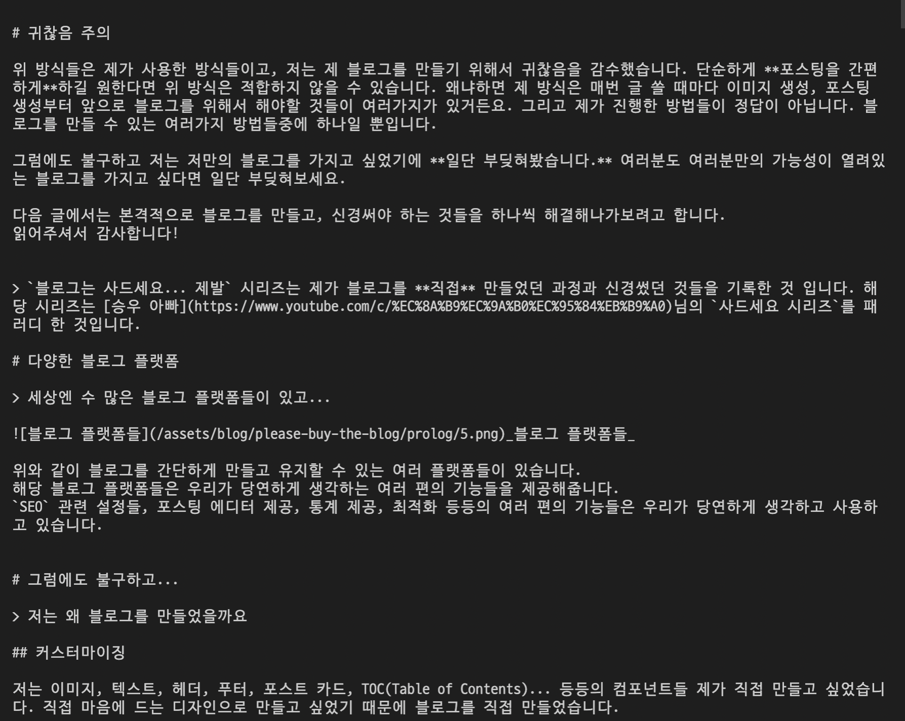
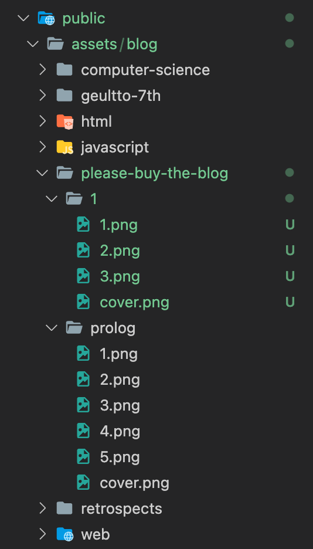

> `블로그는 사드세요... 제발` 시리즈는 제가 블로그를 **직접** 만들었던 과정과 신경썼던 것들을 기록한 것 입니다. 해당 시리즈는 [승우 아빠](https://www.youtube.com/c/%EC%8A%B9%EC%9A%B0%EC%95%84%EB%B9%A0)님의 `사드세요 시리즈`를 패러디 한 것입니다.

# 블로그처럼 보이는 웹 사이트

> 사실 블로그는 별 거 없습니다.

우리가 블로그를 직접 만든다고 하면 뭔가가 무서워져 오는 마음을 걷잡을 수 없을겁니다. 뭐부터 해야하는지 모르니까요. 저도 처음에 그랬습니다. 그런데 막상 블로그를 직접 만들어보고, 몇 가지 편의성을 포기(?)한다면 블로그 구색을 갖추는 것은 그렇게 어렵지 않습니다.

블로그를 만드는데 필요한 기능들이 뭐가 있을까요? 제가 생각했을 때 블로그에서 제일 중요하고, 없으면 안되는 기능은 **포스팅** 기능이라고 생각합니다.

제가 **블로그처럼 보이는 웹 사이트**라고 적은 이유는 단순히 웹 사이트를 만드는데, 말 그대로 블로그처럼 보이게 만든다라고 생각하면 쉽습니다.

포스팅 기능이라고 해서 뭔가 대단한게 있는게 아닙니다. 정말 생각보다 간단하게 구현할 수 있었습니다. 제가 구현한 방법을 소개하려고 합니다.

# 포스팅 기능, 저는 이렇게 만들었습니다.

> 포스팅 기능에는 무엇이 필요할까요?

우선 블로그 포스팅을 하려면 여러 가지가 필요할 것 같습니다. 

- 글을 쓰고, 여러 하이라이팅 기능과 함께 웹 페이지에 잘 보여주기
- 이미지 또는 움짤 업로드도 필요
- 댓글 시스템

이 정도면 대충 블로그의 느낌이 날 것 같습니다. 썸네일이나 포스팅 카드 같은 컴포넌트는 위의 기능들이 완료 됐다면 단순히 리액트 컴포넌트를 만드는 것 처럼 만들면 됩니다.

저는 위의 3개의 기능을 어떤 서버 코드를 짜는 것도 아니고, 클라우드 시스템을 쓴 것도 아닙니다. 단순히 **깃허브**를 파일 저장소로 사용하고, **깃허브**의 기능을 이용한 댓글 시스템을 사용한 것 뿐입니다.

## 글쓰기 기능

> 마크다운

저는 **마크다운**을 사용해서 포스팅을 하고 있습니다. 마크다운을 사용했을 때 여러가지 이점을 누릴 수 있습니다.

- 간단하게 사용할 수 있는 문법으로 포스팅을 할 수 있습니다.
- `React`에서 많은 마크다운 뷰어 라이브러리를 제공해줍니다.
- 개발자스럽습니다.

저는 프로젝트 내에서 `_posts` 폴더에서 마크다운으로 글을 쓰고, 프로젝트를 실행하면 자동적으로 해당 마크다운 파일을 읽어 데이터를 들고와서 해당 데이터로 **포스트 카드**도 보여주고, 글도 보여주는 방식으로 진행됩니다.

저는 [Next.js examples | blog-starter](https://github.com/vercel/next.js/tree/canary/examples/blog-starter)에서 해당 아이디어들을 들고왔습니다.

저는 위의 예시 레파지토리의 파일들을 꼼꼼히 분석하고 제 프로젝트에 적용했습니다. 코드적으로 일일이 설명은 하지 않겠습니다. 다들 위의 레파지토리를 클론해서 이것저것 만져보다보면 금방 감이 오실겁니다!

간단히 포스팅이 어떻게 작성되고 보여지는지 흐름을 설명하자면



저는 블로그 포스트 마크다운 파일 맨 위에 해당 포스팅에 대한 여러 정보들을 적어놓았습니다.
그리고 해당 정보들은 [gray-matter](https://github.com/jonschlinkert/gray-matter) 라는 파서 라이브러리를 통해서 해당 데이터들만 추출할 수 있습니다.



위와 같이 데이터들을 뽑아올 수 있습니다.
위와 같이 데이터를 뽑기 위해서는 해당 파일의 경로를 알아야 합니다.

해당 파일의 경로를 알기 위해서는 주소를 이용하면 됩니다.
만약 블로그 포스팅의 경로가 `도메인주소/posts/blog-starter`와 같이 되어있다면, 해당 포스팅에 대한 마크다운 파일의 경로도 똑같이 작성하면 됩니다.

그래서 해당 경로로 들어오게 된다면 우리가 작성한 로직을 통해서 **해당 경로에 대한 마크다운 파일을 읽고**, 여러 필터링 과정들을 통해 유저들에게 컨텐츠를 보여주는 형식입니다.

1. 마크다운 형식으로 글을 작성한다. (맨 위에는 정보들을 적어야 함)
2. 유저가 **/posts/blog-starter** 경로로 들어온다.
3. **Next.JS**의 **getStaticProps**를 이용해서 현재의 경로를 우리가 만들어놓은 **api**에 넘긴다.
4. 우리의 **api**는 들어온 경로를 파악해서 해당 경로에 대한 마크다운 파일을 찾는다. (**fs**, **path**의 **join** 라이브러리 이용)
5. 찾은 마크다운의 데이터와 컨텐츠 내용을 분리시킨다. (**gray-matter** 라이브러리 이용)
6. 분리시킨 데이터들을 **getStaticProps**의 props로 반환한다.
7. 웹페이지에서 데이터들을 예쁘게 잘 보여주면 된다.

[제 프로젝트의 API 파일](https://github.com/junghyeonsu/junghyeonsu.dev/blob/main/src/lib/api.ts)의 링크를 첨부하겠습니다. 그리고 저는 [NextJS Blog Starter Example](https://github.com/vercel/next.js/blob/canary/examples/blog-starter/lib/api.js)에서 참고해서 코드를 작성했습니다.

지금 현재는 코드가 좀 많이 더러운데, 최적화가 필요할 것 같습니다. 여러분에게 소개하고 싶은 건 대충 이런 방식으로 포스팅이 작성된다는 것 입니다.

그렇게 넘어온 컨텐츠 데이터들은 아래와 같습니다.



그러면 해당 마크다운을 잘 보여주는 것이 필요합니다. 저는 [react-markdonw](https://github.com/remarkjs/react-markdown) 라이브러리를 이용해서 마크다운을 `HTML` 태그들로 파싱했습니다. 그리고 `react-markdown`의 장점으로 들어온 태그들을 자신이 직접 커스텀해서 보여줄 수도 있습니다.

```jsx
const CustomComponents = {
  h1({ ...props }) {
    // 자신의 커스텀 h1 태그 작성
  },
  h2({ ...props }) {
    // 자신의 커스텀 h2 태그 작성
  },
  h3({ ...props }) {
    // 자신의 커스텀 h3 태그 작성
  },
  code({ className, children, ...props }: SyntaxHighlighterProps) {
	  // 자신의 커스텀 code 태그 작성
  },
  img({ ...props }) {
	  // 자신의 커스텀 img 태그 작성
  }
};

const PostContentBody = ({ content }: BodyProps) => {
  return (
    <ReactMarkdown components={CustomComponents}>{content}</ReactMarkdown>
  );
};
```

작성을 한다면 이런식으로 작성할 수 있습니다!

## 이미지 업로드

> 글은 알겠어요... 이미지는요?

저는 이미지를 로컬에 저장하기로 했습니다. 다른 방식으로는 `CDN`에 올리고 링크만 로컬 마크다운 파일에 작성하는 방식, 이미지 링크 추출해주는 사이트에서 이미지 올리고 해당 링크만 마크다운에 작성하는 방식 등등 또 제가 모르는 여러가지 방식이 있을 것 같습니다.

저는 다음과 같은 이유로 로컬에 저장했습니다.

- 백업 용도
- 저장공간이 아직 넘쳐납니다.
- 간단합니다.

`Next.JS`에서는 이미지를 `public` 폴더안에 저장을 합니다.



저는 위와 같이 이미지들을 관리하고 있습니다. 폴더명은 해당 포스팅 URL과 동일하게 작성했고, 썸네일 이미지는 `cover`라는 이름으로, 그 이후에 올라오는 이미지들은 순서대로 번호를 붙여서 관리하고 있습니다. (나름의 컨벤션)

제 블로그도 포스팅이 엄청 많아지고 이미지들도 엄청 많아지면 다른 방법을 모색할 필요가 있을 것 같습니다.

## 댓글 시스템

> 오케이 이미지까지는 간단하네요.. 댓글은 그래도 어렵겠죠!?

이 세상에 똑똑한 사람들은 정말 많더라구요. 저희는 그 사람들을 이용하면 됩니다.

깃허브에는 아주 좋은 `issue`라는 기능과 `discussion` 기능을 적극 사용한 오픈소스들이 있습니다.

[Utterances](https://utteranc.es/)라는 깃허브의 `issue` 기능을 이용해서 댓글 기능처럼 보이게 하는 오픈소스가 있었습니다. 해당 오픈소스와 블로그의 레파지토리를 연결하고, 해당 컴포넌트를 해당 페이지 제일 하단에 보여주기만 하면 `issue`가 자동적으로 생기게 되고, 해당 이슈에 코멘트가 댓글 처럼 보이게 해주는 오픈소스입니다.

`Utterances`에 영감받아서 더 발전된 오픈소스가 있었습니다.

[giscus](https://giscus.app/ko)는 `Github Discusstions` 기능으로 작동하는 댓글 시스템이라고 설명되어 있습니다. `Utterances`와 동작, 연결 방식은 거의 똑같습니다. 하지만 `Discusstion` 기능이 댓글 시스템으로 조금 더 적합하다고 생각합니다.

이유는 `Discusstion`에는 대댓글을 달 수 있습니다. (`issue`는 안됩니다.) 또한 `giscus`에는 해당 포스트 전체에 대한 반응 개수를 표시해줍니다.

제가 `giscus`를 적용한 컴포넌트를 보고싶으면 [해당 링크](https://github.com/junghyeonsu/junghyeonsu.dev/blob/main/src/components/Giscus/index.tsx)를 참고하세요! 저렇게 컴포넌트로 만든 다음, 포스팅 페이지에 제일 하단에 위치시키면 자동적으로 적용됩니다.

저는 그리고 해당 [댓글 시스템만을 위한 레파지토리](https://github.com/junghyeonsu/junghyeonsu.dev.comment/discussions)를 따로 만들었습니다. 해당 레파지토리에서 `Discussion` 탭에서 제 포스트와 댓글들을 확인할 수 있습니다.

# 귀찮음 주의

요기까지 오셨으면 대충 블로그의 구색은 갖춰졌습니다.

위 방식들은 제가 사용한 방식들이고, 저는 제 블로그를 만들기 위해서 귀찮음을 감수했습니다. 단순하게 **포스팅을 간편하게**하길 원한다면 위 방식은 적합하지 않을 수 있습니다. 왜냐하면 제 방식은 매번 글 쓸 때마다 이미지 생성, 포스팅 생성부터 앞으로 블로그를 위해서 해야할 것들이 여러가지가 있거든요. 그리고 제가 진행한 방법들이 정답이 아닙니다. 블로그를 만들 수 있는 여러가지 방법들중에 하나일 뿐입니다.

그럼에도 불구하고 저는 저만의 블로그를 가지고 싶었기에 **일단 부딪혀봤습니다.** 여러분도 여러분만의 가능성이 열려있는 블로그를 가지고 싶다면 일단 부딪혀보세요.

다음 글에서는 본격적으로 블로그를 만들고, 신경써야 하는 것들을 하나씩 해결해나가보려고 합니다.
읽어주셔서 감사합니다!
