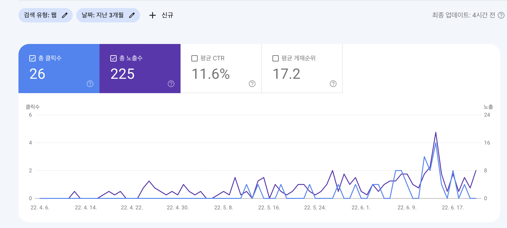
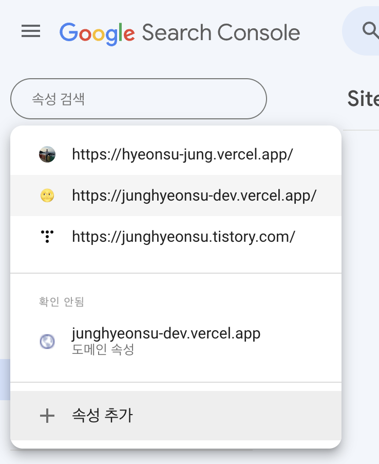
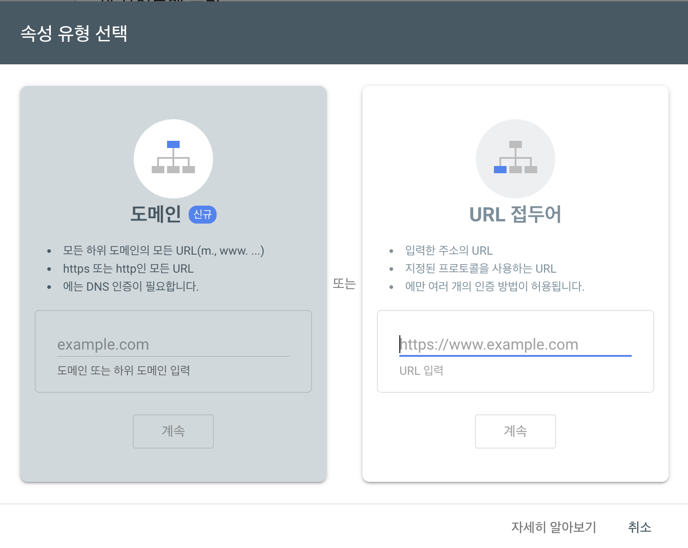
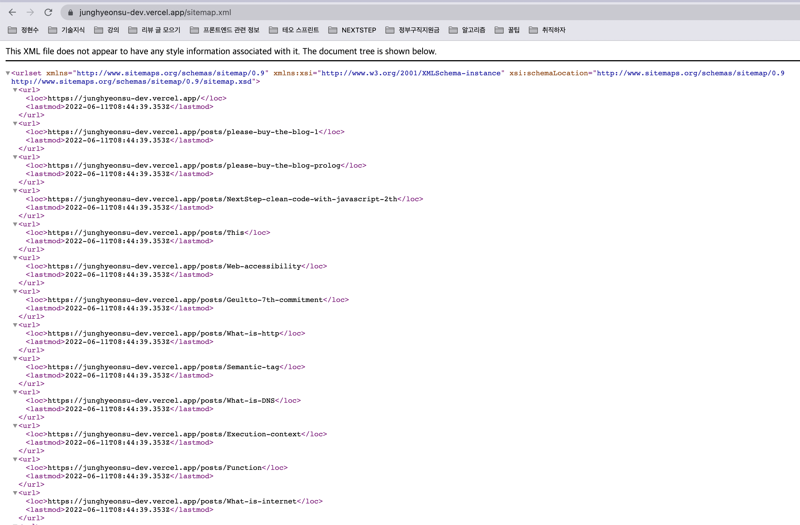
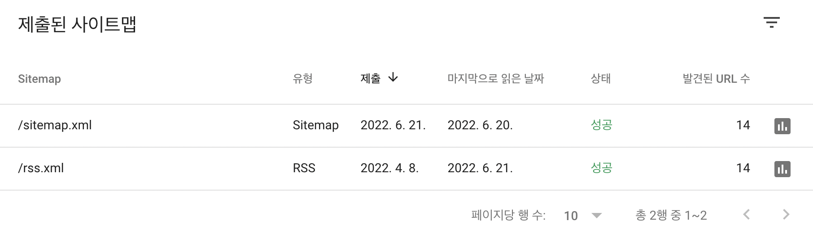
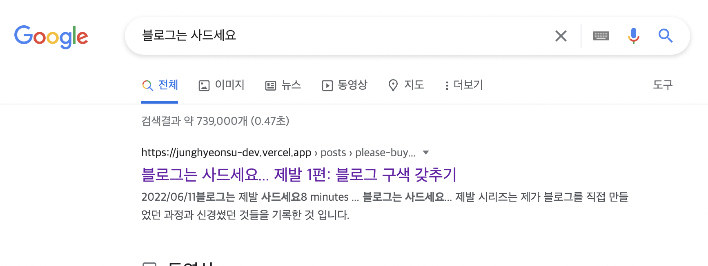

> `블로그는 사드세요... 제발` 시리즈는 제가 블로그를 **직접** 만들었던 과정과 신경썼던 것들을 기록한 것 입니다. 해당 시리즈는 [승우 아빠](https://www.youtube.com/c/%EC%8A%B9%EC%9A%B0%EC%95%84%EB%B9%A0)님의 `사드세요 시리즈`를 패러디 한 것입니다.

# 웹 마스터 도구

우리가 블로그를 만들면 그냥 검색이 되는걸까요? 아닙니다.

여러 포털 사이트들에서 검색이 되려면 포털 사이트들의 검색 로봇들이 우리 블로그를 잘 읽어갈 수 있도록 등록해주어야 합니다.
보통 포털 사이트에서 직접 사이트를 만든 사람들을 위해서 포털 사이트에 검색으로 표시가 되려면 어떻게 해야하는지에 대한 여러 가이드를 제공해줍니다. 그 가이드를 **웹 마스터 도구**와 비슷한 이름으로 제공됩니다.

> **Search Console**은 웹사이트 소유자가 Google 검색에서의 실적을 파악하고, Google 검색에서 표시되는 방식을 개선하기 위해 무엇을 할 수 있는지 이해하여 관련성이 높은 트래픽을 웹사이트로 유도하는 데 도움을 줍니다.

> 네이버 웹마스터도구는 본인이 운영하는 웹사이트의 검색수집, 색인반영 현황을 제공하고 검색에 친화적인 사이트로 관리하는데 필요한 진단 리포트를 제공하는 서비스입니다.

위와 같이 각각의 포털 사이트의 **웹 마스터 도구**는 해당 포털 사이트에 검색되도록 도와줍니다.

- [구글 웹 마스터 도구 (구글서치콘솔)](https://developers.google.com/search/docs/beginner/search-console?hl=ko)
- [네이버 서치어드바이저](https://searchadvisor.naver.com/)
- [다음 검색등록](https://register.search.daum.net/index.daum)
- [줌 검색등록](https://help.zum.com/submit)
- [빙 웹마스터스](https://www.bing.com/webmasters/about?mkt=ko-kr)

저는 구글과 네이버에 제 블로그 주소를 등록을 해놓았습니다.

## 통계 제공
 
> 다른 곳은 몰라도 **구글서치콘솔**은 꼭 등록하자!

구글서치콘솔을 등록하면 각종 블로그 플랫폼에서 제공해주는 통계 자료들을 제공해줍니다.



이렇게 잘 등록해놓으면 조금이나마 성장하는 모습을 볼 수 있습니다.

# 등록해보자!

> 구글서치콘솔을 기준으로 설명하겠습니다. 다른 포털사이트도 방식은 다 비슷합니다.

우선 [구글서치콘솔](https://developers.google.com/search/docs/beginner/search-console?hl=ko)로 이동하고 **속성**을 추가해야합니다.



속성 추가하기 버튼을 클릭하게 되면 **도메인** 혹은 **URL 접두어**를 입력하라고 나오는데 저는 **URL 접두어**를 통해서 제 사이트를 등록했습니다.

만약 도메인을 가지고 있다면 해당 도메인을 입력하시면 됩니다.



이렇게 등록하고 하루이틀 지나고 나면 구글서치콘솔에 통계가 뜨기 시작합니다. 등록하자마자는 뜨지 않습니다. (로봇이 우리 블로그를 탐색할 시간이 필요합니다.)

## sitemap 등록하기

> `sitemap`은 크롤러(로봇)들이 우리 웹 사이트를 방문해서 페이지들을 조금 더 잘 긁어갈 수 있도록 도와주는 파일을 의미합니다.
>
> [사이트맵 알아보기](https://developers.google.com/search/docs/advanced/sitemaps/overview?hl=ko)

사이트맵(sitemap)에는 우리의 블로그에서 페이지, 동영상 및 기타 파일과 같은 중요한 데이터 대한 정보들이 적혀있습니다.

저는 블로그 포스팅을 하고 자동적으로 `sitemap.xml` 파일을 생성되도록 해놨습니다.

저는 `Next.js` 프레임워크를 사용하고 있으므로 `getStaticProps` 메소드에서 `sitemap.xml`을 생성하는 스크립트를 실행해서 블로그에서 생성된 페이지를 긁어서 `sitemap.xml` 파일을 `public` 폴더에 생성하는 로직으로 구축해두었습니다.

`Next.js`를 사용한다면 [해당 블로그](https://medium.com/volla-live/next-js%EB%A5%BC-%EC%9C%84%ED%95%9C-sitemap-generator-%EB%A7%8C%EB%93%A4%EA%B8%B0-10fc917d307e)를 참고해보세요!

만약 정상적으로 생성되었다면 자신의 블로그 루트 주소에서 `/sitemap.xml`을 붙였을 때 정상적으로 사이트맵이 떠야합니다.



> [저는 이렇게 구현했습니다!](https://github.com/junghyeonsu/junghyeonsu.dev/blob/main/src/scripts/sitemap.js)

## rss 등록하기

> RSS(Rich Site Summary)는 뉴스나 블로그 사이트에서 주로 사용하는 콘텐츠 표현 방식입니다. 구글서치콘솔에 등록하는 사이트맵의 한 종류입니다.

`rss`는 [feedly](https://feedly.com/)와 같은 블로그 구독을 모아보는 서비스에서 우리의 블로그를 구독하기 위해 필요한 파일입니다.

또한 구글서치콘솔에는 `rss` 파일 또한 등록해서 검색엔진에 도움을 줄 수 있습니다.



한 번만 등록해놓으면 검색엔진이 알아서 주기적으로 들고가서 블로그에 어떤 포스팅이 생겼는지 파악을 합니다.

> [저는 이렇게 구현했습니다!](https://github.com/junghyeonsu/junghyeonsu.dev/blob/main/src/scripts/rss.ts)

## robots.txt

> robots.txt 파일은 크롤러가 사이트에서 액세스할 수 있는 URL을 검색엔진 크롤러에 알려 줍니다. 이 파일은 주로 요청으로 인해 사이트가 오버로드되는 것을 방지하기 위해 사용하며, Google로부터 웹페이지를 숨기기 위한 메커니즘이 아닙니다. 웹페이지가 Google에 표시되지 않도록 하려면 noindex로 색인 생성을 차단하거나 비밀번호로 페이지를 보호해야 합니다.
> 
> [Robots.txt 소개](https://developers.google.com/search/docs/advanced/robots/intro?hl=ko)

```ts
User-agent: Googlebot
Allow : / 

User-agent: Yeti
Allow: /

User-agent: *
Disallow: /

Sitemap: https://junghyeonsu-dev.vercel.app/sitemap.xml
```

`Yeti`는 네이버 크롤러의 이름이고, `Googlebot`은 구글 크롤러의 이름입니다.

저는 위와 같이 `robots.txt` 파일을 작성했습니다. 저는 구글과 네이버에 제 블로그를 등록해서 두 곳의 크롤러만 허용하도록 했습니다.

# 검색해보자



각종 포털 사이트들의 웹 마스터 도구를 적절히 사용해서 우리의 블로그를 검색되도록 했습니다.

사실 검색이 잘되려면 이것말고 신경써야 하는 것이 더 있습니다.

로봇이 긁어가는 정보를 잘 제공해주는 것 말고도 메타 태그 사용하기, 시멘틱 태그 잘 적용하기 등등과 같은 기술적인 부분들과 블로그의 사용성을 늘려 유입량을 늘리기, 재방문율 높이기와 같은 비기술적인 부분들도 존재합니다. 이거는 블로그를 만들며 계속 발전시켜 나가는 것 밖에 없는 것 같습니다.

2편까지는 블로그를 간단하게 만들고, 서치콘솔에 등록함으로써 크롤러들이 우리 블로그의 정보를 잘 들고갈 수 있도록 하였습니다.

다음 편부터는 제가 사용성을 좋게 하기 위해 적용했던 기술적인 부분 혹은 비기술적인 부분들을 하나씩 풀어나갈 것 같습니다.
