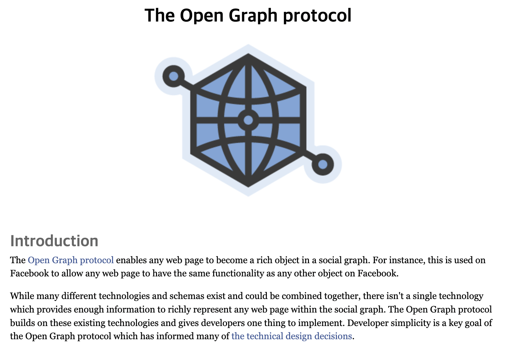
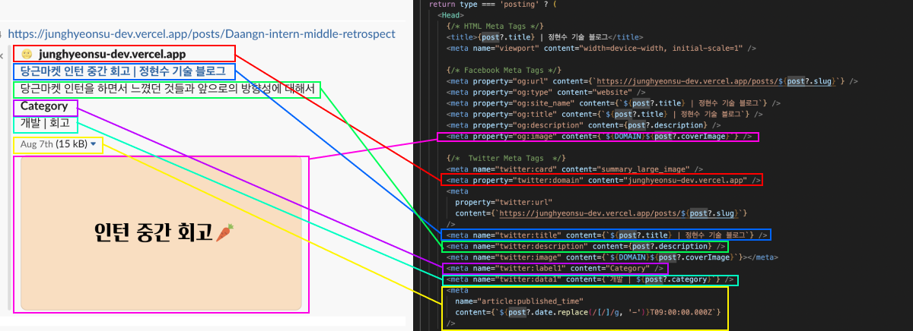
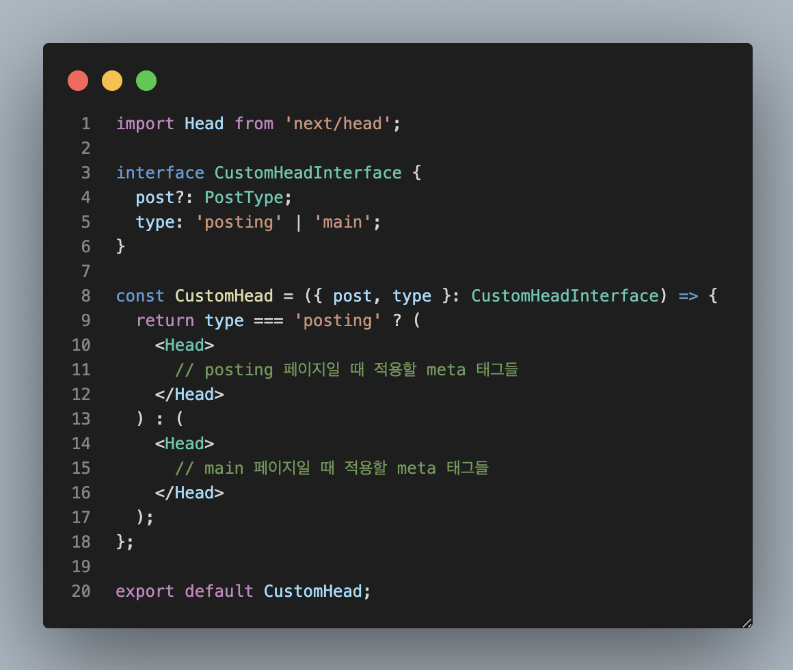
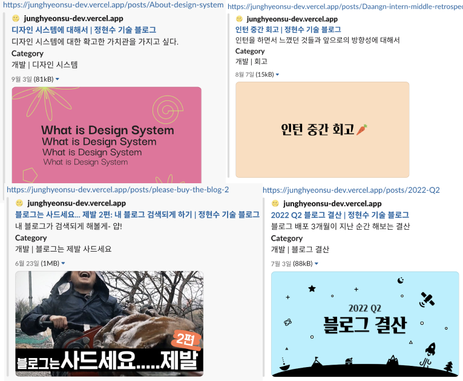

> `블로그는 사드세요... 제발` 시리즈는 제가 블로그를 **직접** 만들었던 과정과 신경썼던 것들을 기록한 것 입니다. 해당 시리즈는 [승우 아빠](https://www.youtube.com/c/%EC%8A%B9%EC%9A%B0%EC%95%84%EB%B9%A0)님의 `사드세요 시리즈`를 패러디 한 것입니다.

# 얘들아 나 블로그 만들었어!


우리는 인터넷 링크를 복사해서 카카오톡, 슬랙, 디스코드 등등 여기저기 공유를 할 수 있어요
공유를 했을 때 주소만 띡 간다면 별로 클릭하고 싶지도 않고, 무슨 주소인지도 모를수도 있죠.


위 사진처럼 해당 링크에 대한 정보가 이미지로든, 텍스트로든 뜨게 된다면 링크를 받는 입장에서는
조금 더 클릭해보고 싶고, 더 알아보고 싶고,,, 그래서 나온게 바로 `Open Graph` 입니다.

# Open Graph



[open graph](https://ogp.me/)는 페이스북에서 만든 프로토콜(통신 규약)입니다.

> Open Graph 프로토콜을 사용하면 모든 웹 페이지가 소셜 그래프에서 풍부한 개체가 될 수 있습니다.
> 예를 들어, 이것은 Facebook에서 모든 웹 페이지가 Facebook의 다른 개체와 동일한 기능을 가질 수 있도록 하는 데 사용됩니다.

라고 설명해놨는데, 간단히 요약하면 웹 페이지 링크를 공유했을 때 풍부한 정보를 제공하기 위한 것으로 볼 수 있습니다.

# 그래서 어떻게 할 수 있는데?

Open Graph는 `head` 태그안의 `meta` 태그를 통해서 노출할 수 있고,
이는 `next.js`에서 아주 쉽게 할 수 있습니다.

```html
<head>
	<meta property="og:title" content="The Rock" />
	<meta property="og:type" content="video.movie" />
	<meta property="og:url" content="https://www.imdb.com/title/tt0117500/" />
	<meta property="og:image" content="https://ia.media-imdb.com/images/rock.jpg" />
	<!-- ... -->
</head>
```

위는 `open graph` 공식홈페이지에 나오는 예시이고, `head` 태그안에 `meta` 태그에 여러 정보를 넣어서 표현할 수 있습니다.
어떤 종류의 `property`가 있는지에 대한 설명은 공식문서에 자세하게 나와있기 떄문에 요기서 하나하나 하지 않겠습니다.
(독자를 강하게 키우는 저자)



만약 블로그를 만들게 된다면 포스트에 대한 open graph를 따로 띄우고 싶을수도 있습니다.
그래서 저는 `main page`에서의 `head`와 `post page`에서의 `head`를 분리시켜놨습니다.



실제 코드는 아래와 같습니다.

```tsx
import Head from 'next/head';

import { DOMAIN } from '../../constants';
import type PostType from '../../types/post';

interface CustomHeadInterface {
  post?: PostType;
  type: 'posting' | 'main';
}

const CustomHead = ({ post, type }: CustomHeadInterface) => {
  return type === 'posting' ? (
    <Head>
      {/* HTML Meta Tags */}
      <title>{post?.title} | 정현수 기술 블로그</title>
      <meta name="viewport" content="width=device-width, initial-scale=1" />

      {/* Facebook Meta Tags */}
      <meta property="og:url" content={`https://junghyeonsu-dev.vercel.app/posts/${post?.slug}`} />
      <meta property="og:type" content="website" />
      <meta property="og:site_name" content={`${post?.title} | 정현수 기술 블로그`} />
      <meta property="og:title" content={`${post?.title} | 정현수 기술 블로그`} />
      <meta property="og:description" content={post?.description} />
      <meta property="og:image" content={`${DOMAIN}${post?.coverImage}`} />

      {/*  Twitter Meta Tags  */}
      <meta name="twitter:card" content="summary_large_image" />
      <meta property="twitter:domain" content="junghyeonsu-dev.vercel.app" />
      <meta
        property="twitter:url"
        content={`https://junghyeonsu-dev.vercel.app/posts/${post?.slug}`}
      />
      <meta name="twitter:title" content={`${post?.title} | 정현수 기술 블로그`} />
      <meta name="twitter:description" content={post?.description} />
      <meta name="twitter:image" content={`${DOMAIN}${post?.coverImage}`}></meta>
      <meta name="twitter:label1" content="Category" />
      <meta name="twitter:data1" content={`개발 | ${post?.category}`} />
      <meta
        name="article:published_time"
        content={`${post?.date.replace(/[/]/g, '-')}T09:00:00.000Z`}
      />
    </Head>
  ) : (
    <Head>
      {/* HTML Meta Tags */}
      <title>정현수 기술 블로그</title>
      <meta name="description" content="공부한 것들을 정리해서 올립니다." />
      <meta name="viewport" content="width=device-width, initial-scale=1" />
      {/* Facebook Meta Tags */}
      <meta property="og:url" content="https://junghyeonsu-dev.vercel.app/" />
      <meta property="og:type" content="website" />
      <meta property="og:site_name" content="정현수 기술 블로그" />
      <meta property="og:title" content="정현수 기술 블로그" />
      <meta property="og:description" content="공부한 것들을 정리해서 올립니다." />
      <meta
        property="og:image"
        content="https://github.com/junghyeonsu/junghyeonsu.dev/blob/main/public/profile.jpeg?raw=true"
      />
      {/*  Twitter Meta Tags  */}
      <meta name="twitter:card" content="summary_large_image" />
      <meta property="twitter:domain" content="junghyeonsu-dev.vercel.app" />
      <meta property="twitter:url" content="https://junghyeonsu-dev.vercel.app/" />
      <meta name="twitter:title" content="정현수 기술 블로그" />
      <meta name="twitter:description" content="공부한 것들을 정리해서 올립니다." />
      <meta
        name="twitter:image"
        content="https://github.com/junghyeonsu/junghyeonsu.dev/blob/main/public/profile.jpeg?raw=true"
      />
      <meta name="twitter:label1" content="Category" />
      <meta name="twitter:data1" content="개발" />
    </Head>
  );
};

export default CustomHead;
```

이제 이렇게 해서 배포를 하고 링크를 공유하면 해당 페이지의 `head` 태그안의 `meta` 태그를 읽어서 다양한 정보를 띄워주게 됩니다.



# 마무리

구글에 `open graph generator`라고 치면 OG를 쉽게 만들 수 있는 사이트도 있고, `open graph test`라고 치게되면 자신의 홈페이지에 잘 적용이 되어있나 확인을 할 수 있는 사이트도 있습니다.

- [open graph test](https://www.opengraph.xyz/url/https%3A%2F%2Fjunghyeonsu-dev.vercel.app%2Fposts%2FAbout-design-system)
- [open graph generator](https://smallseotools.com/open-graph-generator/)

블로그를 직접 만들기 시작하면 정말 신경써야 하는게 한 둘이 아닌 것 같습니다...
그냥 유명한 플랫폼을 쓰면 당연히 해주던 것들이 당연하지 않게 되거든요.
그렇게 해서 배우는 것들도 있고, 고마워 할 줄도 알게되는 것 같습니다.

`open graph`는 모든 사이트에 적용할 수 있습니다.
자신이 운영하는 사이트가 있다면 오늘 당장 `head` 태그안에 정보들을 넣어보는건 어떨까요
링크가 올라왔을 때 그냥 지나치는 사이트가 아닌 한번씩 눌러보는 사이트가 될 겁니다.
