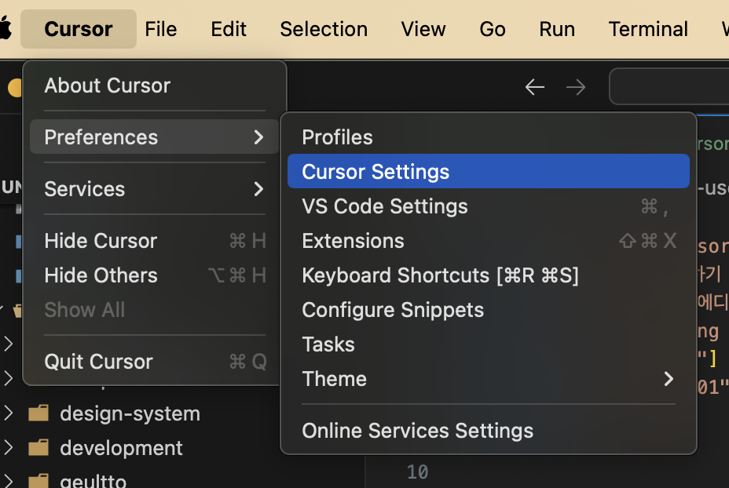
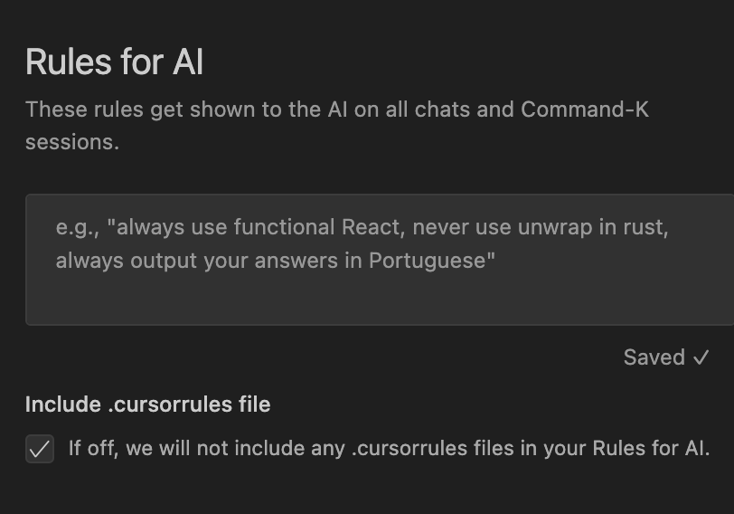
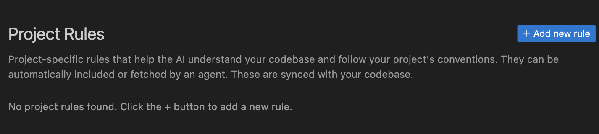
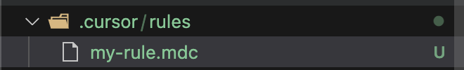
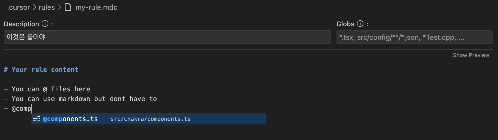
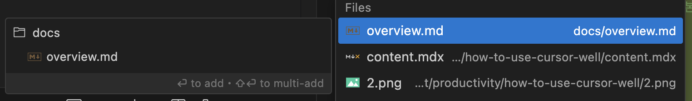
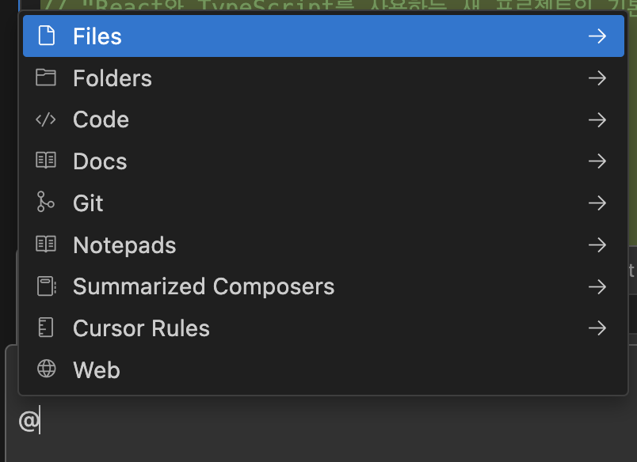
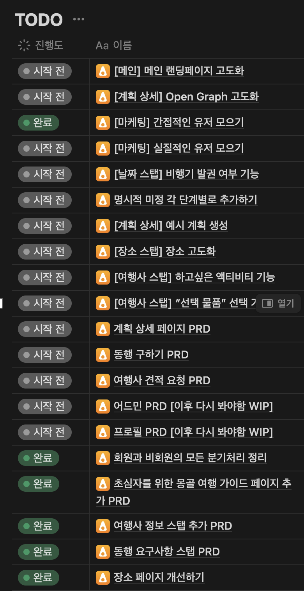

## cursorrules

cursorrules는 커서 AI에게 특정한 컨텍스트를 주입시키는 파일이다.

Mac기준으로 `Cursor` -> `Preferences` -> `Cursor Settings` 에 들어가서
`Rules for AI` 영역에 자신이 넣고 싶은 컨텍스트를 주입할 수 있다.

보통 이럴 때 어떤 내용을 넣어야 할지 막막한 경우가 많다.
나의 경우는 이럴 때 [cursor.directory](https://cursor.directory/) 웹사이트를 많이 참고를 했다.
위 웹사이트에서 각종 언어별로 참고할 수 있는 프롬프트 내용들이 많은데, 적절하게 자신이 원하는 것들을 잘 취합해서 사용하면 되겠다.

그리고 마지막에 `Always respond in 한국어` 라고 해놓으면 한국어로 답변을 잘 해준다.

또한 프로젝트 루트에 `.cursorrules` 파일을 만들어놓으면 프로젝트 협업 팀원들과 함께 프롬프트 세팅을 공유할 수 있다.

## Project Rules

<Callout>
  2월 15일에 새롭게 추가된 내용입니다.
</Callout>

Cursor 자차에서 프로젝트에 대한 규칙을 추가할 수 있는 기능이 따로 생겼다.

mac 기준으로 좌측 상단에 `Cursor` -> `Preferences` -> `Cursor Settings` 에 들어가서
`Rules for AI` 영역에 자신이 넣고 싶은 컨텍스트를 주입시킬 수 있다.

추가하기 버튼을 누르면 `mdc` 확장자로 된 파일이 `.cursor/rules` 폴더에 생성된다.

`Description`과 말그대로 룰에 대한 설명을 적고 `Globs` 필드로 적용할 파일에 대한 패턴을 적는다.
그리고 룰 파일안에서 프로젝트 안의 파일이나 다른 맥락을 `@`로 붙여서 넣어둘 수 있다.

## 프로젝트에 대한 맥락

내가 생각하는 커서 에디터의 강점은 직접 코드를 작성하는 에디터 안에서 모든 것들을 해결할 수 있다는 것이다.
나는 실제로 Cursor 유료 결제를 하고 난 다음부터 ChatGPT, Claude, Perplexity와 같은 LLM을 포팅해서 만들어놓은
웹사이트 들어가서 프롬프트를 작성한 빈도가 엄청 줄었다.

프로젝트에서 파일에 대한 맥락 혹은 폴더에 대한 맥락을 LLM에게 물어볼 때 계속해서 어딘가에 복사해놓고 붙여넣거나
아니면 최근에 나온 [ChatGPT의 Project](https://help.openai.com/en/articles/10169521-using-projects-in-chatgpt)와 같이 맥락을 계속해서 들고 있는 방법이 필요하다.

웹사이트에 가서 질문하는게 뭐가 불편하지? 라고 하지만 개인적으로는 사이트랑 코드 에디터를 왔다갔다하면서 복사 붙여넣기 하는게
수도없이 반복되면 그 시간도 쌓이면 되게 거슬린다고 느꼈다.

그래서 프로젝트 루트에 `ai` 혹은 `document` 와 같은 폴더를 만들어두고 거기에다가 프로젝트에 대한 전반적인 개요를 적어두고
프로젝트의 새로운 기능이라던지, 리팩토링, 테스트 코드 관련해서 질문을 할 때 해당 프롬프트를 같이 던져주면 조금 더 나은 답변을 받을 수 있다.

## Chat 기능 최대한 활용하기

나는 `Composer` 도 좋은 도구라고 생각하지만, `Chat` 을 주로 사용한다.
`Composer` 는 프로젝트 맨 처음 빠르게 설계하기 위해서 사용하면 좋을거같고, 그 이후 프로젝트가 어느정도 고도화 됐을 땐 `Chat` 이 조금 더 나은 것 같다.
왜냐하면 프로젝트가 점점 커질수록 서로 얽혀있는 코드들이 많을거라서 모든걸 AI에게 맡길 수 없는 순간이 오기 때문이다. (내가 직접 다 읽고 필요한 부분들만 적용하는 걸 좋아해서 그런거같기도 하다.)

- `Command` + `I` (`Chat` 계속해서 작성하기 or 창 끄기)
- `Command` + `L` (현재 파일 기준으로 `Chat` 시작하기)
- `Command` + `Option` + `L` (이전 `Chat` 목록 보기)

위에는 내가 자주 사용하는 단축키이다.

나는 `Inline`으로 `Chat`을 거의 하지 않는다.
대부분의 요구사항의 맥락이 한줄에만 그치는 경우는 거의 없고, 파일 전체에 이르거나 폴더를 봐야하는 경우가 많기 떄문이다.
그리고 `Inline`이 필요한 경우는 대부분 `Auto Suggestion`으로 거의 해결된다.

단축키는 Mac 기준으로 `Command` + `L`을 누르면 현재 열려있는 파일 기준으로 바로 `Chat`을 시작할 수 있다.
근데 이건 항상 새로운 `Chat`을 시작하기 때문에 이전에 맥락을 계속 담고 싶으면 이전 히스토리에서 찾아서 `Chat`을 이어나갈 수 있다.
이전 히스토리 목록은 `Command` + `Option` + `L` 을 누르면 볼 수 있다.
그리고 `Chat` 창이 은근 크기가 커서 여러 파일 띄워놓고 코딩하고 싶을 때는 `Command` + `I` 를 눌러서 창을 껐다 켰다 한다.

Chat에서 `@` 를 입력하면 `Chat`에 주입할 수 있는 여러 맥락이 있는데
나는 주로 여러 `Docs` 들을 등록해놓고 질문할 때 사용하고,
`Files`와 `Folders`를 사용해서 내 코드에 대한 맥락을 주입해서 주로 사용하고 있다.

`Web` 과 같이 검색을 하게끔 시킬 수도 있고 최근에는 `Image`에 대한 맥락도 넣을 수 있는거 같아서 잘 사용해보면 좋을거같다.

## 요구사항 잘 적기

해당 내용은 위의 `Chat 기능 최대한 활용하기`와 비슷한 결의 내용이다.

나는 Cursor를 쓰면서 오히려 코드를 짜는 시간보다 문서를 쓰는 시간이 더 늘어난 것 같다.

사이드 프로젝트의 기능 개발을 무작정 시작하기보다 적당한 크기로 기능을 쪼갠 다음
각각의 기능에 대해서 요구사항을 자세하게 적었다. 해당 요구사항도 코드 안에 위치시켜도 좋은데
디자이너분도 함께 보기 위해서 일단은 노션에 적었다.

노션 페이지에는 `개요`, `구현`, `주석` 정도로 요약할 수 있고
`개요는` 기능이나 PRD에 대한 전반적인 내용을 적고,
`구현`은 실제로 그걸 어떻게 구현할건지 자세한 내용을 적는다. 요기서 요구사항이 대부분 적히게 되고
`주석`은 해당 기능을 구현하기 위한 링크 정도로 적어둔다.

해당 기능을 구현할 때 해당 내용들을 전부 던진다.
그리고 기능 개발을 같이하는 동료로 사용을 한다. 어떤 식으로 구현할까? 이렇게 하고 싶은데 좋은 방법일까? 계속 물어보면서 개발을 한다.
그러면 생각하지 못한 방법들을 알려줄 때도 있고, 속도 측면에서 그냥 쌩으로 구현을 하는 것과 `Chat`을 잘 이용해서 개발을 하는 것과 속도 차이가 말이 안된다.

특히 UI 구현을 해야한다면 기존에 비슷하게 구현된 화면을 같이 던져주면 정말 기가막히게 잘 짜준다.
놀라운게 폼과 연동되는 퍼널 작업을 해야했을 때가 있었는데, 처음 화면 만들 때는 하루가 걸렸던게
문서 쓰고, 화면 작업까지 1시간 조금 시간만에 하나의 스탭을 기획, 디자인, 개발까지 전부 했던 경험이 나한테는 너무 와우 포인트였다.

## 추가적인 꿀팁들

- `@File`로 `package.json`을 첨부시켜서 프로젝트에서 사용하고 있는 기술 스택을 한꺼번에 명시하고 해당 기술 스택을 기반으로 답변을 받을 수 있다.
- 혹시나 컨텍스트 길이가 너무 길어져서 끝날 것 같다면 (나는 그런 적은 없다) 다음 Chat에서 사용하기 위해서 지금 맥락을 전부 요약해서 알려달라고 한 다음 나온걸 다음 Chat에 붙여넣어 맥락을 이어붙이는 방법도 있다.

## 마무리

사실 Cursor를 사용하고 있는 분이라면 대부분 알만한 내용들이다.
그냥 내가 어떻게 쓰는지 정리하고 싶었다.

점점 LLM이 발전하고 Deepseek R1이니 Claude니 ChatGPT니 뭐니 너무 많은 정보들이 우리를 덮치고 있다.
이런 세상에 개발자가 살아나가야 하는 방향은 무엇일까

정답은 누구도 모르겠지만 내 결론은 일단 최대한 이쪽에 관심을 가지고 있으려고 한다.
그리고 어떤식으로라도 잘 쓰는 방법을 끊임없이 고민하려한다.
호들갑일수도 있겠지만 어느 순간 내가 하는 일이 대체되고 길바닥에 내동댕이 쳐지지 않으려면 계속해서 발버둥쳐야한다.

원하는 것이 있으면 지속적으로 원하는 방향으로 모든 것들을 설정해야 한다고 믿는 사람으로서
`내동댕이 쳐지지 않기`를 원한다면 그 방향으로 가도록 조금씩이라도 실행해야 하는 것이다.
