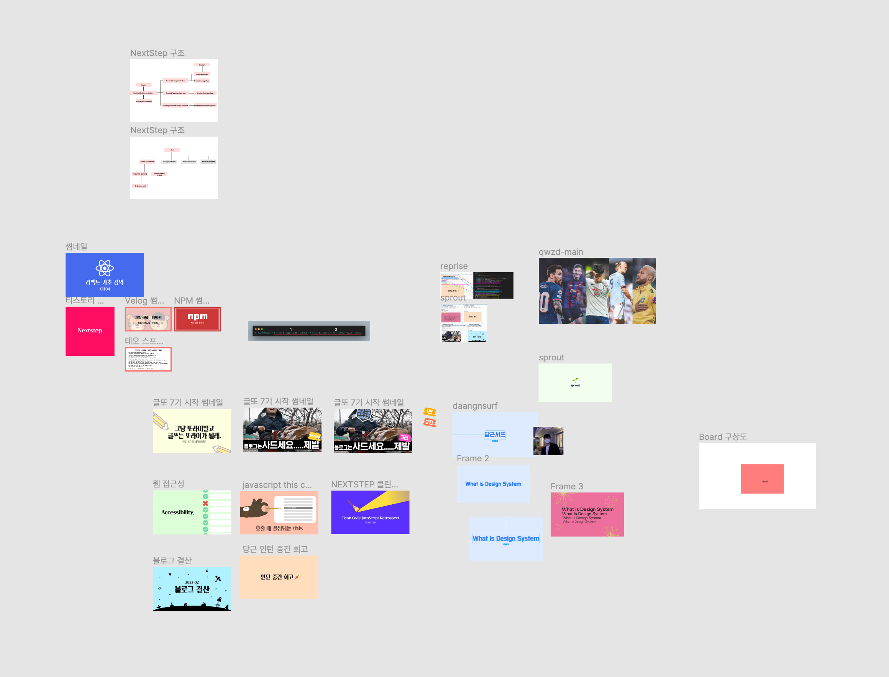

# 계기

가끔 개발을 같이하거나, 프로젝트를 같이하면 이런거 어떻게 했어요? 와 같은 질문들을 받는다.
내가 자주사용하는 이런 도구들을 모아서 소개하는 글을 쓰면 어떨까 하는 생각이 들어서 글을 쓴다.
아마 계속해서 추가되지 않을까 싶어 시리즈를 나눴는데 어떻게 될진 모르겠다.

내가 사용하는 환경이나, 나의 성향은 아래와 같다.

- **Mac M1** 사용
- vscode로 개발
- 코드 리뷰를 위해 PR 같은 걸 올리면 gif, 스크린샷 첨부하는 걸 되게 좋아함
- 예쁘게 무언가를 꾸미는 것을 좋아함. 썸네일, 배경, 이펙트에 진심.

# Vscode Keyboard Shortcut

> 이 섹션은 넣을까말까 고민을 좀 했는데, 내가 당연하다고 생각하는 게 당연하지 않은 사람들이 있기 때문에 혹시나 도움이 될까 올림.

## 사용하지 않는 import 정리

> keyboard shortcut: `option` + `shift` + `o`

`eslint` 설정을 잘 해놨다면, import 구문에 가끔 사용하지 않는 것들이 들어가서 경고를 받을 수 있다. 그럴 때 마우스를 사용해서 지우는 것 보다 키보드를 사용하는 것이 더 빠르다.

마우스로 했다면 마우스를 옮기고, 삭제할 부분을 드래그하고, 지우기를 타이핑하는 것 보다 세 개의 키로 단축시킬 수 있다.


## 한 줄 복사하기

> keyboard shortcut: `shift` + `option` + `방향키`

복사 + 붙여넣기를 하는 것 보다 빠르게 새로운 줄을 추가 할 수 있다.


## 한 줄 이동하기

> keyboard shortcut: `option` + `방향키`

이것도 복사 + 붙여넣기를 하는 것 보다 빠르게 줄을 옮길 수 있다.


## 여러 단어 선택 및 편집

> keyboard shortcut: `command` + `d`

여러 개의 같은 단어를 다른 단어로 고쳐야 한다면 `모두 고치기`로도 빠르게 고칠 수 있지만, 나는 이 방식을 선호한다. 알고나서 정말 많이 쓰는 키보드 숏컷.


## 여러 줄 선택 및 편집

> keyboard shortcut: `option` + `command` + `방향키`

반복되는 라인을 한꺼번에 고칠 때 엄청난 효율을 발휘하는 숏컷.
알아두면 무조건 어디선가 쓰인다.


# Vscode Extensions

## file-tree-generator

보통 폴더 구조 같은 걸 보여줘야 할 때가 생기는데, 그럴 때 일일이 타이핑하지말자.
`file-tree-generator`과 함께라면 당신도 협업 마스터!


트리를 뽑고자 하는 폴더의 오른쪽을 클릭하면 맨 아래에 `generate to tree` 라는 버튼이 생긴다.
클릭하면 아래와 같이 텍스트의 형태로 폴더 구조가 나오게 된다.


그럼 해당 텍스트를 복사해서 자신의 입 맛에 맞게 고칠수도 있고,
삭제하고 싶은 부분은 삭제해서 사용할 수 있다.

아래는 그 예시

```html
📦blog
 ┣ 📂blog-bottom-line
 ┃ ┗ 📂2022-Q2
 ┃ ┃ ┣ 📜1.png
 ┃ ┃ ┣ 📜10.png
 ┃ ┃ ┣ ...
 ┃ ┃ ┗ 📜cover.png
 ┣ 📂computer-science
 ┃ ┣ 📂What-is-DNS
 ┃ ┃ ┣ 📜.DS
 ┃ ┃ ┣ 📜1.png
 ┃ ┃ ┣ 📜2.png
 ┃ ┃ ┣ 📜3.png
 ┃ ┃ ┗ 📜cover.png
 ┃ ┣ 📂What-is-http
 ┃ ┃ ┣ 📜1.png
 ┃ ┃ ┣ 📜2.png
 ┃ ┃ ┣ 📜3.png
 ┃ ┃ ┣ ...
```


## CodeSnap

`CodeSnap`은 코드를 예쁘게 캡처해서 다른 사람에게 공유하고 싶을 때 사용한다.

보통 커뮤니티 같은 곳에서 사람들이 코드에 관한 질문을 할 때 단순 캡처로 코드를 보여주는 경우가 많은데,
그렇게 하지말고 이런 도구들을 이용해서 조금이라도 질문을 받는 입장이 보기 쉽게끔 하면
질문에 대한 답변을 조금 더 잘 받을 수 있다.


Vscode extension 탭에서 설치 받을 수 있다.
사용법은 정말 쉽다. 리뷰 받고자 하는 코드 부분을 드래그하고 오른쪽을 누르게 되면 맨 아래에 CodeSnpa 버튼을 찾을 수 있다.


그리고 해당 버튼을 누르게 되면 아래와 같이 캡쳐된 모습을 볼 수 있고,


해당 사진을 오른쪽 클릭해서 복사를 해서 어디서든 붙여넣을 수 있다.


## ESLint


`eslint`는 많은 사람들이 알고, 사용하고 있을거라고 생각한다.
근데 나는 `eslint`를 **"잘"** 사용하지 못하는 사람들이 많다고 생각한다.

내가 참여했던 여러 프로젝트 몇몇은 `eslint`가 제대로 설정되지도 않았고, 잘 동작하지도 않았다.
사람들은 **`eslint`를 설정했다**. 는 생각 이후로 **`eslint`가 잘 먹혔는지, 어떤 rule이 설정이 됐고 잘 잡아주는지에** 관심이 크게 없는 것 같아 아쉬웠다.

우선 eslint가 잘 동작하는지, eslint가 어디서 로드됐는지에 대한 확인은 vscode 오른쪽 아래에서 확인할 수 있다.


그리고 `eslint`로 협업을 잘 하기 위해서는 몇가지 설정이 더 필요하다.
해당 `.vscode` 폴더에서 vscode 에디터에 대한 설정도 프로젝트마다 할 수 있다는 사실은 잘 모르는 것 같다.


나는 보통 저장을 했을 때 eslint가 한 번 잡아주는 것을 선호하기 때문에 이렇게 설정을 사용한다.


eslint가 동작하는 방식은 해당 파일의 폴더부터 `.eslintrc` 파일을 찾고 계속 바깥으로 찾아낸다.
만약 프로젝트 root에서도 적절한 `.eslintrc` 파일을 찾지 못한다면 자신의 컴퓨터에 설정되어 있는 eslint 설정이 협업하는 프로젝트에 적용될 수도 있다.

그래서 eslintrc 파일에는 **"내가 최상위 파일이야! 더 이상 eslintrc 파일을 찾지마!"** 라는 의미로 `root` 옵션을 제공해준다.


eslint 설정을 조금 더 세심하게 해서 협업할 때 가짜 도움이 아닌 진짜 도움을 받자!

# Application

## 피그마

> [link](https://www.figma.com/)

내가 블로그 같은 걸 사람들에게 보여주면 썸네일 같은거는 어디서 그리냐? 라는 질문을 제일 많이 받는다.
그럴 때 마다 피그마로 그린다고하면 고생을 많이 한다, 피그마 한 번도 안써봤다와 같은 반응들이 온다.


근데 나는 썸네일 만들 때 이만한 도구를 본 적이 없다.
그냥 사진 같은 것도 드래그 엔 드랍으로 바로 붙여넣을 수 있고, 여러가지 합성도 할 수 있고
레이어 시스템도 잘 되어 있기 때문에 썸네일을 만들기 최적이라고 생각한다.



## Giphy Capture

> [link](https://giphy.com/apps/giphycapture)

mac용 캡쳐도구를 그대로 사용해도 상관없지만, 나는 맨처음부터 이 앱을 사용했기 떄문에
이미 익숙해져버려서 넘어가지 못하고 있고, 충분히 좋다고 생각해서 소개한다.

나는 PR을 올릴 때, 기능 구현을 했을 때 셀프 리뷰로 gif를 첨부하는 걸 되게 좋아한다.
어떤 기능을 구현했는지 한 눈에 바로 확인할 수 있고, 빠르게 확인할 수 있다.
동작 방식도 글로 일일이 설명하는 것이 아니라 내가 구현한 의도와 방식을 그대로 설명할 수 있다.

단, `Giphy Capture`는 Mac용이기 때문에 윈도우 유저는 사용하지 못한다.


실행하게 되면 아래와 같은 창이 뜨게된다.
녹화 버튼을 클릭해서 해당 영역을 캡쳐를 뜰 수 있다.

나는 녹화버튼을 일일이 누르지 않고 키보드 숏컷을 등록해놨다.
오른쪽 아래 톱니바퀴 설정 버튼으로 키보드 숏컷을 지정할 수 있는데, 나는 `command` + `a`로 영상 시작, 종료를 조절한다.


그리고 영상을 다 찍게되면 gif로 뽑을 수 있는 창이 뜨는데,
해당 창에서 자막도 달 수 있고, 영상의 품질, 크기, 제목도 결정할 수 있다.


## Pinterest

> [link](https://www.pinterest.co.kr/)

핀터레스트는 도구는 아니고, 내가 자주 들락날락하는 사이트다.
보통 웹, 디자인, 혹은 썸네일을 만들 때 영감을 받기 위해서 들어가는데 사람들이 다양한 이미지를 올려놔서 보는 맛이 있다.

사이드 프로젝트를 하거나 새로운 웹사이트를 만들면 웹 디자인에 대한 생각을 하지 않을 수 없는데,
그럴 때 핀터레스트에 들어가서 `web`이라고 쳐보자. 다양한 인사이트를 얻을 수 있다.


# 마무리

위의 것들 말고도 아직 내가 경험하지 못한 생산성 도구가 많을 것 같다.
이 글을 읽는 모두가 댓글로 하나씩 추천해준다면... 너무나도 감사할 것 같다.
