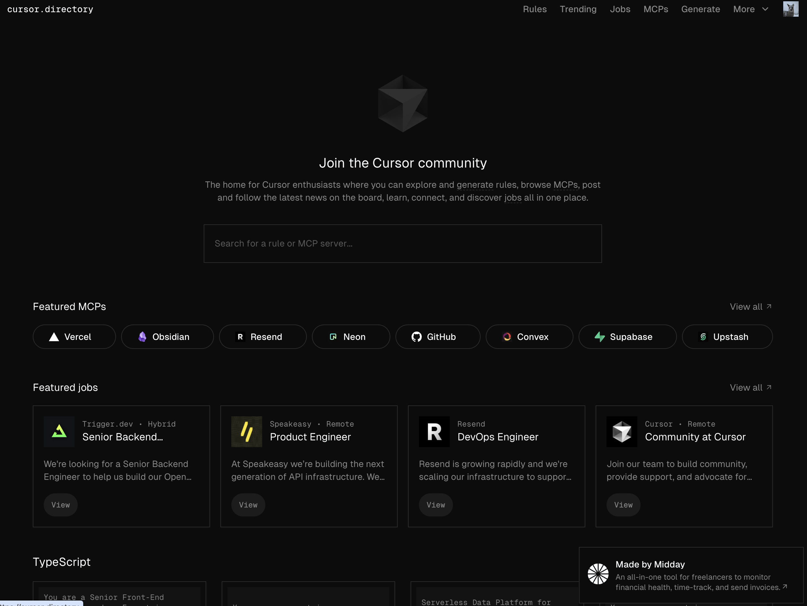
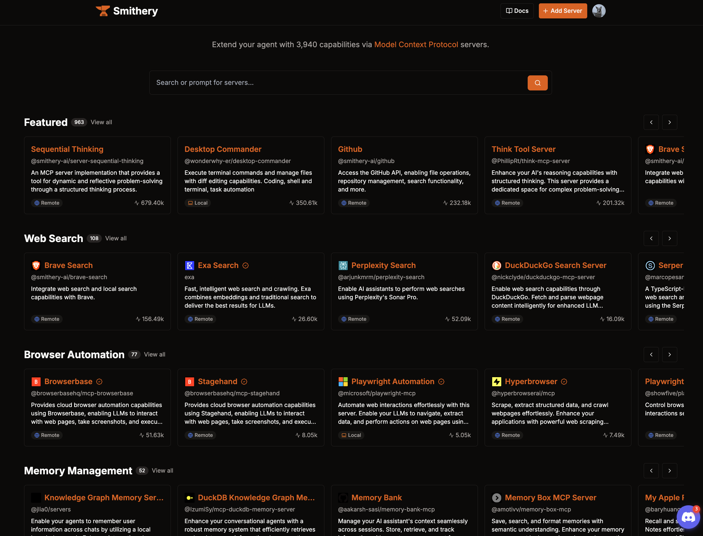
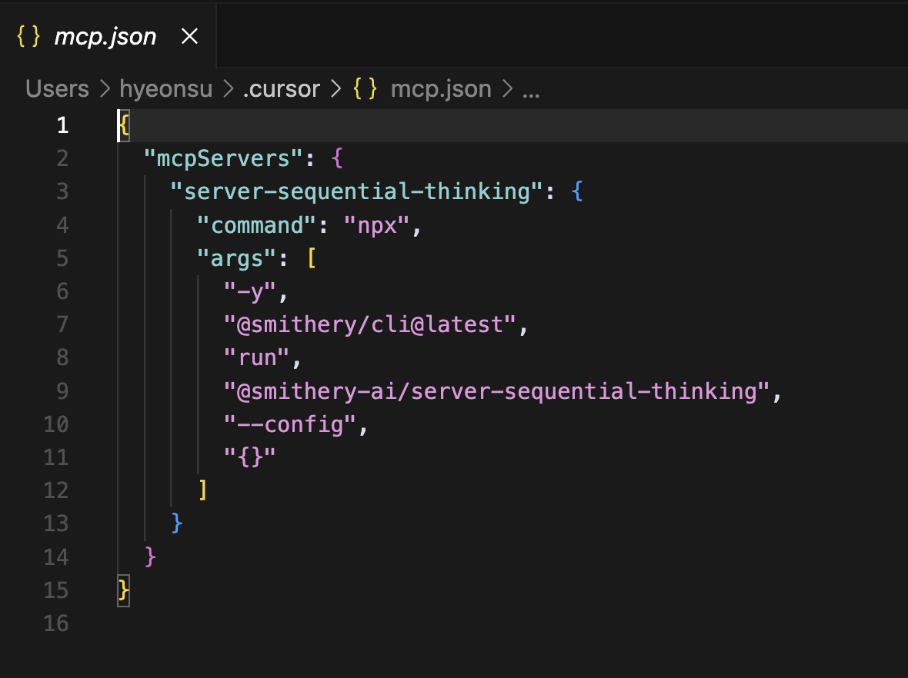
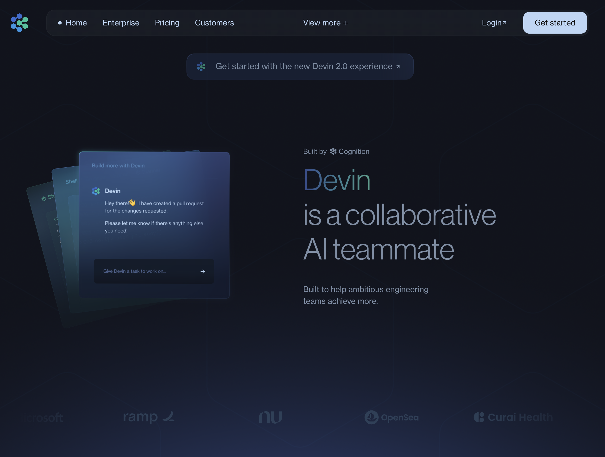
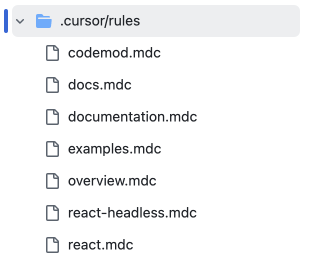
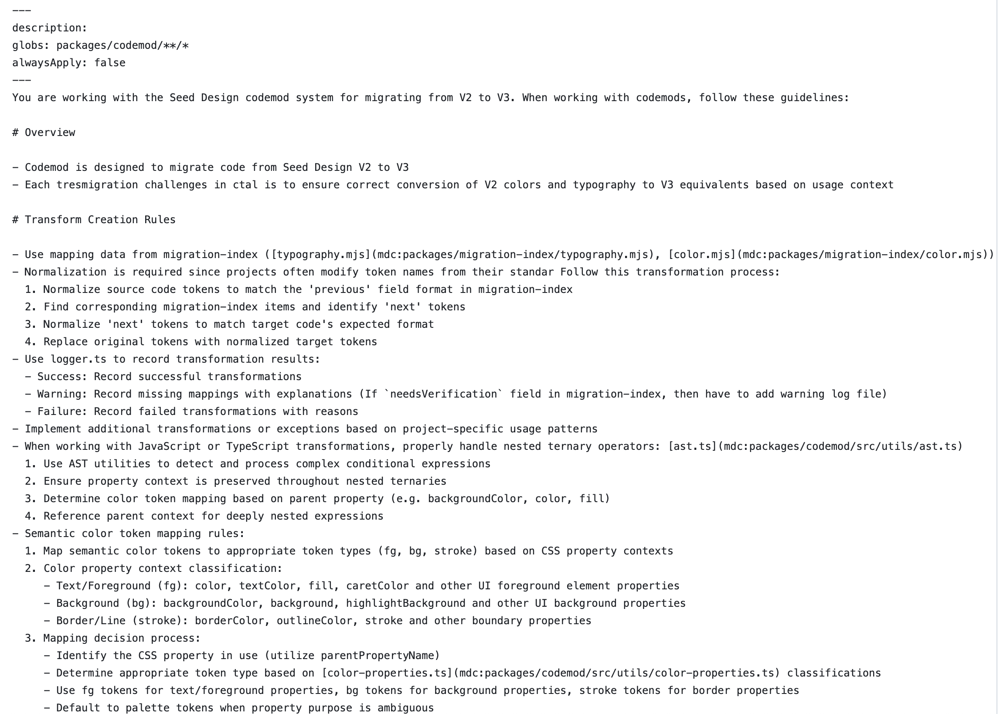

요즘 제가 작성하는 코드의 80~90%는 과장이 아니라 커서(Cursor)가 대신 써주고 있습니다.
왜 커서를 꼭 써야 하는지, 그리고 제가 커서를 어떻게 활용하고 있는지를 공유하고 싶어 이 글을 쓰게 되었습니다.

## 온도 차가 커지고 있습니다

주변을 보면 커서를 아직 안 써본 사람도 있고, 이미 적극적으로 쓰고 있는 사람도 있습니다.
문제는 이 둘 사이의 간극이 점점 벌어지고 있다는 점입니다. 저는 개발자라면 커서를 꼭 한번은 사용해봐야 한다고 생각합니다.

## 맥락 넣기가 너무 쉽고 강력하다

커서에서는 문서를 인덱싱해놓고 참조하는 기능이 매우 강력합니다. 단순히 링크를 첨부하는 것이 아니라,
문서 전체를 읽고 이해한 상태에서 코드를 작성해줍니다. 덕분에 제가 기술 스택에 대해 길게 설명하지 않아도,
마치 그 기술의 마스터인 것처럼 코드를 생성해줍니다.

또한, 파일이나 폴더의 맥락도 드래그 앤 드롭이나 @ 명령어로 간편하게 첨부할 수 있어,
기존처럼 파일 내용을 복사해서 붙여넣는 방식보다 훨씬 빠르고 편리해졌습니다.

## MCP: 새로운 패러다임

최근 부상하고 있는 MCP(Model Context Protocol)는 말 그대로 게임 체인저입니다. USB 꽂듯 다양한 맥락을 빠르게 연결할 수 있고, MCP에서 제공하는 툴들을 통해 단순한 코드 생성 그 이상을 할 수 있게 됩니다.

예를 들어, 피그마와 연결된 MCP를 통해 `특정 프레임의 디자인을 가져와서 코딩해줘` 같은 지시가 이제는 가능해졌습니다. 기존 LLM은 이런 지시를 이해하지 못했지만, MCP 덕분에 피그마의 정보를 직접 참조할 수 있게 된 거죠.

시간이 지날수록 더 많은 써드파티 서비스들이 MCP를 지원하게 될 것입니다.
`GitHub`, `AWS`, `Brave Search`, `Perplexity Search` 등도 이미 이를 지원하기 시작했고,
브라우저 자동화나 로컬 파일 참조 같은 기능도 속속 등장하고 있습니다.

MCP는 커서만의 전유물은 아니지만, 커서는 이를 내부 UI에 자연스럽게 통합해두어 훨씬 손쉽게 사용할 수 있게 해줍니다. 실제로 JSON 파일에 몇 줄만 추가하면 바로 연동됩니다.

그래서 원래는 아무런 맥락도 없었고, 어떤 것들을 해야할지 모르는 LLM한테 한꺼번에 많은 맥락을 이해시킬 수 있는 도구가 MCP로 자리잡혀갈 것 같습니다.맥락이 없던 LLM에게 여러 정보를 한꺼번에 이해시키는 도구로서 MCP는 점점 더 중요해지고 있으며, 다양한 분야에서의 지원으로 LLM의 활용도도 더욱 높아지고 있습니다.

## 병렬적 실행 가능

최근 제 작업은 여러 레포지토리를 오가며 진행됩니다. 커서에서는 한 창에서 프롬프트를 던져두고, 기다리는 동안 다른 창에서 또 다른 작업을 이어가는 병렬적 워크플로우가 가능합니다. 효율성과 생산성 측면에서 아직 정량적인 측정은 어렵지만, 이런 방식으로 커서들을 매니징하는 ‘에이전트 매니저’ 같은 역할로 점점 진화하고 있습니다.

물론, 이 방식이 무조건 좋은 것은 아닙니다. `Vibe Coding` 에만 의존해서는 안 되며, 질문의 품질과 방향 설정은 여전히 우리의 몫입니다. 저는 이동 중에도 어떤 프롬프트를 던질지 고민하며, 자리에 앉자마자 질문을 시작하는 습관이 생겼습니다.

살짝 다른 주제지만, 비슷한 개념으로 최근 [Devin](https://devin.ai/) 같은 AI 에이전트도 등장하고 있습니다.
Devin은 요청만 하면 알아서 코드를 작성하고 Pull Request까지 생성해주는 클라우드 기반 도구입니다.
커서 같은 에디터는 로컬에서 작동하기 때문에 노트북이 꺼지면 작업이 중단되지만,
Devin은 클라우드 상에서 24시간 작동 가능하다는 점에서 장점이 있습니다.

언젠가는 노트북을 켜지 않아도, 자기 전 프로젝트에 대한 할 일을 쭉 적어두면 아침에 보고서를 받는 세상이 올지도 모르겠습니다.

## Rule: 맥락의 정교화

커서를 많이 쓰다 보면 결국 `맥락`이 전부라는 생각이 들 정도입니다.
커서에서는 Rule이라는 개념을 통해 각 프로젝트별로 맥락을 정리하고 적용할 수 있게 해줍니다.
하나의 PRD 문서처럼, 프로젝트나 기능 단위로 요구사항, 주의사항 등을 명시할 수 있어 작업 정리에 큰 도움이 됩니다.

Rule 파일은 언제 어떤 상황에 맥락으로 첨부할지도 설정할 수 있어,
수백 번의 프롬프트가 오가는 상황에서도 효과적으로 의사소통할 수 있게 도와줍니다.

## 주의할 점

커서를 잘 쓰려면 요구사항을 정확히 명시해야 합니다.
예를 들어 패키지 매니저를 명시하지 않으면, yarn을 사용하는 환경에서 npm을 사용하려는 시도가 발생할 수 있습니다.
Rule 파일과 프롬프트를 정교하게 작성하면 어느 정도 방지할 수 있지만, 하루에도 수백 번 대화가 오가다 보면 놓치기 쉬운 부분입니다.

또한 Vibe Coding의 위험성도 경계해야 합니다.
저 역시 여러 레포지토리를 동시에 다루며 관리자처럼 행동하고 있지만,
가능한 작은 단위로 문제를 정의하고, 변경사항은 브랜치로 구분해 리뷰나 교차검증을 할 수 있도록 합니다.
만들어진 코드는 직접 검토하거나 다른 LLM 도구로 검증하여 신뢰도를 높이는 프로세스를 만들어 두어야 합니다.

## 거스를 수 없는 흐름

AI는 이미 거스를 수 없는 흐름입니다.
산업혁명, 인터넷의 등장이 그랬듯, AI 역시 역사의 변곡점이 될 것입니다.
지금은 눈에 띄는 산업적 혁신이 없다고 해도, 한 명의 개발자 생산성을 몇 배로 높여준 것부터 변화는 시작된다고 생각합니다.

처음 컴퓨터가 단순 계산 도구였듯,
지금의 AI도 단순 코딩 보조에서 시작해 점차 그 역할을 확장할 것입니다.
그리고 언젠가는 기업의 리소스와 능력 계산 방식까지 바뀌게 될 것입니다.

현재는 커서 위주로 이야기했지만, `Claude`, `ChatGPT`, `DeepSearch` 등 여러 AI 도구들을 상황에 맞게 조합해 사용하고 있습니다.
앞으로도 더 깊이 있게 공부하고, 관심 있는 주제는 블로그나 LLM이 쉽게 인덱싱할 수 있는 형태로 정리해둘 예정입니다.
개인 AI가 등장했을 때, `내가 지금 뭘 해야 할까?`에 대한 답을 잘 하게 하려면 나 자신에 대한 맥락을 얼마나 정리해뒀는가가 큰 차이를 만들어낼 거라 생각합니다.

결국 이 모든 변화의 중심에는 `맥락`이 있습니다.
우리는 AI가 점점 더 많은 일을 대신하게 될 미래를 살아가고 있고,
**그 미래에서 중요한 건 무엇을 할 것인가보다, 무엇을 왜 하는가를 얼마나 잘 설명할 수 있느냐**일지도 모릅니다.

그래서 지금부터는 코드 한 줄, 문서 한 편을 쓰더라도 단순히 당장의 결과물에만 집중하는 것이 아니라,
나의 사고방식과 선택의 근거를 AI가 학습하고 이해할 수 있는 형태로 정리해두는 것이 중요하다고 생각합니다.
그렇게 쌓인 맥락은 언젠가 나의 개인 AI가 나보다 나를 더 잘 이해하고, 내가 할 일을 먼저 제안해주는 시대를 여는 열쇠가 될지도 모르니까요.

AI는 도구이지만, 그 도구를 어떻게 쓰느냐는 여전히 우리의 몫입니다.
그리고 그 변화의 흐름을 거스를 수는 없습니다.
우리는 지금, 새로운 물결 위에 서 있습니다.
