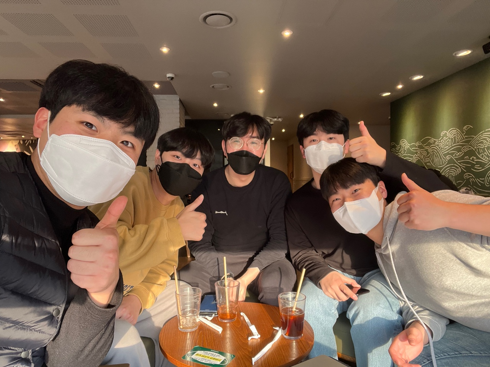
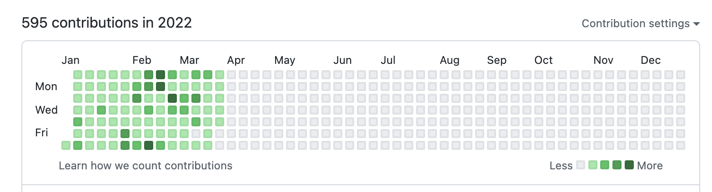
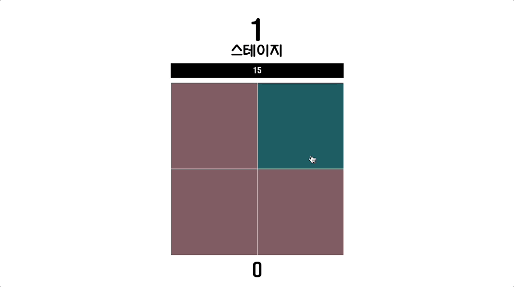
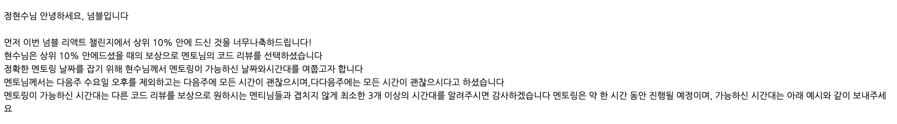
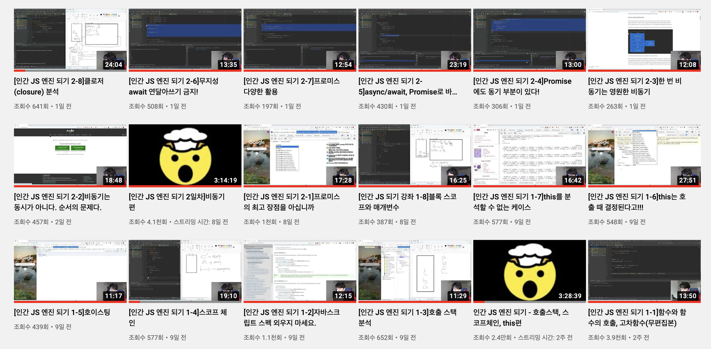
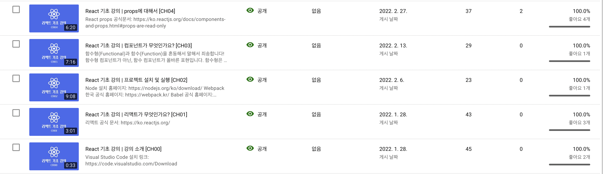
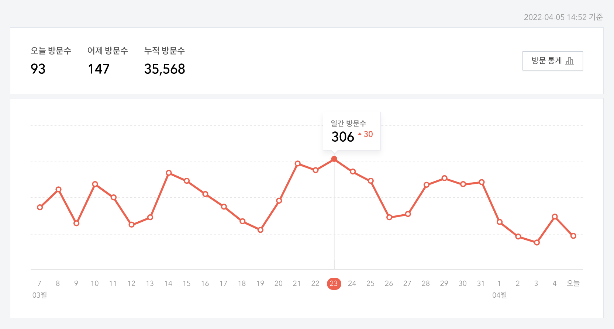

# 동욱님 만나기

> 2022/2/10

2월초 어느 날 친구 한명이 오직 동욱님을 향한 팬심으로 페이스북 메세지를 보낸 것이 시작이었습니다.

동욱님께서 회신을 하시면서 약속날짜를 잡고 친구들 4명이서 차를 빌려서 서울까지가서 동욱님만 뵙고 다시 내려왔던 기억이 있습니다.

[인터뷰 내용 포스팅](https://velog.io/@junghyeonsu/%ED%96%A5%EB%A1%9C%EB%8F%99%EC%9A%B1%EB%8B%98%EC%9D%84-%EB%A7%8C%EB%82%98%EB%8B%A4)

동욱님을 보면서 느낀 것이 있습니다. 우리도 8년 정도 개발씬에 몸을 담고 있으면 어느정도 실력은 향상되겠지만, 저정도의 깊이 있는 지식과 시야를 가지려면 정말 많은 노력과 시간이 들었겠구나 하는 생각이 들었습니다.

모든 질문에 답변 내용 하나하나가 주옥같고 경험에서 우러나온 대답들이 되게 인상 깊었습니다.

동욱님을 만나고 오면서 다시 개발에 대한 열정을 불태우는 계기가 되었습니다.

# 1일 1커밋

2022년 들어서 취업준비를 하면서 1일 1커밋을 실천하고 있습니다.

중간에 하나 빈 건 NEXTSTEP 미션 브랜치에서 작업을 열심히 했는데, NEXTSTEP에서는 브랜치를 merge를 안해주기 때문에 작업한 게 기록이 안남습니다...

약 3개월 진행한 느낌을 얘기하자면 하루에 조금이라도 공부를 하게 되는 것 같습니다. 그리고 1년씩 꾸준히 하시는 분들은 정말 대단하다고 느낍니다... 대충 의미 없는 커밋으로 1일 1커밋을 이룰 수 있지만 그건 아무 의미없다고 생각하고, 최대한 의미있는 커밋으로 남기려고 합니다.

# 넘블 챌린지

> 2022/2/4 - 2022/2/13

[넘블](https://www.numble.it/)에서 챌린지를 했는데 다른 색깔 찾기 게임을 했습니다.
정말 재미있었고 색다른 경험이었습니다.

요구사항에 전역 상태 관리 라이브러리를 사용하지 않고 오직 `state`와 `props`만을 이용해서 구현을 해야하는 조건이 있었습니다.

그러다보니 `state`와 `props`를 어떤 컴포넌트에 배치를 해야하는지 고민을 많이 하게되는 계기가 되었습니다.

그렇게 만들어진 게임은 [요기서](https://find-different-color.vercel.app/) 해보실 수 있습니다.

그리고 제출후에 점수를 매겨서 상위 10%를 추려서 멘토링을 받을 수 있는 기회를 얻을 수 있는데
상위 10%에 얻어서 제 프로젝트 코드 피드백을 받을 수 있었습니다.

그리고 요구 구현사항외에 제가 랭킹시스템을 도입하고 싶어서 `firebase`를 이용해서 랭킹을 도입했고, [벨로그에도 글을 올려서](https://velog.io/@junghyeonsu/React-Numble-Challenge-%EB%8B%A4%EB%A5%B8-%EC%83%89%EA%B9%94-%EC%B0%BE%EA%B8%B0-%EA%B2%8C%EC%9E%84-%EB%A7%8C%EB%93%A4%EA%B8%B0) 많은 관심을 받아서 기분이 좋았습니다.

# 책 읽기

무슨 책을 읽었나?

## 완독

- 초집중 (완독)
- 모두의 네트워크 (완독)
- 클린코드 (니콜라스 챌린지 참여 완료)

## 읽는 중

- 1만시간의 법칙 (읽는중)
- 커리어 스킬 (읽는중)
- 코어 자바스크립트 (읽는중)
- 모던 딥다이브 자바스크립트 (스터디 진행중)

기술서적 외에도 자기개발 책을 꾸준히 읽어야 하는데 그러지 못한 것 같습니다...
책을 꾸준히 읽기 위해서는 하루에 시간을 정해놓고 그 시간에는 무조건 책을 읽겠다. 이런식으로 읽으면 그나마 잘 읽히는 것 같습니다.

# 영상 강의

## 인프런

- 자바스크립트 알고리즘 문제 풀이 | 김태원 (진행중)
- 타입스크립트 기초 | 캡틴 판교 (완강)

## 유튜브

- 제로초 | 인간 JS 엔진 되기 시리즈
- 배민근 | [react-query와 상태 관리 우아한테크세미나](https://www.youtube.com/watch?v=MArE6Hy371c&t=6103s)
- 유인동 | [ES6+ 비동기 프로그래밍과 실전 에러 핸들링](https://www.youtube.com/watch?v=o9JnT4sneAQ)
- 최수형 | [프론트엔드에서 TDD가 가능하다는 것을 보여드립니다.](https://www.youtube.com/watch?v=L1dtkLeIz-M&t=1s)

# 테오 구글 스프린트 4기 진행

> 2022/2/16 - 2022/2/20

2월 16일부터 2얼 20일까지 짧은 시간이지만 1분기에서 가장 의미있는 활동이었던 것 같습니다.
짧은 시간동안 npm 라이브러리를 배포해보고, 그 이후에도 스프린트 사람들과 연이 계속 닿아서 스터디도 진행하고 있습니다.

- [스프린트 진행 과정](https://velog.io/@teo/google-sprint-4)

짧은 시간동안 배포한 거라서 손 볼게 정말 많지만, 바쁘다는 핑계로 아직 못하고 있습니다..
해당 프로젝트를 포트폴리오에 넣었는데 면접을 볼 때 이 프로젝트에 대해서 질문을 많이 받아서 빨리 고쳐야 할 것 같습니다.

스프린트가 끝나고나서 [npm 배포 과정에 대해서 글](https://velog.io/@junghyeonsu/NPM-%EB%B0%B0%ED%8F%AC-%EC%96%B4%EB%A0%B5%EC%A7%80-%EC%95%8A%EC%95%84%EC%9A%94-with-%ED%85%8C%EC%98%A4-%EA%B5%AC%EA%B8%80-%EC%8A%A4%ED%94%84%EB%A6%B0%ED%8A%B8-4%EA%B8%B0)을 적었습니다.

# 포트폴리오 리모델링

작년 말부터 계속 마음속에 간직하고 있던 숙제를 끝냈습니다.
빛 좋은 개살구 같은 제 포트폴리오를 언제 고치나 했는데 이번에 후다닥 해버렸습니다.

- [바뀐 포트폴리오](https://hyeonsu-jung.vercel.app/)

포트폴리오를 리모델링하고 인프런에서 멘토링을 진행했습니다.
[캡틴판교](https://joshua1988.github.io/tech/)님과 [포코](https://github.com/pocojang)님에게 멘토링을 받았고, 포트폴리오 피드백 이외에도 다양한 얘기를 나눴습니다.

다들 인프런 멘토링 한번씩 해보세요. 정말 좋은 인사이트를 얻어갈 수 있습니다.

그리고 [벨로그에도 글](https://velog.io/@junghyeonsu/%EA%B7%B8%EB%9F%B0-%ED%8F%AC%ED%8A%B8%ED%8F%B4%EB%A6%AC%EC%98%A4%EB%A1%9C-%EA%B4%9C%EC%B0%AE%EC%9D%80%EA%B0%80)을 썼습니다. 생각보다 많은 관심을 받아서 또 열심히 공부할 수 있는 원동력이 된 것 같습니다.

# NEXTSTEP 진행중

> 2022/03/08 - 2022-04-26

자바스크립트로 깔끔하게 코드를 짜고 싶어서 신청을 했습니다. `cypress`를 이용한 테스트는 덤으로 가져갈 수 있어서 고민을 조금 하다가 신청을 했습니다.

처음에 고민을 하다가 신청을해서 대기 순번 3번에 걸렸었는데, 다행히 순번이 돌아서 신청을 할 수 있어서 바로 신청을 했습니다.

수강료가 66만원이었는데 이 강의를 보기전에 코드숨을 들을까 말까 고민을 하던 찰나였는데, 코드숨은 300만원이 웃도는 가격이라서... 고민없이 지를 수 있었습니다. (상대적으로 저렴해보이는 마법)

지금까지 진행한 내용들에 대해서 얘기를 조금 해보자면, 자바스크립트로 코드를 어떻게 짜야하는지, 폴더 구조는 어떻게 해야하는지, 변수명과 함수명은 어떻게 지을건지, TDD와 테스트에 대해서 어렴풋이 알게 되었고, 매주 화요일날 진행하는 중간 피드백은 정말 알찼습니다. (poco님의 피드백 시간은 정말 너무 값졌습니다.)

모든 미션이 끝나고 후기글을 남길 예정입니다.

# 유튜브

작년에 학교 후배들에게 리액트 강의를 계획한 적이 있었는데 코로나 때문에 깔끔히 무산되었습니다.
그 이후로 항상 마음 한 켠에 지식 공유에 대한 갈망이 있었던 것 같습니다.

제가 엄청나게 실력이 좋고 뛰어난 사람이 아니지만 누군가에게 도움이 될 수도 있고, 저도 영상을 찍으면서 공부하게 되는 선효과를 볼 수도 있어서 시작하게 되었습니다.

- [유튜브 채널](https://www.youtube.com/channel/UCkC6sYPPSvpnRprmp2GcXZw)

아무 기대없이 시작했는데 꽤(?) 많은 사람들이 제 영상을 봐주었습니다. 그리고 댓글도 달려서 신기했습니다.

유튜브를 찍으면서 영상 편집은 정말 힘든 일이구나, 꾸준히하는 것이 정말 힘든 일이구나를 뼈저리게 느꼈습니다.

시나리오 구성하기 - 대본 쓰기 - 영상 찍기 - 컷 편집하기 - 자막 달기 - 자료 화면 꾸미기 및 효과음 넣기 - 썸네일 만들기 - 영상 올리기

하나의 영상이 올라가는데 이렇게 많은 시간이 소요됩니다... 공부를 병행하면서 영상을 올리는 건 정말 엄청난 정신력이 필요하다는 것을 느끼고 있습니다.

지금은 영상을 잘 못올리고 있는데 다음 분기에는 꾸준히 올리려고 노력을 해야할 것 같습니다..!

# 블로그 포스팅

## 벨로그

- [(2022/02/14 랭크기능 추가)[React Numble Challenge] 다른 색깔 찾기 게임 만들기 | 2022/2/8](https://velog.io/@junghyeonsu/React-Numble-Challenge-%EB%8B%A4%EB%A5%B8-%EC%83%89%EA%B9%94-%EC%B0%BE%EA%B8%B0-%EA%B2%8C%EC%9E%84-%EB%A7%8C%EB%93%A4%EA%B8%B0)
- [동욱(향로)님을 만나다. | 2022/2/10](https://velog.io/@junghyeonsu/%ED%96%A5%EB%A1%9C%EB%8F%99%EC%9A%B1%EB%8B%98%EC%9D%84-%EB%A7%8C%EB%82%98%EB%8B%A4)
- [NPM 배포, 어렵지 않아요 | 2022/2/26](https://velog.io/@junghyeonsu/NPM-%EB%B0%B0%ED%8F%AC-%EC%96%B4%EB%A0%B5%EC%A7%80-%EC%95%8A%EC%95%84%EC%9A%94-with-%ED%85%8C%EC%98%A4-%EA%B5%AC%EA%B8%80-%EC%8A%A4%ED%94%84%EB%A6%B0%ED%8A%B8-4%EA%B8%B0)
- [그런 포트폴리오로 괜찮은가 | 2022/3/18](https://velog.io/@junghyeonsu/%EA%B7%B8%EB%9F%B0-%ED%8F%AC%ED%8A%B8%ED%8F%B4%EB%A6%AC%EC%98%A4%EB%A1%9C-%EA%B4%9C%EC%B0%AE%EC%9D%80%EA%B0%80)

## 티스토리

티스토리에는 1분기에 **63개**의 포스팅을 올렸는데, 50개 정도는 알고리즘 문제 풀이 포스팅이고 나머지는 기술 포스팅, 면접 준비 포스팅, 후기글 등등이 있었습니다.

이렇게 모아놓고 보니까 꽤 글을 쓴 것 같아서 만족합니다.

지금 문제점은 블로그를 깃허브 블로그로 옮기려고 하고 있는데 티스토리의 조회수가 꽤나 잘나와서 사실 많이 아깝기도 합니다..

이 누추한 블로그에 구독자가 **18명**이나 되고, 하루 방문자수가 제일 많았을 때는 **300명**이나 됐었습니다.

장기적으로 봤을 때 내가 직접 커스텀하고 다양한 시도를 하고 싶기 때문에 벨로그나 티스토리에 만족을 못할 것이 뻔합니다.

지금 당장은 아깝지만 티스토리를 만든지 2년째 되는 지금, 2년이 지난 후에 옮긴 깃허브 블로그가 얼마나 커있을지 궁금합니다.

지금 블로그에 해야하는 일은 한 두가지가 아니지만, 차근차근 하나씩 해 나가려고 합니다.

# 취업 준비

구직 활동을 열심히 한다고는 했는데 돌이켜보면 그렇게 막 열심히 한 것 같지도 않습니다.
조금 더 적극적으로 지원하고 코딩테스트 보고 면접보고 그랬어야 했는데, 아쉽습니다.

당근마켓, 토스, SK, 오늘의 집, 프로그래머스 데브매칭 이 정도 진행했던 것 같습니다.
느낀 건 확실히 코딩 테스트 부분이 아직 많이 약한 것 같고, 꾸준히 풀었어야 했는데 알고리즘은 확실히 손이 안갑니다.. 하지만 하고 싶은 것만 하고 살 순 없지.

면접도 몇 번 봤었는데 붙으면 좋지만, 떨어져도 경험을 쌓는다는 마인드로 임했습니다.
근데 역시나 아직 부족한 부분이 많은 것 같아서 열심히 해야겠다는 마음을 먹었습니다.

# 잘하고 있나?

저는 이번년도 하반기, 내년 상반기 취업을 목표로 달리고 있습니다.
작년에 정규직 제의를 해준 스타트업과 우아한테크코스에 집중을 하느라 이번년도가 시작될 때 까지 취업준비를 하지 않았습니다. 그래서 지금 취준생으로서 약 3개월이 지났네요.

지금 취업을 하기 위해서는 제가 해야할 일을 정리하고 가려고 합니다.

- 알고리즘 공부
- CS 및 JavaScript 지식
- 테스트 및 성능 개선 경험하기

이 외에도 만들고 있는 블로그 다듬기, 유튜브 영상 올리기, NextStep 잘 마무리하기, 프로브 주니어 프로젝트 잘 진행하기 등등 많은데 조급하지 않게 천천히 하나씩 진행하면 될 것 같습니다.

취준 기간이 길어질수록 불안감은 조금 커지겠지만, 그리고 면접 때 취준기간 때 무엇을 했냐고 물을 수도 있지만 이렇게 잘 정리해나가면 충분히 증명할 수 있고 할 수 있다고 생각합니다.
