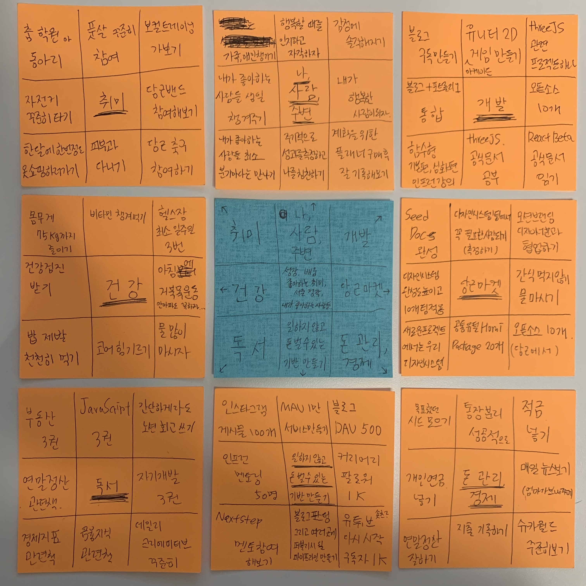

## 2022년을 보내고

- [2020년 회고록](https://junghyeonsu.tistory.com/82)
- [2021년 회고록](https://junghyeonsu.tistory.com/236)

매년 연말에 회고와 계획을 세워온지 이제 3년째이다.
학생에서 졸업하고 취준생에서 직장인이 되기까지 세 개의 회고가 필요했다.
매년 회고를 쓰고 다음 해가 끝날 때 다시보면 감회가 새롭다.
이번에도 작년 꺼를 다시 보게 되었는데 내가 작년에 저런 생각을 했구나, 내가 저 정도의 수준이었구나 하는 생각이 든다.

올해는 조금 더 특별했던 것 같다. 단순히 요약하면 **취업 성공** 이라고 할 수 있을 것 같고,
그 안에서 희노애락이 너무 많았어서 힘들기도 했다. 하지만 그 덕분에 정규직 전환을 했을 때 더욱더 큰 행복으로 다가왔던 것 같다.

올해가 시작하기 전 세웠던 계획들을 잘 지켰는지 잠깐 한 번 살펴보고,
올해 있었던 굵직한 일들을 나열해보고 내가 무엇을 했는지 돌아본다.
그리고 내가 2023년에는 어떤 것을 할 것인지 계획을 세워본다.

### CS 공부

이 블로그에 HTTP, HTML, Web, 접근성, JavaScript 관련해서 포스팅 해놓은 것들이 몇 개 있다.
그래도 시도 정도는 했던 것 같다.

### 알고리즘, Flutter는 Fail...

2022년에 계획했던 알고리즘과 Flutter 공부는 하지 않았던 것 같다.
당근마켓에 합격해서 거기에 집중을 했던 것도 한 몫을 했겠지.

### 기술서적 읽기

- javascript deep dive
- 코어자바스크립트
- 클린코드
- 이팩티브 타입스크립트

지금 생각하면 많은 정도는 절대 아니다.
내년에는 기술서적이든 경제서적이든 책을 읽을 수 있도록 환경을 만들고 싶다.
자꾸 이 생각이 드니까 아이패드 미니가 너무너무 가지고 싶은데 어떡하지...

### 테오스프린트 4기 참여

올해 사실 가장 나를 많이 변화시키고 임팩트가 있는 활동이라고 하면 이 활동을 꼽을 것 같다.
프론트엔드 개발을 시작하고 처음 NPM 배포를 해본 것도 해당 활동에서였고, 이 활동에서 만난 분들과 스터디도 하고 같이 공부도 했다.

### NextStep Clean Code With JavaScript

66만원 주고 들은 자바스크립트 강의였다.
내가 시간을 조금만 더 투자했으면 조금 더 많은 것을 얻지 않았을까 하는 생각이 지금 든다.

### 도메인 구매하기

블로그에 진심이라 도메인을 구매했다. 3년에 66,000원.

### 블로그, 포트폴리오 사이트 만들어보기

- 블로그: 현재보고 있는 사이트
- [포트폴리오](https://hyeonsu-jung.vercel.app/)

### 오픈소스

올해 당근마켓 프론트엔드 코어팀에 소속되어서 그런건지 오픈소스에 대한 나의 인식이 많이 바뀐 것 같다.
이전에 NPM 배포 한 번 해보기 전까지는 **큰 벽** 같은 느낌이었다. 근데 한 번 하고, 그 이후에도 여러 번 한 결과 든 생각은
정말 어렵지 않고 프론트엔드 생태계에 아주 쥐털만큼이라도 기여했다는 느낌이 되게 좋았다. 그리고 오픈소스라고 거창할 것 같지만 정말 별거없다는 것도 느꼈다.

### 당근 합격

2022년의 절반정도를 당근에서 보냈다. 운이 좋았지.

사실 나보다 더 열심히 사는 사람 절대 있을거라 생각도 들고, 나의 노력이 남들보다 더 값지거나 더 질이 좋았다고 생각도 하지 않는다.
어떻게 인턴에서 정규직 합격까지 달려왔는데 요기서 안주하고 싶지 않다. 배울 건 너무나도 많고 하고싶은 것도 너무나도 많다.
인생에서 제일 굵직한 체크포인트가 올해라고 생각한다. 이 기회를 잘 발판 삼아 더 높이 가고싶다.

## 2023년을 맞이하며

매년 회고와 계획을 하는데 느낀 점은 계획은 구체적이야 한다는 것. 그냥 뭉뚱거리면 회고하기가 쉽지가 않다.
위에 2022년 회고를 하는데도 성과를 측정할 방법이 없더라. 회고를 좀 짧게 했는데, 이와 같은 이유에서 였다.

> "CS 공부하기" -> "CS 관련 공부한 것 블로그 포스팅 20개 작성"

차라리 이런 식으로 작성했으면 몇 퍼센트 도달했다 라는식으로 회고를 할 수 있을 것 같아서 올해는 조금 자세하게 작성해보려고 한다.

> 위 처럼 나의 목표를 수치화하기 위해서 "만다라트" 라는 기법(?)을 이용해서 목표를 다시 수정해봤다.

### 당근마켓

> 당근마켓에 잘 적응하고, 영향력있는 사람되기

- Seed Docs 완성하기
- 디자인시스템 컴포넌트 완벽하게 만들고 **10개의 팀에** 적용시키기
- 새롭게 시작되는 프로젝트는 우리의 디자인시스템으로 만들게 되는 환경 구축하기
- 공통 유틸 레포 **20개의** packages
- 이외에 당근에 유용한 혹은 내가 만들고 싶은 **오픈소스 10개** 만들기
- 모션브랜딩 디자이너분과 협업하기
- 디자인시스템팀에서 꼭 필요한 사람되기
- 간식 먹지 않고 물 많이 마시기

### 개발

> 개발 역량과 내가 만들고 싶은 여러 프로덕트를 위한 몸부림

- 블로그 구독 만들기
- 블로그 + 포트폴리오 통합
- 인프런 함수형 기본편, 심화편 강의 듣기 (유인동님)
- three.js 공식 문서보고 공부하기
- three.js 관련 프로젝트 하나 하기
- 유니티 2D 하이퍼 아케이드 게임 만들어보기
- (프론트엔드 생태계) 오픈소스 10개
- React Beta 공식 문서 읽기

### 일하지 않고 돈벌 수 있는 기반 만들기

> 웝급으로는 서울 아파트를 살 수 없다.

- 간단 개발 지식 관련 인스타그램 **게시물 100개**
- 인프런 멘토링 **50명**
- NextStep 멘토 참여 해보기 (기회가 된다면...)
- 블로그 포스팅이 올라가고 여러 곳(유튜브, 인스타, 커리어리와 같은...)에 퍼블리시 될 파이프라인 만들기
- 유튜브 숏츠 컨셉으로 간단 개발 팁으로 시작해보기: **구독자 1K 목표**
- 커리어리 **팔로워 1K**
- 블로그 **DAU 500 UP**
- **MAU 10K** 서비스 만들기

### 독서

> 책은 저자의 인생이나 경험을 압축 획득할 수 있는 마법서, 근데 왜 나는 읽지 않았나.

- 부동산 관련 도서 **3권** 읽기
- JavaScript 관련 도서 **3권** 읽기
- 자기개발 관련 도서 **3권** 읽기
- 연말정산 관련 도서 읽기
- 경제지표 관련 도서 읽기
- 금융지식 관련 도서 읽기
- 데일리 크리에이티브 매일 읽고 기록 남기기
- 간단하게라도 노션에, 혹은 블로그에 회고 쓰기

### 돈 관리, 그리고 경제

> 돈 관리하기 그리고 경제에 대해서 관심 갖기

- 목표했던 시드 모으기
- 개인연금 넣기
- 연말정산 잘하기
- 지출 기록하기
- 매일 뉴스보기
- 적금 넣기
- 통장 분리 성공적으로 하기
- 슈카월드 챙겨 보기

### 건강

> 나의 열정을 지속할 수 있는 기반 만들기

- 몸무게 **75kg까지** 줄이기
- 건강검진 받기
- 밥 제발 천천히 먹기
- 코어 힘 기르기
- 물 많이 마시기
- 아침에 거북목 운동 계속하기
- 헬스장 최소 일주일 **3번가기**
- 비타민 챙겨먹기

### 취미

> 내가 무엇을 좋아하나

- 춤 학원이나 동아리에 들어서 춤 배워보기
- 자전거 꾸준히 타기
- 한 달에 한 번 정도 옷 쇼핑 하러가기
- 피부과 다니기
- 당근 축구 참여하기
- 당근 밴드 참관이나 참여해보기
- 보컬 트레이닝 받아보기
- 풋살 꾸준히 참여하기

### 나, 사람, 그리고 주변

> 내가 살아가는 이유는 내가 좋아하는 사람들과 내가 좋아하는 것들을 같이 하기 위함

- 가족, 애인 챙기기
- 내가 좋아하는 사람들 생일 챙겨주기
- 내가 좋아하는 사람들 최소 분기마다 만나기
- 주기적으로 성과를 측정하고 나를 칭찬하기
- 계획을 위한 플래너 구매 후 잘 기록해보기
- 내가 행복한 사람이 되기
- 감정에 솔직해지기
- 행복할 때를 인지하고 자각하자 = 행복 할 땐 행복하다고 말하기

### 마무리

모든 것을 다 할 수 있다면 정말 정말 좋겠지만,,, 내 몸이 한 3개 정도라면 가능할 것 같다.
하지만 목표 달성을 위해 열심히 2023년을 달릴 것이고 되게 원대하게 잡은 목표들이라서 전부 달성하지 못해도 좋다.

2023년 말에는 의미있는 회고를 할 수 있을 것 같아서 새롭게 시작된 2023년이 너무 기대된다.
