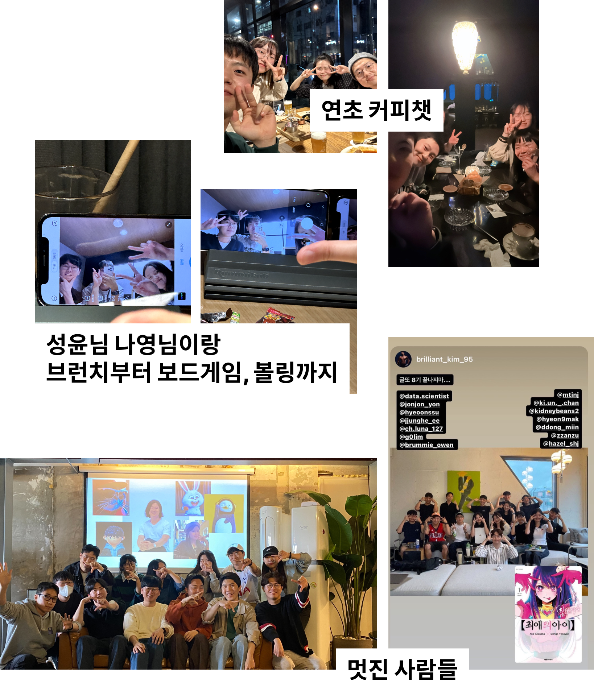
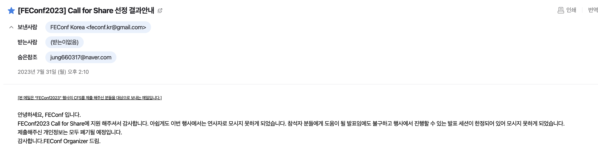
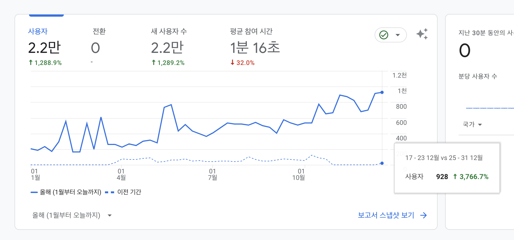
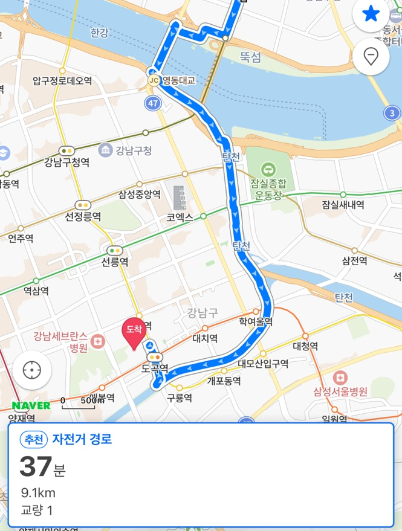
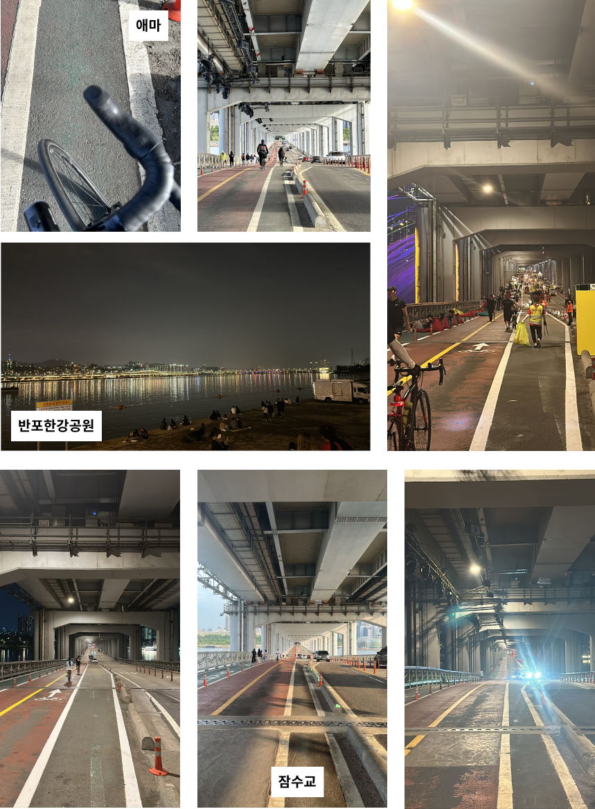
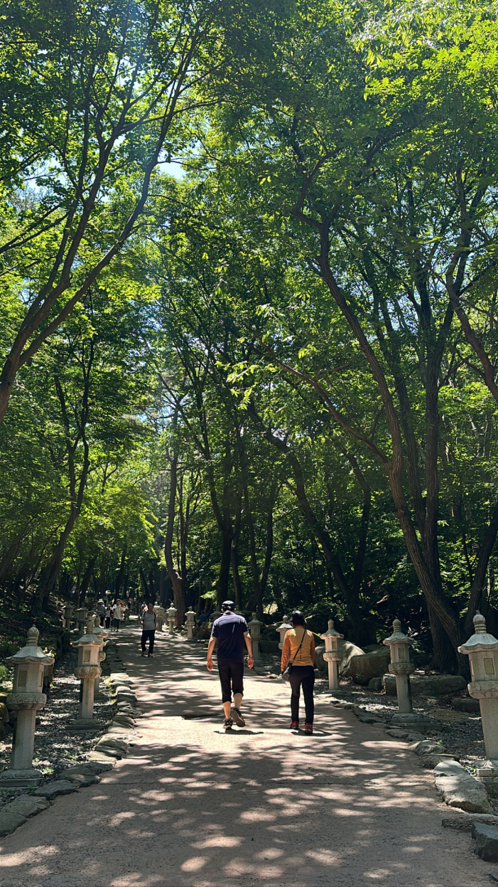

## Good Bye, 2023

`2023년`이 끝났다. 늘 그렇듯 1년을 돌아보는 일은 즐겁다.
회고를 하고 나면 늘 드는 생각은 1년이 생각보다 긴 시간이라는 것이다. 그 안에서 내가 할 수 있는 것들은 정말 많다.
그래서 회고할 것도 많다. (2022년 회고록은 개인적으로 살짝 아쉽다. 너무 대충적은 것 같아)

- [2020년 회고록](https://junghyeonsu.tistory.com/82)
- [2021년 회고록](https://junghyeonsu.tistory.com/236)
- [2022년 회고록](https://junghyeonsu.com/posts/2022-retrospect-2023-plan/)

나는 2020년부터 쭉 1년 회고를 써왔다. 이번이 `4번째 회고`다.

처음 회고를 쓸 땐 분기 회고, 월간 회고도 썼는데 올해는 그러진 못했다.
며칠 전에 2020년 회고를 다시 봤다. 그때 당시에는 정말 심각했던 문제들 혹은 고민이
지금 와서 보면 아무것도 아닌 것처럼 느껴진다. `아, 저 때는 내가 저런 생각과 고민을 했구나.`와 같은 생각들도 들고
`그래도 내가 많이 성장했구나` 하는 생각도 든다. 이 회고록도 언젠가 나중에 보면 추억이고 성장을 증명하기 위한 증거로 남겠지.

이 글은 지난 2023년에 내가 `무엇을 했는가에 대한 기록`이자, `원동력을 위한 자기 칭찬`이자,
`앞으로 어떻게 나아가야 하는지에 대한 이정표`이다.

## 이제는 당근입니다?

<Callout>
  그거 아시나요? 당근은 2023년 8월 28일 당근은 ‘마켓’을 떼어내고 ‘당신 근처’로
  나아가기 위한 긴 여정에 닻을 올렸습니다.
</Callout>

### 당근에서 1년 6개월

작년(2022년) 11월에 당근 디자인시스템 팀에서 정식적으로 커리어를 시작했다.
인턴 기간까지 합치면 약 `1년 6개월` 정도의 시간이 흘렀다.
연차로는 내년에 이제 3년 차(?), 만 1년 6개월째인 프론트엔드 엔지니어가 됐다. <s>(되어버렸다)</s>
좀 겸손하게 말해야 할 땐 **"만 1년 6개월째 개발 중입니다ㅎㅎ.."**라고 말하고 경력을 좀 뽐내고 싶을 땐 **"이제 3년 차 되어갑니다^^"** 라고 친구들이랑 얘기했다ㅋㅋㅋ

올해는 온전히 1년을 **디자인시스템**팀에서 보냈다.
우리 팀과 옆 팀인 **프론트엔드 코어 팀**, 둘을 합쳐서 **UX시스템 실**이라고 부르고 어젠 UX시스템 실의 송년회가 있었다.
어제 `당근에 대해서 어떻게 생각하나` 라는 질문에 서로의 생각을 들을 시간이 있었는데
이렇게 뛰어나고, 능력 좋고, 훌륭한 팀원들과 함께할 수 있다는 것 자체가 축복이라고 말했다.
어느 정도냐면 `긍정적인 두려움`을 느낀다는 말까지 말했다.
예전에는 이 두려움이 나만 느끼는 것 같아 많이 힘들었고, 예전에 썼던 [당근 인턴 회고](https://junghyeonsu.com/posts/Daangn-intern-middle-retrospect/)에서도
적었지만 [임포스터 증후군](https://www.robertwalters.co.kr/insights/career-advice/blog/dealing-with-imposter-syndrome.html) 때문에 많이 힘들었다.
근데 어제 송년회를 통해서 나만 느끼는 것이 아닌 모두가 서로에게 그런 감정을 느끼고 있었고 그게 지금은 부정적이 아니라 **긍정적**으로 다가오고 있다.
매 순간 내가 지금 요기에서 개발할 수 있다는 것 자체가 축복이자 행운이고, 원동력이자 자극제다.

### 리브랜딩

당근에서 있었던 올해 가장 큰 일을 뽑으라고 하면 리브랜딩을 뽑을 것 같다.
약 두 달 정도 몰입해서 [랜딩 페이지](https://brandnew.daangn.com/)를 만들었다.
리브랜딩 관련해서는 [블로그 포스트](https://junghyeonsu.com/posts/daangn-rebranding/)로도 남겨놨다.
또 내 블로그 글을 기반으로 [당근 개발 블로그](https://medium.com/daangn/%EB%8B%B9%EA%B7%BC-%EB%A6%AC%EB%B8%8C%EB%9E%9C%EB%94%A9-%EC%BA%A0%ED%8E%98%EC%9D%B8-%ED%8E%98%EC%9D%B4%EC%A7%80%EB%A5%BC-%EA%B0%9C%EB%B0%9C%ED%95%98%EB%A9%B0-%EB%B0%B0%EC%9A%B4-%EA%B2%83-b41d866df9b7)에 처음으로
기여도 해보고 동시에 [팀 당근](https://about.daangn.com/blog/archive/%EB%8B%B9%EA%B7%BC-%EB%A6%AC%EB%B8%8C%EB%9E%9C%EB%94%A9-%EB%9E%9C%EB%94%A9-%ED%8E%98%EC%9D%B4%EC%A7%80-%EC%9B%B9%EC%82%AC%EC%9D%B4%ED%8A%B8-%EA%B0%9C%EB%B0%9C-%ED%9A%8C%EA%B3%A0/)에도 기여를 했다.
이렇게 연쇄적으로 당근에 다양한 방면으로 기여할 수 있는 기회가 생겼다는 건 내가 그만큼 중요한 프로젝트를 했다는 반증 아닐까 하는 생각을 했다.

리브랜딩 관련해서는 블로그 포스트가 3개나 있으니 짧게 넘어가려고 한다.

### 업무

디자인시스템 팀에서 온전히 1년을 보냈다.
내 1년 주 업무를 돌아보면 크게 아래 프로젝트들을 했다.

- 당근 디자인시스템 문서 웹사이트 개발 및 스펙 관리: [Seed Design](https://github.com/daangn/seed-design)
- 당근 사내 디자인시스템 웹뷰 컴포넌트 개발 및 유지보수 (1년 내내) (인터널 레포라서 링크는 없습니다.)
- 아이콘 관련 피그마 플러그인 개발: [Icona](https://github.com/daangn/icona)
- 에셋 관련 피그마 플러그인 개발: Karrot Asset Storage (인터널 레포라서 링크는 없습니다.)
- 당근 아이콘 관리: [Seed Icon](https://github.com/daangn/seed-icon)
- (단발성 이벤트) 리브랜딩 (8월 - 9월)
- 자잘하게 시도했거나 시도하려고 하는 것들
  - 피그마와 같은 환경에서의 메시지 송신 및 상태 관리 프레임워크 PoC 해보기: [figmazing](https://github.com/junghyeonsu/figmazing)
  - [june.so](https://june.so/) 클라이언트 오픈소스: [june-so-sandbox](https://github.com/junghyeonsu/june-so-sandbox)
  - `chakra/zag` 기여하기: [#629](https://github.com/chakra-ui/zag/pull/629), [#883](https://github.com/chakra-ui/zag/pull/883), [#864](https://github.com/chakra-ui/zag/pull/864)
  - `chakra/ark` 기여하기: [#1441](https://github.com/chakra-ui/ark/pull/1441)
  - Root Attributes 관련 스토리북 애드온 개발: [storybook-addon-root-attributes](https://github.com/junghyeonsu/storybook-addon-root-attributes)

2023년의 내 업무를 세 개 단어로 요약하면 `디자인시스템`, `피그마 플러그인`, `오픈소스`인 것 같다.

개인적으로는 조금 아쉽다. 조금 더 임팩트를 낼 수 있었을 것 같은데...
사실 내가 위에서 내년에 3년 차 뭐시기라고 했지만, 현업을 제대로 한 시기와 디자인시스템에 온전히 몰두한 시간을 따지면
이제 1년째 된 거라서 내가 할 수 있는 범위에서 최대한을 다 한 것 같기도 하다.

하지만 내년에도 그렇고 앞으로도 내 연차나 이런 한계를 스스로 지어서 내가 하는 일에 제한을 두고 싶진 않다.
언제든 내가 할 수 있는 것에 발 벗고 나서서 최선을 다하고 싶다.

### 당근 사람들

2023년에서 진짜 많은 부분을 차지했던 것이 `당근 사람들`이었다.
그것도 그럴 것이 일주일에 5일 같이 일을 하고, 점심을 먹고 얘기하는 사람들이었고 다들 결이 잘 맞아서
놀기도 잘 놀고 일도 열심히 하는 아주 멋진 사람들이다.

나는 예전에도 동료들에게 말했지만 나는 어떤 사람이든 **회사 동료**라는 관점에서 보기보다 그냥 **인생을 같이 살아가는 사람들**로 바라보고 있다.
그런 관점에서는 나와 너무 잘 맞는 사람들이다. 나는 무엇이든 열정적으로 하는 성격이라 대충 노는 거 절대 안 되고, 프로젝트할 때도 대충 하는 거? 절대 안 된다.
그것에 동참하는 사람들이라서 우리는 노래방에서 노래 부를 때도 미친 듯이 춤추면서 논다. 회사 사람들이랑 어떻게 그러냐고?
인생을 같이 살아가는 사람들과 좋아하는 걸 같이 하는 게 그렇게 이상한 일인가 생각이 들긴 한다.

당근에서의 생활이 언제까지 지속될진 모르겠다. 당연히 끝은 있을 것이다. 하지만 지금 당근에서의 순간을 즐기고 몰두하고 싶다.

## 만다라트는 영국에서 최초로 시작되어...

<Callout>만다라트가 `mandal-art`라는 걸 이 글을 쓰면서 알았다.</Callout>

[2023년 만다라트](https://junghyeonsu.com/posts/2022-retrospect-2023-plan/#2023%EB%85%84%EC%9D%84-%EB%A7%9E%EC%9D%B4%ED%95%98%EB%A9%B0)를 작년 말에 작성했다.

결과를 일일이 나열하진 않을 거다. 섹션별로 살짝씩 만 얘기를 해보자면

`취미` 분야는 너무 만족스러웠다. 춤이랑 보컬 트레이닝을 해보진 못했는데, 춤에 대한 욕심은 없어졌고
보컬 트레이닝은 한번 해보고 싶긴 하다. 올해 초부터 원했던 당근 밴드에도 내가 보컬로 들어가게 되어서
잘해보고 싶은 생각이 있다.

`주변과 나 챙기기`는 주변 사람들은 그래도 좀 잘 챙긴 것 같은데, 정작 `나`에 대한 부분들은 못 챙긴 것 같다.
원래 나는 내 건강을 좀 등한시하는 사람인 것 같아서 이 부분을 의식적으로 잘 챙겨야 할 거 같다.

`독서`는 그냥 박살이 나버렸다. 책을 좀 읽겠다고 산 건 많은데 완독률이 너무 처참하다.
꼭 책을 다 읽어야 하는 건 아니지만 그렇다고 해서 꾸준히 읽은 것도 아니다.
유튜브 자기 계발 영상에서 이런 식으로 자기 비하를 시작하면 잘 안 된다고 했던 것 같은데...

만다라트를 1년 해보니 느낀 점이 많지만 제일 핵심적인 건 **1년은 정말 길고, 계획은 항상 바뀐다**는 것이다.
작년 말에 중요하게 생각했던 것들이 몇 개월이 지나면 상황도 바뀌고 환경도 변하고 나도 변하더라.
그래도 작년 말에 만다라트를 쓰면서 생각한 건 **"내가 이걸 다 만족하면 진짜 미친 해였을 거야"** 라는 생각으로 작성한 거라
`50%`나 달성했다는 것에 그래도 뿌듯하다. 그래도 발전할 부분은 많은 것 같아서 2024년에는 6개월 먼저 작성하고
나머지는 2024년을 살아가면서 채우기로 했다.

작년에 같이 만다라트를 작성했던 모임이 있다. 올해 연말에도 모여서 회고와 2024년 만다라트를 같이 작성했다.
나는 이 글 작성하느라 같이 만다라트를 작성하진 못했는데 만다라트를 적어서 2024년 계획 포스팅을 따로 작성할 예정이다.
내가 정말 아끼는 뽀프만(모임이름)에 다나가 2024년은 집에 대문짝만 하게 붙여놓으라고 시트지를 사서 줬다.
종이에 직접 써가면서 채우고 집에 항상 보이는 곳에 두고 채워나갈 예정이다. 덕분에 다가올 2024년이 너무 기대된다. (다나 떙큐)

## 세 번이나 또라이가 된 사건에 대해서

<Callout>글쓰는 또라이</Callout>

2023년에는 글또 8기에 이어서 9기까지 하게 됐다. 7기는 그냥 참가자였지만 8, 9기 때는 운영진을 맡게 됐다.
[9기는 이제 막 시작](https://junghyeonsu.com/posts/geultto-9th-commitment/)했다.
9기 사람들도 이제 알아가야 하지만, 8기 때 운영진분들은 너무 멋진 사람들 그리고 배울 점이 많은 사람들이 많았다.
이런 모임에 있을 수 있다는 자체가 행복했고, 이런 모임을 내가 직접 찾아서 합류할 용기를 낸 나에게 칭찬을 해주고 싶었다.

글또는 어차피 블로그 글은 계속 쓸 생각이어서 지속해서 참가할 생각이고 지금 모임장인 [변성윤](https://zzsza.github.io/)님이 10기까지밖에
운영을 하지 않는다고 하셨지만, 그 이후로도 어떤 형태로든 비슷한 모임은 생기지 않을까 하는 생각이다. (근데 성윤 님만큼의 임팩트를 낼 수 있을진 모르겠다.)

## 일 안 하고 돈 벌고 싶다.

<Callout>그 여정에 내가 할 수 있는 것들</Callout>

### 발표

올해 발표를 몇 번 하게 됐다. 우선 내가 나온 대학교에서 `두 번`의 발표를 했고, 외부에서는 [테오콘에서 `한 번`의 발표](https://www.jumpit.co.kr/contents/428)를 하게 됐다.

대학교에서는 개발 동아리 두 곳에서 나를 따로 불러서 총 두 번을 가게 되었는데,
한 얘기는 **내가 만약에 다시 대학생으로 돌아간다면 프론트엔드 개발자가 되기 위해서 무엇을 준비할까?** 의 주제로 준비했다.
위에서 말했듯 뭐든 대충 하는 건 싫어해서 준비를 좀 열심히 해 갔다. 내가 유의미한 발표를 했는지는 모르겠는데, 한 명이라도 깨달음이 있었다면 나는 그걸로 만족한다.

테오콘 발표는 [발표 자료](https://github.com/junghyeonsu/teoconf2)를 빡세게 준비한 기간은 약 `2주` 정도였다.
발표 자료만 키노트로 약 200장이었고, 애니메이션도 넣고 어떻게 하면 조금 더 쉽게 눈과 귀에 들어올지 고민을 많이 했다.
아쉬운 건 영상으로 남지 않아서 그게 너무 아쉽다. 그래도 발표 끝나고 뒤풀이 장소에 갔을 때 내 블로그도 너무 잘 보고 있고,
발표도 너무 잘 들었다고 해주신 분들이 너무 많아서 좋았고 뿌듯했다. 다음에 또 이런 기회가 있다면 다시 발표를 하고 싶다.

그리고 올해 있었던 [FEConf 2023](https://2023.feconf.kr/)에도 사실 발표 신청을 했었다. 근데 선정되진 않았다.

우리 회사 동료분인 [애셔](https://github.com/malangcat)가 [디자인시스템과 관련된 발표](https://www.youtube.com/watch?v=obQvttzgSzY&t=491s)를 했고
리더분인 [토니](https://github.com/tonyfromundefined)도 [이벤트 기반 웹뷰 프레임워크 설계와 플러그인 생태계 만들기](https://www.youtube.com/watch?v=pEPOGDPDU-U)라는 주제로
발표를 했다.

신청할 때 그 당시로는 **내가 아는 게 모든 사람이 알지 않는다** 라는 사실과 **단 한 명이라도 도움이 된다면 그걸로 족한 거 아닌가** 라는 마인드로 신청을 했다.
근데 위에서 발표해 주신 토니와 애셔가 너무 뛰어난 사람들이라 내가 떨어진 것에 대해서 너무 당연하게 수긍했다.
FEConf를 내년에 신청을 할 수 있을지는 모르겠다. 딱히 발표에 대한 큰 욕심이랄까 많이 사라지긴 했다.
지금 디자인시스템 관련해서 발표하고 그 이후 진전이 많이 없어서 그런 걸 수도 있다. 또 발표 주제가 있고 기회가 있으면 하고 싶은 마음은 있다.

### 블로그

올해 초부터 지금 이 블로그를 제대로 하기 시작했다.
원래 목표는 일일 방문자 `500명`을 찍어보는 것이었는데, 그건 달성하지 못했지만 그래도 절반인 `250명`까지는 달성했다.
확실히 꾸준히만 하면 우상향을 하는구나 하는 생각이 들었다. 반년 전에는 좀 눈에 띌만한 기술 포스팅을 하나 하고 링크드인, 오픈채팅방 등 여러 곳에 뿌려야
일일 방문자가 `250명`을 겨우 찍었다. 연말이 돼서는 평일에 `200 중후반`이 평균이 된 것 같다.

내가 방문자에 집착을 하는 건 아니다. 지표를 성과 측정을 할 수단으로 생각하고 있고, 난 이 블로그에 광고를 붙일 생각이 없다.
나는 이 블로그를 **정현수의 모든 종합 컨텐츠를 다루는** 곳으로 만들고 싶다.
나는 **무언가를 만드는 것**이 정말 좋다.
내가 만약에 만들고 싶은 게 게임이든, 앱이든, 웹이든 상관없이 필요하다면 기술을 배워서 사용할 의지도 있고 사실 실제로 지금 그렇게 하고 있다.
내가 만든 걸 요기서 전시하고, 나중에 강의를 찍게 된다면 강의 영상도 올리고 싶다. 그리고 자연스럽게 내가 만든 것들이 자동으로 홍보됐으면 좋겠다.

내년에는 DAU(일일 방문자)를 `1,000명`을 한번 찍어보고 싶다.

### 유튜브

이번 송년회 때 유튜브에 대한 얘기도 나왔었는데, 사실 난 이미 시도하고 있다. 벌써 첫 영상을 올린지 한 달 하고도 반이 지났다.
송년회 때 팀원들한테 얘기는 하지 않았다ㅋㅋㅋ 이유는 단순히 아직 부끄러운 규모이기도 하고 제대로 된 컨텐츠가 없어서 보여줄 게 없었다.
팀원들이 유튜브 하면 잘할 것 같다고 말해줬는데, 지금은 내가 원하는 그런 느낌은 아니긴하다ㅋㅋㅋㅋ 유튜브 얘기만 하면 아직 왜 이렇게 부끄러운지 모르겠다. 처음이라 그런걸까.

블로그에서 유튜브 홍보는 하지 않을 거다. 그냥 내 다른 페르소나라고 생각한다. 어떤 채널인지, 채널명이 뭔지, 어떤 주제로 올리는 지도 올리지 않을 예정이다.
실제로 내 주변 사람들에게도 (심지어 가족까지도) 내가 무슨 채널을 운영하는지 아는 사람이 `단 한 명`도 없다. 뭐 크게 신경 쓰지도 않겠지만.

첫 번째 영상에서도 했던 얘기가 있는데 나는 유튜브 조회수나 구독자와 같은 지표에 너무 목매달지 않으려고 한다.
내가 유튜브를 제일 중요하게 생각했던 건 `지속가능성`이다. 내가 뭘 할 때 재미를 느끼고, 예전부터 내가 하고 싶었던 게 뭘까
이런 생각들을 하면서 결론 내렸던 걸로 지속해서 컨텐츠를 만들 예정이다. 유튜브도 [스타트업의 데스 밸리](https://brunch.co.kr/@ericaseong/8)처럼
그 구간이 있는 것 같다. 유튜브에는 성공 공식이 있고 그걸 증명한 [영상](https://www.youtube.com/watch?v=Czmkes4yAOA)도 재미있게 봤지만
이건 나와 상황이 많이 다르기도 하고, 이전에 몇 번의 시도도 있었고 단편적으로 저 영상으로만 판단하면 절대 안 된다고 생각한다.
데스 밸리를 지나기 위해서는 위에서 말했듯 `지속가능성`이 제일 중요하다고 생각했고, 그래도 지금까지는 나름 잘 지속되고 있다.

첫 영상을 올리고 약 `2주간`은 정말 단 하나의 반응도 없더라. 정말 이게 전 세계 사람들이 쓰는 그 유튜브가 맞나 싶었다.
첫 댓글과 구독자가 생겼을 때 그 희열감은 진짜 잊지 못한다. 그래도 지속하니까 반응은 오더라.
아무리 구독자 같은 지표를 신경 안 쓴다고 해도 나도 사람인지라 조금 집착을 하게 되긴 했다.
그래도 지금 잘 견디고 있는 나 스스로 너무 기특하고 대견하고 칭찬해~~ 내년 회고 때는 얼마나 늘어있으려나...

## 건강이 제일 중요해요.

<Callout>2023년에 내가 제일 미쳐있고, 미쳐봤던</Callout>

### 다이어트 (간헐적 단식)

사진 너무 얼굴 빡 이라서 좀 많이 축소했는데, 없던 턱선이 생겼다.
거의 올해 초애 `80kg`에서 `72 - 73kg` 까지 뺐다.
다이어트가 왜 진짜 최고의 성형인지 올해 뼈저리게 느꼈다. 사람이 날렵해 보인다는 것, 그리고 자신감도 더 생기고, 사진 찍는 게 이젠 무섭지 않다.

올해 살을 좀 빼고 3, 4분기에 사람들을 만났을 때 **"도대체 어떻게 뺀 거야?", "살이 왜 이렇게 많이 빠졌어"** 라는 얘기를 정말 거짓말 안 하고 모든 모임에서 다 들었다.
이거 듣는 것도 은근히 재미있다ㅋㅋㅋㅋㅋ

나는 `간헐적 단식`을 했다. 하루에 한 끼를 먹는 방식으로 다이어트를 했다.
이 방식이 맞는 사람이 있고, 아닌 사람이 있을 텐데 나한테는 정말 인생 다이어트라고 느껴졌다.
우선 난 원래도 야식을 안 먹는 사람이었고, 밤에 최대한 안 먹으려고 하다 보니 자연스럽게 점심에 왕창 먹어버리고 저녁까지 버티는 식이 됐다.
점심을 먹을 때 "아니 이 사람 굶었나?" 싶을 정도로 진짜 미친 듯이 먹는다. (실제로 굶었다.)
이게 익숙해지니까 저녁을 먹는 게 너무 어색했다. 배가 가벼운 상태로 헬스하고, 잠에 들 때 깔끔하게 잠드는 게 너무 좋았다.
늦은 밤이 살짝 고비긴 한데, 나는 그냥 자 버린다. 그리고 다음 날 아침 홀쭉해진 몸을 보면 기분이 그렇게 좋을 수가 없다.
이렇게 석 달 정도? 반복하니까 그냥 살이 쭈욱 빠지더라. **나는 이제 살 빼는 게 제일 쉽다.**

### 헬스

나는 인바디 측정을 안 하고 눈바디를 해서 수치가 없다.
헬스는 그냥 퇴근하고 오면 무조건 갔다. 일주일에 평균 5회 정도는 갔던 것 같다.
정말 삘받은 주에는 6일 헬스 다 하고 일요일은 헬스장이 쉬어서 자전거를 타고 철봉이 있는 곳에 가서 턱걸이와 팔 굽혀 펴기를 100개 넘게 하고 왔다.
헬스는 이제 그냥 습관을 넘어서 내 인생이 된 것 같다.

### 풋살

풋살을 정말 많이 했다.

우선 매주 금요일에 차는 모임이 생겼다. 바닐라 코딩이라는 부트캠프에서 진행하는 모임인데 우연히 같이 차게 되어서 모임에 가입했다.
실력이 느는지는 모르겠다ㅋㅋ 그냥 재미있다. 풋살도 내 평생 취미가 되지 않을까 싶다.

그리고 대학 선배들이 운영하는 모임이 있어서 거기에서도 찬다.
이 모임은 주기적으로 요일을 잡고 차진 않는데 가끔 평일 저녁에 한 번씩 차는 거에 대부분 참여하려고 했다.
이렇게 하다 보니까 금요일 밤에 풋살 하고, 토요일 아침에 풋살하고 이런 적도 있었다.
진짜 미치게 더운 8월인가 9월에 토요일 아침에 풋살 하다가 더위 먹어서 자전거 타고 풋살장으로 갔는데 집에 못 갈 뻔한 적도 있었다.
그래도 재밌다.

그리고 만다라트에도 있는데 당근에서 진행하는 풋살 혹은 축구에 참여하는 것도 있었다.
올해 세 번 정도 참여했던 것 같고 할때마다 너무 재미있게 찼다.

### 수영

집 앞에 수영장이 있어서 여름에 수영모, 수경, 수영복 사서 두 달 정도 자유 수영을 했다.
예전에 자유형을 배운 기억으로 그냥 수영하는데 내가 지금 수영을 잘 못해서 그런가? 자유형 할 때 숨을 잘 못 쉬겠더라.
그리고 아침에 가면 사람들이 정말 많다. 그래서 뒷사람 신경 쓰면서 계속 빨리 출발해야 하는데 그거 자꾸 신경이 쓰여서 두 달 하고 이후론 많이 못 갔던 것 같다.

그래도 하고 나면 진짜 개운하고 하루 시작이 좋았던 것 같다. 내년 여름에도 다시 시도해 봐야지.
(살이 빠진 게 수영 때문인가?...)

### 자전거

나는 예전에 샀던 로드바이크가 있다. 집에서 풋살장으로 갈 때 대부분 자전거를 타고 이동했다.
집에서 풋살장까지 `9.1km` 정도의 거리고 왕복으로 하면 거의 `20km`를 이동한다.

그리고 놀라운 건 그렇게 자전거를 `9km` 타고 가서 풋살을 `2시간`하고 집으로 다시 `9km`를 타고 온다.
처음에 할 땐 그냥 철인 3종 경기하는 것 같은 느낌이 들고 허벅지가 불타는 느낌이 (오히려 좋아) 들었는데
조금 익숙해지니까 그냥 별생각 없더라. 그냥 하면 된다.

그리고 지금은 날씨가 너무 추워서 잘 못 타는데 날이 좋을 때 자전거 타고 잠수교 가는걸 굉장히 좋아한다.
집에서 잠수교까지가 적절한 반환점이기도 하고 잠수교를 건너서 반포 한강공원에 앉아서 엄마랑 통화하거나 그냥 멍하니 있는 걸 좋아한다.

### 배드민턴

당근에서 매주 월요일마다 배드민턴을 쳤다.
예전에 고등학교에서 배드민턴 동아리를 짧게 한 기억으로 쳤는데 다시 하니까 되게 재미있게 쳤다.
근데 최근에 배드민턴하는데 허벅지 뒤 근육을 다쳤다. 그날 좀 치다가 다친 거면 모르겠는데 첫판을 하는데 허벅지 뒤 근육이 갑자기 올라와서
그날 아예 못하고 그냥 집으로 돌아왔다. 지금은 조금 괜찮아진 것 같은데 스쿼트 자세를 취하면 아직 살짝 당긴다. (다들 겨울에 운동 전에는 무조건 준비운동 잘하세요.)

이 정도 했는데 살이 안 빠지면 그건 내 몸에 문제가 있다는 거 아닐까?.. 정말 엄청나게 움직였구나ㅋㅋㅋㅋㅋ
내년에도 만능 스포츠인을 향해서 가보자고

## 내가 아끼는 사람들

올해 가족이랑 여행을 많이 못 갔다.
가족의 사정이 있어서 못 가기도 하고 내가 서울에서 자취를 하다 보니까 의식하고 있지 않으면 한 달, 두 달 그냥 그렇게 흘러가 버리더라.
올해 만약 이렇게 산다면 내가 가족을 살면서 몇 번을 더 볼까, 생각했는데 분기마다 한 번 간다고 하면 `1년에 4번`
현실적으로 부모님이 오래 산다고 생각하면 50년 더 보는데 (그보다 더 적을 수도 있지) 그러면 `4 * 50 = 200번` 밖에 내 인생에서 가족을 보는 횟수라고 생각할 수 있다.
이렇게 한 번 생각하고 나니까 많은 생각이 들더라. 정말 가족을 보는 순간들이 소중해졌다.

엄마랑은 그런 얘기를 했는데 내년부터는 꼭 분기나 반년마다 해외여행을 같이 가자고 했다.
내가 열심히 돈 벌어서 좋은 곳, 좋은 집, 좋은 차, 안락한 삶을 누리게 해주고 싶다. 열심히 해야지.

그리고 내가 진짜 애정하는 모임인 뽀프만은 작년부터 시작해서 연말을 함께하고 있다. 벌써 2년째인데 매년 연례행사로 자리 잡게 될 것 같다.
정말로 어디 던져놔도 알아서 잘 살아갈 사람들이라서 걱정은 없고 기대만 가득한 모임이다. 소중하고 좋은 사람들.

올해는 대학 친구들이나 고등학교 친구들이랑은 많이 보진 못했다. 다들 회사에 다니기 시작했고 각자의 삶이 바빠서 만나기가 어렵더라.
그래도 내가 소중하게 생각하는 사람들은 적어도 1년에 한 번 혹은 반년에 한 번은 만나려고 노력했고 잘 이뤄진 것 같다.

## 여러분들은 성공합니다.

<Callout>여러분들은 성공합니다. 왜냐하면 그걸 원하기 때문이죠.</Callout>

내가 요즘 아침에 자주 보는 자기 계발 유튜버인 [하와이 대저택](https://www.youtube.com/@hawaiidjt)에 나오는 대사다.
매일 아침 6시에 동기부여 비슷한 영상을 올려주는 유튜버인데 해당 유튜버의 영상들을 보기 시작하면서 마인드가 긍정적인 방향으로 많이 바뀌었다.

나는 자기 계발 영상들을 정말 많이 보고 예전에 책도 많이 읽었다. 해당 부류의 영상들에서 하는 얘기들은 하나 같이 다 비슷하다.
사실 `그냥 하면 된다`라는 진리를 깨우치기 위한 영상들 혹은 책들이 대다수인 것 같다. 결국은 그 영상을 보든, 책을 읽든 내가 실행해야 한다.
그런 강연들도 다 비슷한 얘기를 한다. 성공한 사람들이 나와서 얘기하는 건 대부분 결국 보면 `실천한 사람들`이 나와서 하는 얘기들이다.

`그냥 하면 된다`는 진리는 말은 쉽지만 가장 어렵다. 그래서 나는 그냥 무언가를 시작할 때 큰 의미를 두지 않기로 했다.
가령 내가 술을 먹고 들어와서 공부한다고 하면 대부분 사람이 놀란다. "아니 어떻게 술을 먹고 들어갔는데 공부를 해?"와 같은?..
이 반응은 **술을 먹고 들어가서 공부를 어떻게 하는가**에 대해서 큰 의미 부여를 해서 그렇다.
그냥 말 그대로 `그냥 하면 된다.` "내가 술을 마셨는데 어떻게 공부를 해"와 같은 생각이 들기 전에 그냥 행동하고 있으면 그 행동은 그냥 별것 아니게 된다.
올해 말쯤에 그런 깨달음(?) 비슷한 걸 얻었고, 유튜브를 시작한 것도 그냥 그렇게 시작해 버렸다. "내가 어떻게 유튜브를 시작해"와 같은 생각이 들기 전에 말이다.

난 돈에 대한 갈망이 있다. 사람들이 돈으로 행복할 수 있는 건 어느 적정 수준이 있다고 얘기한다.
나는 어느 정도 동의를 하지만 근데 그걸 이루고 나서 내가 느껴봐야 그게 진짜인지 아는 거 아닐까?..
벌고 나니까 생각보다 더 내가 돈을 갈망하는 사람일 수도 있고, 아닐 수도 있다. 중요한 건 해보지 않으면 모른다는 것이다.

올해 나에 대해서 많은 생각들을 했는데, 제일 큰 수확은 내 인생에서 하고자 하는 게 명확하게 잡혔다. 테오콘에서도 발표 도입부 부분에 내 소개를 할 때 이렇게 소개했다.
`공간적, 시간적, 경제적 제한이 없는 곳에서 내가 만들고 싶은 것들을 만들면서 사는 삶`, `나와 비슷하거나 내가 이끌리는 가치관을 가진 스타트업에 엔젤 투자를 하며 살아가는 삶`
그리고 마지막으로 `위의 모든 것들을 내가 좋아하고 사랑하는 사람들과 함께하면서 소소한 행복을 느끼고, 맛있는 걸 먹고, 황홀한 풍경들을 보며 살아가는 삶`을 살고 싶다고 했다.

제일 중요한 건 위의 것들을 공간적, 시간적, 경제적 제한이 없게 하려면 `돈`이 제일 중요하다.
그래서 돈에 대한 갈망이 있다. 자꾸 돈, 돈 거려서 조금 듣기 거북할 수 있는데 자본주의 사회에서 돈을 제외하고 살아갈 수 있을까.

그리고 제일 중요한 깨달음은 **위의 모든 것들을 내가 할 수 있다는 자신감**을 얻었다.
실제로 위의 모든 것들을 이루고 나서의 하루를 상상해 보고 그 하루의 스케줄을 짜봤었다. 그렇게 가슴이 뛰고 설레었던 기억이 없었다. 진짜 진짜 상상만으로도 행복했다.
그리고 말만 번지르르하게 하는 게 아니라 나는 실천하고 있고 2024년은 내가 위의 모든 것들을 이루는 과정의 한 해가 될 거라는 생각에 너무 설렌다.

## Good Morning, 2024

요기까지 정말 멀리 왔다. 이 글을 쓰는데도 약 10시간 정도는 투자한 것 같다.

`2022년`은 과도기의 한 해였다면, `2023년`은 정착과 적응기의 한 해 그리고 내면적으로 더 단단해진 한 해가 아닐까 싶다.
`2024년`은 시스템 구축 및 지속의 한 해가 되었으면 한다. 2024년 계획과 만다라트는 따로 포스팅을 작성할 예정이다. (사실 회고 쓰느라 계획을 못 짰다.)

나도 그렇고 내 주변 사람들 그리고 여러분 모두가 `2023년`은 내가 상상한 것들을 이룬 한 해,
그리고 다가오는 `2024년` 상상하던 것들을 이루는 해, 실천하는 해, 건강한 해, 행복한 해, 운이 좋은 해, 상상만 해도 설레는 해가 되길 진심으로 바랍니다.
