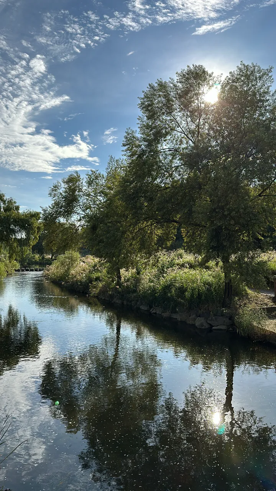
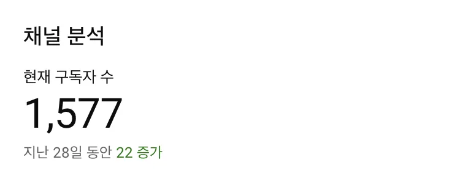
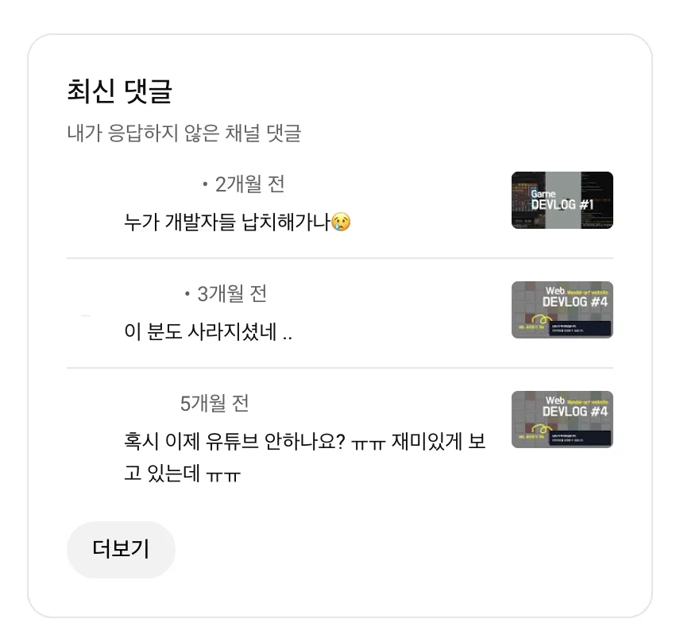
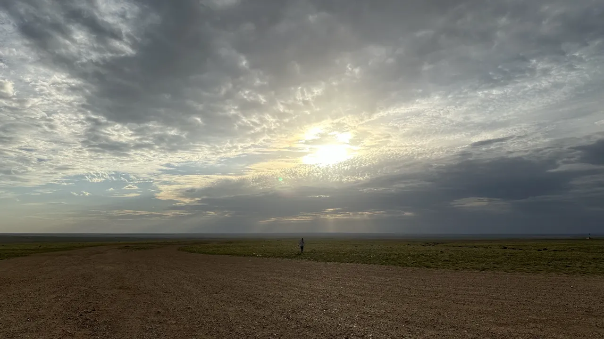
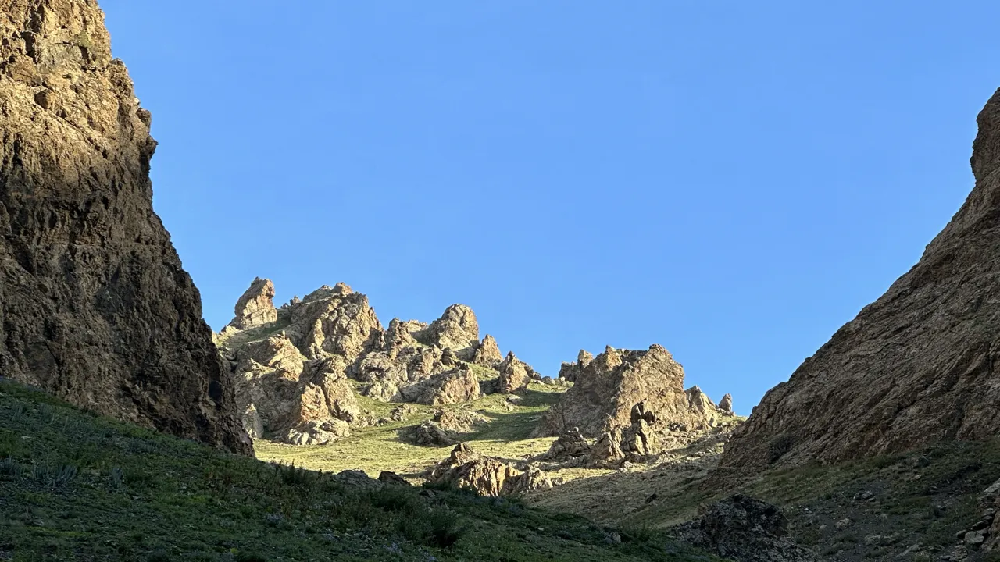
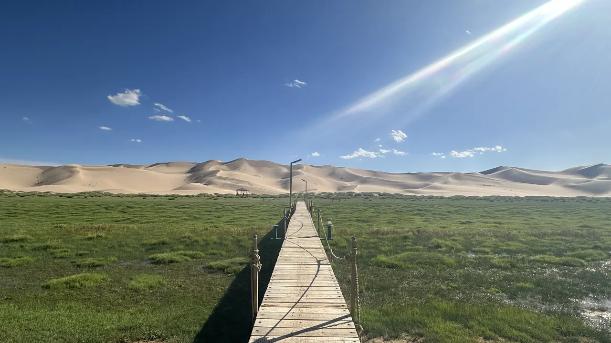
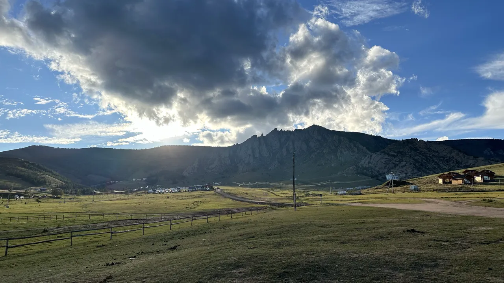

- [2020년 회고록](https://junghyeonsu.tistory.com/82)
- [2021년 회고록](https://junghyeonsu.tistory.com/236)
- [2022년 회고록](/posts/2022-retrospect-2023-plan)
- [2023년 회고록](/posts/2023-retrospect)

## 2024년

1년을 돌아보는 일은 즐겁다.

중간중간에 내가 무엇을 하고 있는지, 어떤 생각을 하는지 간단하게 기록을 해놓고
해가 넘어가기 전에 다시 돌아보면 1년동안 많은 일들을 했구나 하는 생각이 든다.

2024년은 이것저것 시도를 많이하는 해였다.
당근, 유튜브, 블로그, 당근 테크밋업, 이사, 몽골 여행, 임대 사업, 팀 이동 등 많은 일들이 있었다.

너무 힘들 때도 있었고, 너무 좋은 일들도 있었다. 시원하게 울때도 있었고, 뜨겁게 웃었던 날도 있었다.
가슴 터질 듯 벅찬 순간도 있었고, 두렵고 무서운 순간들도 있었다.

앞으로도 이런 다채로운 감정들과 경험들로 내 삶을 채워넣을 수 있기를.

## 책

- 켄트 벡의 Tidy First
- 세이노의 가르침
- 우아한타입스크립트 with React
- 보도 섀퍼: 돈

지금 읽고 있는 책과 사놓은 책은 정말 많은데, 일단 완독한 책 기준으로는 4권이다.

모든 책을 완독할 필요는 없다고 생각한다. 자신이 처한 상황에서 필요한 내용을 찾아서 읽는 것이 중요하다고 생각한다.

그리고 문학 작품을 하나도 읽지 않아서 읽어야 하나 싶기도 하다.

내년에는 조금 더 많은 책들을 읽기를.

## 글또

글또는 내가 애정하는 모임 중 하나다.

사실 현생에 치여 살다보면 블로그 글 쓰기가 정말 쉽지 않다.
내 유튜브 컨텐츠도 그렇듯, 나는 블로그 글 하나를 대충 쓰는 걸 못해서 한 번 쓰면 최소 몇 시간은 써야 한다.
이번에 10기를 진행중인데 덕분에 내가 블로그를 지속할 수 있지 않나 생각하고 있다.

글또 운영진분들과 함께 있으면 고등학교 친구나, 대학교 동기와는 또 다른 세상 사람들을 만나게 된다.
내가 운영진에 굳이 들어가서 계속 커뮤니티에 속하려고 하는 이유는 그런 사람들이 나에게 좋은 영향을 주기 때문이다.

이번 기수가 공식적으로는 글또 마지막 기수가 될 예정이다.
하지만 좋은 사람들과 함께하고 싶은 의지가 계속 있기 때문에 어떠한 형태라도 존재해서 어딘가에 계속 속해있지 않을까 생각하고 있다.

## 이사

참 탈도 많았고, 할 말도 많은 이사였다.

눈 뜨고 코 베어가는 서울이 무엇인지 뼈저리게 느꼈다.

다시는 만나고 싶지 않은 집주인을 만났지만, 결론적으로 좋은 집주인분과 좋은 집을 만났다.

## 유튜브

2023년 11월에 유튜브 채널을 만들었다.

2024년 계획을 세울 땐 내가 지속만 한다면 성공할 수 있다고 생각했다.
1년이 지난 지금 결과적으로는 실패했다. 지속하지 못했다.

컨텐츠가 무거웠다. 롱폼 컨텐츠를 만들기 위해서는 너무 많은 시간이 필요했고,
예측 불허한 당근 생활과 천방지축 내 인생에서 지속하기가 너무 어려웠다.

그래도 3, 4개월 지속했고 10개 미만의 영상을 만들었는데 결과적으로 1500명 정도의 구독자가 생겼다.
덕분에 사람들이 원하는 컨텐츠를 만드는 방법을 배웠다.

나는 구독자 자체가 목표는 아니다. 나는 크리에이터가 되고 싶다는 생각을 예전부터 가지고 있었다.
내 생각과 경험을 담은 컨텐츠를 만들고 싶었고, 나름대로 유튜브 시작전에 연구도 많이 했다.

썸네일은 어떻게 만들어야 할까? 어떤 컨텐츠들이 사람들에게 흥미로울까? 어떤 제목을 지어야할까? 지금 올라가 있는 컨텐츠들이 그 산물이다.

한 때는 요즘은 숏폼이 유행이니까 내 생각과 경험이 아닌 숏폼 컨텐츠를 양산하면서 구독자를 늘릴 수도 있다.
하지만 그런 것들은 구독자를 가져다 줄 수는 있어도, 지속 가능할 것 같지 않았다.

최근 반 년 정도 유튜브를 아예 하지 못했다.

내 채널의 컨셉을 여러 사이드 프로젝트를 진행하며 그 과정과 결과를 빠른 템포로 편집을 통해 만드는 걸로 잡았다.
근데 내가 만든 컨셉에 내가 사로 잡혀서 컨텐츠를 더 만들지 못하는 상황에 봉착한 것 같았다.

요즘 개발 유튜버들이 많이 늘어났다. 자신의 생각을 전하거나, 개발 정보를 전해주는 채널들이 많아졌다.
나도 지식 전달 방향성으로 돌려볼까 생각도 했지만 해당 채널은 그런 용도로는 사용하지 않을거다.
아마 나중에 필요해진다면 채널을 새로 파거나, 다른 플랫폼을 이용할 것 같다.

레드오션이라서 하지 않는 것은 아니다. (딱히 레드오션이라고 생각하지도 않는다.)
유튜브에 채널을 개설한 이유 중에 제일 큰 내 예술적 해소에 부합하지 않기 때문에 하지 않는다.

최근에 유튜브 채널 어드민 페이지에 오랜만에 들어가봤는데 다음과 같은 댓글들이 있었다.

누군가가 기다리는 컨텐츠를 만든다는 건 정말 짜릿한 일이다.
연재를 기다리는 웹툰 작가가 된 것 같은 착각을 일으키게 했다.

내년에는 지금 진행중인 사이드 프로젝트를 잘 다듬어서 영상을 만들어볼까 한다. (제발)

## 몽골 여행

친구들과 몽골 여행을 갔다 왔다.

이전부터 대자연을 경험해보고 싶다는 막연한 생각을 가지고 있었는데, 올해 기회가 있었다.

황홀했다. 너무 좋았다.

나중에 책 몇권만 들고 다시 가고 싶을 정도로 좋았다.

사진들은 몽골의 웅장함과 광활함을 담기에는 너무 턱없이 부족하지만, 조금이나마 느꼈으면 좋겠다.

숙소, 샤워 시설, 편의 시설 같은 것들이 잘 되어있지는 않아도 사실 그런 것들을 보고 가는 나라는 아니었다.
그리고 나는 편의시설에 대한 허들이 좀 높은 편이라 크게 불편하지도 않았다.

몽골 여행 가기전에 계획부터 여행사를 찾아보고 동행을 구하는 것까지 모두 내가 주도적으로 진행했다.
그러면서 아직 몽골 여행에 대한 시스템이 없다고 생각해서 사이드 프로젝트도 진행하고 있다.
해당 사이드 프로젝트는 추후에 글로 다뤄보고 영상도 만들 예정이다.

이번에 느낀건 나는 여행지보다도 같이 간 사람들이 더 중요한 것 같다.
특히 몽골에서는 차로 이동하는 시간이 엄청 긴데, 몇 시간을 떠들어도 주제가 떨어지지 않는 조합이었다.
전 부터도 내가 애정하고 좋아하던 친구들이었고, 다음에 또 기회가 된다면 또 같이 여행을 갈 수 있었으면 좋겠다.

사람들이 여행을 많이 다니는 이유 중에 여러 경험을 하고 거기로부터 느끼는 많은 것들 때문이지 않을까 하는 생각이 든다.
여행을 통해 진행하게된 사이드 프로젝트나, 같이 여행을 간 친구들과 나눈 대화 같은 모든 것들이 여행의 일부이고 여행으로부터 얻은 많은 것들이지 않을까.

앞으로도 좋은 사람들과 추억을 계속 쌓을 수 있기를.

## 당근에서 2년째 생존중

당근에서 2022년 6월에 입사를 했고, 2년이 지났다.

- 디자인시스템 개편
- 에셋타운
- 당근폼
- 당근 테크밋업
- 팀 이동

위 5개 정도가 2024년에 나한테 일어났던 큰 사건들이다.
하나하나 자세하게 설명하진 않고, 그냥 얘기하고 싶은 것들을 적어보려고 한다.

### 디자인시스템

디자인시스템은 어렵다.

멀티 플랫폼 (iOS, Android, Web)을 지원하는 것,
성공적인 파운데이션을 구축하는 것,
매끄러운 마이그레이션을 진행하는 것,
사용하기 좋은 컴포넌트와 유용한 문서를 작성하는 것,
이 모든 것이 통합되고 지속적으로 배포되고 일관성을 지키는 것.

내부적으로 개편이 진행되고 있어서 아직 완벽한 결과물은 아니지만 조금씩 완성되고 있다.

며칠 전 팀원분과 이야기를 나눴는데 어느정도 큼지막한 틀은 잡혔고,
각 세부적인 툴링이라던지 프레임워크성 기능만 제공되면 우리가 없어도 동작하는 디자인시스템이 되지 않을까.
유지보수를 하는 사람은 있어야겠지만, 핵심 구조나 틀이 잡혀있어서 가이드대로만 하면 되는 그런 느낌.
여러 시행착오를 겪으면서 디자인시스템은 최종적으로 이런 모습이 되지 않을까 하는 생각을 했다.
실제로도 해외에서는 디자인시스템을 팔아서 수익을 창출하는 경우가 있는데,
아마 내부적으로는 우리가 검증해놓은 것들을 퀄리티를 높여 상품성을 높이고 팔고 있는 것 아닐까 하는 생각을 했다.

나는 거의 차려진 밥상에 숟가락을 얹이는 정도라서 내가 시스템적으로 기여한 게 많냐고 물으면 그건 아니라고 생각한다.
그래도 과장을 조금 보태서 디자인시스템의 최종장을 미리 실시간으로 볼 수 있는 기회를 내가 겪고 있다는 사실에 감사하다.

최근에 팀원분한테 들은 얘기중 제일 인상 깊은 얘기가 있다.

`컴포넌트를 구성할 땐 세부적 디자인 요구사항, 간단한 composition, 심플한 인터페이스가 요구되는데
오픈소스 디자인 시스템 인터페이스 보면서 아이디어나 결정의 근거를 캐내는 건 도움이 많이 되는데, 다른 곳들이 특정 방식을 택한다고 해서
똑같이 따라해봤자 별로 도움되는 건 없다. 만드는 사람이 알아서 저 삼각형 안에서 트레이드 오프를 조정하면 그만이고, 상황이나 요구사항에 따라 다르게 적용될 수 밖에 없다.`

위 얘기가 내가 디자인시스템을 어렵게 느끼게 만드는 수많은 요인중 하나라고 생각한다.

한 마디로 케이스 바이 케이스로 달라지는 요구사항들을 적절하게 잘 주입할 수 있어야 하는데,
그 사이사이에 다른 곳들에서 진행되고 있는 베스트 케이스들도 잘 적용해야 한다.

다들 직장 생활을 해보면 쏟아지는 요구사항에 치여서 세부적인 것들을 챙기지 못하는 경우가 많다.
나도 디자인시스템 이외에 여러 곁다리 도구와 일들을 하다보니 디자인시스템에 딥다이브 할 수 있는 시간이 많이 없다(고 핑계를 댄다.)
내년부터는 조금 더 의식적으로 무언가를 만들기 전엔 요구사항을 잘 분석하고, 베스트 케이스를 찾아보고 공부하는 시간을 가져야겠다.

디자인시스템 너무 어렵다.

### 테크밋업

<YouTubePlayer url="https://youtu.be/34nhOoRYMmc?si=qMb0s92Yoc3ArDiU" />

- [당근 테크밋업 발표를 하고 (발표를 앞둔 모든 분께)](/posts/daangn-tech-meetup-retrospect)

발표에 대해서는 따로 글을 써놨다.

### 에셋타운

- [에셋 관리 시스템을 만들어보자 (에셋타운 1편 - 개요)](/posts/asset-town-introduction)
- [에셋 관리 시스템을 만들어보자 (에셋타운 2편 - 어드민 페이지 with Sanity)](/posts/asset-town-admin-with-sanity)
- [에셋 관리 시스템을 만들어보자 (에셋타운 3편 - Cloudflare Workers, R2를 이용한 웹훅 처리와 CDN 캐싱)](/posts/asset-town-provide-cdn-using-webhook-and-cloudflare)
- [에셋 관리 시스템을 만들어보자 (에셋타운 4편 - Figma Plugin을 이용한 에셋 전시)](/posts/asset-town-figma-plugin)

Sanity는 내 개인 블로그에도 도입하고 싶을 정도로 좋은 CMS다.
간단한 웹 사이트인데 여러 직군의 사람들이 협업해야 할 때 적절하게 사용하면 많은 시간을 줄여준다.

### 당근폼

내가 당근에 들어와서 처음 맡게 된 웹뷰 프로젝트다.

2024년 하반기에는 팀 우선순위에서 뒤쳐져서 많이 신경쓰지 못했다.
개편한 디자인시스템을 먼저 적용해보는 개밥먹기 프로젝트로 잘 사용이 되면 좋겠다.
그리고 다른 팀과 명시적으로 공유된 목표는 아니지만, 당근 전체로 보면 꽤나 중요한 프로젝트 같아서 욕심도 나고 잘 하고 싶다.

### 조금 더 퀄리티를 높여보자

`에셋스토리지` 라고 내부적으로 사용되는 내가 만든 피그마 플러그인이 있다.

피그마에서 추출하고 싶은 에셋의 public URL을 뽑아주는 플러그인인데, 맨 처음에는 `빠르게 public URL을 뽑아주는 플러그인`에 초점이 맞춰서 기획됐고, 개발됐다.

해당 플러그인이 만들어진지 1년은 넘은 것 같은데 당근에서 꽤나 많이 사용되고 있다.
그러면서 인프라적인 문제들도 많이 있었고, 처음에는 사실 흐린 눈 하고 있다가 수면위로 올라와버렸다.

아직 팀 내에서 문제와 효용성에 대해서 공감이 많이 이뤄지진 않았지만 그건 내가 해결해야 하는 문제고,
어드민 제공, 팀 워크스페이스 제공, API 제공, API key 등 여러 문제들을 해결해야 하는 상황이 되었다.
개인적으로는 챌린지처럼 느껴지는데 그럴수록 더더욱 내가 챙겨야 하는거라고 생각하고 있다.

### 좋은 팀 만들기

`디자인시스템` 팀에서 `디자인코어` 팀으로 이동했다.

나는 **좋은 팀**을 만드는데 관심이 많다.

- 어떻게 하면 효율적으로 일 할 수 있을까?
- 어떻게 하면 팀원들이 즐겁게 일 할 수 있을까?
- 어떻게 하면 팀원들이 좋은 결과물을 만들 수 있을까?

이런 것들을 계속 생각하고 있다.

아마 나중에 내가 팀 빌딩을 해야하는 날이 올 수도 있고,
그리고 그냥 내가 좋은 팀에서 일 하고 있다는 느낌을 우리 모두가 받았으면 좋겠다.

좋은 팀의 기준은 개개인마다 다르겠지만, 팀을 옮기고 반년동안 확실히 느낀 건 `원 팀`으로 뭉쳐서 성과를 내는 느낌이 좋았다.
만족의 기준은 성과가 차지하는 비중이 크다고 생각하는데, 목표 집약적으로 일해서 성과를 내는 느낌이 나쁘지 않았다.

### 어쨌든 살아남았다

지금까지 일을 해본 결과 느낀건 처음 입사했을 때와 같이 내가 부족함을 느끼는 건 앞으로도 쭉 계속 될 것 같다.

자책은 도움이 되지 않는다. 그냥 내가 할 수 있는 것들을 하는 것이 중요하다.
나보다 뛰어난 사람은 넘쳐나고, 각자가 천재성을 가지고 있는 분야가 다를 뿐이다.

어쨌든 나는 살아남았다. 오늘도 그렇게 살아진다.

이렇게 얘기를 하지만 일을 하다보면 현타가 올 때가 있다.
하지만 이런 생각들은 어쩔 수가 없다. 말 그대로 **어쩔 수가 없다.** 그냥 떠오르는 것들이다.
어쩔 수 없는 일들에 대해서는 왈가왈부하는 것이 크게 도움이 되지 않는다.
뭐 어쩔 수가 있나, 이런 긍정적인 생각들로 그냥 조금씩 앞으로 나아가야지.

혹시 모르지. 이런 사고 회로를 가진 것 자체가 긍정이라는 나도 모르는 분야에서 천재성을 가진 사람일수도...?

이러나 저러나해도 당근은 너무 좋은 곳이다.
아직 배울 것이 너무 많고, 하고 싶은 것도 많고, 좋은 사람들도 많다.

가끔씩 오는 현타를 민첩하게 피해가면서 내년도 잘 살아남아야지.

## 2025년

2024년 신년 계획을 세울 때는 만다라트 기법을 이용해서 목표를 세웠다.

만다라트를 3년 정도 계획을 세워본 결과 내린 결론이 있다.
1년이라는 시간은 세부적인 계획을 세우기에는 너무 긴 시간이라는 것이다.

세부적인 것들은 언제나 바뀔 수 있다. 나의 상황에 따라 바뀌기도 하고 외부적인 요인에 따라 바뀌기도 한다.
하지만 집중하고 싶은 큰 목표는 몇 개로 추릴 수 있다.

굵직한 목표들을 세우되, 세부적인 계획은 유동적으로 가져갈 생각이다.

- 당근 디자인시스템 개편
- 당근 에셋 관련 시스템 구축
- 몽골 여행 사이드 프로젝트
- 여러 컨텐츠 제작
- 건강 챙기기
- 좋은 사람들과 함께하기

이 정도가 큰 목표가 되지 않을까 싶다.

새로운 목표가 하나 생겼다면
최근에 백종원의 레미제라블이라는 넷플릭스 컨텐츠를 친구들과 집들이하면서 보게 됐다.

해당 프로그램은 백종원, 그리고 흑백요리사에서 활약을 펼친 요리사분들과 함께 삶이 어려운 사람들에게 요리를 가르쳐주는 프로그램이었다.

프로그램 자체의 취지가 되게 좋았고, 백종원 선생님처럼 선한 영향력을 펼치고 싶다는 생각을 했다.

테크밋업 회고 글에도 “쓸모없는 경험은 없다” 고 적으며 경험 공유가 한국 여러곳에서 일어나고, 그를 바탕으로 생태계 전반적 성장을 이루고 싶다는 얘기를 했다.

나중에 내가 늙었을 때 뭘하고 살아가면 좋을까를 생각해보면 돈을 많이 벌어서 그냥 놀고 먹는거보단
내가 도움을 줄 수 있는 것이 있다면 좋은 영향력을 뻗치며 살아가는 것이 내 궁극적 목표가 아닐까 하는 생각을 했다.
마치 백종원 선생님처럼.

그게 강의 영상이 됐든, 멘토링이 됐든, 스타트업 엔젤투자가 됐든, 컨텐츠 생산이 됐든말이다.

친구와 이사 시즌에 얘기한 것이 있다.
서울에서 막 올라와서 살던 집에서는 시도와 정착의 시기,
그리고 이사하고 난 후엔 뿌려놓은 씨앗들이 열매가 되고 꽃이 피는 시기가 될거라고.

좋은 방향으로 그리고 내가 원하는 방향으로 가고 있다는 생각이 든다.
점점 해가 갈수록 설레는 마음이 더 커지고 있다.

이제 회고는 됐으니 이제 집에가서 좋은 연말을 보내야지.
