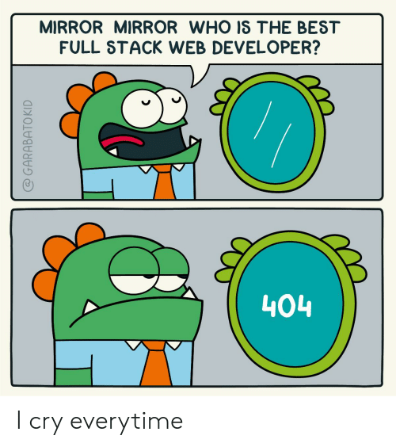
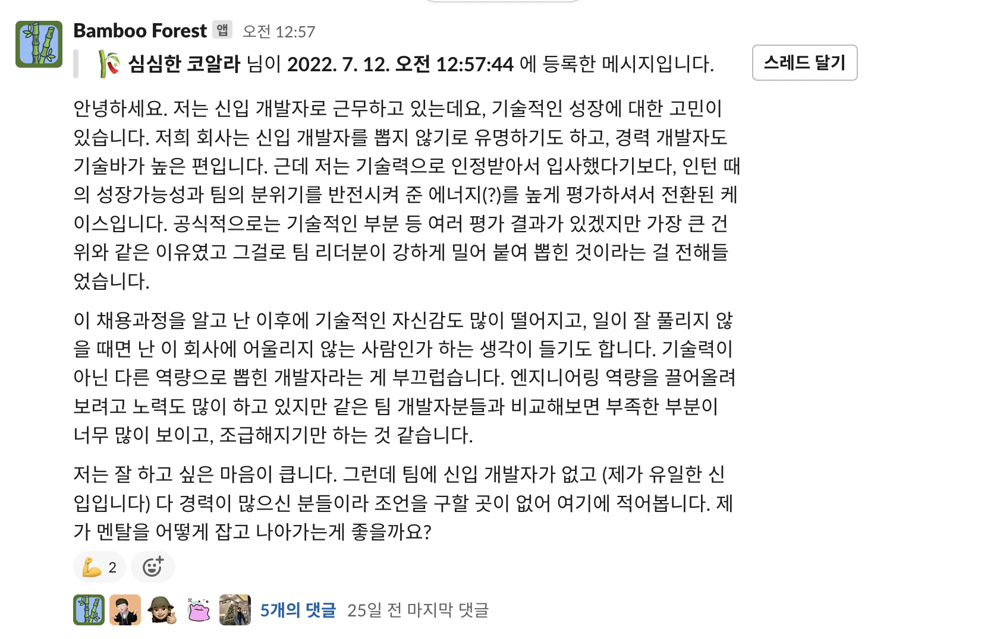
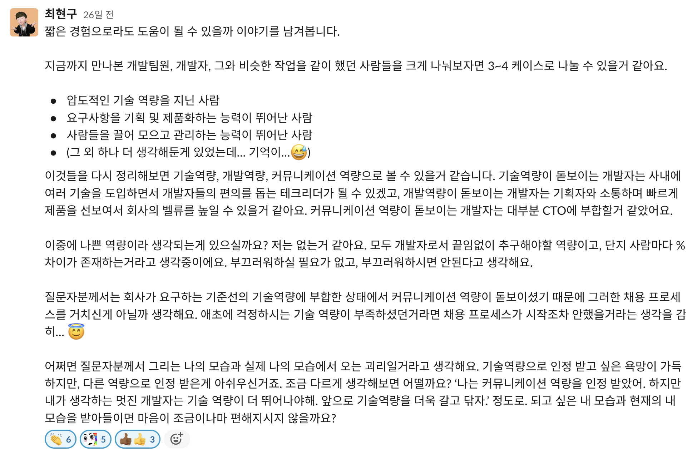

# 인턴을 진행하면서 느낀 것들

> 이번에 인턴을 진행하면서 많은 것들을 느꼈다. 세상에 다양한 사람과, 다양한 개발자들이 있고 나는 어떤 개발자가 될 것이고, 어떤 노력을 할 것인지, 지금은 잘 하고 있는지와 같은 것들을 그냥 주절거릴 예정이다. 글에 두서가 없고 맥락도 확확 전환된다는 점 인지 바람.

## 1. 나는 어떤 역할인가

내가 속한 팀은 **프론트엔드코어팀**으로, 이 곳은 top-down 방식으로 어떤 과업이 주어지는 것이 아니라 개발자들이 어떻게 하면 편하게 개발을 할 수 있을까와 같은 고민을 하는 곳으로 `DX(Developer Experience)`를 향상시키는 것이 주목적이다.

그래서 우리는 어떤 문제를 해결하는 `Problem Solver`의 느낌이 강하다.

## 2. 나는 어떤 문제를 해결했나

> 중복되는 노력을 줄이자.

그래서 우리(같이 인턴을 진행하는 친구와 같이 프로젝트를 진행했다.)는 자주쓰이는 코드를 모아주고, 가져가서 쓸 수 있는 **코드 레지스트리**를 만들었다. 외부에서는 이해 하지못하는 가치관의 프로젝트일수도 있는데 (그냥 깃허브에 코드 올리면 안됨?) 회사 특성상 해당 문제가 계속해서 인식이 되고 있다고 했다.

그래서 우리는 해당 프로젝트로 **중복되는 노력을 줄여주고 싶었다.**

아직은 `internal` 레포이지만, 추후에 `public`으로 전환된다.

## 3. 우리 팀은 문제 해결을 위해서는 무엇이든 한다.

> 프론트엔드로 뽑혔지만... 하는 건 서버와 클라우드?

프로젝트에서 사용한 기술들을 나열만 하자면 완전히 새롭게 배운 것들이 너무나도 많다.
프론트엔드팀이지만 사용하는 것만 보면 거의 풀스택 개발자다.

나는 해당 프로젝트를 나중에 설명해줄 때 어떤 기술을 썼는지에만 집중하고 싶지는 않고, 어떤 문제를 어떤식으로 해결했는지에 집중하고 싶다.

그리고 내가 속한 팀이 어떤 기술을 쓰는지에 대한 자유도가 굉장히 높고, 우리 프로젝트는 우리가 오너십을 가지고 진행하는 것이라서 무엇을 하든 상관이 없었다.

같이 인턴을 진행하는 친구와 나는 새로운 기술에 대한 큰 두려움은 없었기 때문에 새로운 기술을 쓰면서 문제를 해결하고 싶었다.

그리고 새로운 기술을 많이 써봐야 기술들의 차이점을 알고 무엇이 좋은지 알기 때문에 도입하지 않을 이유는 없었다.

이번 프로젝트를 하면서 어떤 기술을 썼는지와 그에 대한 짧은 생각들을 적어봤다.

### client

- client는 vite를 사용헀고, esbuild도 이번 기회에 사용해봤고 css-in-js 라이브러리중에 vanilla extract를 사용했다.
- vanilla extract는 CSS를 아토믹하게 짤 수 있어서 좋다. 자주 사용되는 스타일들을 정의해놓고 가져다 쓰기만 하면 된다.
- react-query를 맨날 사용해보고 싶다고만 했는데 이번 기회에 도입해서 좋았다.
- react-query는 캐시에 대해서 지원을 잘해주고, 기능들이 좋아서 잘 사용해보고 싶었는데 이 부분에 대해서는 잘 사용하고 있는지 모르겠다.

### server

- cloudflare는 편하다. 하지만 cloudflare worker kv는 api가 영...
- 데이터 스키마로 JSON을 사용하고 여러곳에서 사용되는 스키마들을 하나의 스키마 언어로 정의하고 사용한다.
- 중간에 cloudflare worker를 사용하다가 fastify + mongodb로 마이그레이션 했다. 지금와서 생각하면 cloudflare worker kv가 불편했던 건데 우리는 왜 다 마이그레이션을 했을까?
- api version은 **무조건** 바뀌게 되어있더라. version 명시를 해주자. (ex: `v1/api/getCodes`)

### command line interface

- `command line interface` 라이브러리를 개발해봤다.
- `commander` 라이브러리를 이용하면 명령어와 같은 설정들을 할 수 있고, `chalk`를 이용하면 텍스트에 색을 입히고 꾸밀 수 있다.
- 우리가 `cli`로 파일 입출력을 해야됐는데, `create-react-app`과 같은 명령어들이 어떤식으로 동작하는지 대충은 알 것 같다.

### devops

- docker가 왜 필요한지 조금 더 깊게 이해한 것 같다.
  - ?: 제가 만든 서버를 동료의 로컬에 실행시켜서 개발하게끔 하고 싶은데 어떻게 해야할까요?
  - ??: 그거 도커로 감싸서 주면 되지 않을까요?
  - (귀찮은 세팅들을 안 할 수 있다.)
- docker, docker-compose를 조금 더 과감하게 사용할 수 있었다. 근데 로컬에서 개발할 때 docker-compose로 컨테이너 띄워서 mongodb를 사용했는데 이 방식은 영속성을 지켜주지 않아서 개발 서버용 db를 프로비저닝을 해야할 것 같다.

### common

- 프로젝트를 모노레포로 관리했다.
- 빌드 관리는 `ultra-runner`를 썼다. 토폴로지 빌드(패키지별 의존성이 있다면 필요하다), 선택적 빌드 등등을 지원해준다.
- 버전 관리는 `lerna`를 사용했다. 버전 관리를 잘 해준다.
- 의존성 관리는 `yarn workspace`를 사용했다.
- 이번에 [yarn pnp](https://yarnpkg.com/features/pnp)를 사용하고 싶었는데 자꾸 뻑나는 경우가 많아져서 `.yarnrc.yml`에 `nodeLinker`에 `node_modules`를 명시해줘서 결국은 사용을 못했다.
- `pnp`를 이용하면 `github actions`와 같이 의존성을 설치해야 하는 부분들에서 `node_modules`와 같은 더럽게 무거운 것이 필요가 없어서 더욱 빨라진다는데 한 번 사용해보고 싶다.
- `Oauth`를 제공한다면 `auto0`가 정말 편리하더라.
- 객체간에 의존성을 줄이는 방법을 계속해서 생각해야 할 것 같더라. 확장가능하려면 의존성을 주입하는 방식으로 코딩해서 변경에 유동적으로 코드를 짜는 식으로 고민을 계속해야겠다.

그냥 프로젝트 한 것을 보면서 느낀 것들을 주절거렸다. 그리고 같이하는 인턴 친구가 한 것도 많고, 내가 한 것도 몇 개 있어서 요기서 사용했다고 해서 어디가서 **"저 이거 할 줄 알아요"** 라고는 하지 않을 것 같다.

## 4. 왜 나를 뽑았을까

> 내가 인턴을 하고 있는 이곳에서는 사람을 뽑을 때 자신보다 뛰어난 사람을 무조건 뽑는다고 한다. 근데... 제가 더 뛰어나다구요?

당연히 지금 당장으로는 이 곳에 있는 분들과 비교해서는 기술적인 역량이나, 일을 하는 방식이나, 문화적인 부분들 전부 경험이 없기 때문에 배워야 하는 입장일 것이다. 나중에 자신과 같은 연차가 되었을 때 자신보다 뛰어난 부분이 한 가지라도 있을 것 같은 동료를 뽑았다고 했다.

모든 것은 상대적이라고 이 곳에 있으면 엄청난 실력의 사람들에게 기가 눌려버린다. 모든 사람들은 그 사람의 하이라이트만 본다고, 그 사람의 잘하는 부분만 보는 거일수도 있겠지만 아직 나는 이 곳의 사람들보다는 부족한 것 같다.

이런 생각을 하는 도중에 [개발자의 가면증후군에 대한 영상](https://www.youtube.com/watch?v=hU4kULhOdNE&t=77s)을 봤다. 실무에서 뛰고 있는 대부분의 사람들은 나와 같은 생각을 하는 것 같다.

그리고 글또에서도 이런 비슷한 종류의 고민이 대나무 숲에 올라왔는데, **회사에 정직원 전환이 됐는데 자기자신은 기술역량이 뛰어나서 뽑힌 것이 아니라는 말을 듣고 회의감에 빠진 분이 올리신 글**이다.

자신이 잘하는 것에 집중하지 못하고 자신이 부족한 것에 집중하고, 남들과 비교를 하기 시작하면 그런 생각들이 끝도 없이 이어져서 자신감 하락, 자존감 하락까지 이어지는 것 같다.

인턴을 진행하면서 이런 고민들을 살짝씩 팀원들에게 꺼내어 본 적이 있는데 자신도 비슷하다고 하시거나, 혹은 개발자들은 조금 뻔뻔한 무언가가 있어야 한다고 했다. (**내가 최고야**와 같은?.. 이런 느낌이 아니었는데 여튼)

그리고 위의 고민에 대해서 답변을 달아주신 글또분이 있는데 되게 내 심금을 울렸다.

이 글을 보고 나는 어떤 것을 잘하고, 어떤 것에 조금 더 강점이 있는 개발자인지 인지하고 싶어졌다.

## 5. 나는 어떤 종류의 개발자인가

세상에는 정말 다양한 개발자들이 있는 것 같다. 프론트엔드 개발자들 중에서는 아래와 같은 유형의 사람들이 있는 것 같다. (완전 주관적인 생각)

1. 개발을 정말 정말 잘하는 개발자
2. 무언가를 만드는 것을 좋아하고, 사용성을 좋게 잘 만드는 개발자
3. 개발 외적으로 일정 조율 및 팀원들과의 커뮤니케이션 등을 잘하는 개발자
4. 그냥 무시하고 위에 것들을 다 잘하는 개발자
5. etc...

내가 나를 바라봤을 때, 나는 개발을 미친듯이 잘한다던가 논리적인 구조로 코드를 짜고, 엄청난 효율성을 지키고, 테스트코드도 잘 짜고... 그렇지는 않은 것 같다. 그렇다고 대충 짜지는 않는다. 잘하는 남들보다는 살짝 아쉬운 것 같다.

나는 2, 3번을 잘 하는 개발자인 것 같다. **어떤 것을 만들 때** (어떤 기술에 매몰되어 있고 싶지 않다.), 그리고 **예쁘게 꾸밀 때** 행복하다. 어떤 랜딩 페이지를 만든다고 하면 아이디어가 마구 솓구친다. 어떤 애니메이션을 줘야한다 그러면 머리속에서 어떤식으로 해야할 지 생각이 나기도 한다. 그리고 생각한 것을 실체화하는 것도 지금까지 잘해왔다.

그리고 요즘 회사안에서 모든 프론트엔드 개발자들과 만나보는 것을 목표로 같이 인턴하는 친구와 티타임을 계속 가지고 있다. 한 분씩 만나면서 어떤 것을 좋아하고, 어떻게 이곳에 왔고, 사용하는 기술, 취미 등등 얘기를 나누는데 너무 재미있고, `devrel`의 포지션이 있으면 전향을 해야하나 하는 생각까지 했었다.

예전 다른 곳에서 인턴을 할 때 [강점혁명](http://www.yes24.com/Product/Goods/102700741)이라는 책을 받아서 테스트를 진행한 적이 있었는데, 해당 책에서도 **약점을 보완하는 것보다는 강점을 발전시키는 것**이 성공한 사람들을 봤을 때 가능성이 높다고 했다.

# 그래서 앞으로 어떻게 살아갈까

> 그래서 하고자 하는 말이 뭔데

사실 이 글을 적는 목적은 인턴 중간에 조금 정체된 느낌을 해소하고자 했고, 뭔가 정리가 안된 느낌인데 정리를 한 번 하고 가고 싶었다.
그리고 항상 느끼고 있는 가면증후군에 대해서 다짐을 하고 인정하고 넘어가야 할 것 같았다.

## 인정하자

나보다 기술적으로 뛰어난 사람들은 너무나도 많다.
나는 메이커의 어떤 것을 좋아하니까 무언가를 계속 만들어보면 되지 않을까.
잘하는 사람들의 하이라이트만 보지말자. 잘한다는 것을 인정하고 그들한테서 배우자.

## 공부하자

주말엔 회사 프로젝트보다는 회사 프로젝트와 연관된 기술 공부를 하던가, 새로운 지식 공부를 하자.
나는 항상 쓰는 기술만 쓰는 경향이 있어서 의식해서 무언가를 배우려고 해야할 것 같다.
모르는 것들과 새롭게 들은 지식들을 기록해놨다가 주말에 하나씩 공부를 하자.
