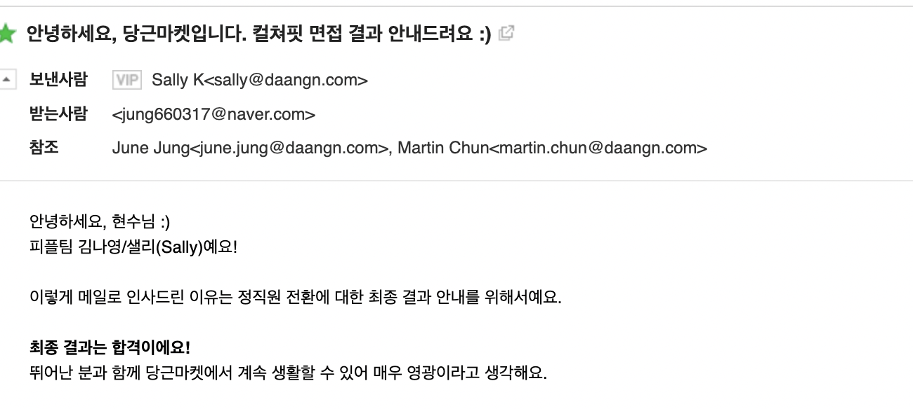
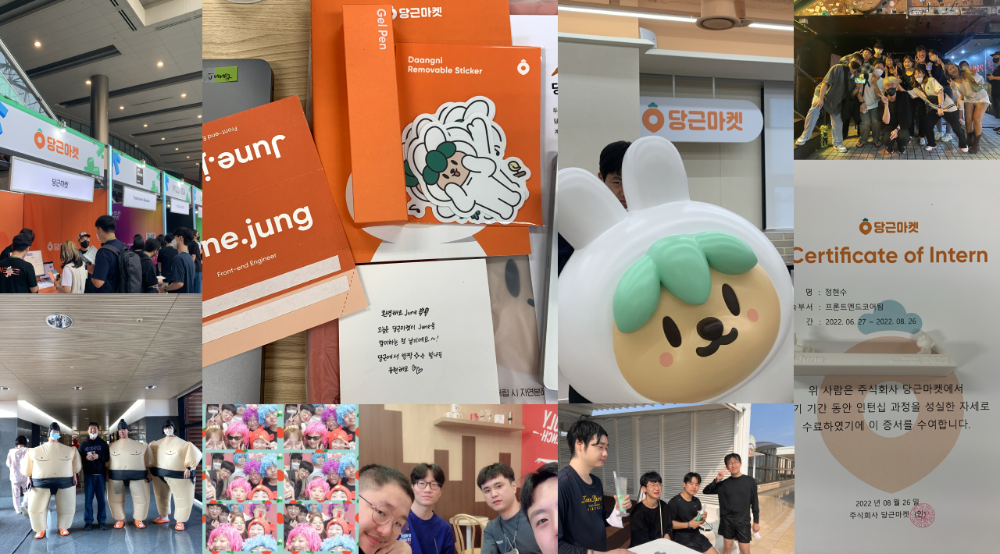

## 합격

내가 현재 속한 팀에 잘 녹아들었는지 전환 면접의 기회가 생겼고, 어제 면접을 진행했다.
그리고 오늘 바로 메일이 도착했다.

메일을 맨 처음 읽었을 때는 실감이 제대로 나지 않았던 것 같다.
코딩을 하고 있었기 때문에 거기에 우선 집중하고 있었고 점차 저녁시간까지 벅차오르는 무언가가 있는 것 같았다.

합격 소식을 알리고 사람들한테 너무 많은 축하 메세지를 받았을 때,
저녁을 먹으면서 프론트엔드코어 팀원들에게 축하 받았을 때,
우리 팀원들에게도 축하받았을 때 그냥 너무 기뻤다.

특히 가족이 너무나 좋아했다. 엄마는 자기일인거마냥 너무 기뻐서 아빠한테 용돈을 줘버렸고(?),
누나는 이제 자기보다 돈 더 잘 벌겠네와 같은 농담섞인 얘기들이 오갈 때 사실 울컥하는 마음을 참을 수 없었다.

그래서 그 기쁜 마음을 오래 남기고 싶어서 당일에 이렇게 기록으로 남기고 있다.

## 인턴

당근마켓 썸머테크 합격하고 4개월하고 2주 정도가 지났다. 사실 진짜 정신없었다.

썸머테크 인턴을 합격했을 때 당장 2개월동안 지내야하는 방을 구해야 된다는 것 부터,
당근에 잘 적응해야 하는 것도 그렇고, 내가 잘 할수 있을까 하는 많은 부담감이 있었다.

그리고 실제로도 정말 열심히 살았던 것 같다. 썸머테크때 같이 인턴하던 친구랑 10시에 퇴근하고 새벽 2시까지 카페에서 코딩한다던지
주말에 같이 카페가서 코딩한다던지 하는건 그냥 일상이 됐다. 사실 당근 들어오기전에도 그렇게 살았다.

사실 인턴으로 지낸다는건 상당히 체력소모와 정신적소모가 심한 것 같다. 직접 경험하고 더욱 더 느꼈다.

당근에 인턴으로 들어오기 전에는 인턴이든 뭐든 그냥 뽑아줬으면 좋겠다는 생각이었고,
썸머테크 인턴으로 합격했을 때는 내가 그냥 배울 수 있다는 생각에 체험형이든 채용형이든 상관없이 그냥 너무 기뻤다.

근데 나도 사람인지라 하다보니 점점 욕심이 생기더라. 2개월 인턴 후 당장은 공석이 없어서 인턴 제안을 받고,
디자인시스템팀으로 제안을 받았을 때도 기뻤다. 정말 디자인시스템팀에 잘 녹아들었으면 했고, 내가 많은 것들을 기여할 수 있었음 했다.
내가 다행히 팀에서 잘 녹아들어 다양한 것들을 하고 있고 다양한 곳에서 기여를 하고 있었기에 합격을 할 수 있었다고 생각한다.

이 과정까지 정말 오래걸렸고, 어쩔 수 없었다는 건 당연히 더욱 더 알고있었지만 혼자 지내는 생활에, 가족과 떨어져 있는 삶에,
친구들과도 떨어져 있는 지역에, 모든 걸 혼자하는건 이제 자취를 오래해서 익숙해졌지만 조금씩 지쳐가고 힘들어져 있었던 상태였던 것 같다.

다행히 이렇게 합격을 했고, 많은 사람들에게 축하를 받는 오늘이 나에게 너무 감격스럽고 그냥 벅차오르는 하루인 것 같다.

내가 당근에 와서 정말 진심으로 느낀건 능력있고 함께하고 싶은 동료들이 주변에 널렸다는게 얼마나 큰 장점인지 뼈저리게 느꼈다.
매 하루하루가 자극의 순간이고, 배움과 성장을 느낀다는 건 다른 어딘가에서 절대 쉽게 얻을 수 없다고 생각한다.

내가 인턴에서 정규직으로 합격하기까지 나의 노력도 있겠지만 팀원들이 나에게 주는 응원들과 지지가 너무나도 감사하고 말로 다 표현하지 못할 것 같다.

## 앞으로 나는

컬쳐핏 면접에서 앞으로 나의 계획이 어떻게 되는지 물어보셨다. 단기적으로, 그리고 장기적으로.

단기적으로는 우리 디자인시스템팀이 잘 돼서 당근마켓안에서 잘 퍼지는 걸 다 같이 보고싶다고 했다.
우리 팀이 지금 하고 있는 모든 일들에 결실을 맺고, 성공을 느꼈으면 한다. 그러기 위해서는 아직 해야 할 일들이 산더미처럼 쌓여있다.
이것들을 잘 해결하고 싶다.

장기적으로는 창업 혹은 교육자가 되고 싶다고 했다. 실제로 유튜브에도 내가 아는 지식이 조금이라도 남에게 도움이 될까 리액트 교육 영상(4개밖에 올리지 않았지만,,)을 올렸고,
이러한 것들을 아직 놓고 싶지 않고 항상 마음속에 품고 있는 것 같다.

아직 당근에서 하고 싶은 것들이 많은 것 같다. 모션 브랜딩 디자이너분과도 협업을 해보고 싶고, 3D를 배워서 당근이를 모델링을 해본다던지,
디자인시스템을 잘 구축한다던지 내가 할 수 있는 일들이 많다고 생각한다. 그리고 그 안에서 내 장점을 더 극대화시켜서 나의 뾰족한 특기를 만들어나가고 싶다.

이제 조금 마음의 여유도 생기고 금전적인 여유도 생길 것 같으니 내가 하고싶은 것이 뭔지, 잘하는 것은 또 뭔지 알아보고 차근차근 성취해나가고 싶다.
그리고 개발 외적으로도 좀 여유를 찾고 삶을 즐기고 싶다. 서울에서 주말에 한강에서 자전거를 탄다던지, 사고싶은 옷을 산다던지 하는 사소한 것들...

## 사실 달라진 건 크게 없다

사실 오늘도 여느때처럼 열심히 코딩하고 퇴근하고 헬스를 갔다가 집에서 노트북을 보면서 글을 쓰고 있다.
아마 내일도 똑같이 일어나서 출근하고 일을 하고 있겠지.

내가 팀에서 하는 역할도 크게 달라지는 것도 없고, 하는 일도 달라지는 게 없다.
그냥 지금까지 해왔던 것 처럼 잘 하면 될 것 같다.

그냥 끝이라기 보다는 내가 앞으로 써나갈 대서사시의 시작점인 것 같은 느낌.

글은 이정도하면 내 감정을 잘 표현한 것 같고 지금은 그냥 이 기분을 느끼고 싶다.

내가 나중에 이 글을 봤을 때 아, 이런 감정을 느꼈었지 지금은 어떻고 그 때는 어땠는데 하면서 회상할 수 있기를

