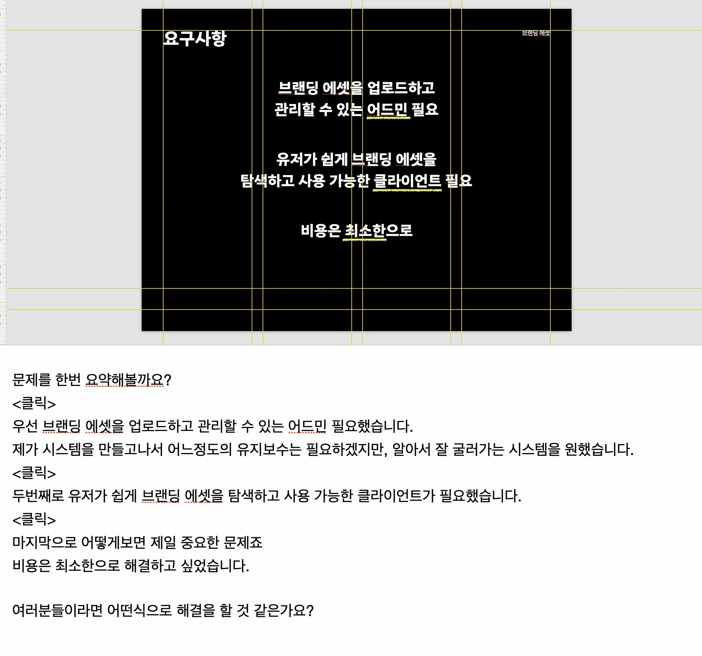
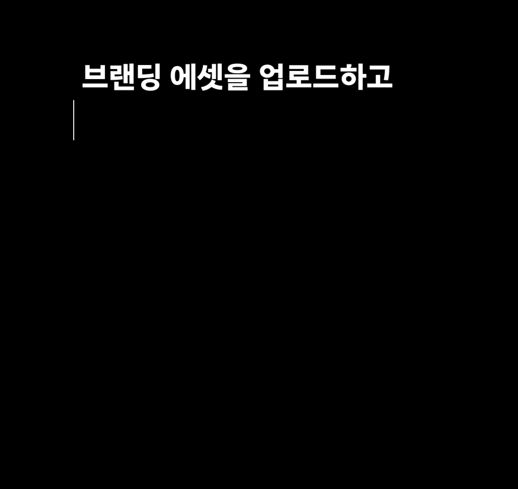
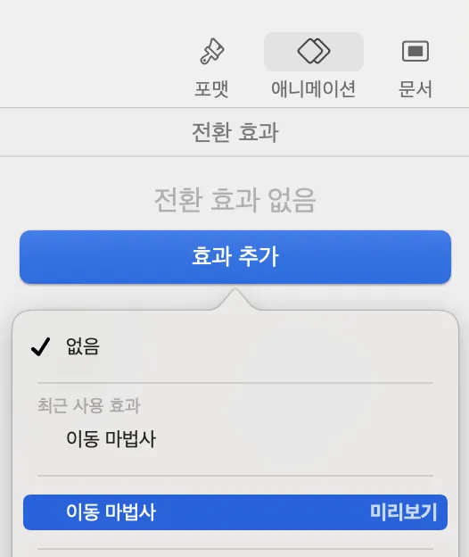
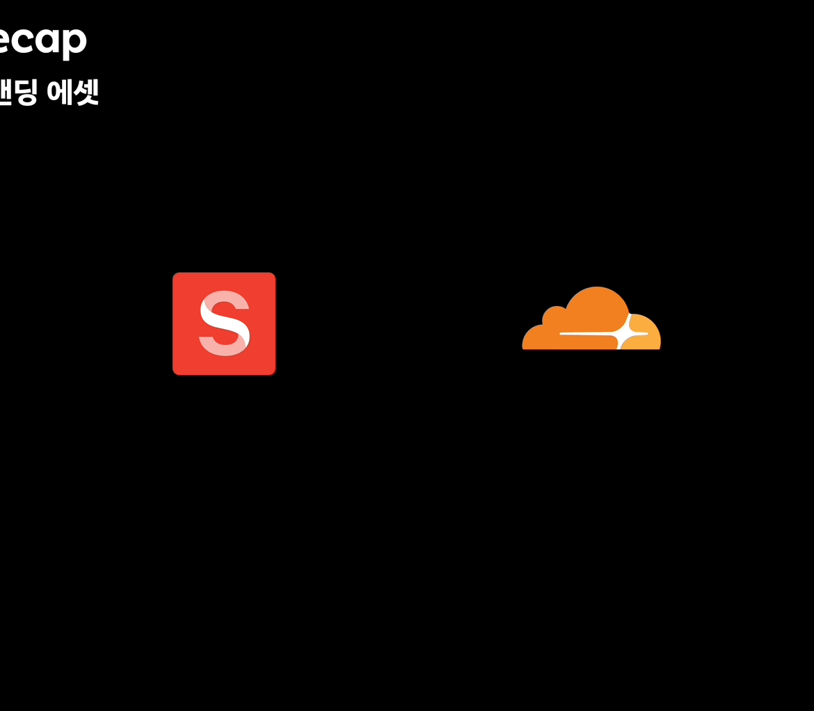

## 저 발표 하겠습니다!

10월 7일 월요일, 고대하던 당근 테크밋업 발표가 끝났다. `아이콘, 브랜딩 에셋까지 디자인시스템으로`라는 주제로 발표했다.

3개월가량 발표 기획, 장표 만들기, 리허설, 연습 등으로 고통받아 왔다.
정말 괴롭기도 하고 두려운 시간의 연속이었지만 결국은 끝났다.

나는 디자인시스템 개발자다.
디자인시스템이 뭐 대단한 건 아니지만 한 회사의 시스템을 담당하는 부서다 보니까 자연스럽게 이런 컨퍼런스가 주최되면 자주 등장하는 주제기도 하다.
당연히 발표자를 모집할 때 디자인시스템이 언급되었고, 내 동료분들은 이미 내가 발표하는 걸로 알더라.

내가 발표해도 될까, 무슨 주제로 발표해야 할 것인가와 같은 생각들이 머릿속을 헤집었지만, 인생 뭐 있나, 그냥 지르고 보는 거지.

발표를 하기로 했다면 이제 뒤도 돌아보지 말고 발표에 대한 기획과 장표 준비를 해야 한다.

이 글은 발표를 준비하는 모든 분에게 내가 얻은 인사이트를 시간 순서대로 이야기처럼 풀어서 써보려고 한다.

## 장표

장표는 [당근 테크밋업 프론트엔드 노션](https://daangn.notion.site/Frontend-b021b31d174946ffa06ee280d7b8886e)에서도 확인할 수 있다.

지금 확인해 보니까 `115장`으로 이루어져 있다.
한 페이지에서 애니메이션으로 여러 컨텐츠를 담는 페이지도 있으니까, 전부 글로 펼치면 `150장` 정도 만들었다고 보면 된다.

장표 만드는 데만 절대적인 시간으로 `100시간` 정도는 쏟은 거 같다.

`에이 100시간? 거짓말하지 마세요!` 라고 한다면..

발표 주제 생각 -> 대단락 설정 -> 텍스트로만 이뤄진 초안 작성 -> 대본 작성
-> 이미지 첨부 -> 영상 제작 및 첨부 -> 리허설 및 연습 -> `장표-최최최종-이게진짜.key` 의 반복...

위의 과정을 거치다가 중간에 피드백을 받고 발표 내용에 큰 변화가 있기라도 한다면
퇴근하고 다른거 안 하고 무조건 장표에만 몰두해야 했다.

사실 그냥 내가 만든 장표처럼 많은 애니메이션은 포기하고
텍스트로만 장표를 채우고, 에셋들을 최소한으로 하겠다 하면 아마 절반은 줄어들 수도 있다.
내가 욕심이 좀 커서 그렇게는 못 넘어가겠더라.

내가 장표를 만들면서 제일 중요하게 생각했던 몇 가지가 있다.
이 생각을 가지고 발표를 했을 때 되게 반응들이 좋았다.
발표를 앞둔 사람들에게 참고가 됐으면 좋겠다.

<Callout type="info">
이 모든 건 제 생각이고, 정답은 없습니다.
</Callout>

### 청자를 확실히 정해라.

**발표는 모든 사람을 다 고려할 순 없다.**

발표를 들으러 오는 사람들은 정말 다양한 사람들이 있다.

발표 주제에 대해서 조금이라도 아는 사람, 아예 모르는 사람, 잘 아는 사람,
시니어, 주니어, 중니어, 다른 직군의 사람들...

하지만 `어떤 사람들을 위한 발표`인지 혹은 `듣고 나서 얻어가는 것`을 확실히 정하고 시작하면 좋다.
이 과정이 없으면 장표를 다 만들고 이도 저도 아닌 장표가 나와서 싹 다 갈아엎는 불상사가 발생할 수 있다.

나는 `아이콘 시스템, 혹은 브랜딩 에셋 시스템을 구축하고 싶은 사람`을 위해 만들었다.
그리고 내 발표를 들으면 `피그마 플러그인과 다양한 도구들을 이용해서 에셋 디자인시스템을 구축`할 수 있다.

### 한 스냅샷에 너무 많은 문장을 넣지 마라.

**한 문장, 한 문장이 진행될 때 화면이 조금씩이라도 바뀌도록 만들자.**
(아마 요기서 시간이 오래 걸리지 않았나 싶다.)

이거는 발표 기법, 장표 기법 같은 느낌인데
장표에 글이 많으면 안 된다고 해서 그림을 하나 띄워놓고 다섯 문장을 말하고 있으면 청자의 집중력이 떨어져 나간다.

예시를 하나 보여주자면, 위 사진은 실제로 내가 발표할 때 썼던 장표와 그 아래에는 대본이다.

대본을 자세하게 보면 `<클릭>` 이라는 문구가 있다.
나는 대본을 읽으면서 저 부분이 보이면 화면을 한 번 클릭해서 텍스트가 쓰이는 애니메이션을 보이게끔 했다.
**그러니까 화면의 모든 글자가 한꺼번에 나타나는 게 아니라 내가 대본을 진행하면서 같이 나타나도록 했다.**

만약에 저 화면의 모든 글자를 맨 처음부터 다 띄우고 발표를 진행하면 어떨까?
발표를 듣는 사람들은 해당 화면의 글자를 읽느라 정신이 없고, 내 얘기는 듣고 있지 않을 거다.

내가 보여준 대로 하면 청자를 내 발표에 흡수시킬 수 있다.
내가 말하는 부분과 화면에 쓰이는 부분이 동일시되고, 해당 문장에서 하고 싶은 말을
한두 마디 더 붙이면 `내가 지금 말하고 있는 부분이 쓰인 문장과 관련이 있어`라는 것을 각인시킬 수 있다.

**청자의 눈과 귀가 습득하는 정보를 발표자가 주도하고, 컨트롤할 수 있어야 한다.**

### 강조해 주기

**얘기하는 부분을, 확대를 해주거나, 네모를 쳐서 어디를 봐야 하는지 확실하게 해주자.**

이건 위의 내용에서 `청자의 눈과 귀가 습득하는 정보를 발표자가 주도하고, 컨트롤할 수 있어야 한다.` 부분과 비슷한 맥락이다.

우리가 장표를 만들 때 사진과 영상을 많이 첨부한다.
우리는 개발자니까 코드가 첨부된 사진을 보여주면서 `자, 저기 위를 보시면...` 이라고만 하지말자.
청자들은 `저기`가 어디인지 모른다.

청자가 `도대체 어디지`라는 생각으로 헷갈리다가 한, 두 문장을 놓치는 순간들을 만들어주지 말자.

### 요약은 많이 해줄 수록 좋다.

**챕터 사이에 내용이 많이 들어간다 싶으면 중간에 앞에서 얘기했던 내용을 한 번 요약하고 가라.**

우리는 장표를 만들면서 해당 내용들이 전부 머리에 있어서
지금 내가 발표의 어디에 있고, 어떤 내용을 말하고 있고, 해당 내용은 어떤 내용의 하위 내용이고
와 같은 모든 것들을 알고 있지만, 청자는 그렇지 않다.

### 당연하다고 생각하는 것들을 다시 한번 생각하고 짧게라도 설명하고 넘어가자.

**장표는 역지사지의 마음으로 상대방을 한 번 더 생각하자.**

장표와 발표를 준비하다 보면 해당 내용을 하도 많이 접하다 보니까 발표 내용들이 점점 당연해지는 순간들이 온다.

내가 초안을 다 만들고, 장표를 쭈욱 훑어보면서 내가 당연하다고 생각한 것들이 있는지 한 번 살펴보자.

그냥 넘어가면 거기서부터 청자는 내용을 따라잡지 못한다.
꼭 짧게라도 설명하고 넘어가자.

### 키노트는 사기다.

위의 내용 중에서 `강조해 주기` 와 `한 스냅샷에 너무 많은 문장을 넣지 마라.`의 것들을 이루기 위해서는 장표에 애니메이션 같은 것들이 필요할 수 있다.

키노트에서는 자체적으로 애니메이션 기능을 제공하고 있고 그중에서 `이동 마법사`는 진짜 마술 같은 효과를 딸깍 한 번으로 누릴 수 있다.

이동 마법사를 한 줄 요약하자면, **이동 마법사가 적용된 화면과 그 이후 화면의 차이를 키노트가 읽고 자연스럽게 화면이 변환되도록 하는 기능**이다.
키노트를 학습하는 데 시간이 조금 걸리더라도 이동 마법사는 꼭 숙지해 두자.

사실 키노트 말고 다른 장표 만드는 도구들을 많이 사용해 보진 않아서
다른 제품들이 더 나은지 비교는 할 수 없다.

근데 키노트를 사용하면서 다른 도구가 생각이 아예 안 날 정도로 너무 불편함 없이 잘 쓰고 있다.
아마 이 글을 읽는 분도 키노트에 한 번 맛 들이면 후회하지 않을 것이다.

키노트를 사용해서 이동 마법사를 내 것으로 만들자.

## 발표

사실 내가 발표를 잘하느냐고 묻는다면 스티브 잡스 뺨치는 발표는 할 수 없겠지만
이번 발표 때 다들 발표 왜 이렇게 잘하냐는 얘기를 좀 많이 들어서 얘기해도 괜찮지 않을까 싶다.

지금까지 성인이 되고 나서 발표는 4~5번 정도 한 것 같다.
이런 공식적인 자리 말고도 사내에서 전체 회의 발표라든지, 회의 진행 같은 것들은 많이 해봤다.

이번에 내가 발표하는 도중에 의식해서 지킨 몇 가지가 있다.

### 생각보다 많이 천천히

**정말 생각보다 많이 천천히 읽어도 느리지 않다. 의식해서 느리게 읽자.**

우리는 긴장하면 말이 빨라진다. 청자는 말이 빨라진 그것을 알아차린다.

발표하면서 `내가 말이 빠른가?`라는 생각을 중간에 한 번씩 해주면 좋다.
`그런 생각을 발표 중간에 어떻게 해`라고, 하지만, 그래도 하려고 노력하자.

나는 실제로 발표 도중에 `조금 빨라진 거 같네, 조금만 느리게 하자`라고 생각했다.

**문장과 문장 사이에는 확실히 끊어주고, 쉼표에는 쉬어주자.**

### 입은 크게 벌리기

이것도 위와 마찬가지로 의식을 해줘야 한다.

입을 크게 벌려주지 않으면 발음이 뭉개지고, 소리가 앞으로 나오지 않는다.
특히나 어려운 단어나 긴 문장을 읽을 때면 발음이 뭉개질 때가 많다.
이러면 청자가 이해하는 데 어려움이 있기 때문에 또 집중력이 흐트러질 수밖에 없다.

**입은 의식해서 크게 벌리고 한 단어씩 또박또박 말하려고 노력하자.**

### 연습은 실제처럼

이건 당연한 얘기긴 한데 이렇게 안 하는 사람도 많을 거로 생각한다.

나는 발표 전 연습할 때 집에서 혼자 일어서서 숟가락을 잡고 내가 발표를 하고 있다고 생각하고 발표 연습을 했다.

그리고 `생각보다 많이 천천히`와 `입은 크게 벌리기`가 발표 도중에 의식하기 위해서는 연습이 필수다.
키노트에 발표 모드를 켜놓고 발표를 진행하면서 `내가 말이 빠른가?` 혹은 `내 발음이 뭉개지나?`와 같은 **의심을 하는 연습**도 같이 하는 것이다.

## 그럼에도 불구하고

`이 모든 것을 다 해야 한다고?`, `어떻게 저걸 다 해`라는 생각이 들 수 있다.
그리고 벌써 겁을 먹고 발표하기를 주저할 수도 있다.

만약 발표를 하기로 했다면 우리는 **최고의 발표**를 해야 한다.

영상이 공개되고, 내 사진이 공개되고, 내가 한 말들이 인터넷상에 돌아다니는 것이 확정이라면
우리는 할 수 있는 모든 것을 해야 한다. 청자의 눈과 귀를 만족시켜야 하고 우리가 전달하고자 하는 내용을 정확하게 전달해야 한다.

발표하기 전이지만 이 글을 보고 겁을 먹었지만,
**그럼에도 불구하고** 발표해야 하는 이유는 많다.

`끝나고 나면 뿌듯할 거야`, `끝나고 나면 너의 커리어에 큰 도움이 될 거야` 와 같은 얘기도 당연히 해당하지만,
아마 발표를 두려워하는 제일 큰 이유 중의 하나는 `내가 발표해도 될까?`가 가장 클 것이다.

나 역시 그런 생각을 수없이 했다. 나는 장표를 만들면서 진짜로 수백 번 했다.
하지만 중요한 사실은 **이 세상에 쓸모없는 경험은 없으며, 모든 경험은 누군가에게는 소중한 인사이트가 된다.**

가장 최근에 올라온 노마드 코더 유튜브 영상 중에 [내가 6일 만에 앱 런칭한 비법?!](https://www.youtube.com/watch?v=DnLTGBo5KM8&t=643s) 의 영상을 되게 감명 깊게 봤다.

해당 영상 중에 우리가 사이드 프로젝트를 성공하지 못하는 많은 이유 중의 하나는
요리사처럼 요리를 최대한 많이 손님에게 내놓고 평가받고 피드백 반영하고 개선해야 하는데
개발자는 그렇게 하지 못한다는 것이다. 그리고 그런 이유 중에 하나는 **남들에게 비판받을까 봐**가 제일 크다고 한다.

그러면서 `경기장의 투사`의 책의 한 구절을 인용하는데

`당신이 비틀거릴 때 지적하는 사람이나, 당신이 할 수 있었던 일을 지적하는 사람은 인정받을 자격이 없다. 중요한 것은 경기장에 있는 사람, 무언가를 시도하고 실수하고 넘어지고 일어서는 사람 즉, 옆에서 비판하는 사람이 아니라 그 말에 가치를 부여하려고 노력하는 사람이다.` 이라는 것이다. 

한국 개발 시장은 아직 해외보다 많이 좁은 것 같다.
나도 해외 개발 시장을 트렌디하게 따라가진 못하지만, 트위터를 보다 보면 제품이 나오는 속도, 기술의 퀄리티, 다양한 오픈소스 등 차이가 확실히 느껴진다.

우리가 따라가기 위해서는 자신의 경험을 두려움 없이 공유할 수 있고,
공유된 것을 바탕으로 우리의 제품을 발전시키고 수없이 손님들에게 검증받아야 한다.

**우리는 서로의 경험을 존중하고, 격려해 주며 응원하며 앞으로 나아가야 한다.**

내가 발표를 한 이유 중에 하나도 `내 발표가 누군가, 못해도 한 명한테는 도움이 되겠지`라는 생각으로 했고,
나는 진심으로 한국의 개발 생태계가 좋아지고 한국 개발자의 위상이 높아지길 바란다.

발표하기를 망설이고 있다면 `내 완벽한 프로젝트를 소개하겠어`의 관점보다는
`내 경험을 공유해줄게.`의 관점으로 접근해 이 세상 하나뿐인 경험을 들려주는 건 어떨까.
