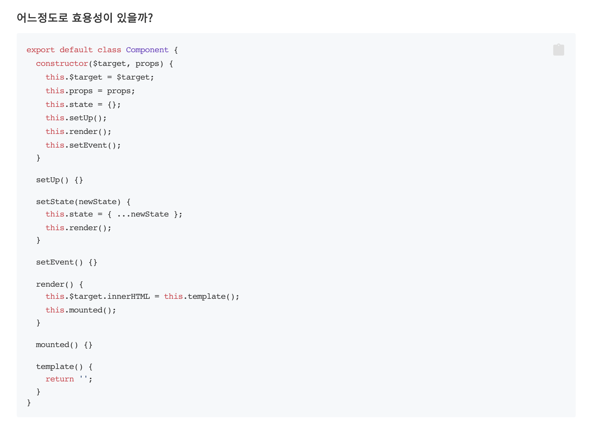
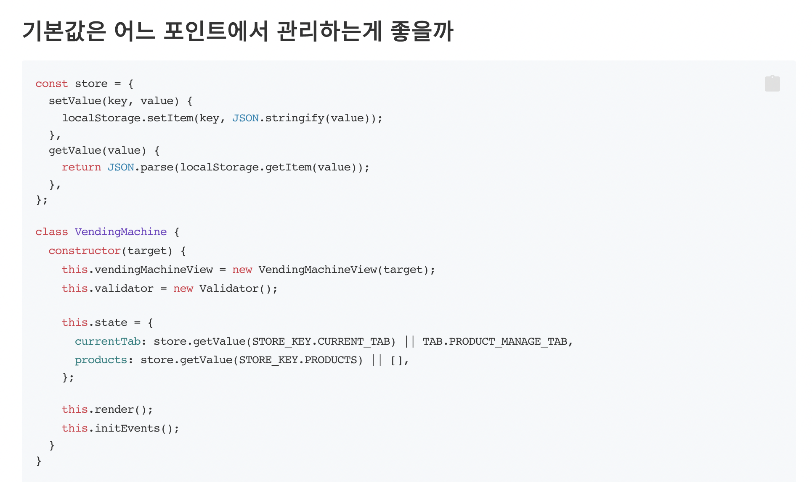
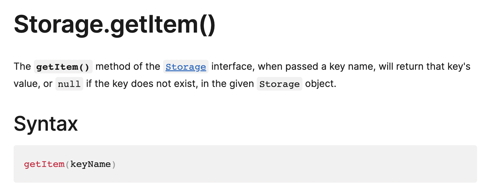
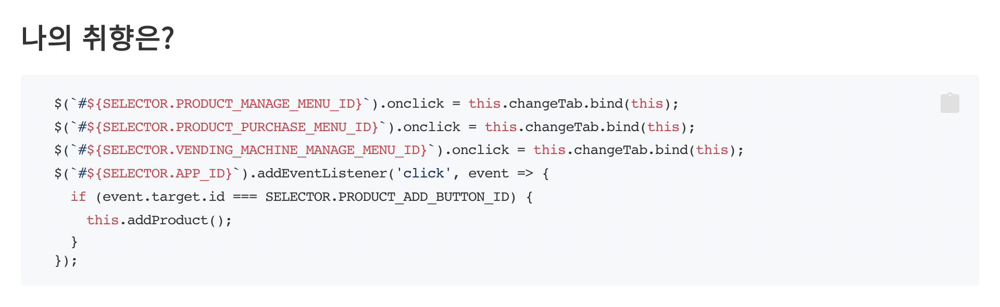
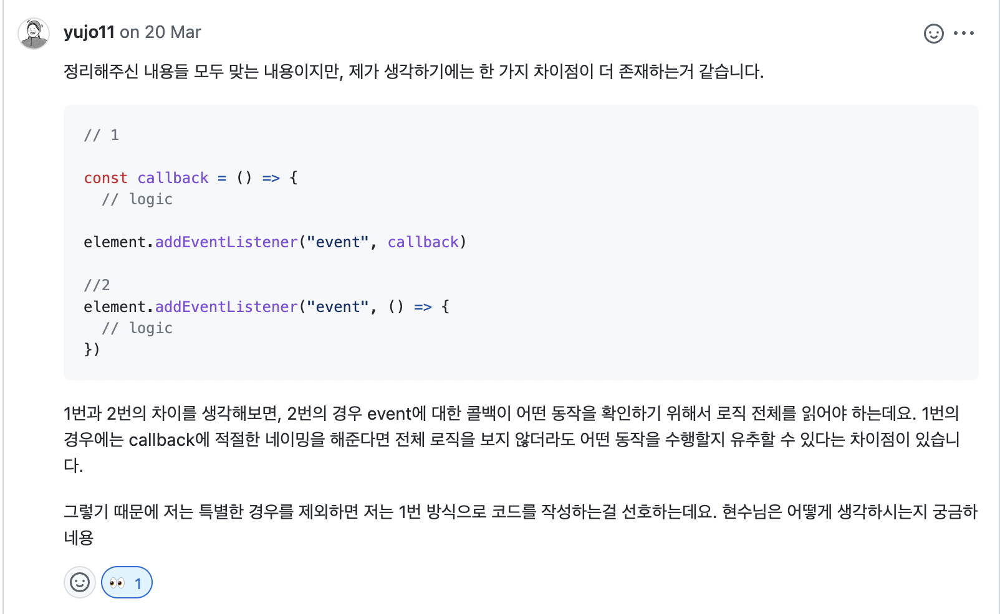
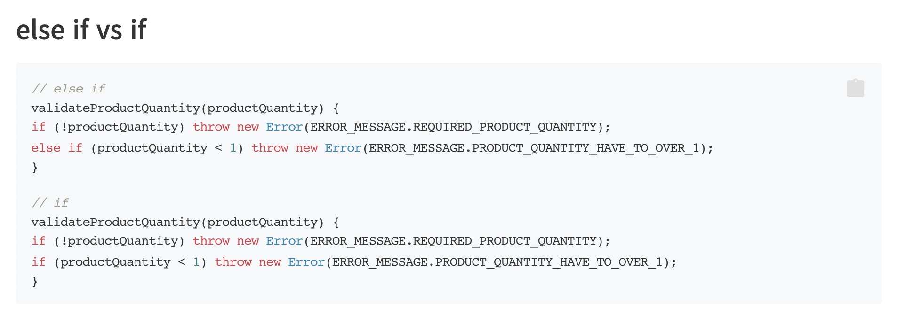

# NEXTSTEP Clean Code with JavaScript 2기

> 내가 왜 지원했고, 이걸로 무엇을 얻으려 했는가

평소에 바닐라 자바스크립트로 개발하는 것에 대해서 두려움이 조금 있었습니다. 프로그래머스 데브매칭과 같은 과제 전형을 보면 보통 바닐라 자바스크립트로 과제를 진행해야 하는데, 바닐라 자바스크립트에 대한 자신감이 없으니 통과할리가 없었죠.

그리고 바닐라 자바스크립트로는 도대체 어떤식으로 개발을 하는거야? 하는 의문이 계속해서 들었습니다. 평소에 `React` 라이브러리를 사용해서 개발만 진행했으니, 당연히 알리가 없었죠.

그리고 테스트에 대한 겁이 있었습니다. 우선 클린코드 자바스크립트 과정이 TDD를 기반으로 진행이 된다고 해서 테스트에 대한 겁을 없애기 위해 신청했었던 기억이 있네요.

그래서 바닐라 자바스크립트로는 어떻게 개발하는지에 대한 궁금증과 자신감을 얻고 테스트에 대한 자신감도 얻기 위해서 신청했다고 보면 되겠네요.

# 내가 완료했던 것들

> 내가 어떤 미션들을 진행했고, 어디까지 했는가

`NEXTSTEP Clean Code with JavaScript`은 총 8주차로 이루어져 있고 미션은 총 4개 진행을 합니다. 모든 미션은 [깃허브](https://github.com/next-step)에 공개가 되어있습니다. 그리고 제가 진행했던 미션의 PR들 또한 다 남겨져있죠.

미션은 1. 계산기 미션 -> 2. 로또 미션 -> 3. 자동차 게임 미션 -> 4. 자판기 미션순으로 진행이 되었습니다.

## 1. 계산기 미션 PR (1/1)

- [STEP 1 PR](https://github.com/next-step/js-calculator/pull/97)

## 2. 로또 미션 PR (2/3)

- [STEP 1 PR](https://github.com/next-step/js-lotto/pull/77)
- [STEP 2 PR](https://github.com/next-step/js-lotto/pull/100)

## 3. 자동차 게임 미션 PR (2/3)

- [STEP 1 PR](https://github.com/next-step/js-racingcar/pull/68)
- [STEP 2 PR](https://github.com/next-step/js-racingcar/pull/76)

## 4. 자판기 미션 PR (2/4)

- [STEP 1 PR](https://github.com/next-step/js-vending-machine/pull/32)
- [STEP 2 PR](https://github.com/next-step/js-vending-machine/pull/36)

온보딩 계산기 미션을 빼고는 나머지 미션들은 전부 STEP을 완료하지 못했습니다. 변명을 하자면 `NEXTSTEP`에서도 `STEP`을 나가는 것에 집착하지말고, 멘토님과 주고 받는 대화들 그리고 어떤 식으로 코드를 작성하면 좋을 것 같은지에 대한 생각을 하는 것이 중요하다고 했습니다.

제가 또 취준생이라서 면접 혹은 코딩테스트 날짜가 겹치면 자연스럽게 미션을 진행할 시간이 줄어들었던 것 같습니다.

# 내가 배웠던 것들

> 나는 무엇을 배웠는가

제일 중요한 부분이죠. 학습을 진행하면서 제가 배웠던 것들을 정리해보려고 합니다.
아래와 같은 간단히 지켜야 할 것들도 새롭게 각인시키면서 갈 수 있었습니다.

- 요구사항 분석 및 세부적으로 쪼개기
- 예외처리 꼼꼼하게 고민하기
- 처음부터 코드를 분리하기 (한번에 너무 몰아넣지 않기)
- 내가 무얼 하려는지 의미를 담기
- 클래스와 객체 역할을 잘 나누기
- 재사용하는 객체와 그렇지 않은 객체 분리하기
- 커밋 단위를 의미 있게 쪼개서 보내기
- 함수 파라미터 순서를 지키지 않은 경우에 대한 처리
- eslint, prettier 차이점
- 주석 지양하기
- 상수는 대문자로 선언
- 필요한 만큼만 구현하기
- 좋은 네이밍에 대한 고민
- early return
- 함수는 하나의 역할만 가능
- 가독성을 위해 함수를 추상화하기
- if else 뎁스 줄이기

그리고 추가적으로 저에게 임팩트 있었던 학습들을 떠올려보겠습니다.

## cypress & TDD

> 테스트에 대한 겁이 없어졌습니다.

분명 학습전에는 테스트를 어떻게 도입하고, 어떻게 사용하고, 어떤식으로 작성하는지를 몰랐습니다. 프로젝트에 도입하려고 해도 우선 겁부터 났던 것 같습니다.

미션들은 전부 `cypress`로 테스트 작성을 하는 것을 기반으로 진행이 됩니다. 구현 사항을 파악하고 해당 구현사항에 대한 실패하는 코드를 작성하고, 테스트를 통과하는 최소한의 코드를 작성하고, 테스트가 통과하면 리팩토링을 하는 방식으로 진행됐습니다.

네. 위의 방법이 `TDD`(테스트주도개발) 방법론에 대한 설명입니다.
테스트주도개발을 하면서 느낀 것은 코드의 변경에 대한 자신감이 가장 크게 다가왔던 것 같습니다.
평소에는 리팩토링을 진행하고 다른 기능들이 잘 동작하는지 일일이 체크를 해야됐었다면 테스트만 잘 작성해놓으면 리팩토링을 자신감있게 진행할 수 있습니다.

그리고 `cypress` 사용법에 대한 것은 덤으로 가져갈 수 있었네요.
단순 `JavaScript`에 `cypress`를 얹어서 사용한 것이라서 `React`에서 사용하려면 조금의 학습이 필요하겠지만 최고의 수확은 어떤 기술을 도입하는데 겁이 조금 없어졌다는 것입니다.

그냥 공부하고 적용해보지 뭐.

## 특정 라이브러리의 패턴을 따라하는 것

> 나는 리액트가 너무 편했나보다



클린코드 자바스크립트 과정은 매주 학습자들을 위해 공통 피드백을 제공해주십니다. 그러면 학습자의 코드를 들고와서 리뷰를 해주시는데, 8주동안 리뷰를 받으면서 제 코드가 정말 많이 나왔던 것 같습니다.

사실 제 코드가 나오면 배울 것이 생겨서 정말 좋다라고 최종적으로는 그렇게 생각했지만, 1차적으로는 부끄러웠던 것이 사실이었습니다. 아무도 제 코드라는 것을 알지는 못하지만 저는 알고있잖아요?

위 사진의 코드는 [황준일님의 바닐라 자바스크립트로 웹 컴포넌트 만들기](https://junilhwang.github.io/TIL/Javascript/Design/Vanilla-JS-Component/#

사실 저는 위의 시도를 하면서 사실 잘 되어가고 있는지 궁금했습니다. 완벽하게 리액트를 따라할거면 조금 더 완벽하게 할 수 있었는데 애매하게 따라하다가 코드가 저도 모르는 사이에 저 멀리 가버렸던 것 같습니다.

위의 시도를 한 것은 학습을 하면서 다양한 시도를 해보기 위함이었습니다. 학습을 진행하면서 할 수 있는 것들은 다 해보는 것이 낫다고 생각했습니다. [현석](https://github.com/pocojang)님도 리뷰를 해주시면서 끝에는 `학습을 하면서 다양한 시도를 하는 것은 괜찮다. 하지만 이것을 왜 적용하는지에 대해서는 알고있어야 한다.`라는 말씀을 비슷하게? 해주셨던 것 같습니다.

결론은 자신이 느껴야 합니다. **사용하는 패턴이나 방법론을 무작정 따라하는 것이 아닌 자신이 왜 필요하고, 유용한지 느끼고 적재적소에 적용하라**라는 의미들로 얘기를 해주신 것 같습니다.

## 클래스와 함수

> 우리는 클래스를 왜 사용할까요

바닐라 자바스크립트로 과제나 미션들을 진행하다보면 `Class`, `Function`로 객체를 많이 선언하고 오브젝트로 만들어서 사용합니다. 근데 클래스를 만들고, 인스턴스로 만들어서 사용하는 이유는 무엇인가요? 저는 이 부분에 대해서 단순히 `React`가 `Component`를 만드는 방식에 대입해서 진행을 했습니다. 그러니까 뷰 단위로 나뉠 가능성이 있다면 단순히 `Class`로 나누어서 만들고, 인스턴스로 만들어서 사용을 했습니다.

저는 `Class`의 목적을 제대로 파악하지 못하고 있었던 것 같습니다. 단순히 `Function`으로 만들어서 사용해도 되는 부분들 까지 `Class`로 사용하고 있었습니다. 객체는 **동전**, **자동차**, **로또**와 같은 반복적이고, 각각의 상태를 가지고 있는 단위가 보통 객체로 나뉠 수 있을 것 같습니다. 단순히 **동전 템플릿**, **자동차 템플릿**과 같은 렌더링 함수들은 굳이 `Class`로 선언해서 사용하지 않아도 `Function`으로 처리할 수 있습니다.

위에서의 깨달음(?)과 비슷하네요. 용도에 맞춰서 사용합시다.

## 이 외에 받은 피드백들

> 제가 작성한 코드가 전체 피드백에서 나온 경우가 꽤 많이 있었습니다.



이 경우에는 `VendingMachine` 클래스 안에 `this.state`에서 값을 초기화 시킬 때, 상태를 저 곳에서 초기화하지 말고, `store` 관련 코드들에서 예외처리도 해주고, 그곳에서 초기화를 해서 넘기는 것이 어떻겠느냐 하는 피드백이었습니다.



로컬스토리지를 `getItem` 메서드를 사용할 때는 `key` 값이 없을 때 null에 대한 처리를 해주어야 합니다. 그 때 로컬스토리지를 사용하는 코드에서 예외처리를 하는 것 보다, 로컬스토리지 관련 코드들이 들어있는 유틸 함수들에서 처리를 해주고 사용하는 곳에서는 예외를 신경쓰지 않는 것이 깔끔합니다.



사실 변명을 하자면 제가 `onclick` 메서드와 `addEventListener`를 혼용해서 사용한 것은 그냥 아무 이유없이 그런 것은 아닙니다.

- addEventListener는 다중 이벤트 등록에 유리하다.
- addEventListener가 두 번 불리면, 함수가 덮어씌워지는 것이 아니라 중복 발생한다.
- 인라인 이벤트 등록은 하나의 이벤트 등록에 유리하다.
- 함수가 제 등록되지 않아서 이벤트가 두 번 일어나는 불상사를 막을 수 있다.

다음과 같은 이유로 둘을 나누어서 사용하려고 했습니다. 그런데 여러 측면에서 고민해보고 적용할 필요가 있다고 생각합니다. 위의 이유 말고도 [@yujo](https://github.com/yujo11) 멘토님께서 리뷰해주신 부분도 인상깊었습니다.

_



사실 위의 `else if`를 사용한 코드는 다음과 다를게 없습니다.

```javascript
if (!productQuantity) {
  /* ...do something */
} else {
  if (productQuantity < 1) {
    /* ...do something */
  }
}
```

`else` 문 안에서 `if`를 한번 더 적어준 것이죠.
그래서 사실 위의 코드는 `if` 두 번으로 대체가 가능합니다.

# 내가 좋았던 부분들

> 클린코드 자바스크립트를 진행하면서 좋았던 부분들 (멘토, 학습, 리뷰, 등등)

## 좋은 멘토분들

우선 멘토분들이 너무 좋았습니다. 리뷰도 이정도면 빠르다고 생각헀고, 멘토분들과 코드 리뷰로 얘기 하는 것도 재미있었습니다. 아 이런 시각도 있구나, 이런 식으로 할 수도 있구나? 이렇게 생각할 수도 있겠다. 와 같은 생각들을 할 수 있게 해주는 것 같습니다.

## 깔끔한 진행과 뼈와 살이되는 피드백들

클린코드 자바스크립트는 매주 월요일 저녁 8시에 세션이 진행됐습니다. 새로운 미션이 시작하는 주에는 새로운 미션과 주로 테스트에 대한 설명을 했던 것 같습니다. 그리고 새로운 미션이 시작하는 것이 아니라 진행하고 있는 주에는 현석님께서 전체 피드백을 해주셨습니다.

우선 메이커준님의 진행력은 최고라고 생각했습니다. 그냥 너무 깔끔해서 방송 틀어놓고 보는 줄 알았습니다. 준비도 탄탄하게 하고 오셔가지고 막힘없이 진행되는 세션이 좋았습니다.

그리고 현석님께서 해주시는 피드백 세션은 정말 값졌는데, 특히 제 코드에 대한 피드백이 많이 나와서 재미있었습니다. 피드백 받을 내용이 없다면 66만원이라는 거금을 주고 수업을 들을 필요가 없으니까요...

# 내가 아쉬웠던 부분들

> 나한테 아쉬웠던 부분들

## 시간을 많이 쏟지 못했다.

중간에 코로나도 걸렸고, 아무래도 취업준비생이다 보니까 면접과 코딩테스트가 너무 크게 다가왔나 봅니다. 그래서 중간에 조금 끊키는 시간이 있었는데 그런 시간들이 끝나고 나서 조금 아쉽게 느껴졌습니다.

# 학습에 아쉬웠던 부분들

> 클린코드에 아쉬웠던 부분들은 무엇인가

## 리뷰를 요청하고 나서...

리뷰를 요청하면 멘토분이 리뷰를 해주기까지 기다려야 합니다. 그 때 까지 시간이 조금 붕 뜨는 것이 아쉬웠습니다. 만약 목요일 밤에 리뷰를 요청하면, 멘토분도 현업자라서 금요일 낮 시간엔 일을 하고 저녁에 리뷰를 해주시면 저는 금요일 밤까지 공부를 하고 있어서 다음날인 토요일부터 할 수 있었습니다. 그래서 하루가 붕 뜨는 시간이 종종 있었는데 그 부분들에 대해서 아쉽게 느껴졌습니다.

# 마무리

두 달이 길다면 길고 짧다면 짧은 시간인데 두 달이 지나고 나서 느낀 것은 "아니 벌써 두 달이 지났어?" 였습니다. 짧게 느껴졌다는 거겠죠? 짧은 시간동안 진짜 **유레카** 할 정도의 실력 향상이 있었던 것은 아니지만 사고방식에 대해서 조금 변화를 줄 수 있었던 것 같습니다.

왜 이걸 사용해? 왜 이렇게 했어? 와 같이 이전보다 스스로에게 질문을 더 하는 것 같네요.
그리고 테스트에 대해서 겁이 없어진 것이 최대의 수익인 것 같습니다.

한 번 정도는 해볼만 한 것 같습니다. 하지만 취준생 입장에서 66만원 큰 돈이기 때문에, 이 기회를 발판 삼아서 열심히 취직해서 회사에서 주는 돈으로 다른 학습을 해야할 것 같습니다ㅎ..
