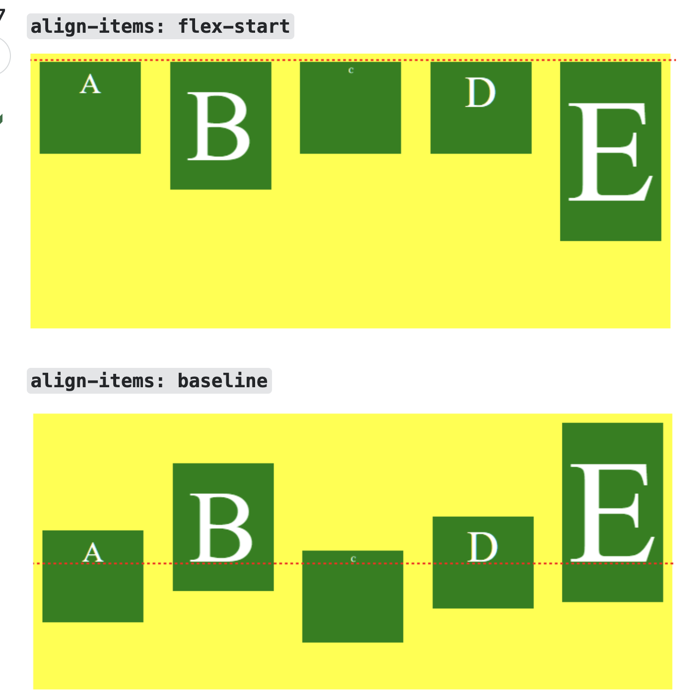

## flex-start vs baseline

## 요약

- `align-items: flex-start`는 flex box의 교차축(cross)의 **시작점에 자식 요소**들을 맞추는 것
- `align-items: baseline`는 flex box의 교차축(cross)의 **자식 요소들의 텍스트 기준선**을 맞추는 것
  - flex box안의 자식들의 텍스트를 기준으로 나열을 해야할 때 사용
  - 어떻게 보면 deps가 하나 더 생기는거라서 CSS 디버깅하기가 어려울 수도 있을 것 같다. (부모 - 자식 - 자식의 텍스트)
