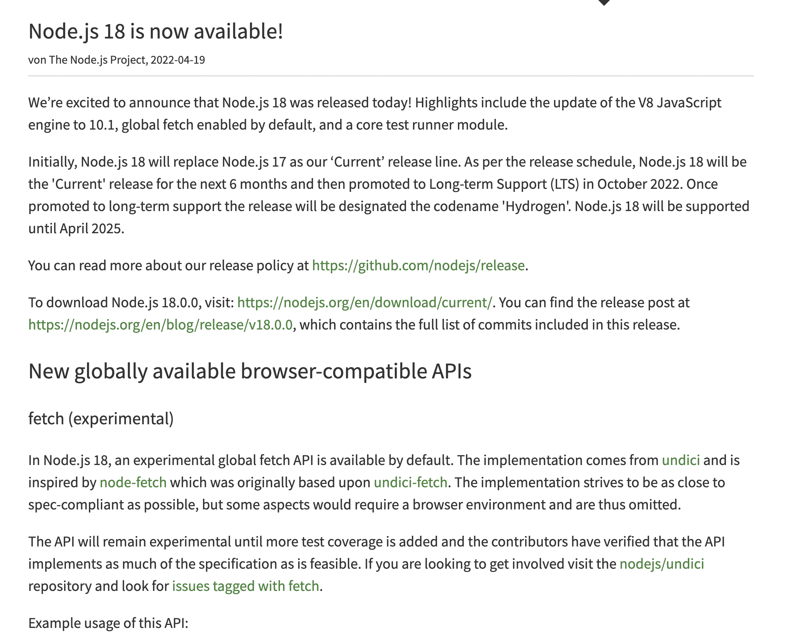

## Axios

[Axios](https://axios-http.com/kr/docs/intro) uses an `XMLHttpRequest` object by default to communicate with the
to communicate with the server. There are some things that work with `fetch` but not with XMLHttpRequest (XHR).

## Things that work with fetch but not with axios (xhr)

### Progress Report

Using the fetch method, you can see how far the download has progressed.

- [fetch progress](https://javascript.info/fetch-progress)

### Cache API

You can cache requests or responses to keep them in memory longer.

- [cache api](https://developer.mozilla.org/en-US/docs/Web/API/Cache)

### Policy Control

You can control `Cross Origin Resource Sharing` or Cache from above.

### Stream

fetch supports streams, but XHR buffers the entire response in memory.

- [fetch stream](https://web.dev/i18n/ko/fetch-upload-streaming/)

### Abort Controller

fetch provides an Abort Controller, an object that can abort a request.

- [AbortController](https://developer.mozilla.org/en-US/docs/Web/API/AbortController)

### API compatibility and bundle size differences

fetch has its own API (Promise-based interface, AbortController, etc.),
axios (XHR) tends to have a heavier bundle size because it needs to implement features that fetch provides natively.

An alternative is the [redaxios](https://www.npmjs.com/package/redaxios) library.
It has a fetch-based implementation and is minimally compatible with the axios API. (fetch-based axios API minimal compat)

### Supported since Node.js version 18

Originally, fetch was part of the web API, so it was a simple way to use JavaScript in a non-web runtime environment.
fetch was not available in the Node.js environment. [However, with the update to Node.js version 18, fetch is now available](https://nodejs.org/de/blog/announcements/v18-release-announce/#fetch-experimental)

So you don't need the `node-fetch` or `isomorphic-fetch` libraries to use fetch in the node environment.
You can now use fetch in the Browser, Node.js, Bun, and Cloudflare Worker environments.

Consider your project's needs before choosing a library.
