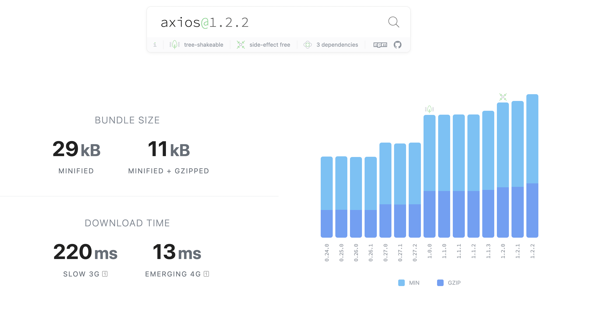
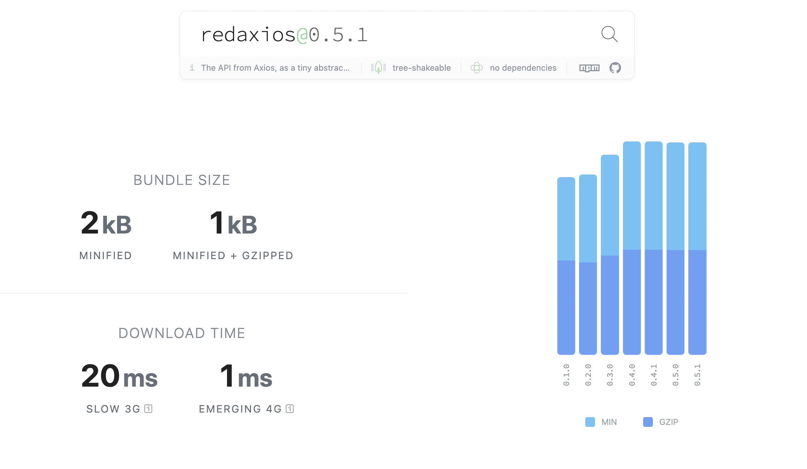
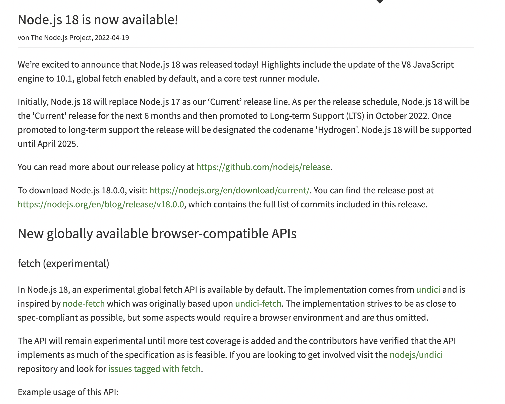

## Axios

[Axios](https://axios-http.com/kr/docs/intro)는 기본적으로 `XMLHttpRequest` 객체를 사용해서
서버와 통신을 한다. `fetch`에서는 되지만 XHR(XMLHttpRequest)에서는 안되는 것들이 있다.

## fetch에서는 되지만 axios(xhr)에서는 안되는 것들

### Progress Report

fetch method를 사용하면 다운로드가 어느정도 진행이 됐는지 알 수 있다.

- [fetch progress](https://javascript.info/fetch-progress)

### Cache API

요청이나 응답에 대해서 메모리에 오래 남도록 캐싱할 수 있다.

- [cache api](https://developer.mozilla.org/en-US/docs/Web/API/Cache)

### Policy Control

`Cross Origin Resource Sharing`이나 위에서 나왔던 Cache를 컨트롤 할 수 있다.

### Stream

fetch는 stream을 지원하지만, XHR은 응답 전체를 메모리에 버퍼링한다.

- [fetch stream](https://web.dev/i18n/ko/fetch-upload-streaming/)

### Abort Controller

fetch는 요청을 중단할 수 있는 객체인 Abort Controller를 제공한다.

- [AbortController](https://developer.mozilla.org/en-US/docs/Web/API/AbortController)

### API 호환성과 번들 사이즈 차이

fetch는 자체적으로 API(Promise 기반 인터페이스, AbortController 등등)들이 구현되어있지만,
axios(XHR)은 fetch에서 기본적으로 제공해주는 기능들을 구현해야 하기 때문에 번들 사이즈가 무거워지는 경향이 있다.

그 대체재로 [redaxios](https://www.npmjs.com/package/redaxios) 라이브러리가 있는데
fetch 기반으로 구현이 되어있고, axios 최소한으로 호환되게 만들어놨다. (fetch 기반 axios API minimal compat)

### Node.js 18버전부터 지원 가능

원래 fetch는 웹 API에 속해있었기 때문에 웹이 아닌 단순 런타임 환경에서 자바스크립트를 이용하기 위한
Node.js 환경에서는 fetch를 사용할 수 없었다. [하지만 Node.js 18버전으로 업데이트 되면서 fetch를 사용할 수 있게 되었다.](https://nodejs.org/de/blog/announcements/v18-release-announce/#fetch-experimental)

그래서 node 환경에서 fetch를 사용하기 위한 `node-fetch` 라이브러리나 `isomorphic-fetch` 라이브러리가 없이도
Browser, Node.js, Bun, Cloudflare Worker 환경에서 fetch를 사용할 수 있게 되었다.

라이브러리를 사용하기전에 자신의 프로젝트에서 필요한 것들을 잘 생각하고 선택을 하자.
