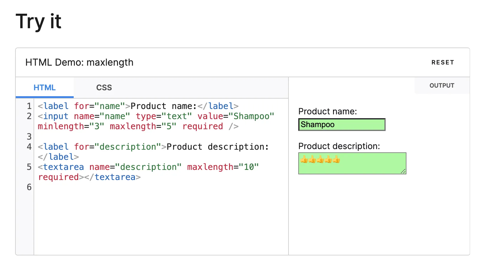
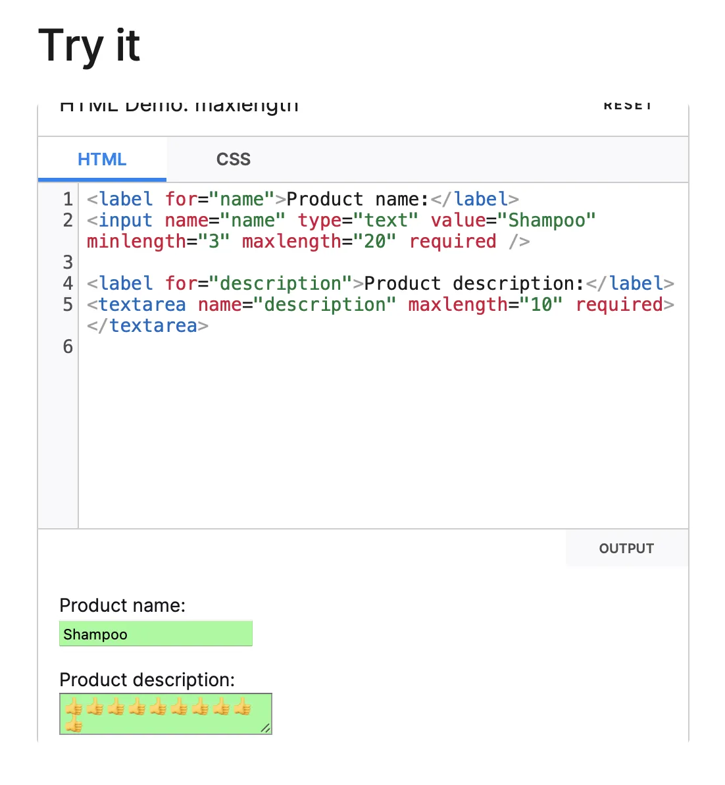

## input, textarea의 `maxLength` 프로퍼티

```html
<textarea name="description" maxlength="10" required />
<input name="description" maxlength="10" required />
```

`<input />` 태그와 `<textarea />` 태그에는 최대 길이를 정할 수 있는 `maxLength`
프로퍼티가 있어요. 해당 프로퍼티가 사파리 브라우저와 다른 브라우저의 동작이
다르다는 것을 아시나요?

### 크롬

HTML input과 textarea의 maxLength 계산 방식은 UTF-8 기준으로 계산이 됩니다.

이모지의 길이는 보통 2로 계산되기 때문에 2 \* 5 = 10해서 5개까지 밖에 못넣습니다.



### 사파리

그런데 사파리는 input과 textarea에서 이모지 계산 방식이 조금 달라서 10개를 넣을 수 있습니다.



### 관련 글

[Different browsers allow different amounts of emoji characters in a maxlength field](https://stackoverflow.com/questions/47320144/different-browsers-allow-different-amounts-of-emoji-characters-in-a-maxlength-fi)

스택오버플로우의 글을 살펴보면 사파리도 아래와 같이 이모지의 길이를 2라고 인식하지만

사파리에서 maxLength 프로퍼티가 조금 이상하게 동작한다고 얘기를 하고 있습니다.


```jsx
// 2 * 10 = 20,,, but maxLength was 10!!!!
// 사파리에서도 해당 콘솔을 찍으면 길이를 2라고 인식한다.
"🥕".length; // 2
```

모든 브라우저가 일관성있게 프로퍼티에 대한 구현을 제공해주면 좋겠지만 그렇지 않은 것이 현실 상황이라서 결국 조금 귀찮겠지만 maxLength를 직접 구현하는 것이 나을수도 있다고 5년전 글에서 얘기 하고 있습니다.
