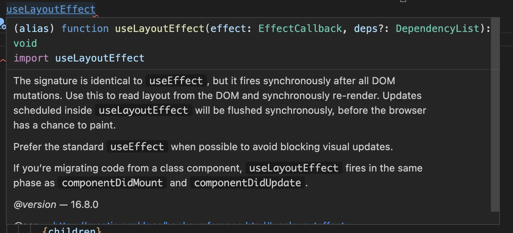

> React에 useEffect 훅 말고 useLayoutEffect가 있다는 걸 아셨나요.

## tl;dr

**useLayoutEffect**는 동기적으로, 렌더링 전에 호출이 일어나고 **useEffect**는 비동기적으로 렌더링 후에 호출이 일어나요.

성능 문제가 발생할 경우만 **useLayoutEffect**을 사용하고 기본적으로는 **useEffect**를 사용하는 것이 좋아요.

제일 큰 차이점은 **useEffect**는 비동기적으로 동작하고 **useLayoutEffect**는 동기적으로 동작해요.
리액트에서 **useEffect**는 **렌더링**이 끝나고 특정 행동을 수행하고, **useLayoutEffect**는 렌더링 전에 특정 행동을 수행해요.

**useLayoutEffect**는 렌더링 전에 특정 행동을 수행하므로
브라우저의 렌더링 파이프라인에서 큰 영향을 미칠 수 있다는 단점이 있어요.
이러한 문제를 해결하기 위해 네트워크 요청, DOM 접근, 비동기 작업을 하는 경우에는 가능한 **useEffect**를 사용하는 것이 좋아요.
또, 서버에서 데이터를 가져오는 경우, 타이머를 설정하는 경우, 네이티브 API를 사용하는 경우가 있을 수 있어요.

**useLayoutEffect**는 렌더링 전에 특정 행동을 수행하도록 만들어주므로,
애니메이션 구현 등 즉시 반응이 필요한 경우에 사용하면 좋습니다.
또한, 성능 모니터링 기능을 사용할 때는 **useLayoutEffect**를 사용하면 유용합니다.

## 꿀팁

크롬 브라우저에서는 **useLayoutEffect**를 사용할 때 크롬 **DevTools**에서는
**layout**과 **paint** 성능을 측정 할 수 있는데, 이러한 성능 모니터링 기능을 사용할때는 **useLayoutEffect**를 사용하면 유용합니다.
