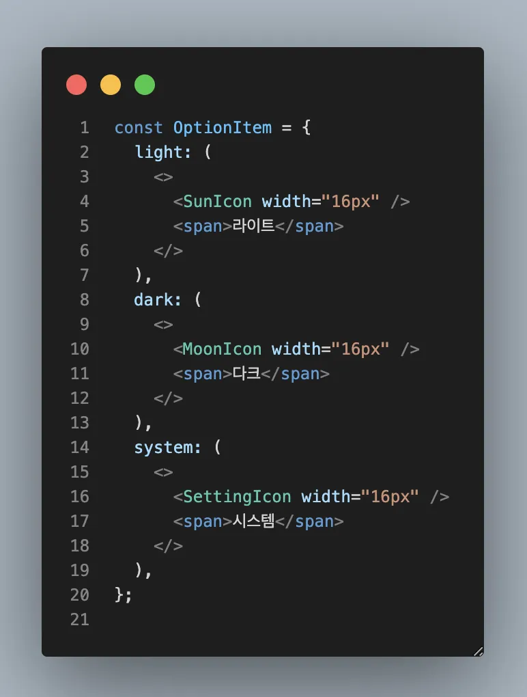

## tl;dr

### AS-IS



### TO-BE


## ReactNode를 외부에서 사용할 땐...

언제 테마 설정 **Select** 컴포넌트를 만들어야 하는 상황이 있었어요.
우리 테마 설정은 다크, 라이트만 있는게 아니라 **시스템** 옵션도 있어서
단순 토글 버튼이 아니라 **Select**로 구현했어야 했어요.

그래서 옵션 아이템들을 `ReactNode` 형태로 컴포넌트 밖에 선언을 해줬어요.

```typescript
// AS-IS
const OptionItem = {
  light: (
    <>
      <SunIcon width="16px" />
      <span>라이트</span>
    </>
  ),
  dark: (
    <>
      <MoonIcon width="16px" />
      <span>다크</span>
    </>
  ),
  system: (
    <>
      <SettingIcon width="16px" />
      <span>시스템</span>
    </>
  ),
};
```

그리고 Select 컴포넌트는 아래와 같이 만들어줬어요.

```tsx
// 해당 컴포넌트는 단순 예시에요.
const Select = () => {
  return (
    <select>
      <option>{OptionItem.light}</option>
      <option>{OptionItem.dark}</option>
      <option>{OptionItem.system}</option>
    </select>
  );
};
```

근데 이렇게 하면 코드를 읽는 입장에서 저게 컴포넌트를 적어놓은건지,
그냥 단순 텍스트로 이루어진 데이터인지 알 수가 없어요.
**그래서 render 메소드로 한 번 감싸주면 조금 더 명확하게 알 수 있어요.**

```typescript
// TO-BE
const OptionItem = {
  light: {
    render: () => (
      <>
        <SunIcon width="16px" />
        <span>라이트</span>
      </>
    ),
  },
  dark: {
    render: () => (
      <>
        <MoonIcon width="16px" />
        <span>다크</span>
      </>
    ),
  },
  system: {
    render: () => (
      <>
        <SettingIcon width="16px" />
        <span>시스템</span>
      </>
    ),
  },
};
```

위와 같이 선언을 해주고, 사용하는 곳에서는 확실하게
**이건 리액트 컴포넌트를 렌더링 하는거야** 라고 얘기할 수 있죠.

```tsx
// 조금 더 컴포넌트 같지 않나요?
const Select = () => {
  return (
    <select>
      <option>{OptionItem.light.render()}</option>
      <option>{OptionItem.dark.render()}</option>
      <option>{OptionItem.system.render()}</option>
    </select>
  );
};
```
