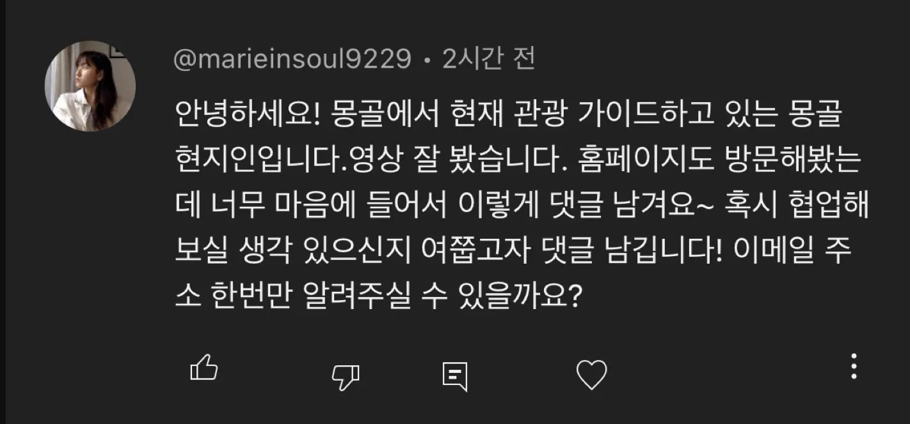
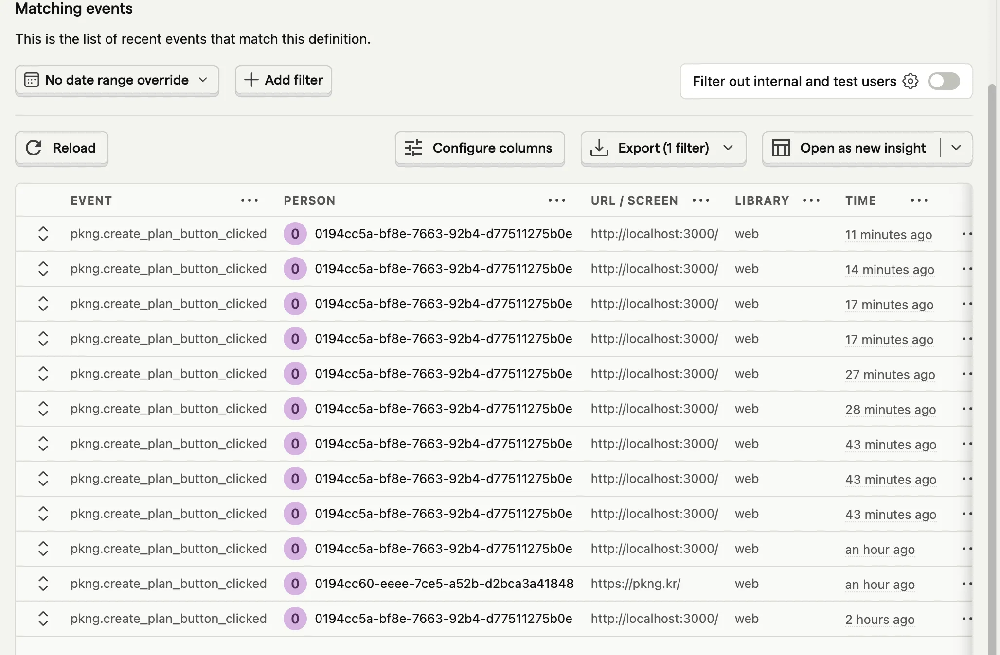

<Callout type="info">
  2025/02/03 - 2025/02/15
</Callout>

## 반응

팩앤고 유튜브에 영상을 올렸는데 몽골 현지에서 여행사를 운영하시는 분이 댓글을 달아주셨다.

근데 아직 답장이 안왔다... 많이 바쁘신가?
그래도 뭔가 수요가 있어보였고, 확실히 존재하는 문제를 풀고 있구나 하는 생각은 들어서 안도했다.
일단 답장이 오고 안오고를 떠나서 일단 내가 할 수 있는 것들을 계속하려한다.
결과적으로 지금 방향성이 많이 바뀐 것 같긴하지만... 일단 몽골 여행에 존재하는 문제를 풀고 싶긴해서 집중해보려 한다.

## PostHog 써보기

<Callout>
  [PostHog](https://posthog.com/)
</Callout>

`PostHog`라고 요즘 사내 조금씩 사용하고 있는 프로덕트 분석 도구가 있다.
기존에 GA에서 제공하는 Analytics나 Event Tracking 이라던지 세션 분석 등 필요한 분석 도구들은 다 있는 것 같고
무료 사용 범위도 되게 넓어서 사이드 프로젝트에서 도입해보기 좋아보였다.

그래서 일단은 팩앤고 프로젝트에 적용해봤다. 얼마나 잘 쓸진 모르겠지만, 일단 주요 버튼에 이벤트 트래킹을 해봤다.

## 팩앤고 변경사항

<Callout>
  [pkng.kr](https://pkng.kr)
</Callout>

- 계획 만들기 강조 및 문구 변경
- 계획 만들기 버튼 클릭 시 퍼널이 아니라 상세페이지로 바로 이동 구현
- 계획 리스트 페이지에 "새로운 계획 만들기" 버튼 구현
- 메인페이지 plan이 있으면 계획 이어서 만들기 버튼 구현
- 메인페이지 plan이 있으면 계획 리스트 보러가기 개수 버튼 구현
- 퍼널에서 뒤로가기 버튼 누르면 계획으로 다시 돌아가도록 변경
- Plan 기본값 변경
- 계획 상세페이지 도움말 및 문구 변경

## 프로젝트 방향성 틀기 (feat. LLM)

요즘 참 LLM들이 난리다.

딥시크니 챗지피티니 클로드니 하는데 계속해서 추적하고 따라가려고 하는데 쉽지 않은 것 같다.
같은 맥락에서 어떻게 하면 이 친구들을 잘 사용할 수 있을까를 고민하고 있는데 정작 내 사이드 프로젝트에는 그걸 잘 못 녹였다고 생각했다.

LLM이 잘 해주는게 요약하고, 찾아주고, 정리하는 걸 잘해주니까 그런 것들을 잘 이용하면 어떨까 했다.
그리고 최우선적으로 사용하는 유저들을 모으는게 우선인데, 지금 5개월 넘게 이 프로젝트를 하다보니 너무 내 생각에 갇혀있었나 싶기도하다.

너무 많은 문제를 한꺼번에 풀려고 했기도 하고 좀 방향을 틀어서 뾰족하게 문제를 풀어보자고 다짐했다.
그래서 일단 `여행사 찾기` 프로젝트에 집중해보자고 생각했다.

견적서에 대한 데이터는 인터넷상에 많이 없다보니 LLM이 잘 하지 못하고, 그럼 예상 가격을 추론하는게 어렵다고 생각했다.
그리고 유저가 어떤 여행사를 선택해야 하는지? 그리고 가격이 어느정도 드는지, 선택된 옵션이나 장소와 액티비티에 따라서 가격이 어떻게 변경되는지
기간이 변경됨에 따라 또 가격이 얼마가 되는지 그런 것들이 궁금하다고 생각했다.

일단 1차적으로는 나도 정보를 자세하게 모르다보니 정보를 모으는 것에 집중하지 않을까 싶다.
그리고 최대한 컴팩트하게 웹사이트를 만들어서 1분안에 원하는 정보를 얻을 수 있게끔 설계해서
유저들을 최대한 많이 만드는 것이 우선인 것 같다. 그 다음은 그 다음에 생각하려고 한다.

모은 정보를 LLM으로 요약하거나 추천해주거나 해서 프로젝트 자체에 LLM을 적용해도 좋을거같긴한데,
일단 너무 생각이 많아져서 견적서들 모아서 요약하고 코딩하는데에 LLM을 충분히 활용하고 있으니까 그런 죄책감은 안 느끼려고 한다.
그리고 아직 LLM이 필요한 서비스인가, 억지 LLM인가 싶기도 해서 일단 나중에 충분히 필요해지면 고려를 해볼 수 있지 않을까
