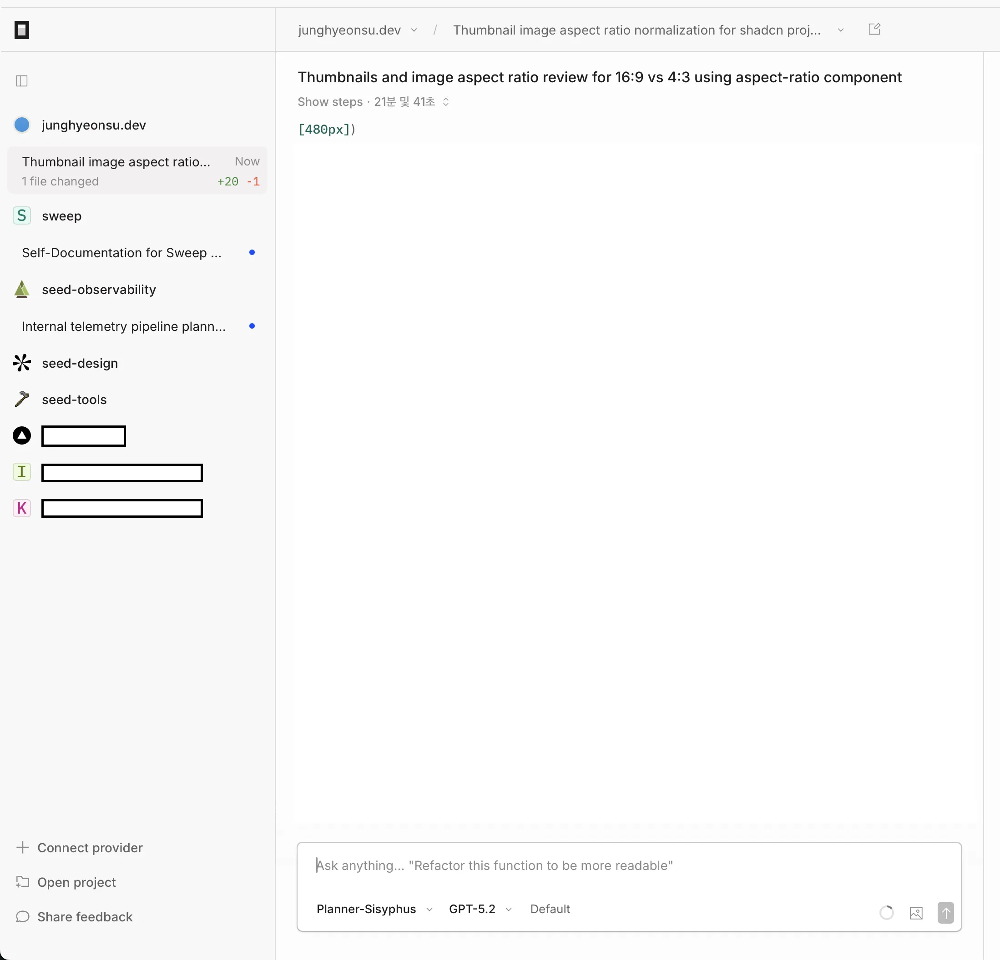
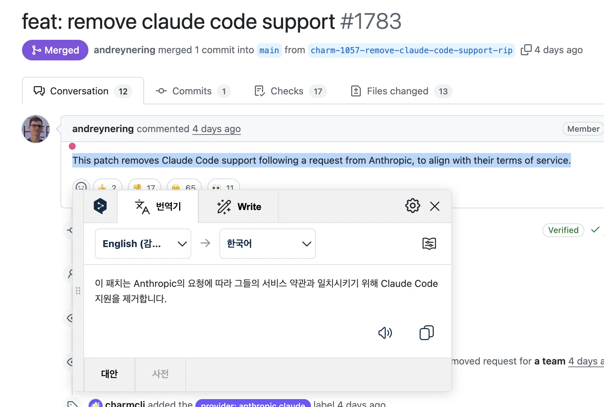
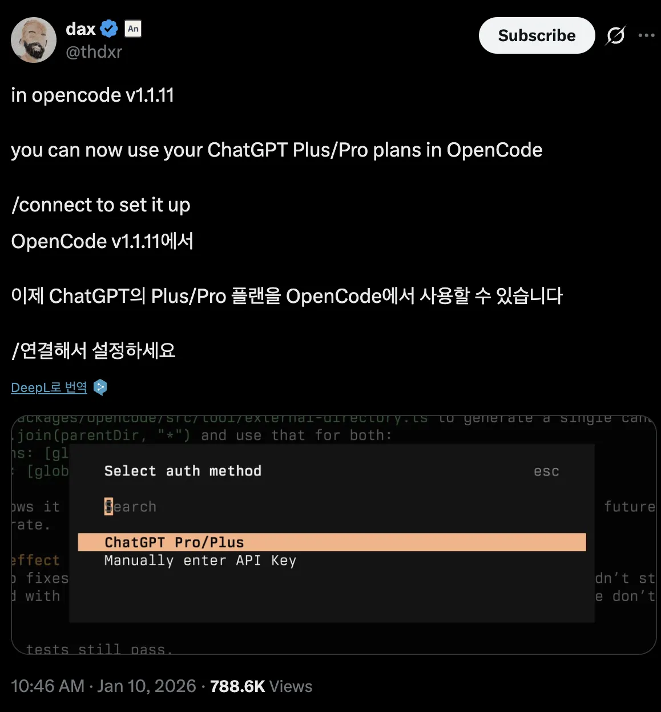

최근 `opencode`가 뜨거운 감자라고 해서 나도 사용해봤다.
지난 월요일부터 일주일 정도 사용해본 결과 엄청나게 만족스럽다.

사실 `opencode`가 장점으로 내세우는 여러 모델을 Orchestration하면서 모델들끼리 협력하는 것에 대해서는 크게 와닿진 않았는데,
`opencode` 데스크탑 앱의 사용성이 너무 마음에 들었다. 여러 프로젝트를 등록해두고 한 앱에서 왔다갔다 하면서 프롬프팅을 할 수 있는 경험이 좋았다.
사내에서 좀 잘 짜여졌다고 생각하는 프로젝트들을 clone해서 거기서 궁금한 점들을 전부 물어보고, 해당 프로젝트의 장점들을 찾아내고 내 프로젝트에 적용해보는 경험이 좋았다.
이걸 사용하고나서 거의 `Cursor`를 보는 일이 줄어들었고, 거의 `opencode`로만 개발하고 있다.

뭔가 할 수 있는게 많아지니까 생각이 폭발하는게 느껴졌다. **뭘 할 수 있는지는 그냥 내가 어디까지 하겠다고 마음먹은지에 따라 달라지는 느낌이다.**
예를들어 예전에는 뭔가를 해야할 때 지금 웹뷰 디자인시스템밖에 없는데 웹 디자인시스템도 지원하겠다고 했을 때 이것저것 병목들이 생각났었는데(지금 해야하는 일과의 우선순위, 기술적 병목)
이제는 그냥 프롬프트 치고 우선 플랜을 짜보면 된다. 그리고 나오는 플랜보고 이리저리 조율하는 시간만 조금 더 들여서 구현 시작하면 된다.

그리고 이제는 `넓게` 아는 것이 중요해질 것 같은 느낌이 들었다. `깊게`의 중요성을 폄하하는건 아니다.
어떤 것을 시작할 때 키워드를 아는게 되게 중요한데 그래야 리서치하거나 플랜 짤 때 해당 키워드 이용해서 조금 더 레버리지를 땡길 수 있는 것 같다.
공개된 오픈소스나 사내에 잘 구현된 코드 클론해서 적용된 패턴이나 개념들을 정리해달라고 하고 하나씩 알려달라고 하면 또 잘 알려준다.

이전에는 개발자들은 조금 더 기획자처럼 일하게 될 것이라는 예측들을 봤을 땐 크게 와닿지 않았는데, 요즘 내가 일하는 방식을 보면 그런 것 같다.
그 때 중요한 프로젝트 2개에서 3개정도 중요한 Task를 Plan 모드로 계획을 짜게 두고, 다음 프로젝트에 또 Planning하고, 돌아와서 Plan 확인하고, 괜찮으면 코드 작업 시키고, 확인하고, 테스트하고... 반복이다.

사람들이 요즘 바이브 코딩이 재미있다고 하는 것을 SNS에서 무슨 호들갑은 이라고 생각했는데, 이젠 내가 평일 밤, 주말 할 것 없이 그냥 구현하고 싶은 것을 실체화 하기 위해서 프롬프팅하고 있다.
(근데 이게 뇌를 많이 쓰는 작업인 것 같아서 조절을 잘 해야할 것 같다.) 확실히 알게 된 사실은 난 코드 구현보다는 뭔가를 만들어내는 것에 더 흥미를 느끼는가보다.

---

지난 금요일(1월 9일)에 Anthropic이 opencode에 요청을 해서 Claude Code 지원이 해지됐다.
지금은 다행히(?) 다시 사용할 수 있는 상태가 되었는데 저때 당시 생산성이 급감하는 게 느껴졌다.
당시에도 여러 프로젝트를 돌아다니면서 플래닝을 열심히 하고 있었는데 갑자기 요청이 다 막혀서 그랬을 수도 있다.

재밌는 포인트는 그 다음 날 OpenAI는 `opencode`에 요청을 해서 Plus/Pro 플랜을 사용할 수 있게 됐다.
경쟁 안에서는 죽을 맛이겠지만 바깥에서 보는 건 재밌다.

`opencode`는 `opencode black` 이라는 플랜을 만들어서 월 `$200`에 제공하기 시작했는데 공개한지 얼마 안돼서 바로 매진됐다.
앤트로픽 사건으로 뜨거워졌을 때 노를 빠르게 젓는 모습이다. 앞으로의 행보가 궁금하고, 한번도 사용해보지 않은 사람은 무료 플랜으로도 사용하고 있는 모델들 연결해서 사용할 수 있으니까 사용해보길 추천한다.

자잘스

- `opencode`는 또 플래닝이 끝나거나 구현이 끝나면 알림을 알려줘서 프로젝트 여러 개를 왔다갔다 하기가 수월하다.
- `opencode`는 폴더 멘션이 된다 (Claude Code CLI는 안 됐음...)
- 지금은 `opencode`의 Orchestration에 대해서 큰 효능을 나는 많이 못 느끼고 있지만, 가능성이 열려있다는 것만으로 다른 도구의 상위 포지션이라고 생각한다.
- 다른 프로젝트를 벤치마킹 하는 것은 다른 프로젝트를 따라가는 것 이상을 못하기 때문에 그 이상은 온전히 나만의 생각을 해야한다.
