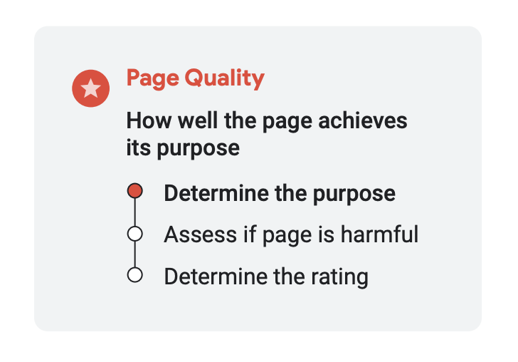

## 들어가기 전

이 글은 다음과 같은 것들은 **제공하지 않습니다**.

- `SEO`를 잘 챙기려면 어떤 것을 해야 하는지
- 무엇을 만들어야 하는지와 같은 액션 아이템
- 프론트엔드 개발자의 관점에서 프론트에서 SEO를 잘하려면 어떤 것을 챙겨야 하는지와 같은 것들은 제공하지 않습니다.

이 글은 다음과 같은 것들을 **제공합니다**.

- 구글이 제공하는 [searchqualityevaluatorguidelines](https://static.googleusercontent.com/media/guidelines.raterhub.com/ko//searchqualityevaluatorguidelines.pdf)와 **그와 관련된 글**들을 같이 읽습니다.
- 구글과 같이 거대한 세계적인 기업이 제공하는 검색엔진에서는 **어떤 것을 중요시하고 어떤 과정을 거쳐 해당 결정을 내렸는지와 같은 생각**을 읽습니다.
- 문서를 읽으며 아하 포인트, 흥미로운 부분, 재미있는 부분을 기재했습니다.

지금 당장 이 글이 읽는 분들의 실력 향상이나 컨텐츠의 검색 우선순위 향상과 같은 실질적인 이득은 가져오지 못합니다.
하지만 앞으로 있을 여러 상황, 맡게 될 여러 프로젝트에서 해당 인사이트들을 사용할 수 있는 포인트가 있었으면 합니다.

## 검색한다는 것

우리가 구글과 같은 거대한 검색 엔진을 만든다고 가정해 봅시다.
한순간에 만들어지는 것은 절대 아니겠지만, 아무튼 지금은 그렇다고 가정해 보죠.

그러면 다음과 같은 고민을 해야 합니다.

- 사용자가 검색할 때 정말로 찾고자 하는 정보는 무엇일까?
- 사용자가 검색했을 때 컨텐츠들을 어떻게 나열해야 할까?
- 부적절한 컨텐츠는 어떻게 파악하고 어떻게 노출하지 않을까
- 상위에 노출되는 `품질이 좋은 컨텐츠`는 어떻게 정하고 어떤 기준을 삼아야 할까

현재 구글의 검색엔진이 위와 같은 고민을 철저히 하고 실험도 하고 모든 이론을 접목해 놓은 결정체라고 보면 됩니다.
현재 구글의 검색엔진은 계속해서 발전하고 있고, 우리가 한 번 검색할 때 검색되는 컨텐츠들은 수많은 실험과 알고리즘 테스트에 의해 검색된 결과입니다.

구글은 유저의 검색어에 해당하는 `품질이 좋은 컨텐츠`가 무엇인지 판별하는 자체적인 알고리즘을 가지고 있습니다.
그리고 시대의 흐름에 따라서 `품질이 좋은 컨텐츠`의 기준은 변경됩니다. 그에 따라 구글도 자체적인 프로세스를 가지고 알고리즘을 계속 발전시키고 있습니다.

구글에서 어떤 프로세스로 `품질이 좋은 컨텐츠`를 판별하는지 알아보겠습니다.

## 품질이 좋은 컨텐츠

> 품질이 좋은 컨텐츠는 어떻게 판별하는 걸까?

구글에서도 사용자가 입력한 "검색어"와 맞춤법 오류나 동의어 등을 이해하는 시스템부터
더 복잡한 자연어 쿼리를 이해할 수 있는 BERT 기반 언어 기능과 같은 고급 AI 기반 시스템까지 다양합니다.

하지만 해당 AI나 기술만으로는 `품질이 좋은 컨텐츠`를 구별하기엔 부족한 부분들이 많습니다.
그래서 구글은 일반적으로 `신호(Signal)`를 통해서 컨텐츠의 품질을 판단합니다.
신호의 한 가지 예시는 **어떤 수많은 양질의 페이지들이 특정 페이지로의 링크를 가지고 있다면 해당 특정 페이지는 신뢰할 수 있는 정보원일 수 있다는 신호**입니다.

이런 것들은 기계가 잘 판단하지 못합니다. 그래서 구글은 10,000명 이상의 `검색 품질 평가자(search quality raters)`를 두고 있습니다.
`평가자`들은 수백만 건의 샘플 검색을 수행하고 `E-A-T(전문성(Expertise), 권위성(Authoritativeness), 그리고 신뢰성(Trustworthiness))`라고 불리는 기준에 의해서 결과의 품질을 평가합니다.

## 평가자

> 평가자들은 어떻게 일할까?

평가자는 정확하게 16,000명에 육박하는 인원이라고 합니다.
이 인원은 유동적으로 변경될 수 있고, 외부 공급업체에 의해 고용된다고 합니다.
이 인원들은 각 지역의 사용자 경험을 대표할 수 있어야 하고, 검색 엔진 사용이 익숙하고 편안한 사람들 위주로 구성되었다고 합니다.
또한 평가자는 개인적인 의견, 선호도, 종교적 신념, 정치적 견해와 같은 주관적인 것들에 대해서 근거해서는 안 된다고 합니다.
그리고 평가자는 인터넷상에 공개된 가이드라인에 대해서 테스트를 통과해야 할 수 있다고 합니다.

평가자 작업의 작동 방식은 다음과 같습니다.

- 쿼리 샘플(예: 수백 개)을 생성합니다.
- 평가자 그룹에 이 쿼리 세트가 할당되고 해당 검색에 대한 두 가지 버전의 결과 페이지가 표시됩니다.
- 한 결과 세트는 현재 버전의 Google에서 가져온 것이고 다른 결과 세트는 현재 고려 중인 개선 사항에서 가져온 것입니다.
- 평가자는 결과 세트에 나열된 모든 페이지를 검토하고 **평가자 가이드라인**에 따라 해당 페이지를 검색어와 비교하여 평가합니다.
- 평가자는 쿼리에서 찾고자 하는 내용에 대한 이해를 바탕으로 해당 페이지가 정보 요구 사항을 충족하는지 여부를 평가하고,
- 해당 소스가 쿼리 주제에 대해 얼마나 권위 있고 신뢰할 수 있는지 등을 고려합니다.
- 평가자는 **전문성, 권위성, 신뢰성**(위에서 'E-A-T'라고 설명)을 평가하기 위해 출처에 대한 평판 조사를 수행하도록 요청받습니다.

만약 샘플 쿼리가 **어떤 음식에 대한 레시피**라고, 가정하겠습니다.
그럼, 평가자는 다음과 같은 것들을 고려한다고 합니다.

- 레시피가 얼마나 이해하기 쉬운지
- 시각적으로 이미지들이 적절하게 제공되었는지
- 사이트에서 쇼핑 목록 같은 독자를 위한 편의성 글이 포함되어 있는지
- 작성자가 평판이 좋은 사람인지
- 작성자가 전문성을 가졌는지, 혹은 자격증을 가졌는지
- 다른 사이트에서 추천받은 사례가 있는지, 리뷰나 평점이 높은지

와 같은 것들까지 질문을 받고 답한다고 합니다.

**하지만 요기서 중요한 점이 있습니다.**

**위와 같은 평가들은 컨텐츠 개별의 검색 랭킹을 설정하는 것이 아닙니다. 평가자는 특정 사이트의 검색 순위를 매기거나 직접적으로 영향을 미치지 않습니다.**
수조 개의 페이지가 존재하기 때문에 이 모든 걸 일일이 사람이 랭킹을 매긴다는 것이 절대 불가능합니다. (이것이 바로 검색 엔진이 개발된 이유라고 하네요.)
순위라는 것은 **검색 품질**로만 따지기에는 너무 다차원적인 요소라서 모든 차원을 **검색 품질 평가**와 같은 단일 차원으로 포착할 수는 없다고 합니다.
개별적인 랭킹을 매기는 작업은 구글 또한 불가능 작업이라는 것을 알고, 그러한 방법이 없다는 것을 알고 있습니다.

**검색 품질 평가**와 같은 작업으로 구글은 현재 제공하고 있는 방식이 잘 동작하고 있는지 측정하는 도구로 사용한다고 합니다.
2019년에는 **383,605건** 이상의 검색 품질 테스트와 **62,937건**의 검색 품질 평가자와의 병렬 실험을 통해 검색 결과의 품질을 측정하고 검색 알고리즘을 **3,600건** 이상 개선하는 데 도움을 주었다고 합니다.

평가자들의 평가들이 개별적인 랭킹에 직접적인 영향을 미치지 않는다는 것은 알았으니,
이제 평가자들이 평가 작업을 어떻게 하는지 자세하게 알아보겠습니다.

평가자들이 진행하는 검색 품질 평가는 두 부분으로 구성됩니다.
첫 번째는 `Page Quality`(페이지 품질: 페이지가 목적을 얼마나 잘 달성하는지 목적 달성 정도)이고
두 번째는 `Needs Met`(요구 사항 충족: 주어진 검색에 대해 결과가 얼마나 유용한 지 얼마나 유용한지)입니다.

### Page Quality: 페이지 품질

> 페이지가 목적을 얼마나 잘 달성하는지 목적 달성 정도

페이지가 목적을 얼마나 잘 달성하는지 판단하는 과정은 세 가지의 과정을 거칩니다.

- Determine the purpose (페이지의 목적을 이해하기)
- Assess if page is harmful (페이지가 유해한 지)
- Determine the rating (페이지의 등급 결정)

첫 번째로 페이지의 목적을 이해하는 과정은 뉴스 페이지를 예시로 들고 있습니다.
뉴스는 중요한 이밴트에 대해서 사용자에게 정확한 정보를 알리는 것이 목적입니다.
그래서 평가자가 뉴스 페이지를 평가할 때는 이러한 기준들을 가지고 평가합니다.
이처럼 정말 다양한 웹사이트와 웹페이지의 목적은 각양각색이라서 그에 대한 기대치와 표준도 다 다르다고 합니다.

두 번째로 웹사이트가 유해한 지 판단하는 과정이 있습니다.
사용자를 속이려는 목적이 있는 페이지는 아래에 나올 등급 척도에서 가장 낮은 품질로 평가된다고 합니다.
스팸성 웹사이트, 사람이나 사회에 해로운 웹사이트 또는 페이지, 불쾌감을 주거나 일방적이거나, 논란의 여지가 있으면 유해하다고 판단합니다.
이 기준들은 가이드라인에 명시되어 있습니다.

가이드라인에 명시되어 있는 유해한 페이지의 예시 하나를 보겠습니다.

[해당 사이트](https://guidelines.raterhub.com/images/wo5vlM90tHEoynkjVys1.jpg)는 이 단체를 분석했을 때 사기 및 재정적 잘못을 설명하는 뉴스나 기사가 많이 있다고 합니다.

마지막으로 평가자들은 사이트에 대한 등급을 결정합니다. (다시 한번 말하지만, 이 등급은 랭킹이 아닙니다.)
구글 가이드라인에서 제공하는 `PQ Rating`에 기반해서 페이지가 목적을 얼마나 잘 달성하는지에 따라 등급을 결정합니다.

위 사진에서 볼 수 있듯, **Lowest(최하), Low(하), Medium(중), High(상), Highest(최상)** 5가지 등급이 존재합니다.
평가자는 등급을 매길 때는 `E-E-A-T`(Experience: 경험, Expertise: 전문성, Authoritativeness: 권위, and Trust: 신뢰)에 맞게 컨텐츠를 판별합니다.

가이드에서 MC(Main Content)에 대한 품질을 검토할 때는 컨텐츠가 상당한 노력이 필요한지, 독창성이 있는지, 재능이나 기술이 필요한 경우는 Highest(최상)의 등급을 준다고 합니다.
그리고 웹사이트 및 제작자에 대한 정보를 검토하는데, 웹사이트에 대한 책임이 누구한테 있는지 정확하게 명시해야 한다고 합니다. 컨텐츠에는 가명이나 사용자 아이디를 노출해야 합니다.
마지막으로 웹사이트 평판은 사용자 경험에 기반하기 때문에 전문가들의 의견을 기반으로 반영한다고 합니다.

위의 방식이 구글이 제공하는 `E-E-A-T`(경험, 전문성, 권위, 신뢰)에 따라서 컨텐츠의 등급을 결정하는 방법이라고 합니다.

#### “Your Money or Your Life”

> “Your Money or Your Life”(YMYL)에 해당하는 컨텐츠는 더욱 세심하게 판별한다.

인터넷은 정말 다양한 주제의 컨텐츠들이 있습니다.
그중에서 구글이 `Your Money or Your Life`, 우리의 돈과 삶 즉, **건강, 재정, 안전, 안녕 또는 복지**에 해당하는 컨텐츠에는
조금 더 높은 기준의 가이드라인 잣대를 가지고 세심하게 판별한다고 합니다.

[구글 가이드라인 12페이지](https://static.googleusercontent.com/media/guidelines.raterhub.com/en//searchqualityevaluatorguidelines.pdf)에서 `YMYL`의 예시를 볼 수 있습니다.

이 중에서 하나의 예시만 들고 와 보겠습니다.

**부정확한 정보로 인해 심각한 피해가 발생할 수 있나요**의 주제에서
명확하게 `YMYL`인 주제, 아마 `YMYL`일 수 있는 주제, `YMYL`가 아닌 주제로 예시를 들고 있습니다.

### Needs Met: 요구사항 충족

> 주어진 검색에 대해 결과가 얼마나 유용한 지 얼마나 유용한지

요구사항 충족 평가 작업은 **사용자가 검색하는 검색 쿼리와 정말로
그 쿼리에 담긴 사용자의 의도에 얼마나 부합**하는지 파악하는 작업입니다.
이 작업은 두 가지 작업으로 나뉩니다.

- Determine the user intent (검색 문장에서 사용자의 의도 파악하기)
- Determine the rating (검색 결과의 등급 결정하기)

첫 번째로 검색 문장에서 사용자의 의도를 파악하는 작업입니다.
하나의 예시를 들고 있습니다. 만약 사용자가 **커피숍**을 검색하고 런던에 거주하는 경우,
해당 검색 문장의 의도는 **런던에 있는 커피숍을 찾지 않을까**로 추측할 수 있습니다.
평가자는 쿼리의 현재 의미에 대해 생각하도록 지시받는다고 합니다.

두 번째로 NM(Needs Met) 등급 평가를 합니다.

요구사항 충족 등급에는 N/A, Fails to Meet (충족 실패), Slightly Meets (약간 충족),
Moderately Meets (보통 충족), Highly Meets (높은 충족), Fully Meets (완전 충족) 이렇게 6개의 등급이 있습니다.

## 우선순위를 높이기 위해선?

> 우선순위를 높이기 위해서 우리가 할 수 있는 것은 무엇이 있을까

구글 검색엔진은 좋은 컨텐츠를 만들고 평가자에게 1등 딱지를 받아서 상위에 랭크되는 단순한 시스템이 아닙니다.
하지만 평가자들은 좋은 컨텐츠(E-E-A-T에 만족하는 컨텐츠, 높은 퀄리티의 YMYL 컨텐츠, 전문성 및 독창성을 가진 컨텐츠 등등.)를
구글에서 만든 [검색 품질 평가 가이드라인](https://static.googleusercontent.com/media/guidelines.raterhub.com/en//searchqualityevaluatorguidelines.pdf)에 따라서
판별하고 해당 평가는 알고리즘에 반영됩니다.

우리는 결국 **좋은 컨텐츠**를 만들어야 합니다.

액션 아이템을 뽑아보자면 단순히 긁어오는 글이 아닌 **자기 생각이 들어간 글**, **자기 경험이 들어간 글**을 쓰는 것이 될 수 있습니다.
또한 우리의 전문성을 길러야 합니다. 전문성은 꾸준한 공부 및 자격증 따기 등과 같은 여러 가지 방법이 있을 수 있고 해당 정보들은 인터넷에 노출되어 있어야 합니다.

또한(이 부분은 제 개인적인 견해가 많이 들어가 있습니다.) **심미적인 부분을 챙기는 것**도 도움이 될 수 있습니다.
결국 평가자도 사람이기 때문에 사람에 의해 알고리즘이 발전됩니다. 16,000명이라면 정말 다양한 사람들이 컨텐츠 평가하게 될 텐데
**가독성이 조금이라도 더 좋은 글, 읽기 좋은 크기, 깔끔한 디자인**들이 컨텐츠의 등급을 매기는데 조금이라도 더 좋은 영향이 있습니다.
그렇게 되면 돌고 돌아 알고리즘이 우리의 컨텐츠를 `품질이 좋은 컨텐츠`로 판별하고, 결국은 구글 검색 엔진의 상위에 랭크하게 될 것입니다.

## 마무리

구글에서 제공하는 [검색 품질 평가 가이드라인](https://static.googleusercontent.com/media/guidelines.raterhub.com/en//searchqualityevaluatorguidelines.pdf)은 총 176페이지로 이루어진 문서입니다.
이 글에서 다루지 않은 많은 내용이 포함되어 있습니다. 예를 들면 위에서 소개한 PQ(Page Quality)의 각 등급에 해당하는 다양한 사례들, 혹은 NM(Needs Met)의 각 등급에 해당하는 다양한 사례들이 소개되어 있습니다.

위의 176페이지의 문서를 요약해 놓은 [검색 품질 평가 가이드라인: An Overview 버전](https://services.google.com/fh/files/misc/hsw-sqrg.pdf)도 있으니 참고하면 좋을 것 같습니다.

우리는 모든 챕터를 읽고 달달 외우진 않아도 됩니다. (우리가 평가자가 될 것이 아니라면 말이죠)
제가 위에서 소개한 글 정도로도 구글이 컨텐츠 평가를 어떻게 하고 어떤 프로세스로 진행하는지 아는 것에는 무리가 없습니다.

저도 다양한 문서를 읽으면서 어떤 식으로 컨텐츠를 평가하고 어떤 컨텐츠를 지양하고 지향해야 하는지에 대한 생각을 할 수 있어 좋았습니다.
방대한 컨텐츠의 바다인 구글의 검색엔진에서 `품질이 좋은 컨텐츠`가 되기 위한 여러분의 발자국에 조금이나마 도움이 되었으면 좋겠습니다.

긴 글 읽어주셔서 감사합니다.

## 참고

- [Search Quality Rater Guidelines: An Overview](https://services.google.com/fh/files/misc/hsw-sqrg.pdf)
- [searchqualityevaluatorguidelines.pdf](https://static.googleusercontent.com/media/guidelines.raterhub.com/en//searchqualityevaluatorguidelines.pdf)
- [Updating Our Search Quality Rating Guidelines: Thursday, November 19, 2015](https://developers.google.com/search/blog/2015/11/updating-our-search-quality-rating)
- [Google Search: How Search Works](https://www.google.com/search/howsearchworks/)
- [How insights from people around the world make Google Search better: Aug 04, 2020](https://blog.google/products/search/raters-experiments-improve-google-search/)
