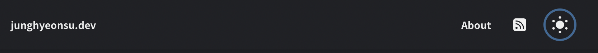

> 혼자 접근성 MDN 문서를 읽으며 정리한 글입니다. 자세한 내용은 MDN을 참고해주세요

# 접근성(Accessibility)

> 접근성이란 웹사이트에 접근하려는 모든 사용자를 차별없이 접근할 수 있도록 하는 것입니다.

모든 사용자라면 누구를 의미하는 것일까요? 말 그대로 **모든** 사용자들이 자신의 조건에 구애받지 않고 웹을 사용할 수 있다면 좋은 접근성을 가진 웹이라고 말할 수 있습니다.

보통 웹을 사용하는 사람들을 생각해보면 컴퓨터를 이용해서 사용한다고 생각하지만, 아래와 같은 사람들이 있을 수 있습니다.

- 느린 네트워크를 가진 사람들
- 모바일 장치를 사용하는 사람들
- 장애인 (시각장애인, 청각장애인, 거동이 불편한 사람, 인지장애인 등등)

그럼 위와 같은 사람들을 위해서 어떤 작업을 할 수 있을까요?

# 접근성이 좋은 사이트 만들기

## HTML과 접근성

### 시멘틱 태그 사용하기

> [시멘틱 태그](https://junghyeonsu-dev.vercel.app/posts/Semantic-tag)를 일관되게 적용시킨다면 많은 이점이 있습니다.

시멘틱 태그는 그냥 `div`와 같은 태그로 도배하지말고, 태그 자체에 의미를 부여해서 알맞은 위치와 알맞은 용도로 사용하자는 의도입니다. 시멘틱 태그를 잘 적용하면 다음과 같은 장점이 있습니다.

- 개발자 경험이 좋아집니다. 프로젝트를 수정하기 위해서 모든 태그를 검색할 필요 없이 우리가 바꾸고자 하는 태그를 빠르게 찾을 수 있습니다.
- 검색엔진최적화(`SEO`)에 좋습니다. 검색 엔진은 비의미적 태그보다 제목, 헤더, 푸터와 같은 키워드를 더 중요하게 여깁니다.

시멘틱 태그를 잘 배치하면 스크린 리더(컴퓨터의 화면 낭독 소프트웨어) 사용자들에게도 좋은 영향을 줄 수 있습니다.

- 스크린 리더는 콘텐츠를 각 헤더를 읽어 제목과 단락을 알려줍니다.
- 읽은 헤더와 제목, 단락 등으로 목차로 사용할 수 있습니다.
- 다음/이전 제목으로 이동할 수 있습니다.

### UI 컨트롤

> UI 컨트롤은 웹 사이트를 키보드로 각각의 요소에 접근할 수 있는 것을 말합니다.

일반적으로 버튼, 링크, 폼과 같은 것들을 키보드로 접근할 수 있으면 접근성이 좋다고 느껴집니다.
탭을 눌렀을 때 다음 링크로 이동한다던가, 폼에서 엔터를 눌렀을 때 다음 인풋으로 넘어간다던가 하는 것이 있습니다.

여러가지 예시가 있지만 요기서 몇 가지만 나열해보겠습니다.

- `Form`에서 여러가지 선택지중에 하나를 고르는 입력창이 있다면 `select`를 사용할 수 있습니다.
- `Form`을 제어하기 위해서 `label` 태그를 이용해서 제어할 수 있습니다.
- 버튼은 `div`가 아닌 `button`을 사용하세요
- 만약 `div`로 만들어야 한다면, `tabindex`를 통해서 탭할 수 없는 요소를 탭할 수 있게 만들 수 있습니다.
- 현재 `focus` 중인 요소를 키보드 엔터를 눌렀을 때의 이벤트를 처리하고 싶다면, `document.activeElement`를 사용할 수 있습니다.

### 대체 텍스트

> 멀티미디어 콘텐츠 같은 경우 (이미지, 동영상)에는 시각 장애가 있는 사람이나, 오디오 콘텐츠는 청각 장애가 있는 사람들이 들을 수 없습니다.

- `img` 태그의 경우에는 `alt` 속성을 제공해서 이미지가 시각적으로 전달하는 내용을 표시해야 합니다.
- 만약 단순한 뒷배경이라면 `CSS background-image`로 이미지를 제공하세요.
- 이미지에 마우스를 올렸을 때는 `title` 속성을 띄웁니다. `title` 속성 또한 제공하도록 합니다.

## CSS, JavaScript와 접근성

### 적절한 CSS 사용하기

> 의미에 맞게, 문맥에 맞게 스타일이 입혀져야 합니다.

```css
h1 {
  font-size: 5rem;
}

p,
li {
  line-height: 1.5;
  font-size: 1.6rem;
}
```

- 합리적인 글꼴 크기, 줄 높이, 문자 간격 등을 선택하여 텍스트를 논리적이고 읽기 쉽고 읽기 쉽게 만듭니다.
- 머리글이 본문 텍스트에서 눈에 띄도록 하십시오. 일반적으로 기본 스타일처럼 크고 굵게 표시하십시오. 목록은 목록처럼 보여야 합니다.
- 텍스트 색상은 배경 색상과 잘 대비되어야 합니다.

### 텍스트 적절하게 강조하기

> 정말 의미적으로 강조하고 싶은 부분은 `strong` 태그를 사용해서 강조하고 시각적으로만 강조하고 싶다면 `em` 태그를 사용할 수 있습니다.

```css
strong,
em {
  color: #a60000;
}
```

### 링크

> 링크에 대한 상태가 관리가 되어야 합니다. 방문했을 때, 하지 않았을 때, 마우스를 올렸을 때에 적절한 스타일을 적용해야 합니다.

```css
a {
  color: #ff0000;
}

a:hover,
a:visited,
a:focus {
  color: #a60000;
  text-decoration: none;
}

a:active {
  color: #000000;
  background-color: #a60000;
}
```

또한 사용자가 링크와 상호 작용할 때 피드백을 계속해서 제공해야 합니다.
포인트 커서나 윤곽선에 신경을 쓰세요!



둘 다 키보드 컨트롤을 사용하는 사람들에게 매우 유용한 접근성 보조 도구로 사용됩니다.

### Form

> 사용자가 웹 사이트에 데이터를 입력할 때 좋은 접근성을 제공합시다.

(form-css-html)[https://github.com/mdn/learning-area/blob/main/accessibility/css/form-css.html]에서 좋은 `form`에 대한 CSS를 볼 수 있습니다.

`form`에 대한 포커스와, 호버 상태의 스타일을 포기하지 마세요. 사람들은 이런 정보들에 의존해서 데이터를 입력하고 상태를 확인합니다.

### Table

> 표 형식 데이터를 표시할 때도 좋은 스타일을 적용해야 합니다.

(table-css-hmtl)[https://github.com/mdn/learning-area/blob/main/accessibility/css/table-css.html]에서 테이블의 좋은 스타일에 대해서 살펴볼 수 있습니다.

테이블 헤더가 더 눈에 띄게 스타일을 입히고, 다른 행을 조금 더 쉽게 파악할 수 있도록 색을 다르게 할 수도 있습니다.

### 색상 및 색상 대비

> 텍스트가 배경색과 잘 대조되는지 확인해야 합니다.

디자인은 멋질 수 있지만 시각 장애가 있는 사람들에게 읽을 수 있는 스타일을 제공해야 합니다.

[색상 대비 검사기](https://webaim.org/resources/contrastchecker/)에서 잘 대조되는 색상인지 파악할 수 있습니다.

## JavaScript

### 과유불급

> 너무 많으면 좋지 않다.

자바스크립트가 너무 많으면 문제가 됩니다.

예를 들어서 반짝 거리는 3D 배경, 오래된 텍스트 입력과 같은 요소들은 정말로 해당 페이지에서 필요한지 생각하세요. 그리고 JavaScript로 HTML을 너무 많이 생성하지 마세요.

> 적절한 자바스크립트를 사용하는 것은 어떤 걸까요?

- 사용자에게 적절한 로딩 상태를 제공하는 것
- 입력 form 제출 시 각 input에 대한 문제를 확인하는 것
- `<video>` 자바스크립트를 사용할 수 없는 경우 액세스 하는 데 사용할 수 있는 비디오에 대한 직접 링크와 함께 키보드 전용 사용자가 액세스할 수 있는 HTML5용 맞춤 컨트롤을 제공하는 것

## WAI-ARIA

> `aria-블라블라` 와 같은 속성들을 보셨나요?

`WAI-ARIA`는 브라우저가 인식할 수 있고, 웹을 사용하는 사용자들에게 진행 상황을 알리는데 사용할 수 있는 특성을 부여해서 접근성을 향상시킬 수 있는 기술입니다.

`WAI-ARIA`는 `W3C`에서 작성한 사양으로, HTML 요소에 적용할 수 있는 추가 HTML 속성 집합을 작성해서 추가 의미 체계를 제공하고 부족할 때마다 접근성을 개선합니다. 세 가지 주요 기능을 간단히 살펴보겠습니다.

### Roles

> HTML 요소의 역할이 무엇인지 정의할 수 있는 속성입니다.

`role="navigation"`, `role="complementary"`, `role="banner"`, `role="search"`, `role="tablist"`, `role="tab"` 등과 같은 속성이 있습니다.

### Properties

> HTML 요소의 추가 의미 또는 의미를 부여하는데 사용할 수 있는 속성입니다.

`aria-required="true"`와 같은 속성을 넣어서 form 입력이 필수적으로 입력되게 할 수도 있습니다. `aria-labelledby="label"` 와 같이 테이블 셀의 레이블을 지정할 수도 있습니다.

### States

> 상태는 자바스크립트에 의해 변경될 수 있는 속성을 말합니다.

`aria-disabled="true"`와 같이 form 입력이 비활성화 되어있는지, 활성화되어 있는지 정의할 수 있습니다.

## WAI-ARIA를 사용해야 하는 상황

### Signposts & Landmarks (이정표 & 랜드마크)

> 스크린리더에게 정보를 제공하여 사용자가 공통 페이지 요소를 찾을 수 있도록 할 수 있습니다.

```html
<header>
  <h1>...</h1>
  <nav>
    <ul>
      ...
    </ul>
    <form>
      <!-- search form  -->
    </form>
  </nav>
</header>

<main>
  <article>...</article>
  <aside>...</aside>
</main>

<footer>...</footer>
```

위와 같이 하는 것 보다는 아래와 같이 해보세요

```html
<header>
  <h1>...</h1>
  <nav role="navigation">
    <ul>
      ...
    </ul>
    <form role="search">
      <!-- search form  -->
    </form>
  </nav>
</header>

<main>
  <article role="article">...</article>
  <aside role="complementary">...</aside>
</main>

<footer>...</footer>
```

각 요소에 역할을 부여해서 스크린리더 사용자가 조금 더 접근하기 쉽도록 만들 수 있습니다.

또한 `input` 태그에는 `label` 속성을 부여해서 스크린리더가 읽을 수 있는 설명 레이블을 제공합니다.

```html
<input type="search" name="q" placeholder="Search query" aria-label="Search through site content" />
```

### Dynamic content updates (동적 컨텐츠 업데이트)

> 웹 사이트는 보통 정적이기 보다는 `fetch`, `DOM API`, `XMLHttpRequest`를 통한 동적 컨텐츠를 받아오는 사이트가 많습니다. 컨텐츠 업데이트는 스크린 리더에 의해 감지되지 않으므로 무슨 일이 일어나고 있는지 알려 줄 필요가 있습니다.

```html
<section>
  <h1>Random quote</h1>
  <blockquote>
    <p></p>
  </blockquote>
</section>
```

위와 같은 코드는 아래와 같이 바꿀 수 있습니다.

```html
<!-- 1. -->
<section aria-live="assertive"></section>

<!-- 2. -->
<section aria-live="assertive" aria-atomic="true"></section>
```

`aria-live` 속성을 조절해서 스크린리더가 컨텐츠를 얼마나 빠르게 읽을 지 결정할 수 있습니다.

- `off`: 기본 값입니다. 업데이트를 알리지 않습니다.
- `polite`: 사용자가 `idle` 상태일 때만 컨텐츠 업데이트를 알립니다.
- `assertive`: 업데이트 가능한 한 빠른 시간내에 사용자에게 알려집니다.

또한 `aria-atomic` 속성을 이용하면 전체 요소 내용을 하나의 원자 단위로 읽도록 지시할 수 있습니다. 하나의 묶음 단위로 컨텐츠를 제공하는 것 같습니다.

### Enhancing keyboard accessibility (키보드 접근성 향상)

> 키보드를 이용해서 Enter/Return 키를 사용해서 컨트롤하고, 활성화 할 수 있으며 위아래로 이동할 수 있습니다.

- `tabindex="0"` 와 같이 `tabindex` 속성을 이용하면 `tab`을 이용해서 포커스를 할 수 있는 요소의 순서를 정할 수 있습니다.

### Describing non-semantic buttons as buttons (의미 없는 버튼을 버튼으로 설정하기)

> 아래의 예제보단 그냥 일반적인 button을 사용하는 것이 더 좋습니다.

```html
<div data-message="This is from the first button" tabindex="0" role="button">Click me!</div>
```

### Guiding users through complex widgets (복잡한 위젯을 통해 사용자 안내)

> 시멘틱 태그를 이용해서 구성하는 것도 좋지만, `article`, `section`과 같은 태그들로는 설명이 충분하지 않을 수 있습니다. 그럴 땐 더 많은 내용을 제공하는 것은 항상 좋다고 합니다.

```html
<ul role="tablist">
  <li
    class="active"
    role="tab"
    aria-selected="true"
    aria-setsize="3"
    aria-posinset="1"
    tabindex="0"
  >
    Tab 1
  </li>
  <li role="tab" aria-selected="false" aria-setsize="3" aria-posinset="2" tabindex="0">Tab 2</li>
  <li role="tab" aria-selected="false" aria-setsize="3" aria-posinset="3" tabindex="0">Tab 3</li>
</ul>
<div class="panels">
  <article class="active-panel" role="tabpanel" aria-hidden="false">...</article>
  <article role="tabpanel" aria-hidden="true">...</article>
  <article role="tabpanel" aria-hidden="true">...</article>
</div>
```

- `aria-selected`: 현재 선택되어 있는 탭을 정의합니다. 사용자가 다른 탭을 선택하면 자바스크립트에 의해 자동적으로 변합니다.
- `aria-hidden`: 스크린 리더가 읽지 못하도록 숨깁니다.
- `tabindex`: 위에서 설명한 것과 똑같습니다. 탭 했을 때의 인덱스를 설정합니다.
- `aria-setsize`: 이 속성을 사용하면 요소가 시리즈의 일부이고 시리즈에 포함된 항목 수를 스크린리더에 지정할 수 있습니다.
- `aria-posinset`: 이 속성을 사용하면 요소가 시리즈에서 어떤 위치에 있는지 지정할 수 있습니다.

# 마무리

평소에 개발을 하면 자신의 위주의 시각에서 잘 벗어나지 못합니다. 다른 사람의 입장이 되어서 어떨 때 불편한지, 어떤 것이 부족한 지 지속적으로 생각하고 개선을 해야할 것 같습니다.

`WAI-ARIA`가 이렇게 많은 속성이 있는지도 몰랐고 `CSS`, `HTML`, `JavaScript` 을 이용해서 개선할 수 있는 방향이 이렇게 다양하다는 것도 정말 놀라웠습니다.

위의 내용을 전부 익히고, 전부 적용할 수는 없겠지만 개발하는 매순간 적용할 수 있는 것들은 최대한 적용을 해야할 것 같습니다. 개발할 때 나중은 없으니까요.

# 참고

- [접근성 | MDN](https://developer.mozilla.org/ko/docs/Learn/Accessibility)
- [HTML: A good basis for accessibility](https://developer.mozilla.org/ko/docs/Learn/Accessibility/HTML#text_alternatives)
- [CSS and JavaScript accessibility best practices](https://developer.mozilla.org/en-US/docs/Learn/Accessibility/CSS_and_JavaScript)
- [WAI-ARIA basics](https://developer.mozilla.org/en-US/docs/Learn/Accessibility/WAI-ARIA_basics#practical_wai-aria_implementations)
